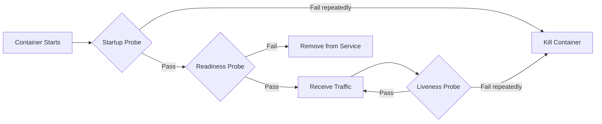

# How to Configure Liveness and Readiness Probes Properly

Author: [nawazdhandala](https://www.github.com/nawazdhandala)

Tags: Kubernetes, Health Checks, Probes, Reliability, DevOps

Description: A practical guide to configuring Kubernetes liveness, readiness, and startup probes correctly to ensure your applications self-heal and handle traffic only when ready.

---

Probes tell Kubernetes about your application's health. Liveness probes detect when to restart a stuck container. Readiness probes determine when a pod can receive traffic. Getting these wrong causes restarts loops, dropped requests, and cascading failures.

## Understanding the Three Probe Types



### Liveness Probe

Detects if the application is running but stuck. Kubernetes restarts the container if the liveness probe fails.

Use case: Deadlocked application, infinite loop, unresponsive process

### Readiness Probe

Detects if the application is ready to receive traffic. Kubernetes removes the pod from Service endpoints if the readiness probe fails.

Use case: Application starting up, loading cache, waiting for dependencies

### Startup Probe

Gives slow-starting applications time to start. Kubernetes waits for startup probe to pass before starting liveness checks.

Use case: Legacy applications, large data loading, slow initialization

## Probe Configuration

### HTTP Probe

```yaml
apiVersion: v1
kind: Pod
metadata:
  name: web-app
spec:
  containers:
    - name: app
      image: myapp:v1
      ports:
        - containerPort: 8080
      livenessProbe:
        httpGet:
          path: /healthz
          port: 8080
          httpHeaders:
            - name: Custom-Header
              value: Kubernetes-Probe
        initialDelaySeconds: 30
        periodSeconds: 10
        timeoutSeconds: 5
        successThreshold: 1
        failureThreshold: 3
      readinessProbe:
        httpGet:
          path: /ready
          port: 8080
        initialDelaySeconds: 5
        periodSeconds: 5
        timeoutSeconds: 3
        successThreshold: 1
        failureThreshold: 3
```

### TCP Probe

```yaml
livenessProbe:
  tcpSocket:
    port: 3306
  initialDelaySeconds: 15
  periodSeconds: 10
```

### Command Probe

```yaml
livenessProbe:
  exec:
    command:
      - /bin/sh
      - -c
      - pg_isready -U postgres -h localhost
  initialDelaySeconds: 30
  periodSeconds: 10
```

### gRPC Probe

```yaml
livenessProbe:
  grpc:
    port: 50051
    service: health    # Optional service name
  initialDelaySeconds: 10
  periodSeconds: 10
```

## Probe Parameters Explained

| Parameter | Description | Default |
|-----------|-------------|---------|
| initialDelaySeconds | Wait before first probe | 0 |
| periodSeconds | Time between probes | 10 |
| timeoutSeconds | Probe timeout | 1 |
| successThreshold | Consecutive successes to be healthy | 1 |
| failureThreshold | Consecutive failures to be unhealthy | 3 |

## Common Patterns

### Pattern 1: Basic Web Application

```yaml
containers:
  - name: web
    image: nginx:1.24
    ports:
      - containerPort: 80
    readinessProbe:
      httpGet:
        path: /
        port: 80
      initialDelaySeconds: 5
      periodSeconds: 5
    livenessProbe:
      httpGet:
        path: /
        port: 80
      initialDelaySeconds: 15
      periodSeconds: 10
```

### Pattern 2: Application with Slow Startup

```yaml
containers:
  - name: app
    image: java-app:v1
    ports:
      - containerPort: 8080
    startupProbe:
      httpGet:
        path: /healthz
        port: 8080
      failureThreshold: 30    # 30 * 10s = 5 minutes max
      periodSeconds: 10
    livenessProbe:
      httpGet:
        path: /healthz
        port: 8080
      periodSeconds: 10
      failureThreshold: 3
    readinessProbe:
      httpGet:
        path: /ready
        port: 8080
      periodSeconds: 5
      failureThreshold: 3
```

### Pattern 3: Database

```yaml
containers:
  - name: postgres
    image: postgres:15
    ports:
      - containerPort: 5432
    readinessProbe:
      exec:
        command:
          - pg_isready
          - -U
          - postgres
      initialDelaySeconds: 5
      periodSeconds: 5
    livenessProbe:
      exec:
        command:
          - pg_isready
          - -U
          - postgres
      initialDelaySeconds: 30
      periodSeconds: 10
```

### Pattern 4: Worker Process (No Network)

```yaml
containers:
  - name: worker
    image: worker:v1
    livenessProbe:
      exec:
        command:
          - /bin/sh
          - -c
          - test -f /tmp/healthy
      initialDelaySeconds: 30
      periodSeconds: 10
```

Worker must create /tmp/healthy file to indicate health:

```python
# Worker code
import os
import time

HEALTH_FILE = '/tmp/healthy'

def process_jobs():
    while True:
        # Update health file timestamp
        with open(HEALTH_FILE, 'w') as f:
            f.write(str(time.time()))

        # Do work
        job = get_next_job()
        process(job)

# Create health file on startup
open(HEALTH_FILE, 'w').close()
process_jobs()
```

## Implementing Health Endpoints

### Separate Liveness and Readiness

```python
# Python Flask example
from flask import Flask, jsonify

app = Flask(__name__)

# Application state
database_connected = False
cache_warmed = False

@app.route('/healthz')
def liveness():
    """
    Liveness check - is the process alive?
    Keep this simple and fast.
    """
    return jsonify({"status": "alive"}), 200

@app.route('/ready')
def readiness():
    """
    Readiness check - can we handle requests?
    Check all dependencies.
    """
    if not database_connected:
        return jsonify({
            "status": "not ready",
            "reason": "database not connected"
        }), 503

    if not cache_warmed:
        return jsonify({
            "status": "not ready",
            "reason": "cache warming"
        }), 503

    return jsonify({"status": "ready"}), 200
```

```javascript
// Node.js Express example
const express = require('express');
const app = express();

let databaseReady = false;
let cacheReady = false;

// Liveness - process is running
app.get('/healthz', (req, res) => {
  res.status(200).json({ status: 'alive' });
});

// Readiness - can handle traffic
app.get('/ready', (req, res) => {
  if (!databaseReady) {
    return res.status(503).json({
      status: 'not ready',
      reason: 'database not connected'
    });
  }
  if (!cacheReady) {
    return res.status(503).json({
      status: 'not ready',
      reason: 'cache warming'
    });
  }
  res.status(200).json({ status: 'ready' });
});
```

## Common Mistakes

### Mistake 1: Liveness Probe Checks Dependencies

```yaml
# BAD - liveness checks database
livenessProbe:
  httpGet:
    path: /health    # Endpoint checks database
    port: 8080
```

If the database is down, all pods restart in a loop. Use readiness for dependencies.

```yaml
# GOOD - liveness only checks app process
livenessProbe:
  httpGet:
    path: /healthz    # Only checks process is alive
    port: 8080
readinessProbe:
  httpGet:
    path: /ready    # Checks database connection
    port: 8080
```

### Mistake 2: Initial Delay Too Short

```yaml
# BAD - probe starts before app is ready
livenessProbe:
  httpGet:
    path: /healthz
    port: 8080
  initialDelaySeconds: 0    # Too aggressive
```

Container restarts in a loop because probe starts before app initializes.

```yaml
# GOOD - use startup probe or appropriate delay
startupProbe:
  httpGet:
    path: /healthz
    port: 8080
  failureThreshold: 30
  periodSeconds: 10
livenessProbe:
  httpGet:
    path: /healthz
    port: 8080
  periodSeconds: 10
```

### Mistake 3: Timeout Too Short

```yaml
# BAD - 1 second timeout
livenessProbe:
  httpGet:
    path: /healthz
    port: 8080
  timeoutSeconds: 1    # Too short for slow endpoints
```

Probe fails during normal load spikes.

```yaml
# GOOD - reasonable timeout
livenessProbe:
  httpGet:
    path: /healthz
    port: 8080
  timeoutSeconds: 5
```

### Mistake 4: Same Probe for Liveness and Readiness

```yaml
# BAD - identical probes
livenessProbe:
  httpGet:
    path: /health
    port: 8080
readinessProbe:
  httpGet:
    path: /health
    port: 8080
```

These serve different purposes. Design them accordingly.

## Debugging Probe Failures

### Check Pod Events

```bash
kubectl describe pod myapp-xyz

# Look for:
# Warning  Unhealthy  Liveness probe failed: HTTP probe failed with statuscode: 503
# Warning  Unhealthy  Readiness probe failed: connection refused
```

### Test Probe Manually

```bash
# Port forward to pod
kubectl port-forward pod/myapp-xyz 8080:8080

# Test endpoint
curl -v http://localhost:8080/healthz
curl -v http://localhost:8080/ready
```

### Check Logs During Probe Failure

```bash
kubectl logs myapp-xyz --previous    # Previous container logs
kubectl logs myapp-xyz -f            # Stream current logs
```

### Check Probe Configuration

```bash
kubectl get pod myapp-xyz -o yaml | grep -A 20 livenessProbe
kubectl get pod myapp-xyz -o yaml | grep -A 20 readinessProbe
```

## Best Practices

### 1. Keep Liveness Probes Simple

```python
@app.route('/healthz')
def liveness():
    # Just check if process can respond
    return "OK", 200
```

### 2. Use Startup Probes for Slow Apps

```yaml
startupProbe:
  httpGet:
    path: /healthz
    port: 8080
  failureThreshold: 60
  periodSeconds: 5    # 5 minutes total
```

### 3. Set Appropriate Timeouts

```yaml
readinessProbe:
  httpGet:
    path: /ready
    port: 8080
  timeoutSeconds: 5    # Should be longer than p99 response time
```

### 4. Test Probes Under Load

```bash
# Generate load
hey -z 60s -c 100 http://myapp/api

# Watch for probe failures
kubectl get events --watch
```

### 5. Monitor Probe Metrics

```yaml
# Prometheus alert for frequent restarts
- alert: PodRestartingFrequently
  expr: increase(kube_pod_container_status_restarts_total[1h]) > 3
  labels:
    severity: warning
  annotations:
    summary: "Pod {{ $labels.pod }} restarting frequently"
```

## Complete Example

```yaml
apiVersion: apps/v1
kind: Deployment
metadata:
  name: web-app
spec:
  replicas: 3
  selector:
    matchLabels:
      app: web
  template:
    metadata:
      labels:
        app: web
    spec:
      containers:
        - name: app
          image: myapp:v1
          ports:
            - containerPort: 8080

          # Startup probe - allow slow initialization
          startupProbe:
            httpGet:
              path: /healthz
              port: 8080
            failureThreshold: 30
            periodSeconds: 10

          # Liveness probe - is the process healthy?
          livenessProbe:
            httpGet:
              path: /healthz
              port: 8080
            periodSeconds: 10
            timeoutSeconds: 5
            failureThreshold: 3

          # Readiness probe - can we handle traffic?
          readinessProbe:
            httpGet:
              path: /ready
              port: 8080
            periodSeconds: 5
            timeoutSeconds: 3
            failureThreshold: 3

          resources:
            requests:
              memory: "256Mi"
              cpu: "100m"
            limits:
              memory: "512Mi"
              cpu: "500m"
```

---

Proper probe configuration is essential for self-healing applications. Keep liveness probes simple to avoid restart loops. Use readiness probes to check dependencies. Add startup probes for slow-starting applications. Always test probes under realistic load conditions before deploying to production.
