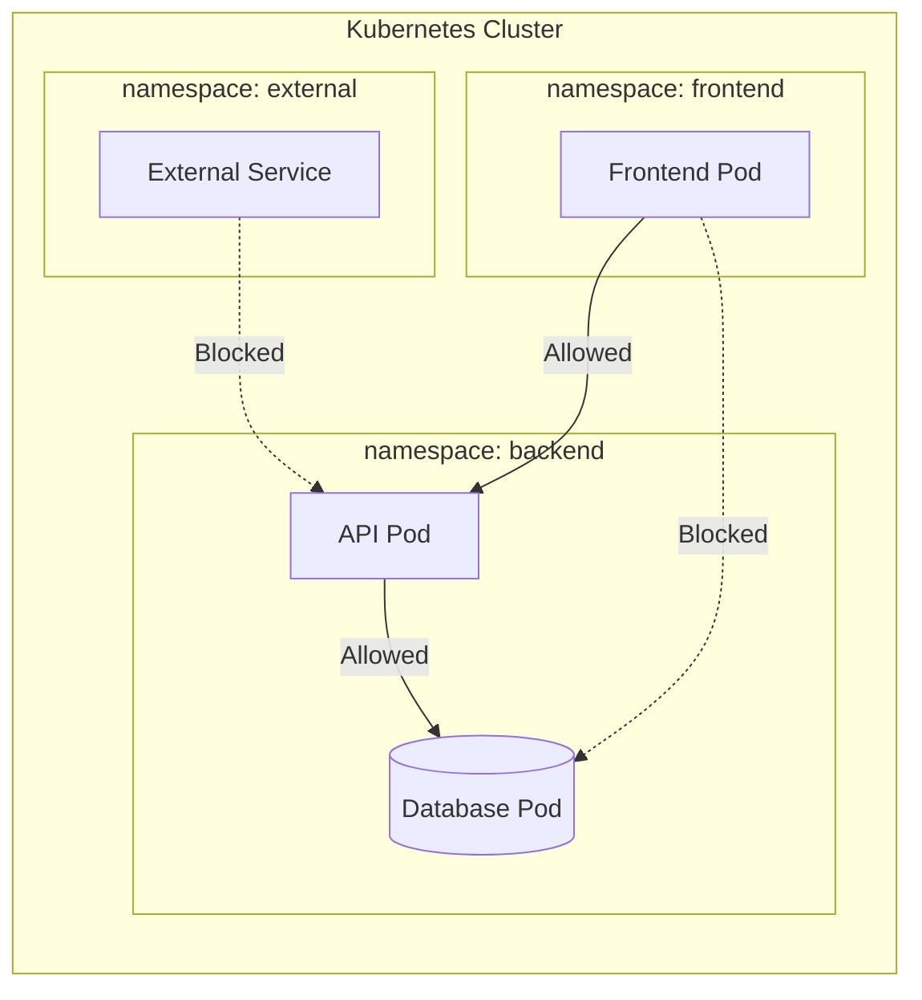

# How to Configure Kubernetes Network Policies for Security

Author: [nawazdhandala](https://www.github.com/nawazdhandala)

Tags: Kubernetes, Network Policies, Security, DevOps, Zero Trust, Microservices

Description: Learn how to configure Kubernetes Network Policies to secure pod-to-pod communication and implement zero-trust networking.

---

Kubernetes allows all pods to communicate with each other by default. This means a compromised pod can potentially reach every other pod in your cluster. Network Policies let you define rules that restrict which pods can talk to each other, implementing the principle of least privilege for network access.

## How Network Policies Work

Network Policies are Kubernetes resources that act like firewall rules for pods. They control traffic at the IP address and port level (Layer 3/4).



### Prerequisites

Network Policies require a CNI (Container Network Interface) that supports them:

| CNI Plugin | Network Policy Support |
|------------|----------------------|
| Calico | Full support |
| Cilium | Full support + L7 |
| Weave Net | Full support |
| Flannel | No support |

Check your CNI:

```bash
# List CNI pods
kubectl get pods -n kube-system | grep -E 'calico|cilium|weave|flannel'

# Check if NetworkPolicy resources work
kubectl get networkpolicies --all-namespaces
```

## Starting with Default Deny

The foundation of secure networking is to deny all traffic by default, then explicitly allow what is needed.

### Deny All Ingress Traffic

```yaml
# default-deny-ingress.yaml
apiVersion: networking.k8s.io/v1
kind: NetworkPolicy
metadata:
  name: default-deny-ingress
  namespace: production
spec:
  # Empty selector matches all pods in the namespace
  podSelector: {}
  policyTypes:
    - Ingress
  # No ingress rules = deny all incoming traffic
```

### Deny All Egress Traffic

```yaml
# default-deny-egress.yaml
apiVersion: networking.k8s.io/v1
kind: NetworkPolicy
metadata:
  name: default-deny-egress
  namespace: production
spec:
  podSelector: {}
  policyTypes:
    - Egress
  # No egress rules = deny all outgoing traffic
```

### Deny All Traffic (Both Directions)

```yaml
# default-deny-all.yaml
apiVersion: networking.k8s.io/v1
kind: NetworkPolicy
metadata:
  name: default-deny-all
  namespace: production
spec:
  podSelector: {}
  policyTypes:
    - Ingress
    - Egress
```

Apply default deny to all namespaces:

```bash
# Apply to multiple namespaces
for ns in production staging development; do
  kubectl apply -f default-deny-all.yaml -n $ns
done
```

## Allowing Essential Traffic

After applying default deny, your pods cannot reach anything, including DNS. You need to explicitly allow essential services.

### Allow DNS Resolution

```yaml
# allow-dns.yaml
apiVersion: networking.k8s.io/v1
kind: NetworkPolicy
metadata:
  name: allow-dns
  namespace: production
spec:
  podSelector: {}
  policyTypes:
    - Egress
  egress:
    # Allow DNS traffic to kube-dns
    - to:
        - namespaceSelector:
            matchLabels:
              kubernetes.io/metadata.name: kube-system
          podSelector:
            matchLabels:
              k8s-app: kube-dns
      ports:
        - protocol: UDP
          port: 53
        - protocol: TCP
          port: 53
```

### Allow Traffic to Kubernetes API Server

```yaml
# allow-kube-api.yaml
apiVersion: networking.k8s.io/v1
kind: NetworkPolicy
metadata:
  name: allow-kube-api
  namespace: production
spec:
  podSelector: {}
  policyTypes:
    - Egress
  egress:
    - to:
        - ipBlock:
            # Replace with your API server IP
            cidr: 10.96.0.1/32
      ports:
        - protocol: TCP
          port: 443
```

Find your API server IP:

```bash
kubectl get svc kubernetes -n default -o jsonpath='{.spec.clusterIP}'
```

## Real-World Application Patterns

### Three-Tier Application

A typical web application with frontend, API, and database layers:

```yaml
# frontend-policy.yaml
apiVersion: networking.k8s.io/v1
kind: NetworkPolicy
metadata:
  name: frontend-policy
  namespace: production
spec:
  podSelector:
    matchLabels:
      app: frontend
  policyTypes:
    - Ingress
    - Egress
  ingress:
    # Allow traffic from ingress controller
    - from:
        - namespaceSelector:
            matchLabels:
              kubernetes.io/metadata.name: ingress-nginx
      ports:
        - protocol: TCP
          port: 80
  egress:
    # Allow traffic to API service only
    - to:
        - podSelector:
            matchLabels:
              app: api
      ports:
        - protocol: TCP
          port: 8080
---
# api-policy.yaml
apiVersion: networking.k8s.io/v1
kind: NetworkPolicy
metadata:
  name: api-policy
  namespace: production
spec:
  podSelector:
    matchLabels:
      app: api
  policyTypes:
    - Ingress
    - Egress
  ingress:
    # Accept traffic from frontend only
    - from:
        - podSelector:
            matchLabels:
              app: frontend
      ports:
        - protocol: TCP
          port: 8080
  egress:
    # Allow traffic to database only
    - to:
        - podSelector:
            matchLabels:
              app: postgres
      ports:
        - protocol: TCP
          port: 5432
---
# database-policy.yaml
apiVersion: networking.k8s.io/v1
kind: NetworkPolicy
metadata:
  name: database-policy
  namespace: production
spec:
  podSelector:
    matchLabels:
      app: postgres
  policyTypes:
    - Ingress
    - Egress
  ingress:
    # Accept traffic from API only
    - from:
        - podSelector:
            matchLabels:
              app: api
      ports:
        - protocol: TCP
          port: 5432
  # No egress rules - database should not initiate connections
```

### Microservices Communication

Allow specific services to communicate:

```yaml
# order-service-policy.yaml
apiVersion: networking.k8s.io/v1
kind: NetworkPolicy
metadata:
  name: order-service-policy
  namespace: production
spec:
  podSelector:
    matchLabels:
      app: order-service
  policyTypes:
    - Ingress
    - Egress
  ingress:
    # Accept from API gateway
    - from:
        - podSelector:
            matchLabels:
              app: api-gateway
      ports:
        - protocol: TCP
          port: 8080
  egress:
    # Can call inventory and payment services
    - to:
        - podSelector:
            matchLabels:
              app: inventory-service
      ports:
        - protocol: TCP
          port: 8080
    - to:
        - podSelector:
            matchLabels:
              app: payment-service
      ports:
        - protocol: TCP
          port: 8080
```

### Cross-Namespace Communication

Allow monitoring to scrape metrics from all namespaces:

```yaml
# allow-prometheus-scrape.yaml
apiVersion: networking.k8s.io/v1
kind: NetworkPolicy
metadata:
  name: allow-prometheus-scrape
  namespace: production
spec:
  podSelector:
    matchLabels:
      metrics: enabled
  policyTypes:
    - Ingress
  ingress:
    - from:
        # From monitoring namespace
        - namespaceSelector:
            matchLabels:
              kubernetes.io/metadata.name: monitoring
          podSelector:
            matchLabels:
              app: prometheus
      ports:
        - protocol: TCP
          port: 9090
```

### Allow External API Access

Permit specific pods to call external services:

```yaml
# allow-external-apis.yaml
apiVersion: networking.k8s.io/v1
kind: NetworkPolicy
metadata:
  name: allow-external-apis
  namespace: production
spec:
  podSelector:
    matchLabels:
      external-access: required
  policyTypes:
    - Egress
  egress:
    # Allow HTTPS to external services
    - to:
        - ipBlock:
            cidr: 0.0.0.0/0
            except:
              # Block internal networks
              - 10.0.0.0/8
              - 172.16.0.0/12
              - 192.168.0.0/16
      ports:
        - protocol: TCP
          port: 443
```

## Testing Network Policies

### Deploy Test Pods

```bash
# Create test namespace
kubectl create namespace netpol-test

# Deploy server pod
kubectl run server -n netpol-test \
  --image=nginx \
  --port=80 \
  --expose \
  --labels="app=server"

# Deploy client pod
kubectl run client -n netpol-test \
  --image=curlimages/curl \
  --command -- sleep infinity
```

### Test Connectivity

```bash
# Test before applying policy (should work)
kubectl exec -n netpol-test client -- curl -s --max-time 5 http://server

# Apply deny-all policy
kubectl apply -n netpol-test -f - <<EOF
apiVersion: networking.k8s.io/v1
kind: NetworkPolicy
metadata:
  name: deny-all
spec:
  podSelector: {}
  policyTypes:
    - Ingress
    - Egress
EOF

# Test after policy (should timeout)
kubectl exec -n netpol-test client -- curl -s --max-time 5 http://server
# Expected: command terminated with exit code 28 (timeout)
```

### Verify Policy Application

```bash
# List all network policies
kubectl get networkpolicies -n production

# Describe a specific policy
kubectl describe networkpolicy frontend-policy -n production

# Check pod labels match selectors
kubectl get pods -n production --show-labels
```

## Debugging Network Policy Issues

Common problems and solutions:

### Problem: All Traffic Blocked

```bash
# Check if DNS is allowed
kubectl exec -n production <pod> -- nslookup kubernetes.default

# If DNS fails, add DNS allow policy
```

### Problem: Policy Not Taking Effect

```bash
# Verify CNI supports network policies
kubectl get pods -n kube-system | grep calico

# Check pod labels match policy selectors
kubectl get pods -n production -l app=frontend

# Ensure policy is in the correct namespace
kubectl get networkpolicy -n production
```

### Problem: Intermittent Connectivity

```bash
# Check for conflicting policies
kubectl get networkpolicy -n production -o yaml

# Verify port numbers are correct
kubectl get svc -n production
```

## Best Practices

1. **Start with default deny** - Apply deny-all policies to every namespace
2. **Allow DNS first** - Pods need DNS for service discovery
3. **Use labels consistently** - Define a labeling strategy for policy selectors
4. **Test in staging** - Validate policies before production deployment
5. **Document policies** - Add annotations explaining each rule
6. **Monitor policy violations** - Use Cilium Hubble or Calico Enterprise
7. **Version control policies** - Store policies in Git with your application

### Policy Template with Documentation

```yaml
apiVersion: networking.k8s.io/v1
kind: NetworkPolicy
metadata:
  name: api-service-policy
  namespace: production
  annotations:
    description: "Controls traffic for the API service"
    owner: "platform-team"
    last-reviewed: "2026-01-24"
spec:
  podSelector:
    matchLabels:
      app: api
  policyTypes:
    - Ingress
    - Egress
  ingress:
    # Rule 1: Accept traffic from frontend
    - from:
        - podSelector:
            matchLabels:
              app: frontend
      ports:
        - protocol: TCP
          port: 8080
  egress:
    # Rule 1: Allow database access
    - to:
        - podSelector:
            matchLabels:
              app: postgres
      ports:
        - protocol: TCP
          port: 5432
```

---

Network Policies are essential for securing Kubernetes clusters. Start with default deny, explicitly allow required traffic, and test thoroughly. Remember that policies are additive - if any policy allows traffic, it is permitted. Regularly audit your policies and remove any that are no longer needed.
