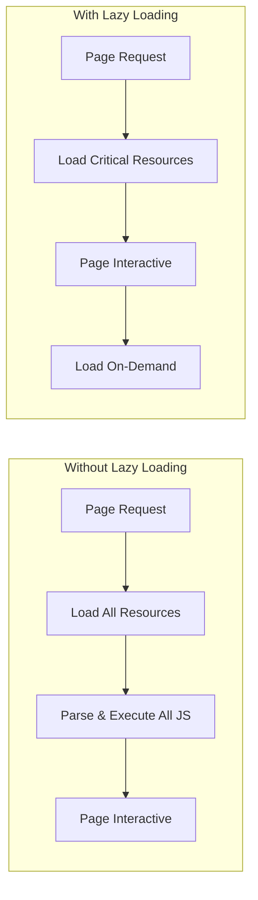

# How to Configure Lazy Loading

Author: [nawazdhandala](https://www.github.com/nawazdhandala)

Tags: Performance, JavaScript, React, Frontend, Optimization, Web Development

Description: Learn how to configure lazy loading for images, components, and modules to improve page load times and user experience.

---

Lazy loading defers the loading of non-critical resources until they are needed. A page that loads 50 images upfront takes seconds to become interactive. The same page with lazy loading can be interactive in milliseconds, loading images only as users scroll to them. This guide covers lazy loading configuration for images, JavaScript modules, and UI components.

## Why Lazy Loading Matters



| Metric | Without Lazy Loading | With Lazy Loading |
|--------|---------------------|-------------------|
| Initial Bundle Size | 2.5 MB | 500 KB |
| Time to Interactive | 4.2s | 1.1s |
| Initial Network Requests | 85 | 12 |
| Largest Contentful Paint | 3.8s | 1.5s |

## Native Image Lazy Loading

Modern browsers support native lazy loading with the `loading` attribute:

```html
<!-- Native lazy loading - simplest approach -->


<!-- With width/height to prevent layout shift -->

```

### Responsive Images with Lazy Loading

```html
<!-- Lazy loading with srcset for responsive images -->


<!-- Picture element with lazy loading -->
<picture>
  <source
    media="(min-width: 1200px)"
    srcset="hero-large.webp"
    type="image/webp"
  >
  <source
    media="(min-width: 800px)"
    srcset="hero-medium.webp"
    type="image/webp"
  >
  
</picture>
```

### JavaScript Fallback for Older Browsers

```javascript
// lazy-images.js - Intersection Observer fallback
class LazyImageLoader {
  constructor(options = {}) {
    this.rootMargin = options.rootMargin || '50px 0px';
    this.threshold = options.threshold || 0.01;

    // Check for native support
    this.supportsNative = 'loading' in HTMLImageElement.prototype;

    if (!this.supportsNative) {
      this.setupObserver();
    }
  }

  setupObserver() {
    this.observer = new IntersectionObserver(
      (entries) => this.handleIntersection(entries),
      {
        rootMargin: this.rootMargin,
        threshold: this.threshold
      }
    );

    // Observe all lazy images
    document.querySelectorAll('img[data-src]').forEach(img => {
      this.observer.observe(img);
    });
  }

  handleIntersection(entries) {
    entries.forEach(entry => {
      if (entry.isIntersecting) {
        this.loadImage(entry.target);
        this.observer.unobserve(entry.target);
      }
    });
  }

  loadImage(img) {
    const src = img.dataset.src;
    const srcset = img.dataset.srcset;

    if (srcset) {
      img.srcset = srcset;
    }

    img.src = src;
    img.removeAttribute('data-src');
    img.removeAttribute('data-srcset');

    // Add loaded class for CSS transitions
    img.classList.add('lazy-loaded');
  }
}

// Initialize
document.addEventListener('DOMContentLoaded', () => {
  new LazyImageLoader({ rootMargin: '100px 0px' });
});
```

```css
/* Fade-in effect for lazy loaded images */
img[data-src] {
  opacity: 0;
  transition: opacity 0.3s ease-in;
}

img.lazy-loaded {
  opacity: 1;
}

/* Placeholder background */
img[data-src] {
  background: linear-gradient(90deg, #f0f0f0 25%, #e0e0e0 50%, #f0f0f0 75%);
  background-size: 200% 100%;
  animation: shimmer 1.5s infinite;
}

@keyframes shimmer {
  0% { background-position: 200% 0; }
  100% { background-position: -200% 0; }
}
```

## React Component Lazy Loading

React's `lazy()` and `Suspense` enable code splitting at the component level:

```jsx
// App.jsx - Basic lazy loading setup
import React, { Suspense, lazy } from 'react';

// Lazy load heavy components
const Dashboard = lazy(() => import('./pages/Dashboard'));
const Analytics = lazy(() => import('./pages/Analytics'));
const Settings = lazy(() => import('./pages/Settings'));

// Loading fallback component
function PageLoader() {
  return (
    <div className="page-loader">
      <div className="spinner" />
      <p>Loading...</p>
    </div>
  );
}

function App() {
  return (
    <Router>
      <Suspense fallback={<PageLoader />}>
        <Routes>
          <Route path="/" element={<Dashboard />} />
          <Route path="/analytics" element={<Analytics />} />
          <Route path="/settings" element={<Settings />} />
        </Routes>
      </Suspense>
    </Router>
  );
}
```

### Advanced Lazy Loading with Preloading

```jsx
// LazyWithPreload.jsx - Preload on hover/focus
import { lazy, Suspense, useState, useCallback } from 'react';

// Create lazy component with preload capability
function lazyWithPreload(importFn) {
  const LazyComponent = lazy(importFn);

  // Attach preload function
  LazyComponent.preload = importFn;

  return LazyComponent;
}

// Usage
const HeavyModal = lazyWithPreload(() => import('./HeavyModal'));

function App() {
  const [showModal, setShowModal] = useState(false);

  // Preload on hover
  const handleMouseEnter = useCallback(() => {
    HeavyModal.preload();
  }, []);

  return (
    <div>
      <button
        onMouseEnter={handleMouseEnter}
        onFocus={handleMouseEnter}
        onClick={() => setShowModal(true)}
      >
        Open Modal
      </button>

      {showModal && (
        <Suspense fallback={<div>Loading modal...</div>}>
          <HeavyModal onClose={() => setShowModal(false)} />
        </Suspense>
      )}
    </div>
  );
}
```

### Route-Based Code Splitting

```jsx
// routes.jsx - Comprehensive route-based splitting
import { lazy, Suspense } from 'react';
import { Routes, Route, useLocation } from 'react-router-dom';
import { AnimatePresence } from 'framer-motion';

// Group related routes into chunks
const publicRoutes = {
  Home: lazy(() => import(/* webpackChunkName: "public" */ './pages/Home')),
  About: lazy(() => import(/* webpackChunkName: "public" */ './pages/About')),
  Pricing: lazy(() => import(/* webpackChunkName: "public" */ './pages/Pricing'))
};

const authRoutes = {
  Login: lazy(() => import(/* webpackChunkName: "auth" */ './pages/Login')),
  Register: lazy(() => import(/* webpackChunkName: "auth" */ './pages/Register')),
  ForgotPassword: lazy(() => import(/* webpackChunkName: "auth" */ './pages/ForgotPassword'))
};

const dashboardRoutes = {
  Dashboard: lazy(() => import(/* webpackChunkName: "dashboard" */ './pages/Dashboard')),
  Projects: lazy(() => import(/* webpackChunkName: "dashboard" */ './pages/Projects')),
  Team: lazy(() => import(/* webpackChunkName: "dashboard" */ './pages/Team'))
};

// Skeleton loaders for different page types
const skeletons = {
  page: <PageSkeleton />,
  dashboard: <DashboardSkeleton />,
  form: <FormSkeleton />
};

function AppRoutes() {
  const location = useLocation();

  return (
    <AnimatePresence mode="wait">
      <Suspense fallback={skeletons.page} key={location.pathname}>
        <Routes location={location}>
          {/* Public routes */}
          <Route path="/" element={<publicRoutes.Home />} />
          <Route path="/about" element={<publicRoutes.About />} />
          <Route path="/pricing" element={<publicRoutes.Pricing />} />

          {/* Auth routes */}
          <Route path="/login" element={
            <Suspense fallback={skeletons.form}>
              <authRoutes.Login />
            </Suspense>
          } />

          {/* Dashboard routes - nested suspense */}
          <Route path="/app/*" element={
            <Suspense fallback={skeletons.dashboard}>
              <DashboardLayout>
                <Routes>
                  <Route index element={<dashboardRoutes.Dashboard />} />
                  <Route path="projects" element={<dashboardRoutes.Projects />} />
                  <Route path="team" element={<dashboardRoutes.Team />} />
                </Routes>
              </DashboardLayout>
            </Suspense>
          } />
        </Routes>
      </Suspense>
    </AnimatePresence>
  );
}
```

## Dynamic Module Loading

For non-React applications or more control:

```javascript
// module-loader.js - Dynamic import utility
class ModuleLoader {
  constructor() {
    this.cache = new Map();
    this.loading = new Map();
  }

  async load(modulePath) {
    // Return cached module
    if (this.cache.has(modulePath)) {
      return this.cache.get(modulePath);
    }

    // Return pending promise if already loading
    if (this.loading.has(modulePath)) {
      return this.loading.get(modulePath);
    }

    // Start loading
    const loadPromise = import(modulePath)
      .then(module => {
        this.cache.set(modulePath, module);
        this.loading.delete(modulePath);
        return module;
      })
      .catch(error => {
        this.loading.delete(modulePath);
        throw error;
      });

    this.loading.set(modulePath, loadPromise);
    return loadPromise;
  }

  // Preload without executing
  preload(modulePath) {
    const link = document.createElement('link');
    link.rel = 'modulepreload';
    link.href = modulePath;
    document.head.appendChild(link);
  }

  // Prefetch for future navigation
  prefetch(modulePath) {
    const link = document.createElement('link');
    link.rel = 'prefetch';
    link.href = modulePath;
    document.head.appendChild(link);
  }
}

// Usage
const loader = new ModuleLoader();

// Load on demand
document.getElementById('chart-btn').addEventListener('click', async () => {
  const { renderChart } = await loader.load('./charts.js');
  renderChart(document.getElementById('chart-container'));
});

// Preload when likely to be needed
document.getElementById('chart-btn').addEventListener('mouseenter', () => {
  loader.preload('./charts.js');
});
```

## Webpack Configuration for Code Splitting

```javascript
// webpack.config.js
module.exports = {
  optimization: {
    splitChunks: {
      chunks: 'all',
      minSize: 20000,
      minChunks: 1,
      maxAsyncRequests: 30,
      maxInitialRequests: 30,
      cacheGroups: {
        // Vendor chunk for node_modules
        vendors: {
          test: /[\\/]node_modules[\\/]/,
          name: 'vendors',
          priority: -10,
          reuseExistingChunk: true
        },
        // Separate chunk for large libraries
        react: {
          test: /[\\/]node_modules[\\/](react|react-dom)[\\/]/,
          name: 'react',
          priority: 20
        },
        charts: {
          test: /[\\/]node_modules[\\/](chart\.js|d3)[\\/]/,
          name: 'charts',
          priority: 15
        },
        // Common chunk for shared code
        common: {
          minChunks: 2,
          priority: -20,
          reuseExistingChunk: true,
          name: 'common'
        }
      }
    }
  },

  output: {
    // Enable chunk naming
    chunkFilename: '[name].[contenthash].js',
    filename: '[name].[contenthash].js'
  }
};
```

## Lazy Loading Data

```javascript
// useLazyQuery.js - Lazy data fetching hook
import { useState, useCallback, useRef } from 'react';

function useLazyQuery(queryFn) {
  const [data, setData] = useState(null);
  const [loading, setLoading] = useState(false);
  const [error, setError] = useState(null);
  const abortControllerRef = useRef(null);

  const execute = useCallback(async (...args) => {
    // Cancel previous request
    if (abortControllerRef.current) {
      abortControllerRef.current.abort();
    }

    abortControllerRef.current = new AbortController();
    setLoading(true);
    setError(null);

    try {
      const result = await queryFn(...args, {
        signal: abortControllerRef.current.signal
      });
      setData(result);
      return result;
    } catch (err) {
      if (err.name !== 'AbortError') {
        setError(err);
        throw err;
      }
    } finally {
      setLoading(false);
    }
  }, [queryFn]);

  const reset = useCallback(() => {
    setData(null);
    setError(null);
    setLoading(false);
  }, []);

  return { data, loading, error, execute, reset };
}

// Usage
function SearchResults() {
  const { data, loading, error, execute } = useLazyQuery(
    (query, options) => fetch(`/api/search?q=${query}`, options).then(r => r.json())
  );

  const handleSearch = (query) => {
    if (query.length >= 3) {
      execute(query);
    }
  };

  return (
    <div>
      <input onChange={(e) => handleSearch(e.target.value)} />
      {loading && <Spinner />}
      {error && <ErrorMessage error={error} />}
      {data && <ResultsList results={data} />}
    </div>
  );
}
```

## Intersection Observer for Infinite Scroll

```jsx
// useInfiniteScroll.jsx - Lazy loading list items
import { useEffect, useRef, useCallback } from 'react';

function useInfiniteScroll(loadMore, hasMore, loading) {
  const observerRef = useRef(null);
  const targetRef = useRef(null);

  const handleObserver = useCallback((entries) => {
    const [entry] = entries;
    if (entry.isIntersecting && hasMore && !loading) {
      loadMore();
    }
  }, [loadMore, hasMore, loading]);

  useEffect(() => {
    observerRef.current = new IntersectionObserver(handleObserver, {
      root: null,
      rootMargin: '100px',
      threshold: 0
    });

    if (targetRef.current) {
      observerRef.current.observe(targetRef.current);
    }

    return () => {
      if (observerRef.current) {
        observerRef.current.disconnect();
      }
    };
  }, [handleObserver]);

  return targetRef;
}

// Usage
function ProductList() {
  const [products, setProducts] = useState([]);
  const [page, setPage] = useState(1);
  const [hasMore, setHasMore] = useState(true);
  const [loading, setLoading] = useState(false);

  const loadMore = async () => {
    setLoading(true);
    const newProducts = await fetchProducts(page);
    setProducts(prev => [...prev, ...newProducts]);
    setHasMore(newProducts.length === 20);
    setPage(prev => prev + 1);
    setLoading(false);
  };

  const loadMoreRef = useInfiniteScroll(loadMore, hasMore, loading);

  return (
    <div className="product-grid">
      {products.map(product => (
        <ProductCard key={product.id} product={product} />
      ))}

      {/* Sentinel element */}
      <div ref={loadMoreRef} style={{ height: 1 }} />

      {loading && <LoadingSpinner />}
    </div>
  );
}
```

## Performance Monitoring

| Metric | Target | Measurement |
|--------|--------|-------------|
| First Contentful Paint | < 1.8s | Lighthouse |
| Largest Contentful Paint | < 2.5s | Lighthouse |
| Time to Interactive | < 3.8s | Lighthouse |
| Total Blocking Time | < 200ms | Lighthouse |
| Cumulative Layout Shift | < 0.1 | Lighthouse |

```javascript
// Monitor lazy loading performance
const observer = new PerformanceObserver((list) => {
  for (const entry of list.getEntries()) {
    if (entry.entryType === 'resource') {
      console.log('Lazy loaded:', {
        name: entry.name,
        duration: entry.duration,
        transferSize: entry.transferSize
      });
    }
  }
});

observer.observe({ entryTypes: ['resource'] });
```

Lazy loading is not about loading less, it is about loading smarter. Prioritize what users see first, defer everything else, and your applications will feel faster even on slow connections.
