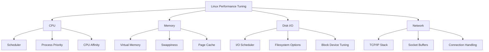
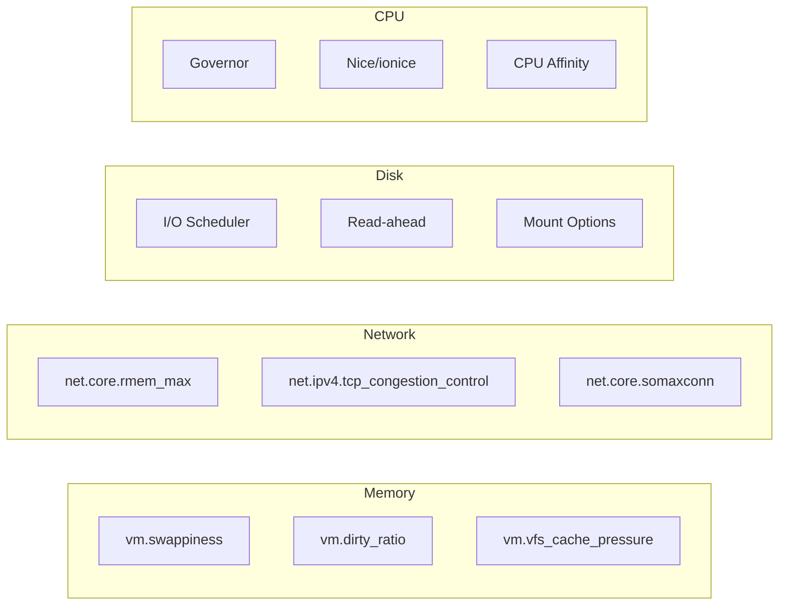

# How to Optimize Linux Performance Tuning

Author: [nawazdhandala](https://www.github.com/nawazdhandala)

Tags: Linux, Performance, System Administration, Optimization, Kernel, Memory, CPU, I/O

Description: A comprehensive guide to Linux performance tuning covering CPU, memory, disk I/O, and network optimization with practical sysctl configurations and monitoring techniques.

---

> Linux performance tuning is both an art and a science. Understanding how to identify bottlenecks and apply appropriate optimizations can dramatically improve system responsiveness and throughput.

This guide covers the essential areas of Linux performance tuning: CPU scheduling, memory management, disk I/O, and network performance, with practical configurations you can apply to your systems.

---

## Performance Tuning Overview



---

## Identifying Bottlenecks

Before tuning, identify where the bottleneck is:

```bash
# Overall system overview
# Shows load averages, memory, CPU, and top processes
top -bn1 | head -20

# More detailed view with vmstat
# Run for 5 iterations at 1 second intervals
vmstat 1 5

# Key columns in vmstat:
# r  - processes waiting for CPU (runnable)
# b  - processes blocked on I/O
# si/so - swap in/out (should be near 0)
# wa - CPU time waiting for I/O

# Example interpretation:
# High 'r' value = CPU bound
# High 'b' value = I/O bound
# High 'si/so' = Memory pressure
# High 'wa' = Disk bottleneck
```

### System Resource Check Script

```bash
#!/bin/bash
# system_bottleneck_check.sh - Quick bottleneck identification

echo "=== System Bottleneck Analysis ==="
echo

# CPU check
echo "--- CPU Status ---"
cpu_idle=$(top -bn1 | grep "Cpu(s)" | awk '{print $8}')
load_avg=$(cat /proc/loadavg | awk '{print $1}')
cpu_count=$(nproc)
echo "CPU idle: ${cpu_idle}%"
echo "Load average: $load_avg (CPUs: $cpu_count)"

if (( $(echo "$load_avg > $cpu_count" | bc -l) )); then
    echo "WARNING: System is CPU-bound (load > CPU count)"
fi
echo

# Memory check
echo "--- Memory Status ---"
free -h
echo
mem_available=$(awk '/MemAvailable/ {print $2}' /proc/meminfo)
mem_total=$(awk '/MemTotal/ {print $2}' /proc/meminfo)
mem_percent=$((100 - (mem_available * 100 / mem_total)))
echo "Memory utilization: ${mem_percent}%"

if [ "$mem_percent" -gt 90 ]; then
    echo "WARNING: High memory utilization"
fi
echo

# I/O check
echo "--- I/O Status ---"
iostat -x 1 2 | tail -n +7 | head -10
echo

# Swap check
echo "--- Swap Activity ---"
vmstat 1 3 | tail -2
```

---

## CPU Performance Tuning

### CPU Governor Settings

```bash
# Check current CPU governor
cat /sys/devices/system/cpu/cpu0/cpufreq/scaling_governor

# List available governors
cat /sys/devices/system/cpu/cpu0/cpufreq/scaling_available_governors

# Set performance governor for maximum CPU speed
# This disables power saving but maximizes performance
for cpu in /sys/devices/system/cpu/cpu*/cpufreq/scaling_governor; do
    echo "performance" | sudo tee "$cpu"
done

# Alternative: Use cpupower tool
cpupower frequency-set -g performance

# Make persistent via systemd service
cat > /etc/systemd/system/cpu-performance.service << 'EOF'
[Unit]
Description=Set CPU Governor to Performance
After=multi-user.target

[Service]
Type=oneshot
ExecStart=/usr/bin/cpupower frequency-set -g performance
RemainAfterExit=yes

[Install]
WantedBy=multi-user.target
EOF

systemctl enable cpu-performance.service
```

### Process Priority and Nice Values

```bash
# Run a process with high priority (lower nice value = higher priority)
# Nice values range from -20 (highest) to 19 (lowest)
nice -n -10 /path/to/important/process

# Change priority of running process
renice -n -5 -p 1234

# Use ionice for I/O priority
# Class 1 = realtime, Class 2 = best-effort, Class 3 = idle
ionice -c 1 -n 0 -p 1234  # Highest I/O priority
ionice -c 3 -p 5678       # Lowest I/O priority (idle)

# Combine nice and ionice for a database process
nice -n -5 ionice -c 2 -n 0 /usr/bin/mysqld
```

### CPU Affinity

```bash
# Pin a process to specific CPUs
# Useful for isolating critical processes
taskset -c 0,1 /path/to/process

# Check CPU affinity of running process
taskset -p 1234

# Move process to specific CPUs
taskset -pc 2,3 1234

# Use cgroups for more advanced control
# Create a cgroup for high-priority processes
cgcreate -g cpu:/high_priority
echo 200000 > /sys/fs/cgroup/cpu/high_priority/cpu.cfs_quota_us
cgexec -g cpu:/high_priority /path/to/process
```

---

## Memory Performance Tuning

### Virtual Memory Settings

```bash
# Create comprehensive memory tuning configuration
cat > /etc/sysctl.d/99-memory-tuning.conf << 'EOF'
# Memory Performance Tuning

# Swappiness: Lower values keep more data in RAM
# 0-10 for database servers
# 10-30 for general servers
# 60 is default (good for desktops)
vm.swappiness = 10

# How aggressively to reclaim memory used for caching
# Higher values favor keeping files in cache
vm.vfs_cache_pressure = 50

# Percentage of memory for dirty pages before writes start
# Lower values = more frequent small writes
# Higher values = larger, less frequent writes
vm.dirty_ratio = 20

# Percentage when background writeback starts
vm.dirty_background_ratio = 5

# Maximum time dirty pages remain in memory (centiseconds)
# 3000 = 30 seconds
vm.dirty_expire_centisecs = 3000

# How often pdflush wakes to write dirty pages
vm.dirty_writeback_centisecs = 500

# Memory overcommit settings
# 0 = heuristic overcommit (default)
# 1 = always overcommit (risky)
# 2 = strict overcommit (safe but may reject allocations)
vm.overcommit_memory = 0
vm.overcommit_ratio = 50

# Enable memory compaction for huge pages
vm.compact_memory = 1

# Zone reclaim mode (for NUMA systems)
# 0 = disabled (generally better for most workloads)
vm.zone_reclaim_mode = 0
EOF

# Apply changes
sysctl -p /etc/sysctl.d/99-memory-tuning.conf
```

### Transparent Huge Pages

```bash
# Check current THP settings
cat /sys/kernel/mm/transparent_hugepage/enabled
cat /sys/kernel/mm/transparent_hugepage/defrag

# For databases (Redis, MongoDB, etc.), disable THP
# THP can cause latency spikes
echo never > /sys/kernel/mm/transparent_hugepage/enabled
echo never > /sys/kernel/mm/transparent_hugepage/defrag

# Make persistent via systemd
cat > /etc/systemd/system/disable-thp.service << 'EOF'
[Unit]
Description=Disable Transparent Huge Pages
DefaultDependencies=no
After=sysinit.target local-fs.target
Before=basic.target

[Service]
Type=oneshot
ExecStart=/bin/sh -c 'echo never > /sys/kernel/mm/transparent_hugepage/enabled'
ExecStart=/bin/sh -c 'echo never > /sys/kernel/mm/transparent_hugepage/defrag'

[Install]
WantedBy=basic.target
EOF

systemctl enable disable-thp.service
```

---

## Disk I/O Performance Tuning

### I/O Scheduler Selection

```bash
# Check current I/O scheduler
cat /sys/block/sda/queue/scheduler

# Available schedulers:
# - none/noop: No scheduling, best for NVMe and SSDs
# - mq-deadline: Good for databases and mixed workloads
# - bfq: Budget Fair Queueing, good for desktops
# - kyber: Low-latency, good for fast devices

# Set scheduler for SSD/NVMe
echo none > /sys/block/nvme0n1/queue/scheduler

# Set scheduler for spinning disk (HDD)
echo mq-deadline > /sys/block/sda/queue/scheduler

# Make persistent via udev rule
cat > /etc/udev/rules.d/60-io-scheduler.rules << 'EOF'
# Set I/O scheduler based on device type
# NVMe devices - use none
ACTION=="add|change", KERNEL=="nvme[0-9]*", ATTR{queue/scheduler}="none"

# SATA SSDs - use none or mq-deadline
ACTION=="add|change", KERNEL=="sd[a-z]", ATTR{queue/rotational}=="0", ATTR{queue/scheduler}="none"

# Spinning disks - use mq-deadline
ACTION=="add|change", KERNEL=="sd[a-z]", ATTR{queue/rotational}=="1", ATTR{queue/scheduler}="mq-deadline"
EOF

# Reload udev rules
udevadm control --reload-rules
udevadm trigger
```

### Block Device Tuning

```bash
# Increase read-ahead for sequential workloads
# Default is 128 (in 512-byte sectors = 64KB)
# Increase for sequential reads
blockdev --setra 4096 /dev/sda  # 2MB read-ahead

# Check current setting
blockdev --getra /dev/sda

# Tune queue depth for better parallelism
echo 256 > /sys/block/sda/queue/nr_requests

# Enable write caching (if battery-backed or using UPS)
hdparm -W1 /dev/sda

# For NVMe, adjust queue depth
echo 1024 > /sys/block/nvme0n1/queue/nr_requests
```

### Filesystem Mount Options

```bash
# Optimal mount options for ext4
# Add to /etc/fstab
# noatime - don't update access time (big performance gain)
# nodiratime - don't update directory access time
# data=ordered - default journaling mode
# barrier=1 - write barriers for data integrity (keep enabled)
# discard - TRIM support for SSDs

# Example fstab entry for SSD with ext4
# UUID=xxx /data ext4 defaults,noatime,nodiratime,discard 0 2

# Optimal mount options for XFS
# noatime,nodiratime - same as ext4
# inode64 - use 64-bit inodes (for large filesystems)
# logbufs=8 - increase log buffers
# logbsize=256k - increase log buffer size

# Example fstab entry for XFS on SSD
# UUID=xxx /data xfs defaults,noatime,nodiratime,logbufs=8,logbsize=256k 0 2

# Remount with new options without reboot
mount -o remount,noatime /data
```

---

## Network Performance Tuning

### TCP/IP Stack Optimization

```bash
# Create comprehensive network tuning configuration
cat > /etc/sysctl.d/99-network-tuning.conf << 'EOF'
# Network Performance Tuning

# Increase socket buffer sizes for high-bandwidth connections
net.core.rmem_max = 134217728
net.core.wmem_max = 134217728
net.core.rmem_default = 31457280
net.core.wmem_default = 31457280
net.core.optmem_max = 25165824

# TCP buffer sizes (min, default, max)
net.ipv4.tcp_rmem = 4096 87380 134217728
net.ipv4.tcp_wmem = 4096 65536 134217728

# Increase backlog for busy servers
net.core.somaxconn = 65535
net.core.netdev_max_backlog = 65536
net.ipv4.tcp_max_syn_backlog = 65536

# TCP keepalive settings
# Reduce time to detect dead connections
net.ipv4.tcp_keepalive_time = 600
net.ipv4.tcp_keepalive_intvl = 60
net.ipv4.tcp_keepalive_probes = 5

# Enable TCP Fast Open (reduces latency for repeated connections)
net.ipv4.tcp_fastopen = 3

# TCP congestion control algorithm
# Options: cubic (default), bbr (recommended for high-bandwidth)
net.ipv4.tcp_congestion_control = bbr

# Enable window scaling for high-bandwidth networks
net.ipv4.tcp_window_scaling = 1

# Enable selective acknowledgments
net.ipv4.tcp_sack = 1

# Increase ephemeral port range
net.ipv4.ip_local_port_range = 1024 65535

# Reduce TIME_WAIT connections
net.ipv4.tcp_tw_reuse = 1
net.ipv4.tcp_fin_timeout = 15

# Increase max connection tracking
net.netfilter.nf_conntrack_max = 1000000
net.netfilter.nf_conntrack_tcp_timeout_established = 86400
EOF

# Load BBR module if using BBR congestion control
modprobe tcp_bbr

# Apply changes
sysctl -p /etc/sysctl.d/99-network-tuning.conf
```

### Network Interface Tuning

```bash
# Increase ring buffer size for high-traffic interfaces
ethtool -G eth0 rx 4096 tx 4096

# Check current settings
ethtool -g eth0

# Enable interrupt coalescing to reduce CPU overhead
# Balances latency vs CPU usage
ethtool -C eth0 rx-usecs 100 tx-usecs 100

# Enable TCP Segmentation Offload
ethtool -K eth0 tso on gso on gro on

# Check offload settings
ethtool -k eth0

# For high packet rate workloads, use multiple queues
ethtool -L eth0 combined 8  # Use 8 queues
```

---

## Kernel Parameters Summary



---

## Workload-Specific Tuning

### Database Server (MySQL/PostgreSQL)

```bash
# Database-optimized sysctl settings
cat > /etc/sysctl.d/99-database.conf << 'EOF'
# Database Server Tuning

# Memory settings - favor caching, minimize swap
vm.swappiness = 1
vm.dirty_ratio = 40
vm.dirty_background_ratio = 10
vm.dirty_expire_centisecs = 500

# Increase shared memory limits for large databases
kernel.shmmax = 68719476736
kernel.shmall = 4294967296

# Increase semaphore limits
kernel.sem = 250 256000 32 1024

# Network tuning for database connections
net.core.somaxconn = 65535
net.ipv4.tcp_max_syn_backlog = 65535
net.ipv4.tcp_tw_reuse = 1

# File handle limits
fs.file-max = 2097152
fs.nr_open = 2097152
EOF

sysctl -p /etc/sysctl.d/99-database.conf

# Disable THP (causes latency spikes)
echo never > /sys/kernel/mm/transparent_hugepage/enabled
```

### Web Server (Nginx/Apache)

```bash
# Web server optimized settings
cat > /etc/sysctl.d/99-webserver.conf << 'EOF'
# Web Server Tuning

# Handle many concurrent connections
net.core.somaxconn = 65535
net.core.netdev_max_backlog = 65536
net.ipv4.tcp_max_syn_backlog = 65536

# Fast connection recycling
net.ipv4.tcp_tw_reuse = 1
net.ipv4.tcp_fin_timeout = 10

# Enable TCP Fast Open
net.ipv4.tcp_fastopen = 3

# Larger ephemeral port range
net.ipv4.ip_local_port_range = 1024 65535

# Buffer sizes
net.core.rmem_max = 16777216
net.core.wmem_max = 16777216
net.ipv4.tcp_rmem = 4096 87380 16777216
net.ipv4.tcp_wmem = 4096 65536 16777216

# File handle limits
fs.file-max = 2097152
EOF

sysctl -p /etc/sysctl.d/99-webserver.conf
```

### High-Frequency Trading / Low-Latency

```bash
# Ultra-low latency settings
cat > /etc/sysctl.d/99-low-latency.conf << 'EOF'
# Low-Latency Tuning

# Disable swap completely
vm.swappiness = 0

# Minimize dirty page writeback delays
vm.dirty_ratio = 1
vm.dirty_background_ratio = 1
vm.dirty_expire_centisecs = 10
vm.dirty_writeback_centisecs = 10

# Network - minimize latency
net.ipv4.tcp_low_latency = 1
net.core.busy_read = 50
net.core.busy_poll = 50

# Disable delayed ACKs
net.ipv4.tcp_quickack = 1
EOF

# CPU settings for low latency
# Disable CPU frequency scaling
for cpu in /sys/devices/system/cpu/cpu*/cpufreq/scaling_governor; do
    echo "performance" > "$cpu"
done

# Disable CPU idle states
for cpu in /sys/devices/system/cpu/cpu*/cpuidle/state*/disable; do
    echo 1 > "$cpu"
done
```

---

## Monitoring Performance Improvements

```bash
#!/bin/bash
# performance_benchmark.sh - Compare before/after tuning

echo "=== Performance Benchmark ==="
echo "Run this before and after tuning to compare"
echo

# CPU benchmark
echo "--- CPU Benchmark (sysbench) ---"
if command -v sysbench &>/dev/null; then
    sysbench cpu --cpu-max-prime=20000 run 2>/dev/null | grep "events per second"
fi

# Memory benchmark
echo "--- Memory Benchmark ---"
if command -v sysbench &>/dev/null; then
    sysbench memory --memory-block-size=1K --memory-total-size=10G run 2>/dev/null | grep "transferred"
fi

# Disk benchmark
echo "--- Disk I/O Benchmark ---"
if command -v fio &>/dev/null; then
    echo "Sequential read:"
    fio --name=seqread --rw=read --bs=128k --size=1G --runtime=10 --filename=/tmp/fiotest 2>/dev/null | grep "READ:"
    echo "Random read:"
    fio --name=randread --rw=randread --bs=4k --size=1G --runtime=10 --filename=/tmp/fiotest 2>/dev/null | grep "READ:"
    rm -f /tmp/fiotest
fi

# Network latency
echo "--- Network Latency ---"
ping -c 5 8.8.8.8 | tail -1

echo
echo "=== Current System Settings ==="
echo "Swappiness: $(cat /proc/sys/vm/swappiness)"
echo "Dirty ratio: $(cat /proc/sys/vm/dirty_ratio)"
echo "TCP congestion: $(cat /proc/sys/net/ipv4/tcp_congestion_control)"
echo "CPU governor: $(cat /sys/devices/system/cpu/cpu0/cpufreq/scaling_governor 2>/dev/null || echo 'N/A')"
```

---

## Quick Reference

| Parameter | Low Latency | High Throughput | Database |
|-----------|-------------|-----------------|----------|
| vm.swappiness | 0 | 10 | 1 |
| vm.dirty_ratio | 1 | 40 | 40 |
| tcp_congestion | cubic | bbr | cubic |
| somaxconn | 65535 | 65535 | 65535 |
| I/O scheduler | none | mq-deadline | none |
| THP | disabled | enabled | disabled |

---

## Best Practices

1. **Benchmark before and after**: Always measure performance before applying changes to verify improvements

2. **Change one thing at a time**: Apply changes incrementally to understand their impact

3. **Document all changes**: Keep a record of tuning parameters and their rationale

4. **Monitor continuously**: Performance characteristics change with load and over time

5. **Test under realistic load**: Synthetic benchmarks may not reflect production workloads

6. **Have a rollback plan**: Keep the original configuration handy to restore if needed

7. **Consider the full stack**: Application-level tuning often has more impact than kernel tuning

---

## Conclusion

Linux performance tuning requires understanding your workload characteristics and bottlenecks before applying optimizations. The settings in this guide provide starting points for common scenarios, but always measure and adjust based on your specific requirements.

Remember that kernel parameters interact with each other and with your applications. What works for one workload may not be optimal for another. Continuous monitoring and iterative tuning are key to maintaining optimal performance as your systems and workloads evolve.
