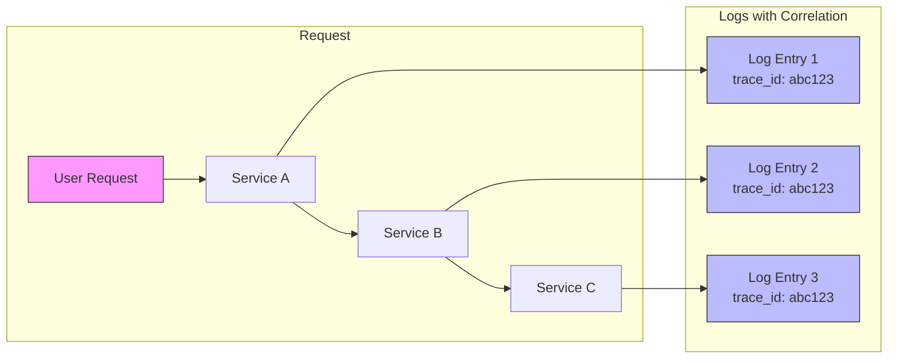
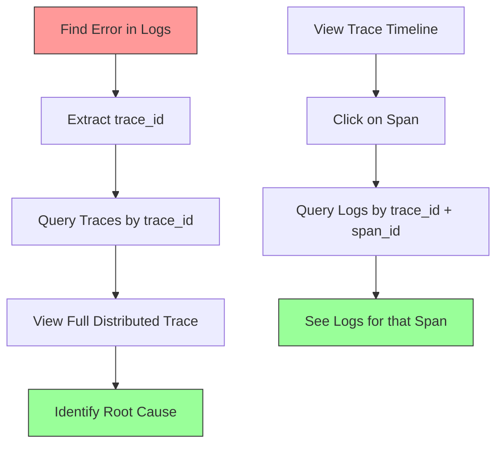

# How to Handle Log Correlation with Traces

Author: [nawazdhandala](https://www.github.com/nawazdhandala)

Tags: OpenTelemetry, Logging, Tracing, Observability, Correlation

Description: Learn how to correlate logs with distributed traces in OpenTelemetry to gain unified visibility into your application behavior.

---

Log correlation with traces is one of the most powerful features of modern observability. When your logs include trace and span IDs, you can jump directly from a log entry to the exact distributed trace that produced it, making debugging significantly easier.

## Understanding Log-Trace Correlation

In a distributed system, a single user request may traverse multiple services. Without correlation, finding the relevant logs across all these services becomes a needle-in-a-haystack problem.



## Setting Up Log Correlation in Python

The key to log correlation is injecting trace context into your log records. Here is how to do it with Python:

```python
# logging_config.py
import logging
from opentelemetry import trace
from opentelemetry.sdk.trace import TracerProvider
from opentelemetry.sdk.trace.export import BatchSpanProcessor
from opentelemetry.exporter.otlp.proto.grpc.trace_exporter import OTLPSpanExporter

# Initialize the tracer provider
trace.set_tracer_provider(TracerProvider())
tracer = trace.get_tracer(__name__)

# Add the OTLP exporter for sending traces to your backend
span_processor = BatchSpanProcessor(OTLPSpanExporter(endpoint="http://localhost:4317"))
trace.get_tracer_provider().add_span_processor(span_processor)

class TraceContextFilter(logging.Filter):
    """
    A logging filter that injects trace context into log records.
    This allows logs to be correlated with their parent traces.
    """

    def filter(self, record):
        # Get the current span from the trace context
        span = trace.get_current_span()

        if span.is_recording():
            # Extract trace_id and span_id from the current span
            ctx = span.get_span_context()
            # Convert to hex format for readability
            record.trace_id = format(ctx.trace_id, '032x')
            record.span_id = format(ctx.span_id, '016x')
            record.trace_flags = ctx.trace_flags
        else:
            # No active span, use placeholder values
            record.trace_id = "00000000000000000000000000000000"
            record.span_id = "0000000000000000"
            record.trace_flags = 0

        return True

# Configure the logger with trace context
def setup_logging():
    """
    Set up logging with trace context injection.
    All log messages will automatically include trace_id and span_id.
    """
    # Create a formatter that includes trace context
    formatter = logging.Formatter(
        '%(asctime)s - %(levelname)s - [trace_id=%(trace_id)s span_id=%(span_id)s] - %(message)s'
    )

    # Set up the root logger
    logger = logging.getLogger()
    logger.setLevel(logging.INFO)

    # Create and configure the handler
    handler = logging.StreamHandler()
    handler.setFormatter(formatter)
    handler.addFilter(TraceContextFilter())

    logger.addHandler(handler)

    return logger
```

## Using Correlated Logging in Your Application

Once logging is configured, use it within traced operations:

```python
# app.py
import logging
from opentelemetry import trace
from logging_config import setup_logging, tracer

# Initialize correlated logging
logger = setup_logging()

def process_order(order_id: str):
    """
    Process an order with full trace correlation.
    All logs within this function will include the trace context.
    """
    # Start a new span for this operation
    with tracer.start_as_current_span("process_order") as span:
        # Add order_id as a span attribute for additional context
        span.set_attribute("order.id", order_id)

        # This log will automatically include trace_id and span_id
        logger.info(f"Starting order processing for order {order_id}")

        try:
            # Validate the order
            validate_order(order_id)

            # Process payment
            process_payment(order_id)

            logger.info(f"Order {order_id} processed successfully")

        except Exception as e:
            # Log the error with full trace context
            logger.error(f"Failed to process order {order_id}: {str(e)}")
            span.record_exception(e)
            span.set_status(trace.Status(trace.StatusCode.ERROR, str(e)))
            raise

def validate_order(order_id: str):
    """Validate order details with a child span."""
    with tracer.start_as_current_span("validate_order") as span:
        span.set_attribute("order.id", order_id)
        logger.info(f"Validating order {order_id}")
        # Validation logic here
        logger.info(f"Order {order_id} validation complete")

def process_payment(order_id: str):
    """Process payment with a child span."""
    with tracer.start_as_current_span("process_payment") as span:
        span.set_attribute("order.id", order_id)
        logger.info(f"Processing payment for order {order_id}")
        # Payment logic here
        logger.info(f"Payment for order {order_id} completed")
```

## Log Correlation in Go

Here is how to achieve the same in Go applications:

```go
// main.go
package main

import (
    "context"
    "log/slog"
    "os"

    "go.opentelemetry.io/otel"
    "go.opentelemetry.io/otel/trace"
)

// TraceHandler wraps an slog.Handler to inject trace context
type TraceHandler struct {
    handler slog.Handler
}

// NewTraceHandler creates a new handler that adds trace context to logs
func NewTraceHandler(h slog.Handler) *TraceHandler {
    return &TraceHandler{handler: h}
}

// Handle processes each log record, injecting trace context
func (h *TraceHandler) Handle(ctx context.Context, r slog.Record) error {
    // Extract span from context
    span := trace.SpanFromContext(ctx)
    if span.SpanContext().IsValid() {
        // Add trace_id and span_id to the log record
        r.AddAttrs(
            slog.String("trace_id", span.SpanContext().TraceID().String()),
            slog.String("span_id", span.SpanContext().SpanID().String()),
        )
    }
    return h.handler.Handle(ctx, r)
}

// Enabled reports whether the handler handles records at the given level
func (h *TraceHandler) Enabled(ctx context.Context, level slog.Level) bool {
    return h.handler.Enabled(ctx, level)
}

// WithAttrs returns a new handler with the given attributes
func (h *TraceHandler) WithAttrs(attrs []slog.Attr) slog.Handler {
    return &TraceHandler{handler: h.handler.WithAttrs(attrs)}
}

// WithGroup returns a new handler with the given group name
func (h *TraceHandler) WithGroup(name string) slog.Handler {
    return &TraceHandler{handler: h.handler.WithGroup(name)}
}

func main() {
    // Set up the base JSON handler
    baseHandler := slog.NewJSONHandler(os.Stdout, &slog.HandlerOptions{
        Level: slog.LevelInfo,
    })

    // Wrap it with trace context injection
    logger := slog.New(NewTraceHandler(baseHandler))

    // Get a tracer
    tracer := otel.Tracer("my-service")

    // Create a span and log within it
    ctx, span := tracer.Start(context.Background(), "process-request")
    defer span.End()

    // This log will include trace_id and span_id
    logger.InfoContext(ctx, "Processing request started",
        slog.String("request_id", "req-123"),
    )

    // Your business logic here

    logger.InfoContext(ctx, "Processing request completed")
}
```

## Using OpenTelemetry Logging SDK

OpenTelemetry also provides a native logging SDK that automatically handles correlation:

```python
# otel_logging.py
from opentelemetry import trace
from opentelemetry.sdk._logs import LoggerProvider, LoggingHandler
from opentelemetry.sdk._logs.export import BatchLogRecordProcessor
from opentelemetry.exporter.otlp.proto.grpc._log_exporter import OTLPLogExporter
import logging

def setup_otel_logging():
    """
    Set up OpenTelemetry's native logging with automatic correlation.
    This approach sends logs directly to your OTLP backend with trace context.
    """
    # Create a logger provider
    logger_provider = LoggerProvider()

    # Add the OTLP exporter for logs
    log_exporter = OTLPLogExporter(endpoint="http://localhost:4317")
    logger_provider.add_log_record_processor(
        BatchLogRecordProcessor(log_exporter)
    )

    # Create a logging handler that uses OpenTelemetry
    handler = LoggingHandler(
        level=logging.INFO,
        logger_provider=logger_provider
    )

    # Attach it to the root logger
    logging.getLogger().addHandler(handler)

    return logger_provider
```

## Correlation in OpenTelemetry Collector

Configure your OpenTelemetry Collector to preserve and forward correlation:

```yaml
# otel-collector-config.yaml
receivers:
  # Receive OTLP data (traces and logs)
  otlp:
    protocols:
      grpc:
        endpoint: 0.0.0.0:4317
      http:
        endpoint: 0.0.0.0:4318

processors:
  # Batch processing for better performance
  batch:
    timeout: 1s
    send_batch_size: 1024

  # Add resource attributes to help with correlation
  resource:
    attributes:
      - key: service.name
        value: my-service
        action: upsert
      - key: deployment.environment
        value: production
        action: upsert

exporters:
  # Export to your observability backend
  otlp/backend:
    endpoint: https://your-backend.example.com:4317
    headers:
      authorization: "Bearer ${BACKEND_TOKEN}"

service:
  pipelines:
    # Traces pipeline
    traces:
      receivers: [otlp]
      processors: [batch, resource]
      exporters: [otlp/backend]

    # Logs pipeline - uses same processors for consistent attributes
    logs:
      receivers: [otlp]
      processors: [batch, resource]
      exporters: [otlp/backend]
```

## Querying Correlated Data

Once your logs include trace context, you can query them effectively:



## Best Practices for Log Correlation

1. **Always Include Both IDs**: Include both `trace_id` and `span_id` in your logs for precise correlation.

2. **Use Structured Logging**: JSON-formatted logs make it easier to parse and query trace context.

3. **Consistent Field Names**: Use the same field names (`trace_id`, `span_id`) across all services.

4. **Log at Span Boundaries**: Log at the start and end of important operations for better visibility.

5. **Include Business Context**: Add order IDs, user IDs, and other business identifiers to both logs and spans.

```python
# Example of comprehensive logging
def handle_request(request):
    with tracer.start_as_current_span("handle_request") as span:
        # Add business context to the span
        span.set_attribute("user.id", request.user_id)
        span.set_attribute("request.path", request.path)

        # Log with the same business context
        logger.info(
            "Handling request",
            extra={
                "user_id": request.user_id,
                "path": request.path,
                "method": request.method
            }
        )

        # Process the request...
```

## Common Issues and Solutions

### Logs Missing Trace Context

If your logs do not show trace IDs, verify that:

1. The logging filter is properly attached to your logger
2. There is an active span when logging occurs
3. The span is recording (not a no-op span)

```python
# Debug helper to verify trace context
def debug_trace_context():
    span = trace.get_current_span()
    if span.is_recording():
        ctx = span.get_span_context()
        print(f"Active trace: {format(ctx.trace_id, '032x')}")
        print(f"Active span: {format(ctx.span_id, '016x')}")
    else:
        print("No active span - trace context will not be in logs")
```

### Mismatched Timestamps

Ensure your logs and traces use the same time source:

```python
# Use UTC timestamps consistently
import datetime

logging.Formatter.converter = lambda *args: datetime.datetime.utcnow().timetuple()
```

## Conclusion

Log correlation with traces transforms debugging from a guessing game into a methodical process. By including trace and span IDs in your logs, you create a unified view of your system behavior that makes it easy to follow requests across service boundaries and understand exactly what happened when issues occur.

Start by adding trace context injection to your logging configuration, then gradually adopt OpenTelemetry's native logging SDK for tighter integration. The investment pays off quickly when you need to debug production issues.
