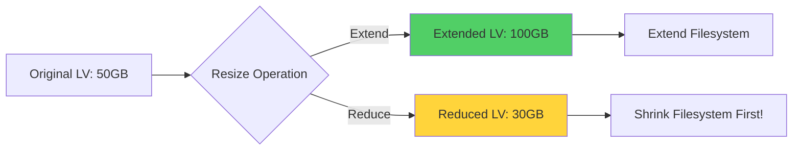
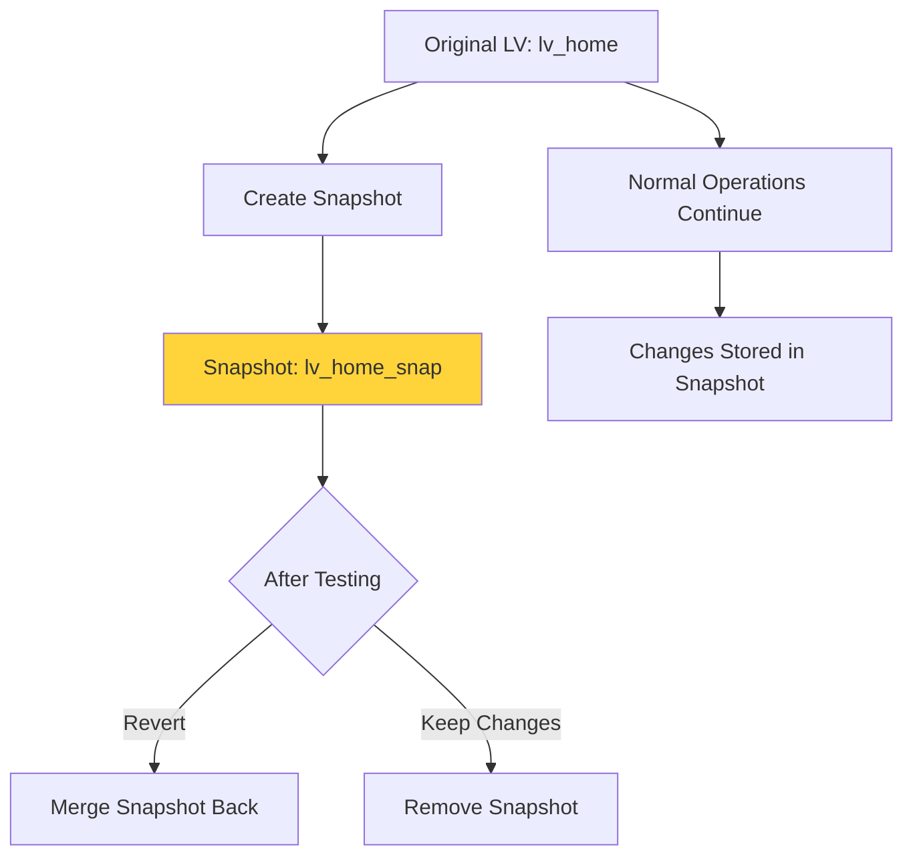
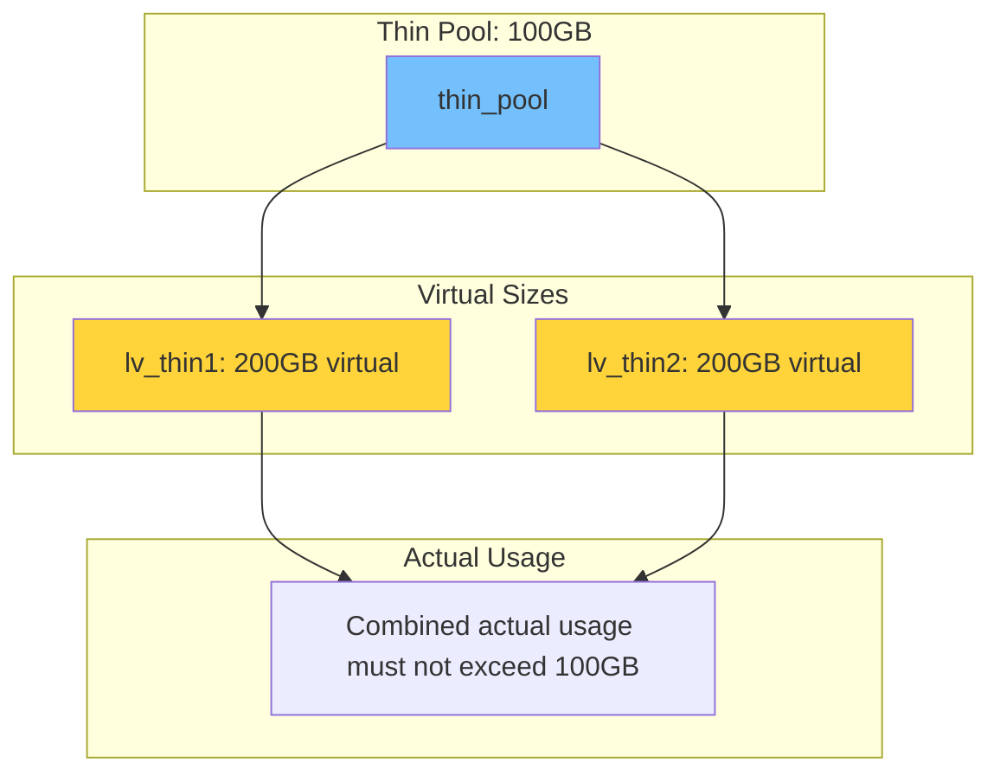

# How to Configure LVM for Storage Management

Author: [nawazdhandala](https://www.github.com/nawazdhandala)

Tags: Linux, LVM, Storage, System Administration, Disk Management, Partitioning, Volumes

Description: A comprehensive guide to configuring and managing Logical Volume Manager (LVM) for flexible storage management in Linux systems.

---

Logical Volume Manager (LVM) is a powerful storage management technology that provides a layer of abstraction between your physical storage devices and the filesystems that use them. LVM enables dynamic resizing, snapshots, and flexible storage allocation that traditional partitioning cannot offer.

## Understanding LVM Architecture

LVM consists of three main components that work together to provide flexible storage management:

```mermaid
flowchart TD
    subgraph Physical Layer
        PV1[Physical Volume /dev/sda1]
        PV2[Physical Volume /dev/sdb1]
        PV3[Physical Volume /dev/sdc1]
    end

    subgraph Volume Group Layer
        VG[Volume Group: vg_data]
    end

    subgraph Logical Volume Layer
        LV1[Logical Volume: lv_home]
        LV2[Logical Volume: lv_var]
        LV3[Logical Volume: lv_backup]
    end

    subgraph Filesystem Layer
        FS1[/home - ext4]
        FS2[/var - xfs]
        FS3[/backup - ext4]
    end

    PV1 --> VG
    PV2 --> VG
    PV3 --> VG
    VG --> LV1
    VG --> LV2
    VG --> LV3
    LV1 --> FS1
    LV2 --> FS2
    LV3 --> FS3

    style VG fill:#74c0fc
    style LV1 fill:#a9e34b
    style LV2 fill:#a9e34b
    style LV3 fill:#a9e34b
```

### Components Explained

1. **Physical Volumes (PV)**: Physical disks or partitions initialized for use with LVM
2. **Volume Groups (VG)**: Pools of storage combining multiple physical volumes
3. **Logical Volumes (LV)**: Virtual partitions created from volume group space

## Installing LVM

```bash
# Install LVM tools on Debian/Ubuntu
sudo apt update
sudo apt install lvm2

# Install LVM tools on RHEL/CentOS
sudo yum install lvm2

# Verify LVM is installed and check version
lvm version

# Start and enable the LVM service
sudo systemctl enable lvm2-lvmetad
sudo systemctl start lvm2-lvmetad
```

## Creating LVM Storage Step by Step

### Step 1: Prepare Physical Disks

First, identify available disks and prepare them for LVM.

```bash
# List all block devices to identify available disks
# Look for disks without partitions that you can use
lsblk

# Example output:
# sda      8:0    0  100G  0 disk
# sdb      8:16   0  200G  0 disk
# sdc      8:32   0  200G  0 disk

# Check if disks are already in use
sudo fdisk -l /dev/sdb

# Create a new partition for LVM on each disk
# We will use fdisk to create a Linux LVM partition (type 8e)
sudo fdisk /dev/sdb
# Commands in fdisk:
# n - new partition
# p - primary partition
# 1 - partition number
# Enter - accept default first sector
# Enter - accept default last sector (use entire disk)
# t - change partition type
# 8e - Linux LVM type
# w - write changes and exit
```

### Step 2: Create Physical Volumes

Initialize the partitions as LVM physical volumes.

```bash
# Create physical volumes on the prepared partitions
# The pvcreate command initializes the partition for LVM use
sudo pvcreate /dev/sdb1
sudo pvcreate /dev/sdc1

# Verify physical volumes were created
# Shows all physical volumes with their size and VG membership
sudo pvs

# Get detailed information about a physical volume
sudo pvdisplay /dev/sdb1
```

### Step 3: Create a Volume Group

Combine physical volumes into a volume group.

```bash
# Create a volume group named 'vg_data' from the physical volumes
# The volume group pools storage from all included PVs
sudo vgcreate vg_data /dev/sdb1 /dev/sdc1

# Verify the volume group was created
# Shows volume group name, number of PVs, and total/free space
sudo vgs

# Get detailed information about the volume group
sudo vgdisplay vg_data
```

### Step 4: Create Logical Volumes

Create logical volumes from the volume group space.

```bash
# Create a 50GB logical volume for /home
# The -L flag specifies the size, -n specifies the name
sudo lvcreate -L 50G -n lv_home vg_data

# Create a 100GB logical volume for /var
sudo lvcreate -L 100G -n lv_var vg_data

# Create a logical volume using percentage of remaining space
# This creates a volume using 80% of free space in the VG
sudo lvcreate -l 80%FREE -n lv_backup vg_data

# Verify logical volumes were created
sudo lvs

# Get detailed information about a logical volume
sudo lvdisplay vg_data/lv_home
```

### Step 5: Create Filesystems

Format the logical volumes with your preferred filesystem.

```bash
# Create an ext4 filesystem on the home logical volume
sudo mkfs.ext4 /dev/vg_data/lv_home

# Create an xfs filesystem on the var logical volume
# XFS is recommended for large files and high throughput
sudo mkfs.xfs /dev/vg_data/lv_var

# Create an ext4 filesystem on the backup volume
sudo mkfs.ext4 /dev/vg_data/lv_backup
```

### Step 6: Mount the Filesystems

```bash
# Create mount points
sudo mkdir -p /mnt/home /mnt/var /mnt/backup

# Mount the logical volumes
sudo mount /dev/vg_data/lv_home /mnt/home
sudo mount /dev/vg_data/lv_var /mnt/var
sudo mount /dev/vg_data/lv_backup /mnt/backup

# Verify mounts
df -h | grep vg_data

# Add entries to /etc/fstab for persistent mounting
# Using the LVM path ensures consistent mounting across reboots
echo '/dev/vg_data/lv_home /mnt/home ext4 defaults 0 2' | sudo tee -a /etc/fstab
echo '/dev/vg_data/lv_var /mnt/var xfs defaults 0 2' | sudo tee -a /etc/fstab
echo '/dev/vg_data/lv_backup /mnt/backup ext4 defaults 0 2' | sudo tee -a /etc/fstab
```

## Resizing Logical Volumes

One of LVM's greatest advantages is the ability to resize volumes without data loss.



### Extending a Logical Volume

```bash
# Check available space in the volume group
sudo vgs

# Extend the logical volume by 20GB
# The -L +20G adds 20GB to the current size
sudo lvextend -L +20G /dev/vg_data/lv_home

# Or extend to a specific size
sudo lvextend -L 100G /dev/vg_data/lv_home

# Or use all remaining free space
sudo lvextend -l +100%FREE /dev/vg_data/lv_home

# Resize the filesystem to use the new space
# For ext4 filesystems (can be done online)
sudo resize2fs /dev/vg_data/lv_home

# For xfs filesystems (must be mounted, grows automatically)
sudo xfs_growfs /mnt/var

# Combine lvextend and filesystem resize in one command
# The -r flag automatically resizes the filesystem
sudo lvextend -r -L +20G /dev/vg_data/lv_home
```

### Reducing a Logical Volume

**Warning:** Reducing a logical volume is risky. Always backup data first!

```bash
# IMPORTANT: Reduction requires unmounting and is risky
# Always backup your data before reducing a volume

# For ext4 filesystems:
# 1. Unmount the filesystem
sudo umount /mnt/home

# 2. Check the filesystem for errors
sudo e2fsck -f /dev/vg_data/lv_home

# 3. Resize the filesystem first (MUST be done before lvreduce)
# Reduce to slightly smaller than target LV size for safety
sudo resize2fs /dev/vg_data/lv_home 40G

# 4. Reduce the logical volume
sudo lvreduce -L 45G /dev/vg_data/lv_home

# 5. Remount
sudo mount /dev/vg_data/lv_home /mnt/home

# Note: XFS filesystems cannot be reduced!
# For XFS, you must backup, recreate the LV, and restore
```

## Extending Volume Groups

Add more physical storage to an existing volume group.

```bash
# Add a new disk to the system and prepare it
sudo pvcreate /dev/sdd1

# Extend the volume group with the new physical volume
# This adds the new disk's capacity to the pool
sudo vgextend vg_data /dev/sdd1

# Verify the volume group now has more space
sudo vgs
```

## LVM Snapshots

Snapshots create point-in-time copies of logical volumes, useful for backups and testing.



### Creating and Using Snapshots

```bash
# Create a snapshot of a logical volume
# The -s flag indicates this is a snapshot
# The -L specifies the size to allocate for changes
sudo lvcreate -s -L 10G -n lv_home_snap /dev/vg_data/lv_home

# List all logical volumes including snapshots
sudo lvs

# Mount the snapshot to access point-in-time data
sudo mkdir -p /mnt/snapshot
sudo mount /dev/vg_data/lv_home_snap /mnt/snapshot

# Use the snapshot for backup
tar -czvf /backup/home_backup.tar.gz /mnt/snapshot/

# Check snapshot usage (important - snapshots can fill up!)
# When a snapshot fills up, it becomes invalid
sudo lvs -o +snap_percent

# Remove a snapshot when done
sudo umount /mnt/snapshot
sudo lvremove /dev/vg_data/lv_home_snap
```

### Reverting to a Snapshot

```bash
# To revert changes and restore to snapshot state:
# First unmount both the original and snapshot
sudo umount /mnt/home
sudo umount /mnt/snapshot

# Merge the snapshot back into the original volume
# This reverts all changes made since the snapshot
sudo lvconvert --merge /dev/vg_data/lv_home_snap

# Reactivate the logical volume
sudo lvchange -an /dev/vg_data/lv_home
sudo lvchange -ay /dev/vg_data/lv_home

# Remount
sudo mount /dev/vg_data/lv_home /mnt/home
```

## LVM Thin Provisioning

Thin provisioning allows over-allocation of storage, creating volumes larger than the available physical space.

```bash
# Create a thin pool in the volume group
# This creates a pool that thin volumes will draw from
sudo lvcreate -L 100G --thinpool thin_pool vg_data

# Create a thin volume from the pool
# This volume can be larger than the pool size (over-provisioned)
sudo lvcreate -V 200G --thin -n lv_thin1 vg_data/thin_pool

# Create another thin volume
sudo lvcreate -V 200G --thin -n lv_thin2 vg_data/thin_pool

# The thin volumes share the 100G pool
# Actual space is only used as data is written

# Monitor thin pool usage
sudo lvs -o +data_percent,metadata_percent vg_data/thin_pool
```



## LVM Administration Commands Reference

### Viewing LVM Information

```bash
# Summary view of all LVM components
sudo pvs    # Physical volumes summary
sudo vgs    # Volume groups summary
sudo lvs    # Logical volumes summary

# Detailed views
sudo pvdisplay    # All PVs in detail
sudo vgdisplay    # All VGs in detail
sudo lvdisplay    # All LVs in detail

# Scan for all LVM devices
sudo pvscan
sudo vgscan
sudo lvscan
```

### Managing Physical Volumes

```bash
# Initialize a disk for LVM
sudo pvcreate /dev/sdb1

# Remove a physical volume from LVM
# First move data off the PV
sudo pvmove /dev/sdb1
# Then remove from volume group
sudo vgreduce vg_data /dev/sdb1
# Finally remove the PV
sudo pvremove /dev/sdb1

# Check for and repair physical volume metadata
sudo pvck /dev/sdb1
```

### Managing Volume Groups

```bash
# Create a volume group
sudo vgcreate vg_name /dev/sdb1 /dev/sdc1

# Rename a volume group
sudo vgrename vg_old vg_new

# Add a PV to an existing VG
sudo vgextend vg_data /dev/sdd1

# Remove a PV from a VG (must move data first)
sudo pvmove /dev/sdb1
sudo vgreduce vg_data /dev/sdb1

# Remove an entire volume group (LVs must be removed first)
sudo vgremove vg_data

# Export/Import VG for moving between systems
sudo vgexport vg_data
# ... move disks to new system ...
sudo vgimport vg_data
```

### Managing Logical Volumes

```bash
# Create a logical volume
sudo lvcreate -L 50G -n lv_name vg_data

# Rename a logical volume
sudo lvrename vg_data lv_old lv_new

# Remove a logical volume (unmount first)
sudo umount /mnt/data
sudo lvremove /dev/vg_data/lv_name

# Activate/deactivate a logical volume
sudo lvchange -ay /dev/vg_data/lv_name    # Activate
sudo lvchange -an /dev/vg_data/lv_name    # Deactivate
```

## Best Practices

### 1. Leave Free Space in Volume Groups

```bash
# Always leave some free space in VGs for snapshots and emergencies
# Check free space
sudo vgs -o +vg_free

# Recommendation: Keep at least 10-20% free
```

### 2. Monitor LVM Health

```bash
# Create a monitoring script
cat << 'EOF' > /usr/local/bin/lvm-check.sh
#!/bin/bash
# Check LVM health and alert on issues

# Check for volume groups with low free space
for vg in $(vgs --noheadings -o vg_name); do
    free_percent=$(vgs --noheadings -o vg_free_count,vg_extent_count "$vg" | awk '{print int(($1/$2)*100)}')
    if [ "$free_percent" -lt 10 ]; then
        echo "Warning: Volume group $vg has only ${free_percent}% free space"
    fi
done

# Check for nearly full thin pools
for pool in $(lvs --noheadings -o lv_path -S 'lv_attr=~^t'); do
    data_percent=$(lvs --noheadings -o data_percent "$pool" | tr -d ' ')
    if (( $(echo "$data_percent > 80" | bc -l) )); then
        echo "Warning: Thin pool $pool is ${data_percent}% full"
    fi
done
EOF
chmod +x /usr/local/bin/lvm-check.sh
```

### 3. Document Your LVM Configuration

```bash
# Generate LVM configuration report
sudo vgcfgbackup -f /root/lvm-backup-$(date +%Y%m%d).conf vg_data

# Create a snapshot of LVM configuration for documentation
sudo lvmdump -d /root/lvmdump-$(date +%Y%m%d)
```

## Conclusion

LVM provides powerful and flexible storage management capabilities that traditional partitioning cannot match. By understanding how to create, resize, and manage logical volumes, you can efficiently allocate storage across your Linux systems and respond to changing capacity needs without downtime.

**Key Takeaways:**
- LVM adds flexibility with resizable volumes and snapshots
- Always leave free space in volume groups for emergencies
- Use thin provisioning for efficient storage utilization
- Monitor snapshot usage to prevent invalid snapshots
- Regular backups are essential, especially before reduction operations

**Related Reading:**
- [How to Fix "Read-Only File System" Errors](https://oneuptime.com/blog/post/2026-01-24-read-only-file-system-errors/view)
- [How to Handle Package Management with apt and yum](https://oneuptime.com/blog/post/2026-01-24-package-management-apt-yum/view)
