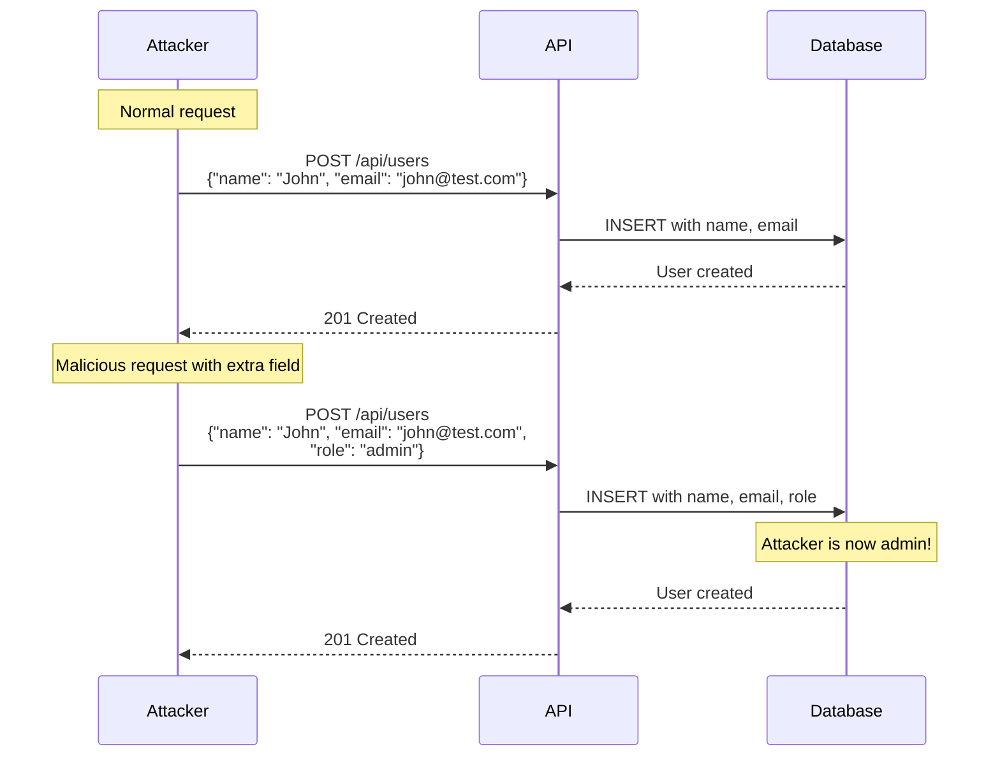

# How to Fix "Mass Assignment" Vulnerabilities

Author: [nawazdhandala](https://www.github.com/nawazdhandala)

Tags: Security, Mass Assignment, API Security, OWASP, Web Security, Node.js, Python

Description: Learn how to identify and fix mass assignment vulnerabilities that allow attackers to modify protected fields in your application.

---

Mass assignment vulnerabilities occur when an application automatically binds user input to object properties without filtering. An attacker can exploit this by adding unexpected fields to requests, potentially modifying sensitive attributes like user roles, account balances, or admin flags.

## Understanding Mass Assignment

Mass assignment happens when you directly use request data to update database records without validating which fields are allowed.



## Vulnerable Code Examples

### Node.js/Express with Mongoose

```javascript
// VULNERABLE: Directly using request body
app.post('/api/users', async (req, res) => {
  // Attacker can add any field: role, isAdmin, balance, etc.
  const user = new User(req.body);
  await user.save();
  res.status(201).json(user);
});

app.put('/api/users/:id', async (req, res) => {
  // Attacker can modify protected fields
  const user = await User.findByIdAndUpdate(
    req.params.id,
    req.body,  // All fields from request are applied!
    { new: true }
  );
  res.json(user);
});
```

### Python/Flask with SQLAlchemy

```python
# VULNERABLE: Using **kwargs from request
@app.route('/api/users', methods=['POST'])
def create_user():
    data = request.get_json()
    # Attacker can include any field
    user = User(**data)
    db.session.add(user)
    db.session.commit()
    return jsonify(user.to_dict()), 201

@app.route('/api/users/<int:id>', methods=['PUT'])
def update_user(id):
    user = User.query.get_or_404(id)
    data = request.get_json()
    # All fields are updated without validation
    for key, value in data.items():
        setattr(user, key, value)
    db.session.commit()
    return jsonify(user.to_dict())
```

### Ruby on Rails

```ruby
# VULNERABLE: Without strong parameters
class UsersController < ApplicationController
  def create
    # Accepts all parameters
    @user = User.new(params[:user])
    @user.save
  end

  def update
    @user = User.find(params[:id])
    # Attacker can modify any attribute
    @user.update(params[:user])
  end
end
```

## How to Fix Mass Assignment

### Solution 1: Explicit Field Whitelisting

Only allow specific fields to be set from user input.

```javascript
// SECURE: Whitelist allowed fields
app.post('/api/users', async (req, res) => {
  // Extract only allowed fields
  const allowedFields = ['name', 'email', 'password'];
  const userData = {};

  allowedFields.forEach(field => {
    if (req.body[field] !== undefined) {
      userData[field] = req.body[field];
    }
  });

  const user = new User(userData);
  await user.save();
  res.status(201).json(user);
});

app.put('/api/users/:id', async (req, res) => {
  const allowedFields = ['name', 'email'];
  const updates = {};

  allowedFields.forEach(field => {
    if (req.body[field] !== undefined) {
      updates[field] = req.body[field];
    }
  });

  const user = await User.findByIdAndUpdate(
    req.params.id,
    updates,
    { new: true }
  );
  res.json(user);
});
```

### Solution 2: Data Transfer Objects (DTOs)

Create separate classes for input validation.

```javascript
// dto/CreateUserDTO.js
const Joi = require('joi');

const createUserSchema = Joi.object({
  name: Joi.string().required().max(100),
  email: Joi.string().email().required(),
  password: Joi.string().min(8).required()
  // role, isAdmin, balance are NOT included
});

const updateUserSchema = Joi.object({
  name: Joi.string().max(100),
  email: Joi.string().email()
  // Only these fields can be updated by users
});

// Middleware for validation
function validateDTO(schema) {
  return (req, res, next) => {
    const { error, value } = schema.validate(req.body, {
      stripUnknown: true  // Remove fields not in schema
    });

    if (error) {
      return res.status(400).json({
        error: error.details[0].message
      });
    }

    req.validatedBody = value;
    next();
  };
}

// Usage in routes
app.post('/api/users',
  validateDTO(createUserSchema),
  async (req, res) => {
    // req.validatedBody only contains allowed fields
    const user = new User(req.validatedBody);
    await user.save();
    res.status(201).json(user);
  }
);
```

### Solution 3: Context-Based Field Filtering

Allow different fields based on user role or context.

```javascript
// fieldFilters.js
const fieldFilters = {
  user: {
    create: ['name', 'email', 'password'],
    update: ['name', 'email'],
    adminUpdate: ['name', 'email', 'role', 'isActive', 'emailVerified']
  },
  product: {
    create: ['name', 'description', 'price', 'category'],
    update: ['name', 'description', 'price'],
    adminUpdate: ['name', 'description', 'price', 'category', 'isActive', 'featured']
  }
};

function filterFields(data, resource, action, isAdmin = false) {
  const effectiveAction = isAdmin ? `admin${action.charAt(0).toUpperCase() + action.slice(1)}` : action;
  const allowedFields = fieldFilters[resource][effectiveAction] || fieldFilters[resource][action];

  const filtered = {};
  allowedFields.forEach(field => {
    if (data[field] !== undefined) {
      filtered[field] = data[field];
    }
  });

  return filtered;
}

// Usage
app.put('/api/users/:id', authenticate, async (req, res) => {
  const isAdmin = req.user.role === 'admin';
  const filteredData = filterFields(req.body, 'user', 'update', isAdmin);

  const user = await User.findByIdAndUpdate(
    req.params.id,
    filteredData,
    { new: true }
  );
  res.json(user);
});
```

### Python/Flask Secure Implementation

```python
from marshmallow import Schema, fields, EXCLUDE

# Define schemas for different operations
class CreateUserSchema(Schema):
    class Meta:
        unknown = EXCLUDE  # Ignore unknown fields

    name = fields.String(required=True, validate=lambda x: len(x) <= 100)
    email = fields.Email(required=True)
    password = fields.String(required=True, load_only=True, validate=lambda x: len(x) >= 8)

class UpdateUserSchema(Schema):
    class Meta:
        unknown = EXCLUDE

    name = fields.String(validate=lambda x: len(x) <= 100)
    email = fields.Email()

class AdminUpdateUserSchema(UpdateUserSchema):
    role = fields.String(validate=lambda x: x in ['user', 'moderator', 'admin'])
    is_active = fields.Boolean()

# Usage in routes
create_user_schema = CreateUserSchema()
update_user_schema = UpdateUserSchema()
admin_update_schema = AdminUpdateUserSchema()

@app.route('/api/users', methods=['POST'])
def create_user():
    data = create_user_schema.load(request.get_json())
    # data only contains name, email, password
    user = User(**data)
    db.session.add(user)
    db.session.commit()
    return jsonify(user.to_dict()), 201

@app.route('/api/users/<int:id>', methods=['PUT'])
@require_auth
def update_user(id):
    user = User.query.get_or_404(id)

    # Choose schema based on user role
    if g.current_user.role == 'admin':
        schema = admin_update_schema
    else:
        schema = update_user_schema

    data = schema.load(request.get_json())

    for key, value in data.items():
        setattr(user, key, value)

    db.session.commit()
    return jsonify(user.to_dict())
```

### Ruby on Rails Strong Parameters

```ruby
class UsersController < ApplicationController
  def create
    @user = User.new(user_create_params)
    if @user.save
      render json: @user, status: :created
    else
      render json: @user.errors, status: :unprocessable_entity
    end
  end

  def update
    @user = User.find(params[:id])

    # Use different params based on role
    permitted = current_user.admin? ? admin_user_params : user_update_params

    if @user.update(permitted)
      render json: @user
    else
      render json: @user.errors, status: :unprocessable_entity
    end
  end

  private

  def user_create_params
    params.require(:user).permit(:name, :email, :password, :password_confirmation)
  end

  def user_update_params
    params.require(:user).permit(:name, :email)
  end

  def admin_user_params
    params.require(:user).permit(:name, :email, :role, :is_active, :email_verified)
  end
end
```

## Mongoose Schema Protection

Configure your schema to prevent mass assignment at the model level.

```javascript
const mongoose = require('mongoose');

const userSchema = new mongoose.Schema({
  name: { type: String, required: true },
  email: { type: String, required: true, unique: true },
  password: { type: String, required: true, select: false },

  // Protected fields - set immutable or use methods
  role: {
    type: String,
    enum: ['user', 'admin'],
    default: 'user'
  },
  isAdmin: {
    type: Boolean,
    default: false,
    immutable: true  // Cannot be changed after creation
  },
  balance: {
    type: Number,
    default: 0
  },
  emailVerified: {
    type: Boolean,
    default: false
  }
});

// Method to safely update user - only allows specific fields
userSchema.methods.safeUpdate = function(data) {
  const allowedFields = ['name', 'email'];
  allowedFields.forEach(field => {
    if (data[field] !== undefined) {
      this[field] = data[field];
    }
  });
  return this.save();
};

// Static method for admin updates
userSchema.statics.adminUpdate = async function(id, data) {
  const allowedFields = ['name', 'email', 'role', 'isActive', 'emailVerified'];
  const updates = {};

  allowedFields.forEach(field => {
    if (data[field] !== undefined) {
      updates[field] = data[field];
    }
  });

  return this.findByIdAndUpdate(id, updates, { new: true });
};

module.exports = mongoose.model('User', userSchema);
```

## Testing for Mass Assignment

```javascript
describe('User API Mass Assignment Protection', () => {
  test('should not allow role escalation on create', async () => {
    const response = await request(app)
      .post('/api/users')
      .send({
        name: 'Test User',
        email: 'test@example.com',
        password: 'password123',
        role: 'admin',  // Attempting privilege escalation
        isAdmin: true
      });

    expect(response.status).toBe(201);
    expect(response.body.role).toBe('user');  // Should be default
    expect(response.body.isAdmin).toBe(false);  // Should be default
  });

  test('should not allow balance modification', async () => {
    const user = await createUser({ balance: 100 });

    const response = await request(app)
      .put(`/api/users/${user.id}`)
      .set('Authorization', `Bearer ${userToken}`)
      .send({
        name: 'Updated Name',
        balance: 1000000  // Attempting to modify balance
      });

    expect(response.status).toBe(200);
    expect(response.body.name).toBe('Updated Name');

    // Verify balance unchanged
    const updatedUser = await User.findById(user.id);
    expect(updatedUser.balance).toBe(100);
  });
});
```

## Security Checklist

- [ ] Never use request body directly in database operations
- [ ] Define explicit whitelists for each endpoint
- [ ] Use different field lists for different user roles
- [ ] Implement DTOs or schemas for input validation
- [ ] Test for mass assignment in your security tests
- [ ] Mark sensitive fields as immutable where possible
- [ ] Review all create and update endpoints

---

Mass assignment is a subtle but dangerous vulnerability. The fix is straightforward: never trust user input to determine which fields to update. Always explicitly define what fields are allowed, validate input against schemas, and test that protected fields cannot be modified. A few minutes of prevention saves hours of incident response.
