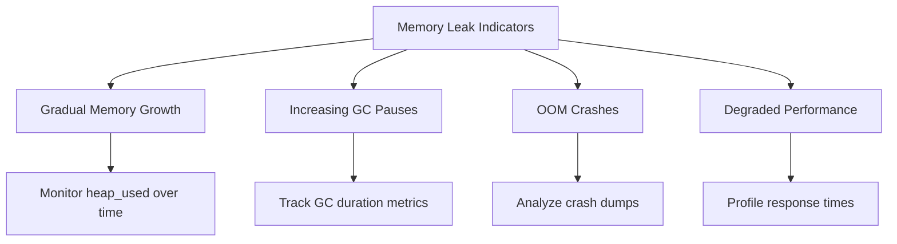
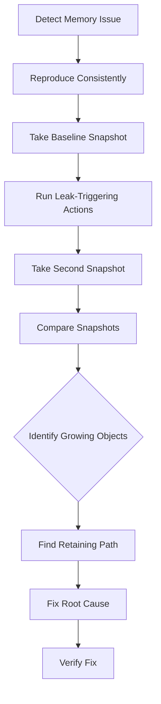

# How to Fix "Memory Leak" Detection

Author: [nawazdhandala](https://www.github.com/nawazdhandala)

Tags: Debugging, Performance, Memory, Node.js, JavaScript, DevOps

Description: Learn how to detect, diagnose, and fix memory leaks in JavaScript applications using heap snapshots, profiling tools, and systematic debugging approaches.

---

Memory leaks are silent killers. Your application starts with 100MB of memory, runs fine for hours, then suddenly crashes when it hits 4GB. The longer the leak runs undetected, the harder it becomes to trace back to the source. This guide covers practical techniques to find and fix memory leaks before they crash production.

## Recognizing Memory Leak Symptoms



| Symptom | Likely Cause | Diagnostic Tool |
|---------|--------------|-----------------|
| Heap grows over hours | Object accumulation | Heap snapshots |
| Frequent long GC pauses | Large heap, many objects | `--trace-gc` flag |
| Process restart fixes issue | Unbounded caches/listeners | Memory timeline |
| Gradual response time increase | Memory pressure | APM tools |

## Setting Up Memory Monitoring

```javascript
// memory-monitor.js - Production memory monitoring
const v8 = require('v8');
const process = require('process');

class MemoryMonitor {
  constructor(options = {}) {
    this.interval = options.interval || 60000; // 1 minute
    this.threshold = options.threshold || 0.85; // 85% of max
    this.samples = [];
    this.maxSamples = options.maxSamples || 60;
    this.onAlert = options.onAlert || console.warn;
  }

  start() {
    this.intervalId = setInterval(() => {
      this.collectSample();
    }, this.interval);

    // Also monitor on GC
    if (global.gc) {
      const originalGc = global.gc;
      global.gc = () => {
        const before = process.memoryUsage().heapUsed;
        originalGc();
        const after = process.memoryUsage().heapUsed;
        console.log(`GC freed: ${((before - after) / 1024 / 1024).toFixed(2)}MB`);
      };
    }
  }

  collectSample() {
    const usage = process.memoryUsage();
    const heapStats = v8.getHeapStatistics();

    const sample = {
      timestamp: Date.now(),
      heapUsed: usage.heapUsed,
      heapTotal: usage.heapTotal,
      external: usage.external,
      rss: usage.rss,
      heapSizeLimit: heapStats.heap_size_limit,
      usedHeapPercentage: usage.heapUsed / heapStats.heap_size_limit
    };

    this.samples.push(sample);
    if (this.samples.length > this.maxSamples) {
      this.samples.shift();
    }

    // Check for issues
    this.analyze(sample);
  }

  analyze(current) {
    // Alert if approaching heap limit
    if (current.usedHeapPercentage > this.threshold) {
      this.onAlert({
        type: 'heap_pressure',
        message: `Heap usage at ${(current.usedHeapPercentage * 100).toFixed(1)}%`,
        heapUsed: current.heapUsed,
        heapLimit: current.heapSizeLimit
      });
    }

    // Detect sustained growth
    if (this.samples.length >= 10) {
      const trend = this.calculateTrend();
      if (trend.growthRate > 0.1) { // 10% growth over sampling period
        this.onAlert({
          type: 'memory_leak_suspected',
          message: `Heap growing at ${(trend.growthRate * 100).toFixed(1)}% per sample period`,
          projectedOOM: trend.projectedOOM
        });
      }
    }
  }

  calculateTrend() {
    const first = this.samples[0];
    const last = this.samples[this.samples.length - 1];
    const growthRate = (last.heapUsed - first.heapUsed) / first.heapUsed;

    // Project when OOM might occur
    const heapLimit = last.heapSizeLimit;
    const remaining = heapLimit - last.heapUsed;
    const growthPerSample = (last.heapUsed - first.heapUsed) / this.samples.length;
    const samplesUntilOOM = remaining / growthPerSample;
    const projectedOOM = Date.now() + (samplesUntilOOM * this.interval);

    return { growthRate, projectedOOM };
  }

  stop() {
    clearInterval(this.intervalId);
  }
}

// Initialize monitoring
const monitor = new MemoryMonitor({
  interval: 30000,
  threshold: 0.8,
  onAlert: (alert) => {
    console.error('Memory alert:', alert);
    // Send to monitoring system
    metrics.recordAlert(alert);
  }
});

monitor.start();
```

## Taking Heap Snapshots

Heap snapshots capture the entire memory state for analysis:

```javascript
// heap-snapshot.js - Programmatic heap snapshot capture
const v8 = require('v8');
const fs = require('fs');
const path = require('path');

class HeapSnapshotManager {
  constructor(options = {}) {
    this.outputDir = options.outputDir || '/tmp/heapdumps';
    this.maxSnapshots = options.maxSnapshots || 5;

    // Ensure output directory exists
    if (!fs.existsSync(this.outputDir)) {
      fs.mkdirSync(this.outputDir, { recursive: true });
    }
  }

  async capture(label = 'manual') {
    // Force GC before snapshot for cleaner results
    if (global.gc) {
      global.gc();
      global.gc(); // Run twice to clean weak refs
    }

    const filename = `heapdump-${label}-${Date.now()}.heapsnapshot`;
    const filepath = path.join(this.outputDir, filename);

    console.log(`Taking heap snapshot: ${filepath}`);
    const start = Date.now();

    // Write snapshot to file
    const snapshotStream = v8.writeHeapSnapshot(filepath);

    console.log(`Heap snapshot saved in ${Date.now() - start}ms`);

    // Clean up old snapshots
    await this.cleanup();

    return filepath;
  }

  async cleanup() {
    const files = fs.readdirSync(this.outputDir)
      .filter(f => f.endsWith('.heapsnapshot'))
      .map(f => ({
        name: f,
        path: path.join(this.outputDir, f),
        time: fs.statSync(path.join(this.outputDir, f)).mtime.getTime()
      }))
      .sort((a, b) => b.time - a.time);

    // Remove excess snapshots
    for (const file of files.slice(this.maxSnapshots)) {
      fs.unlinkSync(file.path);
      console.log(`Removed old snapshot: ${file.name}`);
    }
  }

  // Compare two snapshots to find growth
  async compareSnapshots(snapshot1Path, snapshot2Path) {
    // This would typically use Chrome DevTools or heapdump-analyzer
    console.log('Use Chrome DevTools to compare:');
    console.log('1. Open chrome://inspect');
    console.log('2. Click "Open dedicated DevTools for Node"');
    console.log('3. Go to Memory tab');
    console.log('4. Load both snapshots');
    console.log('5. Select "Comparison" view');
  }
}

// HTTP endpoint for on-demand snapshots
const express = require('express');
const app = express();
const snapshotManager = new HeapSnapshotManager();

app.post('/debug/heap-snapshot', async (req, res) => {
  // Protect this endpoint!
  if (req.headers['x-debug-token'] !== process.env.DEBUG_TOKEN) {
    return res.status(403).json({ error: 'Forbidden' });
  }

  try {
    const filepath = await snapshotManager.capture(req.query.label);
    res.json({ success: true, filepath });
  } catch (error) {
    res.status(500).json({ error: error.message });
  }
});
```

## Common Memory Leak Patterns

### 1. Closures Retaining References

```javascript
// LEAK: Closure captures entire scope including large objects
function createProcessor(hugeDataset) {
  const results = [];

  // This closure keeps hugeDataset alive
  return function process(item) {
    results.push(transform(item, hugeDataset));
    return results;
  };
}

// FIX: Extract only what's needed
function createProcessor(hugeDataset) {
  // Extract necessary data before closure
  const lookupTable = buildLookupTable(hugeDataset);
  hugeDataset = null; // Allow GC

  const results = [];

  return function process(item) {
    results.push(transform(item, lookupTable));
    return results;
  };
}

// FIX: Limit result accumulation
function createProcessor(hugeDataset) {
  const lookupTable = buildLookupTable(hugeDataset);
  const results = [];
  const MAX_RESULTS = 1000;

  return function process(item) {
    results.push(transform(item, lookupTable));

    // Prevent unbounded growth
    if (results.length > MAX_RESULTS) {
      results.shift();
    }

    return results;
  };
}
```

### 2. Event Listener Accumulation

```javascript
// LEAK: Adding listeners without removing them
class WebSocketManager {
  constructor() {
    this.connections = new Map();
  }

  handleConnection(socket, userId) {
    this.connections.set(userId, socket);

    // LEAK: These listeners accumulate on reconnect
    socket.on('message', (data) => this.processMessage(userId, data));
    socket.on('error', (err) => this.handleError(userId, err));
  }
}

// FIX: Track and clean up listeners
class WebSocketManager {
  constructor() {
    this.connections = new Map();
    this.listeners = new Map();
  }

  handleConnection(socket, userId) {
    // Clean up existing connection first
    this.cleanupConnection(userId);

    this.connections.set(userId, socket);

    // Track listeners for cleanup
    const messageHandler = (data) => this.processMessage(userId, data);
    const errorHandler = (err) => this.handleError(userId, err);
    const closeHandler = () => this.cleanupConnection(userId);

    socket.on('message', messageHandler);
    socket.on('error', errorHandler);
    socket.on('close', closeHandler);

    this.listeners.set(userId, {
      socket,
      handlers: { messageHandler, errorHandler, closeHandler }
    });
  }

  cleanupConnection(userId) {
    const listener = this.listeners.get(userId);
    if (listener) {
      const { socket, handlers } = listener;
      socket.removeListener('message', handlers.messageHandler);
      socket.removeListener('error', handlers.errorHandler);
      socket.removeListener('close', handlers.closeHandler);
      this.listeners.delete(userId);
    }
    this.connections.delete(userId);
  }
}
```

### 3. Unbounded Caches

```javascript
// LEAK: Cache grows forever
const cache = {};

function getData(key) {
  if (!cache[key]) {
    cache[key] = expensiveComputation(key);
  }
  return cache[key];
}

// FIX: Use LRU cache with size limit
const LRU = require('lru-cache');

const cache = new LRU({
  max: 500,           // Maximum 500 items
  maxSize: 50000000,  // Or 50MB total
  sizeCalculation: (value) => JSON.stringify(value).length,
  ttl: 1000 * 60 * 5  // 5 minute TTL
});

function getData(key) {
  let data = cache.get(key);
  if (!data) {
    data = expensiveComputation(key);
    cache.set(key, data);
  }
  return data;
}

// FIX: WeakMap for object keys
const metadataCache = new WeakMap();

function attachMetadata(obj, metadata) {
  metadataCache.set(obj, metadata);
  // When obj is GC'd, metadata is automatically cleaned up
}
```

### 4. Timer Leaks

```javascript
// LEAK: Intervals never cleared
class DataPoller {
  start() {
    this.interval = setInterval(() => {
      this.fetchData();
    }, 5000);
  }

  // If stop() is never called, interval runs forever
  stop() {
    clearInterval(this.interval);
  }
}

// FIX: Use AbortController pattern
class DataPoller {
  constructor() {
    this.abortController = null;
  }

  async start() {
    this.abortController = new AbortController();

    while (!this.abortController.signal.aborted) {
      try {
        await this.fetchData();
        await this.sleep(5000);
      } catch (error) {
        if (error.name === 'AbortError') break;
        console.error('Poll error:', error);
      }
    }
  }

  sleep(ms) {
    return new Promise((resolve, reject) => {
      const timeout = setTimeout(resolve, ms);
      this.abortController.signal.addEventListener('abort', () => {
        clearTimeout(timeout);
        reject(new DOMException('Aborted', 'AbortError'));
      });
    });
  }

  stop() {
    if (this.abortController) {
      this.abortController.abort();
    }
  }
}
```

## Debugging Workflow



### Step-by-Step Analysis

```javascript
// leak-detector.js - Automated leak detection
class LeakDetector {
  constructor() {
    this.snapshots = [];
    this.snapshotManager = new HeapSnapshotManager();
  }

  async startBaseline() {
    console.log('Taking baseline snapshot...');
    if (global.gc) global.gc();

    await new Promise(r => setTimeout(r, 1000));

    const path = await this.snapshotManager.capture('baseline');
    this.snapshots.push({ label: 'baseline', path, time: Date.now() });
  }

  async takeSnapshot(label) {
    console.log(`Taking snapshot: ${label}`);
    if (global.gc) global.gc();

    await new Promise(r => setTimeout(r, 500));

    const path = await this.snapshotManager.capture(label);
    this.snapshots.push({ label, path, time: Date.now() });

    // Log memory growth
    const usage = process.memoryUsage();
    console.log(`Heap used: ${(usage.heapUsed / 1024 / 1024).toFixed(2)}MB`);
  }

  getSummary() {
    return this.snapshots.map((s, i) => {
      const usage = process.memoryUsage();
      return {
        index: i,
        label: s.label,
        path: s.path,
        timeSinceStart: s.time - this.snapshots[0].time
      };
    });
  }
}

// Usage in tests
async function findLeak() {
  const detector = new LeakDetector();

  // Baseline
  await detector.startBaseline();

  // Simulate leak-causing operations
  for (let i = 0; i < 5; i++) {
    // Your suspect code here
    await performSuspectOperation();
    await detector.takeSnapshot(`iteration-${i}`);
  }

  console.log('Snapshots taken:');
  console.table(detector.getSummary());
  console.log('\nLoad snapshots in Chrome DevTools Memory tab for comparison');
}
```

## Production Safeguards

```javascript
// memory-safeguards.js - Prevent OOM in production
class MemorySafeguard {
  constructor(options = {}) {
    this.heapThreshold = options.heapThreshold || 0.9;
    this.checkInterval = options.checkInterval || 10000;
    this.onPressure = options.onPressure || (() => {});
    this.onCritical = options.onCritical || (() => process.exit(1));
  }

  start() {
    this.intervalId = setInterval(() => {
      this.check();
    }, this.checkInterval);
  }

  check() {
    const usage = process.memoryUsage();
    const v8Stats = require('v8').getHeapStatistics();
    const usageRatio = usage.heapUsed / v8Stats.heap_size_limit;

    if (usageRatio > 0.95) {
      console.error('CRITICAL: Memory at 95%, forcing restart');
      this.onCritical();
    } else if (usageRatio > this.heapThreshold) {
      console.warn(`Memory pressure: ${(usageRatio * 100).toFixed(1)}%`);
      this.onPressure();

      // Attempt emergency cleanup
      this.emergencyCleanup();
    }
  }

  emergencyCleanup() {
    // Clear optional caches
    if (global.optionalCaches) {
      global.optionalCaches.forEach(cache => cache.clear());
    }

    // Force GC if available
    if (global.gc) {
      global.gc();
    }
  }

  stop() {
    clearInterval(this.intervalId);
  }
}

// Usage
const safeguard = new MemorySafeguard({
  heapThreshold: 0.85,
  onPressure: () => {
    // Reduce memory usage
    cache.prune();
  },
  onCritical: () => {
    // Graceful shutdown
    server.close(() => process.exit(1));
  }
});

safeguard.start();
```

## Quick Reference

| Tool | Use Case | Command/Usage |
|------|----------|---------------|
| `--inspect` | Interactive debugging | `node --inspect app.js` |
| `--trace-gc` | GC activity logging | `node --trace-gc app.js` |
| `--expose-gc` | Manual GC control | `node --expose-gc app.js` |
| `heapdump` | Heap snapshots | `require('heapdump')` |
| Chrome DevTools | Snapshot analysis | `chrome://inspect` |
| clinic.js | Automated analysis | `clinic doctor -- node app.js` |

Memory leaks require patience to debug. Start with monitoring to detect leaks early, use heap snapshots to identify the growing objects, trace retaining paths to find the root cause, and test fixes thoroughly before deploying to production.
