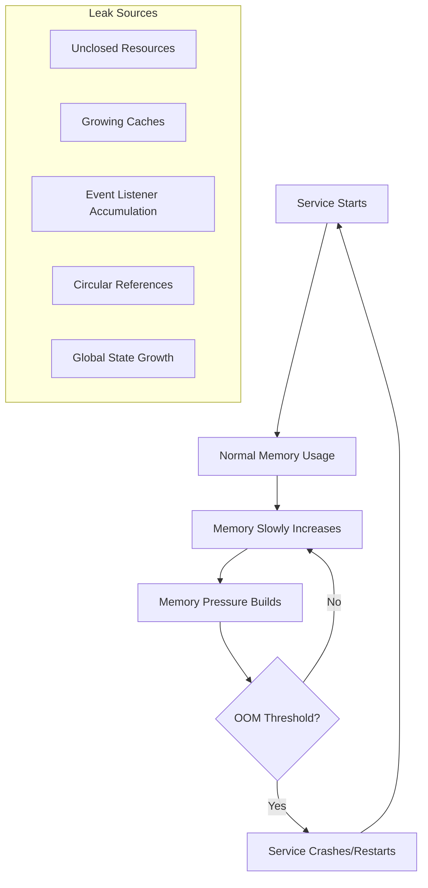
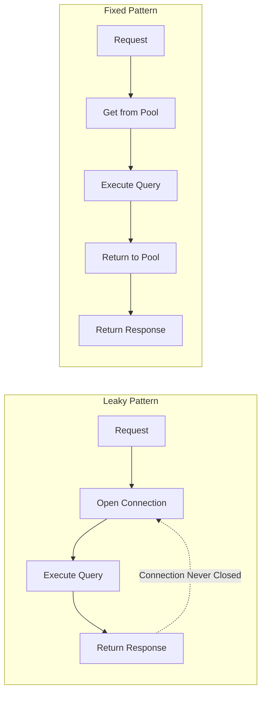
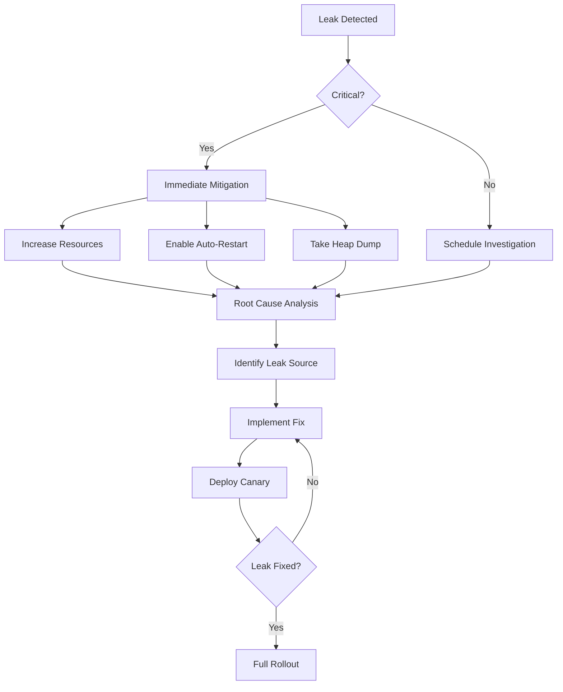

# How to Fix "Memory Leak" in Long-Running Services

Author: [nawazdhandala](https://www.github.com/nawazdhandala)

Tags: Memory Leak, Long-Running Services, Performance, Debugging, Node.js, Python, Go, Profiling

Description: A practical guide to identifying, diagnosing, and fixing memory leaks in long-running services with real-world examples and debugging techniques.

---

Memory leaks in long-running services cause gradual performance degradation, increased infrastructure costs, and eventual service crashes. Unlike short-lived processes where memory is reclaimed at exit, long-running services must manage memory carefully throughout their lifecycle. This guide covers practical techniques to identify, diagnose, and fix memory leaks across different languages and frameworks.

## Understanding Memory Leaks in Long-Running Services

Memory leaks occur when allocated memory is no longer needed but cannot be reclaimed by the garbage collector or freed manually. In long-running services, even small leaks compound over time.



## Diagnosing Memory Leaks

Before fixing a leak, you need to identify it. Start with monitoring and then drill down with profiling tools.

### Monitoring Memory Trends

```python
# memory_monitor.py - Track memory usage over time
import psutil
import time
import logging
from dataclasses import dataclass
from typing import List
from datetime import datetime

logging.basicConfig(level=logging.INFO)
logger = logging.getLogger(__name__)

@dataclass
class MemorySnapshot:
    timestamp: datetime
    rss_mb: float
    vms_mb: float
    percent: float

class MemoryMonitor:
    def __init__(self, alert_threshold_mb: float = 1024):
        self.snapshots: List[MemorySnapshot] = []
        self.alert_threshold_mb = alert_threshold_mb
        self.process = psutil.Process()

    def take_snapshot(self) -> MemorySnapshot:
        """Capture current memory state."""
        mem_info = self.process.memory_info()
        snapshot = MemorySnapshot(
            timestamp=datetime.now(),
            rss_mb=mem_info.rss / (1024 * 1024),
            vms_mb=mem_info.vms / (1024 * 1024),
            percent=self.process.memory_percent()
        )
        self.snapshots.append(snapshot)
        return snapshot

    def get_growth_rate(self, window_minutes: int = 60) -> float:
        """Calculate memory growth rate in MB per hour."""
        if len(self.snapshots) < 2:
            return 0.0

        # Filter snapshots within window
        cutoff = datetime.now().timestamp() - (window_minutes * 60)
        recent = [s for s in self.snapshots
                  if s.timestamp.timestamp() > cutoff]

        if len(recent) < 2:
            return 0.0

        first, last = recent[0], recent[-1]
        time_diff_hours = (last.timestamp - first.timestamp).seconds / 3600

        if time_diff_hours == 0:
            return 0.0

        memory_diff = last.rss_mb - first.rss_mb
        return memory_diff / time_diff_hours

    def check_for_leak(self) -> bool:
        """Detect potential memory leak based on consistent growth."""
        growth_rate = self.get_growth_rate()

        # Alert if growing more than 10MB per hour consistently
        if growth_rate > 10:
            logger.warning(
                f"Potential memory leak detected: "
                f"growing at {growth_rate:.2f} MB/hour"
            )
            return True
        return False

# Usage with periodic monitoring
def start_memory_monitoring(interval_seconds: int = 60):
    """Start background memory monitoring."""
    import threading

    monitor = MemoryMonitor()

    def monitor_loop():
        while True:
            snapshot = monitor.take_snapshot()
            logger.info(
                f"Memory: RSS={snapshot.rss_mb:.1f}MB, "
                f"Growth rate={monitor.get_growth_rate():.2f}MB/hr"
            )
            monitor.check_for_leak()
            time.sleep(interval_seconds)

    thread = threading.Thread(target=monitor_loop, daemon=True)
    thread.start()
    return monitor
```

### Node.js Heap Profiling

```javascript
// heap_profiler.js - Profile heap usage in Node.js
const v8 = require('v8');
const fs = require('fs');
const path = require('path');

class HeapProfiler {
  constructor(snapshotDir = '/tmp/heapdumps') {
    this.snapshotDir = snapshotDir;
    this.snapshotCount = 0;

    // Ensure directory exists
    if (!fs.existsSync(snapshotDir)) {
      fs.mkdirSync(snapshotDir, { recursive: true });
    }
  }

  // Get current heap statistics
  getHeapStats() {
    const stats = v8.getHeapStatistics();
    return {
      heapUsedMB: stats.used_heap_size / (1024 * 1024),
      heapTotalMB: stats.total_heap_size / (1024 * 1024),
      heapLimitMB: stats.heap_size_limit / (1024 * 1024),
      externalMB: stats.external_memory / (1024 * 1024),
      utilizationPercent: (stats.used_heap_size / stats.heap_size_limit) * 100
    };
  }

  // Write heap snapshot to disk for analysis
  writeHeapSnapshot() {
    const filename = `heapdump-${Date.now()}-${this.snapshotCount++}.heapsnapshot`;
    const filepath = path.join(this.snapshotDir, filename);

    v8.writeHeapSnapshot(filepath);
    console.log(`Heap snapshot written to: ${filepath}`);
    return filepath;
  }

  // Monitor heap and trigger snapshot on threshold
  startMonitoring(options = {}) {
    const {
      intervalMs = 30000,
      thresholdPercent = 80,
      autoSnapshot = true
    } = options;

    setInterval(() => {
      const stats = this.getHeapStats();

      console.log(`Heap: ${stats.heapUsedMB.toFixed(1)}MB / ${stats.heapTotalMB.toFixed(1)}MB (${stats.utilizationPercent.toFixed(1)}%)`);

      if (autoSnapshot && stats.utilizationPercent > thresholdPercent) {
        console.warn(`Heap utilization above ${thresholdPercent}%, taking snapshot`);
        this.writeHeapSnapshot();
      }
    }, intervalMs);
  }
}

// Expose endpoint for manual heap dump
function setupHeapDumpEndpoint(app) {
  const profiler = new HeapProfiler();

  app.get('/debug/heapdump', (req, res) => {
    // Protect this endpoint in production
    const authToken = req.headers['x-debug-token'];
    if (authToken !== process.env.DEBUG_TOKEN) {
      return res.status(403).json({ error: 'Unauthorized' });
    }

    const filepath = profiler.writeHeapSnapshot();
    res.json({
      message: 'Heap snapshot created',
      path: filepath,
      stats: profiler.getHeapStats()
    });
  });
}

module.exports = { HeapProfiler, setupHeapDumpEndpoint };
```

## Common Memory Leak Patterns and Fixes

### Pattern 1: Unclosed Database Connections

Forgetting to close database connections is one of the most common leaks.



```python
# database_connection_leak.py - Before and after fix

# LEAKY CODE - connections never returned to pool
class LeakyDatabaseService:
    def __init__(self, connection_string):
        self.connection_string = connection_string

    def get_user(self, user_id):
        # New connection created but never closed
        conn = psycopg2.connect(self.connection_string)
        cursor = conn.cursor()
        cursor.execute("SELECT * FROM users WHERE id = %s", (user_id,))
        result = cursor.fetchone()
        # Missing: cursor.close() and conn.close()
        return result


# FIXED CODE - using context managers and connection pooling
from contextlib import contextmanager
from psycopg2 import pool

class FixedDatabaseService:
    def __init__(self, connection_string, min_conn=5, max_conn=20):
        self.pool = pool.ThreadedConnectionPool(
            min_conn,
            max_conn,
            connection_string
        )

    @contextmanager
    def get_connection(self):
        """Context manager for safe connection handling."""
        conn = None
        try:
            conn = self.pool.getconn()
            yield conn
        finally:
            if conn:
                self.pool.putconn(conn)

    def get_user(self, user_id):
        with self.get_connection() as conn:
            with conn.cursor() as cursor:
                cursor.execute(
                    "SELECT * FROM users WHERE id = %s",
                    (user_id,)
                )
                return cursor.fetchone()

    def close(self):
        """Clean up pool on shutdown."""
        self.pool.closeall()
```

### Pattern 2: Event Listener Accumulation

Adding event listeners without removing them causes memory to grow indefinitely.

```javascript
// event_listener_leak.js - Common in Node.js applications

// LEAKY CODE - listeners accumulate on each request
class LeakyEventHandler {
  constructor(eventEmitter) {
    this.emitter = eventEmitter;
  }

  handleRequest(req, res) {
    // This adds a NEW listener on every request
    this.emitter.on('data', (data) => {
      this.processData(data, req.id);
    });

    // Listener is never removed, causing memory leak
  }
}


// FIXED CODE - properly manage listener lifecycle
const EventEmitter = require('events');

class FixedEventHandler {
  constructor(eventEmitter) {
    this.emitter = eventEmitter;
    this.activeListeners = new Map();
  }

  handleRequest(req, res) {
    const requestId = req.id;

    // Create bound handler so we can remove it later
    const handler = (data) => {
      this.processData(data, requestId);
    };

    // Store reference for cleanup
    this.activeListeners.set(requestId, handler);
    this.emitter.on('data', handler);

    // Clean up when request ends
    res.on('finish', () => {
      this.cleanup(requestId);
    });

    res.on('error', () => {
      this.cleanup(requestId);
    });
  }

  cleanup(requestId) {
    const handler = this.activeListeners.get(requestId);
    if (handler) {
      this.emitter.removeListener('data', handler);
      this.activeListeners.delete(requestId);
    }
  }

  // Periodic cleanup of orphaned listeners
  startCleanupInterval(intervalMs = 60000) {
    setInterval(() => {
      console.log(`Active listeners: ${this.activeListeners.size}`);
      console.log(`Emitter listener count: ${this.emitter.listenerCount('data')}`);
    }, intervalMs);
  }
}

// Using EventEmitter.once() for single-use listeners
class SingleUseEventHandler {
  constructor(eventEmitter) {
    this.emitter = eventEmitter;
  }

  waitForEvent(eventName, timeoutMs = 5000) {
    return new Promise((resolve, reject) => {
      const timeout = setTimeout(() => {
        this.emitter.removeListener(eventName, handler);
        reject(new Error(`Timeout waiting for ${eventName}`));
      }, timeoutMs);

      const handler = (data) => {
        clearTimeout(timeout);
        resolve(data);
      };

      // once() automatically removes the listener after it fires
      this.emitter.once(eventName, handler);
    });
  }
}
```

### Pattern 3: Unbounded Caches

Caches without size limits or expiration grow forever.

```python
# cache_leak.py - Unbounded cache growth

# LEAKY CODE - cache grows without limit
class LeakyCache:
    def __init__(self):
        self.cache = {}  # Grows forever

    def get_user_data(self, user_id):
        if user_id not in self.cache:
            self.cache[user_id] = self.fetch_from_db(user_id)
        return self.cache[user_id]


# FIXED CODE - LRU cache with size limit
from functools import lru_cache
from collections import OrderedDict
from threading import Lock
import time

class BoundedCache:
    def __init__(self, max_size=1000, ttl_seconds=3600):
        self.cache = OrderedDict()
        self.max_size = max_size
        self.ttl_seconds = ttl_seconds
        self.lock = Lock()

    def get(self, key):
        with self.lock:
            if key not in self.cache:
                return None

            value, timestamp = self.cache[key]

            # Check TTL
            if time.time() - timestamp > self.ttl_seconds:
                del self.cache[key]
                return None

            # Move to end (most recently used)
            self.cache.move_to_end(key)
            return value

    def set(self, key, value):
        with self.lock:
            # Remove oldest items if at capacity
            while len(self.cache) >= self.max_size:
                self.cache.popitem(last=False)

            self.cache[key] = (value, time.time())

    def clear_expired(self):
        """Remove expired entries."""
        with self.lock:
            current_time = time.time()
            expired_keys = [
                k for k, (v, ts) in self.cache.items()
                if current_time - ts > self.ttl_seconds
            ]
            for key in expired_keys:
                del self.cache[key]

        return len(expired_keys)

    def stats(self):
        """Return cache statistics."""
        return {
            "size": len(self.cache),
            "max_size": self.max_size,
            "utilization": len(self.cache) / self.max_size
        }


# Using functools.lru_cache for simple cases
class UserService:
    @lru_cache(maxsize=1000)
    def get_user_profile(self, user_id):
        """Cached user profile lookup with automatic LRU eviction."""
        return self.db.query(f"SELECT * FROM users WHERE id = {user_id}")

    def invalidate_user(self, user_id):
        """Remove specific user from cache."""
        # Clear entire cache - lru_cache does not support single key deletion
        self.get_user_profile.cache_clear()
```

### Pattern 4: Goroutine Leaks in Go

Goroutines that never exit consume memory and CPU.

```go
// goroutine_leak.go - Common Go memory leak patterns

package main

import (
    "context"
    "fmt"
    "runtime"
    "sync"
    "time"
)

// LEAKY CODE - goroutine blocks forever on channel
func leakyProcessor(jobs <-chan Job) {
    for {
        // If jobs channel is never closed, this goroutine lives forever
        job := <-jobs
        process(job)
    }
}

// LEAKY CODE - goroutine waiting on channel that sender abandoned
func leakyFetch(url string) string {
    result := make(chan string)

    go func() {
        // If this takes too long, caller may give up
        // but this goroutine keeps running
        data := fetchURL(url)
        result <- data  // Blocks forever if no receiver
    }()

    select {
    case r := <-result:
        return r
    case <-time.After(5 * time.Second):
        return ""  // Goroutine leaked!
    }
}


// FIXED CODE - using context for cancellation
func fixedFetch(ctx context.Context, url string) (string, error) {
    result := make(chan string, 1)  // Buffered channel
    errCh := make(chan error, 1)

    go func() {
        data, err := fetchURLWithContext(ctx, url)
        if err != nil {
            errCh <- err
            return
        }
        result <- data
    }()

    select {
    case r := <-result:
        return r, nil
    case err := <-errCh:
        return "", err
    case <-ctx.Done():
        return "", ctx.Err()
    }
}

// FIXED CODE - worker pool with proper shutdown
type WorkerPool struct {
    jobs    chan Job
    results chan Result
    wg      sync.WaitGroup
    ctx     context.Context
    cancel  context.CancelFunc
}

func NewWorkerPool(numWorkers int) *WorkerPool {
    ctx, cancel := context.WithCancel(context.Background())

    pool := &WorkerPool{
        jobs:    make(chan Job, 100),
        results: make(chan Result, 100),
        ctx:     ctx,
        cancel:  cancel,
    }

    // Start workers
    for i := 0; i < numWorkers; i++ {
        pool.wg.Add(1)
        go pool.worker(i)
    }

    return pool
}

func (p *WorkerPool) worker(id int) {
    defer p.wg.Done()

    for {
        select {
        case job, ok := <-p.jobs:
            if !ok {
                // Channel closed, exit gracefully
                return
            }
            result := process(job)
            p.results <- result

        case <-p.ctx.Done():
            // Context cancelled, exit gracefully
            return
        }
    }
}

func (p *WorkerPool) Shutdown() {
    // Signal workers to stop
    p.cancel()
    close(p.jobs)

    // Wait for all workers to finish
    p.wg.Wait()
    close(p.results)
}

// Goroutine leak detector
func monitorGoroutines(interval time.Duration) {
    var lastCount int

    for {
        count := runtime.NumGoroutine()

        if count > lastCount+10 {
            fmt.Printf("WARNING: Goroutine count increased: %d -> %d\n",
                lastCount, count)
        }

        lastCount = count
        time.Sleep(interval)
    }
}
```

### Pattern 5: Closure Variable Capture

Closures can inadvertently hold references to large objects.

```javascript
// closure_leak.js - Closures capturing unintended references

// LEAKY CODE - closure captures entire request object
function createLeakyHandler(largeDataProcessor) {
  return function handleRequest(req, res) {
    // This closure captures 'req' which contains large body
    const processLater = () => {
      // Only needs req.id but holds reference to entire req
      return largeDataProcessor.process(req.id, req.body);
    };

    // Store closure in long-lived collection
    pendingOperations.push(processLater);

    res.json({ status: 'queued' });
  };
}


// FIXED CODE - extract only needed data before creating closure
function createFixedHandler(largeDataProcessor) {
  return function handleRequest(req, res) {
    // Extract only what we need
    const requestId = req.id;
    const bodyData = req.body;

    // Now closure only captures the extracted values
    const processLater = () => {
      return largeDataProcessor.process(requestId, bodyData);
    };

    pendingOperations.push(processLater);

    // Original req can be garbage collected
    res.json({ status: 'queued' });
  };
}


// Even better - clear references when done
class SafeOperationQueue {
  constructor() {
    this.operations = new Map();
    this.nextId = 0;
  }

  enqueue(operation) {
    const id = this.nextId++;
    this.operations.set(id, operation);
    return id;
  }

  async process(id) {
    const operation = this.operations.get(id);
    if (!operation) {
      throw new Error(`Operation ${id} not found`);
    }

    try {
      return await operation();
    } finally {
      // Always clean up reference after processing
      this.operations.delete(id);
    }
  }

  // Periodic cleanup of stale operations
  cleanupStale(maxAgeMs = 300000) {
    const now = Date.now();
    let cleaned = 0;

    for (const [id, op] of this.operations) {
      if (op.createdAt && now - op.createdAt > maxAgeMs) {
        this.operations.delete(id);
        cleaned++;
      }
    }

    return cleaned;
  }
}
```

## Automated Leak Detection

Set up automated detection to catch leaks before they cause outages.

```yaml
# prometheus-alerts.yaml - Memory leak alerting rules
groups:
  - name: memory_leak_detection
    rules:
      - alert: MemoryLeakSuspected
        expr: |
          (
            rate(process_resident_memory_bytes[1h]) > 0
            and
            increase(process_resident_memory_bytes[6h]) > 500000000
          )
        for: 30m
        labels:
          severity: warning
        annotations:
          summary: "Possible memory leak in {{ $labels.job }}"
          description: |
            Service {{ $labels.instance }} memory has grown
            by {{ $value | humanize1024 }} over 6 hours

      - alert: HighMemoryUtilization
        expr: |
          (process_resident_memory_bytes /
           container_spec_memory_limit_bytes) > 0.85
        for: 10m
        labels:
          severity: critical
        annotations:
          summary: "High memory usage in {{ $labels.job }}"
          description: |
            Service using {{ $value | printf "%.1f" }}% of memory limit
```

```python
# automated_leak_test.py - Integration test for memory leaks
import gc
import tracemalloc
import pytest

class TestMemoryLeaks:

    @pytest.fixture(autouse=True)
    def setup_tracemalloc(self):
        """Start memory tracking before each test."""
        tracemalloc.start()
        gc.collect()
        yield
        tracemalloc.stop()

    def test_request_handler_no_leak(self, client):
        """Verify request handling does not leak memory."""
        # Take baseline snapshot
        gc.collect()
        snapshot1 = tracemalloc.take_snapshot()

        # Simulate many requests
        for _ in range(1000):
            response = client.post('/api/process', json={'data': 'x' * 1000})
            assert response.status_code == 200

        # Force garbage collection
        gc.collect()
        snapshot2 = tracemalloc.take_snapshot()

        # Compare snapshots
        top_stats = snapshot2.compare_to(snapshot1, 'lineno')

        # Check for significant growth
        total_growth = sum(stat.size_diff for stat in top_stats[:10])

        # Allow some growth but flag significant leaks
        assert total_growth < 10 * 1024 * 1024, (
            f"Memory grew by {total_growth / 1024 / 1024:.2f}MB "
            f"over 1000 requests.\nTop allocations:\n" +
            '\n'.join(str(s) for s in top_stats[:5])
        )

    def test_websocket_connection_cleanup(self, ws_client):
        """Verify WebSocket connections are properly cleaned up."""
        initial_connections = get_active_connection_count()

        # Open and close many connections
        for _ in range(100):
            ws = ws_client.connect('/ws')
            ws.send('ping')
            ws.receive()
            ws.close()

        gc.collect()
        time.sleep(1)  # Allow async cleanup

        final_connections = get_active_connection_count()

        # Should return to baseline
        assert final_connections <= initial_connections + 5, (
            f"Connection leak: started with {initial_connections}, "
            f"ended with {final_connections}"
        )
```

## Production Remediation

When you discover a leak in production, follow these steps.



```bash
# emergency_mitigation.sh - Quick fixes for production leaks

# Set memory limit with automatic restart
kubectl set resources deployment/myapp \
  --limits=memory=2Gi \
  --requests=memory=1Gi

# Enable liveness probe to restart unhealthy pods
kubectl patch deployment myapp -p '
{
  "spec": {
    "template": {
      "spec": {
        "containers": [{
          "name": "myapp",
          "livenessProbe": {
            "httpGet": {
              "path": "/health",
              "port": 8080
            },
            "initialDelaySeconds": 30,
            "periodSeconds": 10
          }
        }]
      }
    }
  }
}'

# Set up Horizontal Pod Autoscaler for temporary relief
kubectl autoscale deployment myapp \
  --min=3 \
  --max=10 \
  --cpu-percent=70

# Take heap dump from running container for analysis
kubectl exec -it myapp-pod-123 -- \
  node --expose-gc -e "global.gc(); require('v8').writeHeapSnapshot()"

# Copy heap dump locally
kubectl cp myapp-pod-123:/app/heapdump.heapsnapshot ./heapdump.heapsnapshot
```

Memory leaks are inevitable in complex systems, but with proper monitoring, testing, and quick remediation strategies, you can catch them early and minimize their impact. The key is establishing baselines, monitoring trends, and building automated detection into your pipeline.
