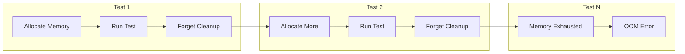

# How to Fix 'Memory Leak' Test Detection

Author: [nawazdhandala](https://www.github.com/nawazdhandala)

Tags: Testing, Memory Leaks, JavaScript, Node.js, Performance, Debugging, Quality Assurance

Description: A practical guide to detecting, diagnosing, and fixing memory leaks in your test suites with real code examples and debugging strategies.

---

Memory leaks in tests are sneaky problems that cause your test suite to slow down over time, eventually leading to out-of-memory crashes. When your CI pipeline fails with cryptic heap allocation errors or your tests become progressively slower, memory leaks are often the culprit. This guide will help you identify, track down, and eliminate memory leaks in your test code.

## Understanding Memory Leaks in Tests

A memory leak occurs when your code allocates memory but fails to release it when it is no longer needed. In tests, this commonly happens when:

- Event listeners are not cleaned up after each test
- Timers and intervals are left running
- Global state accumulates across tests
- Database connections or file handles remain open
- Mock objects are not properly restored



## Detecting Memory Leaks

### Using Node.js Memory Profiling

The first step is confirming you have a memory leak. Node.js provides built-in tools for this.

```javascript
// memory-tracker.js
// Track memory usage before and after each test

const v8 = require('v8');
const { performance } = require('perf_hooks');

class MemoryTracker {
  constructor() {
    this.snapshots = [];
  }

  // Take a heap snapshot and record current memory usage
  recordSnapshot(label) {
    // Force garbage collection if available
    if (global.gc) {
      global.gc();
    }

    const usage = process.memoryUsage();
    this.snapshots.push({
      label,
      timestamp: performance.now(),
      heapUsed: usage.heapUsed,
      heapTotal: usage.heapTotal,
      external: usage.external,
      rss: usage.rss
    });
  }

  // Compare memory growth between snapshots
  analyzeGrowth() {
    if (this.snapshots.length < 2) return null;

    const first = this.snapshots[0];
    const last = this.snapshots[this.snapshots.length - 1];

    return {
      heapGrowth: last.heapUsed - first.heapUsed,
      heapGrowthMB: ((last.heapUsed - first.heapUsed) / 1024 / 1024).toFixed(2),
      totalTests: this.snapshots.length,
      averageGrowthPerTest: (last.heapUsed - first.heapUsed) / this.snapshots.length
    };
  }

  // Warn if memory growth exceeds threshold
  checkForLeaks(thresholdMB = 50) {
    const analysis = this.analyzeGrowth();
    if (analysis && parseFloat(analysis.heapGrowthMB) > thresholdMB) {
      console.warn(`Memory leak detected! Heap grew by ${analysis.heapGrowthMB}MB`);
      return true;
    }
    return false;
  }
}

module.exports = { MemoryTracker };
```

### Integrating with Jest

Configure Jest to track memory across your test suite.

```javascript
// jest.setup.js
const { MemoryTracker } = require('./memory-tracker');

const tracker = new MemoryTracker();

beforeAll(() => {
  tracker.recordSnapshot('suite-start');
});

afterEach(() => {
  // Record memory after each test
  tracker.recordSnapshot(`test-${expect.getState().currentTestName}`);
});

afterAll(() => {
  const analysis = tracker.analyzeGrowth();
  console.log('Memory Analysis:', analysis);

  if (tracker.checkForLeaks(100)) {
    // Optionally fail the suite if memory grew too much
    console.error('Excessive memory growth detected in test suite');
  }
});
```

Run tests with garbage collection exposed:

```bash
# Run Jest with garbage collection exposed for accurate measurements
node --expose-gc ./node_modules/.bin/jest --runInBand
```

## Common Memory Leak Patterns and Fixes

### Pattern 1: Uncleared Event Listeners

One of the most common causes of memory leaks in tests.

```javascript
// BAD: Event listener accumulates across tests
describe('WebSocket Handler', () => {
  let socket;

  beforeEach(() => {
    socket = new WebSocket('ws://localhost:8080');
    // This listener is never removed
    socket.addEventListener('message', handleMessage);
  });

  test('handles messages', () => {
    // Test code
  });
});

// GOOD: Clean up event listeners after each test
describe('WebSocket Handler', () => {
  let socket;
  let messageHandler;

  beforeEach(() => {
    socket = new WebSocket('ws://localhost:8080');
    messageHandler = jest.fn(handleMessage);
    socket.addEventListener('message', messageHandler);
  });

  afterEach(() => {
    // Remove the listener and close the socket
    socket.removeEventListener('message', messageHandler);
    socket.close();
    socket = null;
  });

  test('handles messages', () => {
    // Test code
  });
});
```

### Pattern 2: Uncleared Timers and Intervals

Timers that outlive their tests cause memory buildup.

```javascript
// BAD: Interval keeps running after test ends
describe('Polling Service', () => {
  test('polls for updates', () => {
    const service = new PollingService();
    service.startPolling(); // Creates setInterval internally

    expect(service.isPolling).toBe(true);
    // Test ends but interval keeps running
  });
});

// GOOD: Use fake timers and clean up properly
describe('Polling Service', () => {
  beforeEach(() => {
    jest.useFakeTimers();
  });

  afterEach(() => {
    jest.clearAllTimers();
    jest.useRealTimers();
  });

  test('polls for updates', () => {
    const service = new PollingService();
    service.startPolling();

    // Advance timers instead of waiting
    jest.advanceTimersByTime(5000);

    expect(service.pollCount).toBeGreaterThan(0);

    // Always stop the service
    service.stopPolling();
  });
});
```

### Pattern 3: Global State Accumulation

Tests that modify global state without cleanup.

```javascript
// BAD: Global cache grows indefinitely
const cache = require('./global-cache');

describe('User Service', () => {
  test('caches user data', async () => {
    const user = await userService.getUser(1);
    expect(cache.get('user:1')).toEqual(user);
  });

  test('caches another user', async () => {
    const user = await userService.getUser(2);
    expect(cache.get('user:2')).toEqual(user);
    // Cache now has both users, accumulating memory
  });
});

// GOOD: Clear cache after each test
describe('User Service', () => {
  afterEach(() => {
    cache.clear();
  });

  test('caches user data', async () => {
    const user = await userService.getUser(1);
    expect(cache.get('user:1')).toEqual(user);
  });

  test('caches another user', async () => {
    const user = await userService.getUser(2);
    expect(cache.get('user:2')).toEqual(user);
  });
});
```

### Pattern 4: Unreleased Database Connections

Database connections that are not properly closed leak memory.

```javascript
// BAD: Connection pool grows with each test
describe('Database Operations', () => {
  test('inserts records', async () => {
    const db = await createDatabaseConnection();
    await db.insert({ name: 'test' });
    expect(await db.count()).toBe(1);
    // Connection never closed
  });
});

// GOOD: Manage connection lifecycle properly
describe('Database Operations', () => {
  let db;

  beforeAll(async () => {
    // Create one connection for all tests
    db = await createDatabaseConnection();
  });

  afterAll(async () => {
    // Close connection after all tests
    await db.close();
  });

  afterEach(async () => {
    // Clean up test data but keep connection
    await db.truncate('test_table');
  });

  test('inserts records', async () => {
    await db.insert({ name: 'test' });
    expect(await db.count()).toBe(1);
  });
});
```

## Advanced Debugging Techniques

### Heap Snapshots for Leak Analysis

When you need to find exactly what is leaking, use heap snapshots.

```javascript
// heap-debug.js
const v8 = require('v8');
const fs = require('fs');
const path = require('path');

function writeHeapSnapshot(label) {
  const snapshotPath = path.join(
    __dirname,
    `heap-${label}-${Date.now()}.heapsnapshot`
  );

  // Write heap snapshot for analysis in Chrome DevTools
  v8.writeHeapSnapshot(snapshotPath);
  console.log(`Heap snapshot written to: ${snapshotPath}`);

  return snapshotPath;
}

// Usage in tests
describe('Memory Intensive Tests', () => {
  test('suspected leaky test', () => {
    writeHeapSnapshot('before');

    // Run the suspected code
    performSuspectedLeakyOperation();

    // Force GC and take another snapshot
    if (global.gc) global.gc();
    writeHeapSnapshot('after');
  });
});
```

To analyze the snapshots, open Chrome DevTools, go to the Memory tab, and load the `.heapsnapshot` files. Compare them to see what objects are being retained.

### Using Jest's Memory Leak Detection

Jest has a built-in flag to help detect memory leaks.

```bash
# Run Jest with leak detection
jest --detectLeaks --runInBand
```

Configure it in `jest.config.js`:

```javascript
module.exports = {
  detectLeaks: true,
  // Run tests serially for accurate leak detection
  maxWorkers: 1,
  // Increase timeout for memory analysis
  testTimeout: 30000,
};
```

## Preventing Memory Leaks

### Create a Cleanup Utility

Build a utility that tracks all allocations and cleans them up automatically.

```javascript
// test-cleanup.js
class TestCleanup {
  constructor() {
    this.cleanupFunctions = [];
  }

  // Register a cleanup function to run after the test
  register(cleanupFn) {
    this.cleanupFunctions.push(cleanupFn);
  }

  // Track a resource that needs cleanup
  track(resource, cleanupMethod = 'close') {
    this.register(() => {
      if (resource && typeof resource[cleanupMethod] === 'function') {
        resource[cleanupMethod]();
      }
    });
    return resource;
  }

  // Run all cleanup functions
  async cleanup() {
    for (const fn of this.cleanupFunctions.reverse()) {
      try {
        await fn();
      } catch (error) {
        console.warn('Cleanup error:', error.message);
      }
    }
    this.cleanupFunctions = [];
  }
}

// Usage in tests
describe('Resource Tests', () => {
  let cleanup;

  beforeEach(() => {
    cleanup = new TestCleanup();
  });

  afterEach(async () => {
    await cleanup.cleanup();
  });

  test('uses tracked resources', () => {
    // Resources are automatically cleaned up after the test
    const db = cleanup.track(createDatabase(), 'disconnect');
    const socket = cleanup.track(createSocket(), 'close');
    const file = cleanup.track(openFile(), 'close');

    // Test code using resources
  });
});
```

### Memory Leak Detection CI Integration

Add memory leak checks to your CI pipeline.

```yaml
# .github/workflows/test.yml
name: Tests with Memory Check

on: [push, pull_request]

jobs:
  test:
    runs-on: ubuntu-latest

    steps:
      - uses: actions/checkout@v4

      - name: Setup Node.js
        uses: actions/setup-node@v4
        with:
          node-version: '20'

      - name: Install dependencies
        run: npm ci

      - name: Run tests with memory tracking
        run: |
          node --expose-gc --max-old-space-size=512 \
            ./node_modules/.bin/jest \
            --detectLeaks \
            --runInBand \
            --forceExit
        env:
          NODE_OPTIONS: --max-old-space-size=512
```

## Checklist for Memory Leak Prevention

Before committing your tests, verify the following:

- Event listeners are removed in `afterEach` or `afterAll`
- Timers and intervals are cleared after each test
- Database and network connections are closed
- Mock objects and spies are restored
- Global state is reset between tests
- Large data structures are set to null after use
- File handles are properly closed

By following these practices, your test suite will remain fast and reliable, and you will avoid the frustrating hunt for memory leaks in your CI pipeline. Remember that memory leaks often manifest slowly, so regular monitoring and proactive cleanup are your best defenses.
