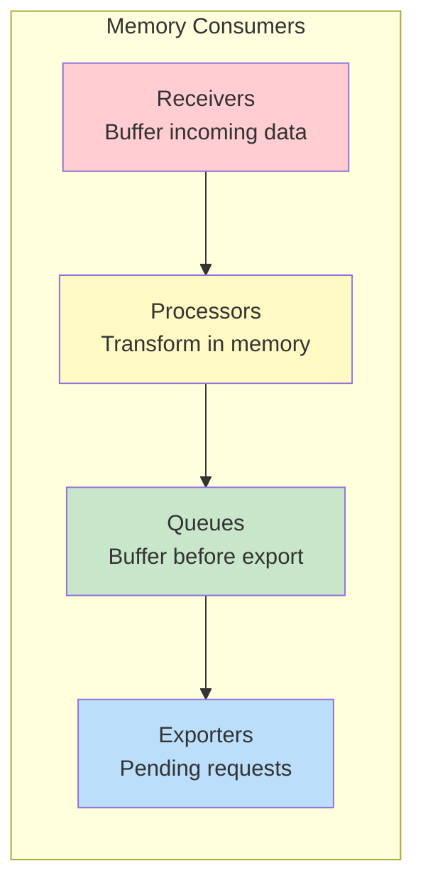
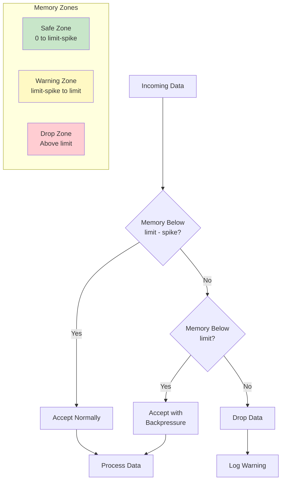
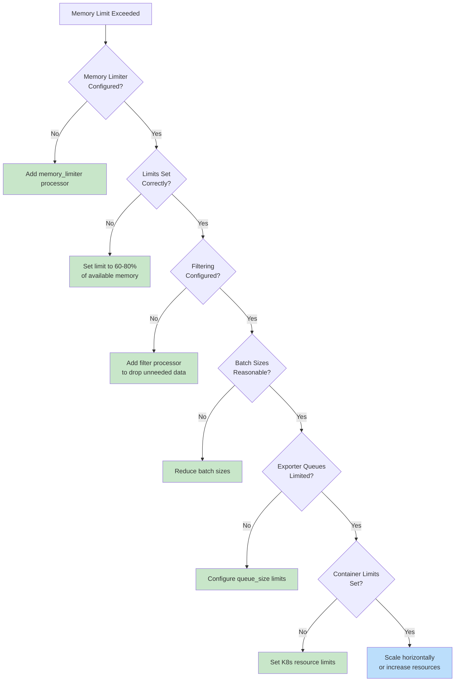

# How to Fix 'Memory Limit Exceeded' Collector Errors

Author: [nawazdhandala](https://www.github.com/nawazdhandala)

Tags: OpenTelemetry, Collector, Memory, Performance, Debugging, Observability

Description: Learn how to diagnose and fix memory limit exceeded errors in the OpenTelemetry Collector, including configuration tuning, pipeline optimization, and resource management.

---

The OpenTelemetry Collector is designed to handle high volumes of telemetry data, but without proper configuration, it can easily exhaust available memory and crash. The dreaded "memory limit exceeded" error indicates that your collector is receiving more data than it can process with its current resources. This guide will help you understand why this happens and how to fix it.

## Understanding Memory Usage in the Collector

The collector uses memory at multiple stages of the pipeline. Understanding where memory is consumed helps identify optimization opportunities.



## Common Causes of Memory Issues

### 1. Missing Memory Limiter Processor

The most common cause is not having a memory limiter processor configured. This processor is essential for preventing OOM (Out of Memory) crashes.

```yaml
# PROBLEM: No memory protection
processors:
  batch:
    timeout: 5s

# SOLUTION: Add memory limiter as the FIRST processor
processors:
  memory_limiter:
    # Check memory usage every second
    check_interval: 1s
    # Hard limit - data will be dropped above this
    limit_mib: 512
    # Soft limit - backpressure applied before hitting hard limit
    spike_limit_mib: 128

  batch:
    timeout: 5s

service:
  pipelines:
    traces:
      receivers: [otlp]
      processors: [memory_limiter, batch]  # memory_limiter MUST be first
      exporters: [otlp]
```

### 2. Incorrect Memory Limit Configuration

Setting memory limits incorrectly can lead to either wasted resources or unexpected drops.

```yaml
# Calculate proper limits based on container/system memory
# Rule of thumb: limit_mib should be 60-80% of available memory
# spike_limit_mib should be 20-30% of limit_mib

processors:
  memory_limiter:
    check_interval: 1s

    # For a 1GB container:
    # limit_mib: 800   # 80% of 1024MB
    # spike_limit_mib: 200  # 25% of 800MB

    # For a 2GB container:
    limit_mib: 1600
    spike_limit_mib: 400

    # Alternative: percentage-based (recommended for containers)
    # These are percentage of cgroup memory limit
    # limit_percentage: 75
    # spike_limit_percentage: 25
```

The relationship between limits works like this:



### 3. Uncontrolled Batch Sizes

Large batch sizes consume significant memory. Tune them based on your throughput requirements.

```yaml
processors:
  batch:
    # PROBLEM: Very large batches hold too much data in memory
    # send_batch_size: 50000  # Too large!
    # send_batch_max_size: 100000  # Way too large!

    # SOLUTION: Use moderate batch sizes
    timeout: 5s           # Maximum time to wait
    send_batch_size: 1000    # Target batch size
    send_batch_max_size: 1500  # Maximum batch size

  # For high-throughput scenarios, use multiple smaller batches
  batch/frequent:
    timeout: 1s
    send_batch_size: 500
    send_batch_max_size: 750
```

### 4. Exporter Queue Buildup

When exporters cannot keep up with incoming data, queues grow unbounded.

```yaml
exporters:
  otlp:
    endpoint: http://backend:4317

    # Configure retry to prevent infinite queue growth
    retry_on_failure:
      enabled: true
      initial_interval: 5s
      max_interval: 30s
      max_elapsed_time: 300s  # Stop retrying after 5 minutes

    # Configure queue size limits
    sending_queue:
      enabled: true
      num_consumers: 10       # Parallel export workers
      queue_size: 5000        # Maximum items in queue
      # When queue is full, oldest items are dropped

  otlphttp:
    endpoint: https://api.backend.com

    sending_queue:
      enabled: true
      num_consumers: 10
      queue_size: 5000

    # Enable persistent queue to survive restarts
    # (requires file storage extension)
    sending_queue:
      storage: file_storage
```

### 5. Complex Processing Pipelines

Complex transformations hold data in memory longer. Simplify where possible.

```yaml
# PROBLEM: Many processors hold data in memory simultaneously
processors:
  transform/one:
    # Complex transformation
  transform/two:
    # Another transformation
  transform/three:
    # Yet another transformation
  groupbyattrs:
    # Groups data in memory

# SOLUTION: Consolidate transformations and filter early
processors:
  memory_limiter:
    limit_mib: 512
    spike_limit_mib: 128
    check_interval: 1s

  # Filter EARLY to reduce data volume
  filter:
    traces:
      span:
        - 'attributes["http.route"] == "/health"'

  # Combine transformations into one processor
  transform:
    trace_statements:
      - context: span
        statements:
          - set(attributes["a"], "value")
          - set(attributes["b"], "value")
          - set(attributes["c"], "value")

  batch:
    send_batch_size: 1000
```

## Debugging Memory Issues

### Step 1: Enable Memory Metrics

The collector exposes memory metrics that help identify issues:

```yaml
service:
  telemetry:
    metrics:
      # Expose collector's own metrics
      address: 0.0.0.0:8888
      level: detailed  # Include memory metrics

    logs:
      level: info

extensions:
  # Enable pprof for memory profiling
  pprof:
    endpoint: 0.0.0.0:1777

  # Enable zpages for debugging
  zpages:
    endpoint: 0.0.0.0:55679

service:
  extensions: [pprof, zpages]
```

### Step 2: Monitor Key Metrics

```bash
# Query collector metrics
curl -s http://localhost:8888/metrics | grep -E "otelcol_processor_memory|otelcol_exporter_queue"

# Key metrics to watch:
# otelcol_processor_accepted_spans - spans accepted by processor
# otelcol_processor_dropped_spans - spans dropped (memory issues)
# otelcol_exporter_queue_size - current queue size
# otelcol_exporter_queue_capacity - maximum queue size
# process_runtime_heap_alloc_bytes - Go heap allocation
```

### Step 3: Use pprof for Memory Profiling

```bash
# Get memory profile
curl -s http://localhost:1777/debug/pprof/heap > heap.out

# Analyze with go tool
go tool pprof heap.out

# Or use web interface
go tool pprof -http=:8080 heap.out

# Get live memory stats
curl http://localhost:1777/debug/pprof/heap?debug=1
```

### Step 4: Check zpages for Pipeline Status

```bash
# Open in browser
open http://localhost:55679/debug/tracez
open http://localhost:55679/debug/pipelinez

# These pages show:
# - Active spans and their memory usage
# - Pipeline processing status
# - Exporter queue depths
```

## Complete Optimized Configuration

Here is a production-ready configuration with memory optimizations:

```yaml
# otel-collector-config.yaml - Memory-optimized configuration

extensions:
  # Health check endpoint
  health_check:
    endpoint: 0.0.0.0:13133

  # Memory profiling
  pprof:
    endpoint: 0.0.0.0:1777

  # Debugging pages
  zpages:
    endpoint: 0.0.0.0:55679

  # File storage for persistent queues
  file_storage:
    directory: /var/lib/otelcol/storage

receivers:
  otlp:
    protocols:
      grpc:
        endpoint: 0.0.0.0:4317
        # Limit message size to prevent memory spikes
        max_recv_msg_size_mib: 4
      http:
        endpoint: 0.0.0.0:4318

processors:
  # CRITICAL: Memory limiter must be first
  memory_limiter:
    check_interval: 1s
    limit_percentage: 75      # Use 75% of available memory
    spike_limit_percentage: 25  # Reserve 25% for spikes

  # Filter early to reduce memory usage
  filter/reduce:
    traces:
      span:
        - 'attributes["http.route"] == "/health"'
        - 'attributes["http.route"] == "/ready"'
        - 'attributes["http.route"] == "/metrics"'
    logs:
      log_record:
        - 'severity_number < 9'  # Drop DEBUG logs

  # Minimal attribute processing
  attributes/essential:
    actions:
      - key: sensitive.data
        action: delete
      - key: db.statement
        action: hash

  # Efficient batching
  batch:
    timeout: 5s
    send_batch_size: 1000
    send_batch_max_size: 1500

exporters:
  otlphttp:
    endpoint: https://api.oneuptime.com
    headers:
      x-oneuptime-token: "${ONEUPTIME_TOKEN}"

    # Compression reduces memory for pending requests
    compression: gzip

    # Limit queue size
    sending_queue:
      enabled: true
      num_consumers: 10
      queue_size: 5000
      # Use persistent storage to survive restarts
      storage: file_storage

    # Limit retries
    retry_on_failure:
      enabled: true
      initial_interval: 5s
      max_interval: 30s
      max_elapsed_time: 300s

  # Debug exporter for troubleshooting (disable in production)
  debug:
    verbosity: basic
    sampling_initial: 2
    sampling_thereafter: 500

service:
  extensions: [health_check, pprof, zpages, file_storage]

  pipelines:
    traces:
      receivers: [otlp]
      processors:
        - memory_limiter  # First: protect memory
        - filter/reduce   # Second: reduce data volume
        - attributes/essential
        - batch           # Last: efficient batching
      exporters: [otlphttp]

    metrics:
      receivers: [otlp]
      processors:
        - memory_limiter
        - batch
      exporters: [otlphttp]

    logs:
      receivers: [otlp]
      processors:
        - memory_limiter
        - filter/reduce
        - batch
      exporters: [otlphttp]

  telemetry:
    logs:
      level: info
      encoding: json
    metrics:
      address: 0.0.0.0:8888
      level: detailed
```

## Kubernetes Resource Configuration

When running in Kubernetes, set appropriate resource limits:

```yaml
# kubernetes deployment for otel-collector
apiVersion: apps/v1
kind: Deployment
metadata:
  name: otel-collector
spec:
  template:
    spec:
      containers:
        - name: otel-collector
          image: otel/opentelemetry-collector-contrib:latest
          resources:
            requests:
              # Request enough memory for normal operation
              memory: "512Mi"
              cpu: "200m"
            limits:
              # Set limit higher than collector's memory_limiter
              # Collector limit_mib should be ~75% of this value
              memory: "1Gi"
              cpu: "1000m"
          env:
            # Set GOMEMLIMIT to help Go's GC
            - name: GOMEMLIMIT
              value: "800MiB"  # 80% of memory limit
```

## Memory Optimization Checklist



## Summary

Memory limit exceeded errors in the OpenTelemetry Collector are preventable with proper configuration. The key strategies are: always use a memory limiter processor as the first processor in your pipeline, filter out unnecessary data early, use reasonable batch sizes, limit exporter queue sizes, and set appropriate container resource limits. Monitor collector metrics to detect memory issues before they cause crashes, and use pprof and zpages for detailed debugging when issues arise. With these practices in place, your collector can handle high volumes of telemetry data reliably.

**Related Reading:**

- [How to Configure OpenTelemetry Processors](https://oneuptime.com/blog/post/2026-01-24-configure-opentelemetry-processors/view)
- [How to Fix "Invalid Endpoint" Collector Errors](https://oneuptime.com/blog/post/2026-01-24-invalid-endpoint-collector-errors/view)
- [How to Fix "Span Not Exported" Issues](https://oneuptime.com/blog/post/2026-01-24-span-not-exported-issues/view)
