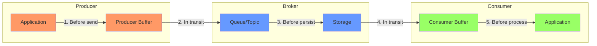
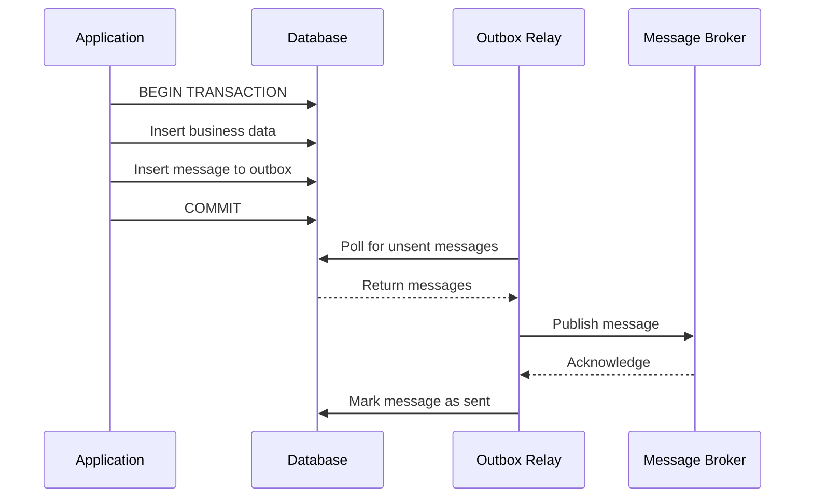
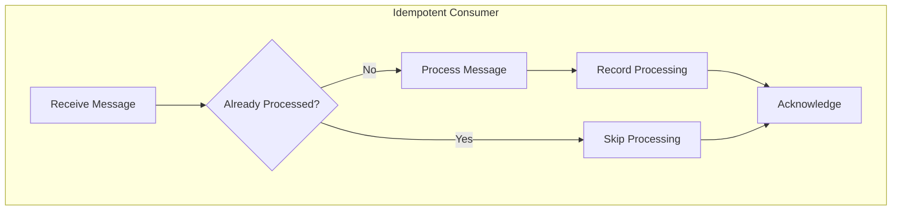

# How to Fix 'Message Lost' in Async Communication

Author: [nawazdhandala](https://www.github.com/nawazdhandala)

Tags: Microservices, Message Queue, Kafka, RabbitMQ, Async Communication, Event-Driven, Reliability, Dead Letter Queue

Description: Learn how to prevent and recover from message loss in asynchronous communication systems, including idempotency, acknowledgments, and dead letter queues.

---

Message loss in asynchronous communication can lead to data inconsistencies, failed business processes, and frustrated users. Understanding where messages can be lost and implementing proper safeguards is essential for reliable distributed systems.

## Where Messages Get Lost

Messages can be lost at multiple points in the communication pipeline.



Each numbered point represents a potential failure point where messages can be lost.

## Common Causes of Message Loss

### Cause 1: Producer Failures

Messages can be lost if the producer crashes before confirming delivery.

```go
package producer

import (
    "context"
    "fmt"
    "time"

    "github.com/segmentio/kafka-go"
)

// UnsafeProducer demonstrates how messages can be lost
type UnsafeProducer struct {
    writer *kafka.Writer
}

// SendUnsafe sends without waiting for acknowledgment
func (p *UnsafeProducer) SendUnsafe(ctx context.Context, message []byte) error {
    // PROBLEM: Fire and forget - no confirmation of delivery
    go func() {
        p.writer.WriteMessages(ctx, kafka.Message{
            Value: message,
        })
    }()
    return nil // Returns immediately, message may never arrive
}

// SafeProducer ensures message delivery
type SafeProducer struct {
    writer *kafka.Writer
}

// NewSafeProducer creates a producer with proper acknowledgment settings
func NewSafeProducer(brokers []string, topic string) *SafeProducer {
    return &SafeProducer{
        writer: &kafka.Writer{
            Addr:         kafka.TCP(brokers...),
            Topic:        topic,
            Balancer:     &kafka.LeastBytes{},
            // Wait for all replicas to acknowledge
            RequiredAcks: kafka.RequireAll,
            // Retry on failure
            MaxAttempts:  3,
            // Set timeouts
            WriteTimeout: 10 * time.Second,
            ReadTimeout:  10 * time.Second,
        },
    }
}

// SendSafe sends with delivery confirmation
func (p *SafeProducer) SendSafe(ctx context.Context, key, value []byte) error {
    err := p.writer.WriteMessages(ctx, kafka.Message{
        Key:   key,
        Value: value,
    })

    if err != nil {
        return fmt.Errorf("failed to deliver message: %w", err)
    }

    // Message is now confirmed to be stored in Kafka
    return nil
}
```

### Cause 2: Consumer Acknowledgment Issues

Messages can be lost if acknowledged before processing completes.

```go
package consumer

import (
    "context"
    "fmt"

    "github.com/segmentio/kafka-go"
)

// UnsafeConsumer demonstrates premature acknowledgment
type UnsafeConsumer struct {
    reader *kafka.Reader
}

// ConsumeUnsafe acknowledges before processing
func (c *UnsafeConsumer) ConsumeUnsafe(ctx context.Context) error {
    for {
        msg, err := c.reader.ReadMessage(ctx) // Auto-commits offset
        if err != nil {
            return err
        }

        // PROBLEM: If processing fails here, message is lost
        // because offset was already committed
        if err := processMessage(msg.Value); err != nil {
            fmt.Printf("Failed to process: %v\n", err)
            // Message is lost - cannot be reprocessed
        }
    }
}

// SafeConsumer uses manual acknowledgment
type SafeConsumer struct {
    reader *kafka.Reader
}

// NewSafeConsumer creates a consumer with manual commit
func NewSafeConsumer(brokers []string, topic, groupID string) *SafeConsumer {
    return &SafeConsumer{
        reader: kafka.NewReader(kafka.ReaderConfig{
            Brokers:        brokers,
            Topic:          topic,
            GroupID:        groupID,
            // Disable auto-commit
            CommitInterval: 0,
            // Start from earliest unread message
            StartOffset:    kafka.FirstOffset,
        }),
    }
}

// ConsumeSafe only acknowledges after successful processing
func (c *SafeConsumer) ConsumeSafe(ctx context.Context) error {
    for {
        // Fetch message without committing
        msg, err := c.reader.FetchMessage(ctx)
        if err != nil {
            return fmt.Errorf("fetching message: %w", err)
        }

        // Process the message
        if err := processMessage(msg.Value); err != nil {
            fmt.Printf("Failed to process message at offset %d: %v\n", msg.Offset, err)
            // Do not commit - message will be redelivered
            continue
        }

        // Only commit after successful processing
        if err := c.reader.CommitMessages(ctx, msg); err != nil {
            return fmt.Errorf("committing message: %w", err)
        }
    }
}
```

## Implementing the Outbox Pattern

The outbox pattern ensures messages are not lost by storing them in the database alongside business data.



### Outbox Implementation

```go
package outbox

import (
    "context"
    "database/sql"
    "encoding/json"
    "fmt"
    "time"
)

// OutboxMessage represents a message in the outbox table
type OutboxMessage struct {
    ID          string    `json:"id"`
    Topic       string    `json:"topic"`
    Key         string    `json:"key"`
    Payload     []byte    `json:"payload"`
    Status      string    `json:"status"`
    Retries     int       `json:"retries"`
    CreatedAt   time.Time `json:"created_at"`
    ProcessedAt *time.Time `json:"processed_at,omitempty"`
}

// OutboxRepository handles outbox operations
type OutboxRepository struct {
    db *sql.DB
}

// SaveWithOutbox saves business data and outbox message in one transaction
func (r *OutboxRepository) SaveWithOutbox(ctx context.Context, order *Order, event interface{}) error {
    tx, err := r.db.BeginTx(ctx, nil)
    if err != nil {
        return fmt.Errorf("beginning transaction: %w", err)
    }
    defer tx.Rollback()

    // Save business data
    _, err = tx.ExecContext(ctx, `
        INSERT INTO orders (id, customer_id, total_amount, status, created_at)
        VALUES ($1, $2, $3, $4, $5)
    `, order.ID, order.CustomerID, order.TotalAmount, order.Status, order.CreatedAt)

    if err != nil {
        return fmt.Errorf("inserting order: %w", err)
    }

    // Save message to outbox
    payload, err := json.Marshal(event)
    if err != nil {
        return fmt.Errorf("marshaling event: %w", err)
    }

    _, err = tx.ExecContext(ctx, `
        INSERT INTO outbox (id, topic, key, payload, status, created_at)
        VALUES ($1, $2, $3, $4, $5, $6)
    `, generateID(), "order.created", order.ID, payload, "PENDING", time.Now())

    if err != nil {
        return fmt.Errorf("inserting outbox message: %w", err)
    }

    // Commit transaction - both or neither
    if err := tx.Commit(); err != nil {
        return fmt.Errorf("committing transaction: %w", err)
    }

    return nil
}

// GetPendingMessages retrieves messages ready to be sent
func (r *OutboxRepository) GetPendingMessages(ctx context.Context, limit int) ([]OutboxMessage, error) {
    rows, err := r.db.QueryContext(ctx, `
        SELECT id, topic, key, payload, status, retries, created_at
        FROM outbox
        WHERE status = 'PENDING' AND retries < 5
        ORDER BY created_at ASC
        LIMIT $1
        FOR UPDATE SKIP LOCKED
    `, limit)

    if err != nil {
        return nil, fmt.Errorf("querying outbox: %w", err)
    }
    defer rows.Close()

    var messages []OutboxMessage
    for rows.Next() {
        var msg OutboxMessage
        if err := rows.Scan(&msg.ID, &msg.Topic, &msg.Key, &msg.Payload, &msg.Status, &msg.Retries, &msg.CreatedAt); err != nil {
            return nil, fmt.Errorf("scanning row: %w", err)
        }
        messages = append(messages, msg)
    }

    return messages, nil
}

// MarkAsSent updates message status after successful delivery
func (r *OutboxRepository) MarkAsSent(ctx context.Context, id string) error {
    now := time.Now()
    _, err := r.db.ExecContext(ctx, `
        UPDATE outbox
        SET status = 'SENT', processed_at = $1
        WHERE id = $2
    `, now, id)

    return err
}

// IncrementRetry updates retry count on failure
func (r *OutboxRepository) IncrementRetry(ctx context.Context, id string) error {
    _, err := r.db.ExecContext(ctx, `
        UPDATE outbox
        SET retries = retries + 1
        WHERE id = $1
    `, id)

    return err
}
```

### Outbox Relay Service

```go
package outbox

import (
    "context"
    "fmt"
    "time"

    "github.com/segmentio/kafka-go"
)

// RelayService polls outbox and publishes messages
type RelayService struct {
    repo     *OutboxRepository
    producer *kafka.Writer
    interval time.Duration
}

// NewRelayService creates a new outbox relay
func NewRelayService(repo *OutboxRepository, brokers []string, interval time.Duration) *RelayService {
    return &RelayService{
        repo: repo,
        producer: &kafka.Writer{
            Addr:         kafka.TCP(brokers...),
            Balancer:     &kafka.LeastBytes{},
            RequiredAcks: kafka.RequireAll,
        },
        interval: interval,
    }
}

// Start begins polling the outbox
func (s *RelayService) Start(ctx context.Context) error {
    ticker := time.NewTicker(s.interval)
    defer ticker.Stop()

    for {
        select {
        case <-ctx.Done():
            return ctx.Err()
        case <-ticker.C:
            if err := s.processOutbox(ctx); err != nil {
                fmt.Printf("Error processing outbox: %v\n", err)
            }
        }
    }
}

func (s *RelayService) processOutbox(ctx context.Context) error {
    messages, err := s.repo.GetPendingMessages(ctx, 100)
    if err != nil {
        return fmt.Errorf("getting pending messages: %w", err)
    }

    for _, msg := range messages {
        if err := s.publishMessage(ctx, msg); err != nil {
            fmt.Printf("Failed to publish message %s: %v\n", msg.ID, err)
            s.repo.IncrementRetry(ctx, msg.ID)
            continue
        }

        if err := s.repo.MarkAsSent(ctx, msg.ID); err != nil {
            fmt.Printf("Failed to mark message %s as sent: %v\n", msg.ID, err)
        }
    }

    return nil
}

func (s *RelayService) publishMessage(ctx context.Context, msg OutboxMessage) error {
    return s.producer.WriteMessages(ctx, kafka.Message{
        Topic: msg.Topic,
        Key:   []byte(msg.Key),
        Value: msg.Payload,
    })
}
```

## Implementing Idempotent Consumers

Idempotency ensures processing a message multiple times produces the same result.



### Idempotency Implementation

```go
package consumer

import (
    "context"
    "database/sql"
    "fmt"
    "time"
)

// IdempotencyStore tracks processed messages
type IdempotencyStore struct {
    db *sql.DB
}

// IsProcessed checks if a message has already been processed
func (s *IdempotencyStore) IsProcessed(ctx context.Context, messageID string) (bool, error) {
    var exists bool
    err := s.db.QueryRowContext(ctx, `
        SELECT EXISTS(SELECT 1 FROM processed_messages WHERE message_id = $1)
    `, messageID).Scan(&exists)

    return exists, err
}

// MarkProcessed records a message as processed
func (s *IdempotencyStore) MarkProcessed(ctx context.Context, messageID string) error {
    _, err := s.db.ExecContext(ctx, `
        INSERT INTO processed_messages (message_id, processed_at)
        VALUES ($1, $2)
        ON CONFLICT (message_id) DO NOTHING
    `, messageID, time.Now())

    return err
}

// IdempotentConsumer ensures each message is processed exactly once
type IdempotentConsumer struct {
    reader     *kafka.Reader
    store      *IdempotencyStore
    handler    MessageHandler
}

// MessageHandler processes messages
type MessageHandler interface {
    Handle(ctx context.Context, payload []byte) error
}

// Consume processes messages idempotently
func (c *IdempotentConsumer) Consume(ctx context.Context) error {
    for {
        msg, err := c.reader.FetchMessage(ctx)
        if err != nil {
            return fmt.Errorf("fetching message: %w", err)
        }

        messageID := getMessageID(msg)

        // Check if already processed
        processed, err := c.store.IsProcessed(ctx, messageID)
        if err != nil {
            fmt.Printf("Error checking idempotency: %v\n", err)
            continue
        }

        if processed {
            fmt.Printf("Message %s already processed, skipping\n", messageID)
            c.reader.CommitMessages(ctx, msg)
            continue
        }

        // Process the message
        if err := c.handler.Handle(ctx, msg.Value); err != nil {
            fmt.Printf("Error processing message: %v\n", err)
            // Do not commit - will retry
            continue
        }

        // Mark as processed
        if err := c.store.MarkProcessed(ctx, messageID); err != nil {
            fmt.Printf("Error marking message as processed: %v\n", err)
        }

        // Commit offset
        if err := c.reader.CommitMessages(ctx, msg); err != nil {
            fmt.Printf("Error committing message: %v\n", err)
        }
    }
}

func getMessageID(msg kafka.Message) string {
    // Use message key + offset as unique identifier
    return fmt.Sprintf("%s-%d-%d", msg.Topic, msg.Partition, msg.Offset)
}
```

## Dead Letter Queue Implementation

Messages that cannot be processed after multiple retries should go to a dead letter queue for investigation.

```go
package consumer

import (
    "context"
    "encoding/json"
    "fmt"
    "time"
)

// DeadLetterMessage wraps the original message with metadata
type DeadLetterMessage struct {
    OriginalTopic   string    `json:"original_topic"`
    OriginalKey     string    `json:"original_key"`
    OriginalPayload []byte    `json:"original_payload"`
    Error           string    `json:"error"`
    Attempts        int       `json:"attempts"`
    FirstAttempt    time.Time `json:"first_attempt"`
    LastAttempt     time.Time `json:"last_attempt"`
}

// RetryableConsumer handles retries and dead letter queue
type RetryableConsumer struct {
    reader      *kafka.Reader
    dlqWriter   *kafka.Writer
    handler     MessageHandler
    maxRetries  int
    retryDelay  time.Duration
}

// NewRetryableConsumer creates a consumer with DLQ support
func NewRetryableConsumer(
    brokers []string,
    topic string,
    groupID string,
    dlqTopic string,
    maxRetries int,
) *RetryableConsumer {
    return &RetryableConsumer{
        reader: kafka.NewReader(kafka.ReaderConfig{
            Brokers:        brokers,
            Topic:          topic,
            GroupID:        groupID,
            CommitInterval: 0,
        }),
        dlqWriter: &kafka.Writer{
            Addr:         kafka.TCP(brokers...),
            Topic:        dlqTopic,
            RequiredAcks: kafka.RequireAll,
        },
        maxRetries: maxRetries,
        retryDelay: time.Second,
    }
}

// Consume processes messages with retry logic
func (c *RetryableConsumer) Consume(ctx context.Context) error {
    for {
        msg, err := c.reader.FetchMessage(ctx)
        if err != nil {
            return fmt.Errorf("fetching message: %w", err)
        }

        var lastErr error
        success := false

        for attempt := 1; attempt <= c.maxRetries; attempt++ {
            if err := c.handler.Handle(ctx, msg.Value); err != nil {
                lastErr = err
                fmt.Printf("Attempt %d failed: %v\n", attempt, err)

                // Exponential backoff
                delay := c.retryDelay * time.Duration(attempt)
                time.Sleep(delay)
                continue
            }

            success = true
            break
        }

        if !success {
            // Send to dead letter queue
            if err := c.sendToDLQ(ctx, msg, lastErr); err != nil {
                fmt.Printf("Failed to send to DLQ: %v\n", err)
            }
        }

        // Commit regardless - message is either processed or in DLQ
        if err := c.reader.CommitMessages(ctx, msg); err != nil {
            fmt.Printf("Error committing message: %v\n", err)
        }
    }
}

func (c *RetryableConsumer) sendToDLQ(ctx context.Context, msg kafka.Message, err error) error {
    dlqMsg := DeadLetterMessage{
        OriginalTopic:   msg.Topic,
        OriginalKey:     string(msg.Key),
        OriginalPayload: msg.Value,
        Error:           err.Error(),
        Attempts:        c.maxRetries,
        FirstAttempt:    msg.Time,
        LastAttempt:     time.Now(),
    }

    payload, marshalErr := json.Marshal(dlqMsg)
    if marshalErr != nil {
        return fmt.Errorf("marshaling DLQ message: %w", marshalErr)
    }

    return c.dlqWriter.WriteMessages(ctx, kafka.Message{
        Key:   msg.Key,
        Value: payload,
    })
}
```

## Database Schema for Message Tracking

```sql
-- Outbox table for guaranteed message delivery
CREATE TABLE outbox (
    id UUID PRIMARY KEY,
    topic VARCHAR(255) NOT NULL,
    key VARCHAR(255),
    payload JSONB NOT NULL,
    status VARCHAR(20) NOT NULL DEFAULT 'PENDING',
    retries INT NOT NULL DEFAULT 0,
    created_at TIMESTAMP NOT NULL DEFAULT NOW(),
    processed_at TIMESTAMP
);

-- Index for efficient polling
CREATE INDEX idx_outbox_pending ON outbox(status, created_at)
    WHERE status = 'PENDING';

-- Processed messages for idempotency
CREATE TABLE processed_messages (
    message_id VARCHAR(255) PRIMARY KEY,
    processed_at TIMESTAMP NOT NULL DEFAULT NOW()
);

-- Index for cleanup of old records
CREATE INDEX idx_processed_messages_date ON processed_messages(processed_at);

-- Clean up old processed message records (run periodically)
-- DELETE FROM processed_messages WHERE processed_at < NOW() - INTERVAL '7 days';

-- Dead letter queue for analysis
CREATE TABLE dead_letter_messages (
    id UUID PRIMARY KEY,
    original_topic VARCHAR(255) NOT NULL,
    original_key VARCHAR(255),
    original_payload JSONB NOT NULL,
    error TEXT NOT NULL,
    attempts INT NOT NULL,
    first_attempt TIMESTAMP NOT NULL,
    last_attempt TIMESTAMP NOT NULL,
    resolved BOOLEAN NOT NULL DEFAULT FALSE,
    resolved_at TIMESTAMP,
    created_at TIMESTAMP NOT NULL DEFAULT NOW()
);
```

## Monitoring Message Loss

```yaml
# Prometheus alerting rules for message loss detection
groups:
  - name: message_reliability
    rules:
      # Alert on consumer lag
      - alert: HighConsumerLag
        expr: kafka_consumergroup_lag_sum > 10000
        for: 5m
        labels:
          severity: warning
        annotations:
          summary: "High consumer lag detected"
          description: "Consumer group {{ $labels.consumergroup }} has lag of {{ $value }}"

      # Alert on dead letter queue growth
      - alert: DLQGrowing
        expr: increase(dlq_messages_total[1h]) > 100
        for: 10m
        labels:
          severity: critical
        annotations:
          summary: "Dead letter queue is growing"
          description: "{{ $value }} messages sent to DLQ in the last hour"

      # Alert on outbox backup
      - alert: OutboxBacklog
        expr: outbox_pending_messages > 1000
        for: 5m
        labels:
          severity: warning
        annotations:
          summary: "Outbox has pending messages"
          description: "{{ $value }} messages waiting to be published"
```

## Best Practices Summary

1. Always wait for broker acknowledgment before considering a message sent
2. Use manual acknowledgment and only commit after successful processing
3. Implement the outbox pattern for guaranteed delivery with database transactions
4. Make consumers idempotent to handle duplicate messages safely
5. Use dead letter queues for messages that fail repeatedly
6. Monitor consumer lag, DLQ size, and outbox backlog
7. Set appropriate retention periods for processed message tracking
8. Test failure scenarios to verify your message reliability

Message loss is preventable with the right patterns and careful implementation. The key is understanding where failures can occur and building safeguards at each point.
