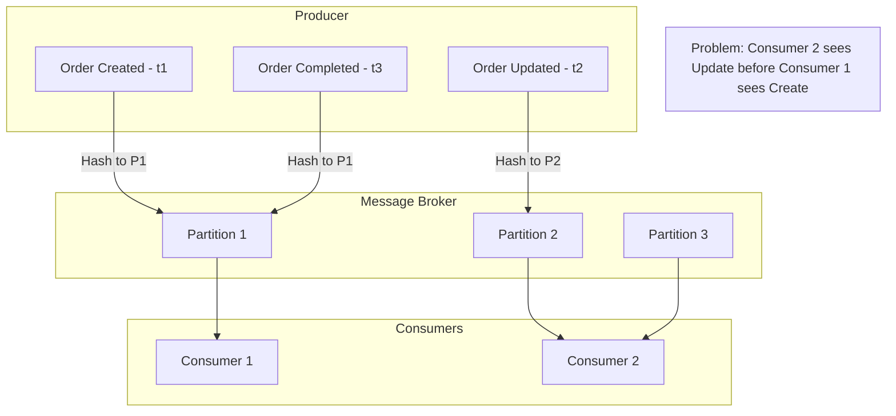
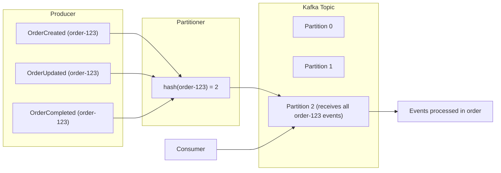
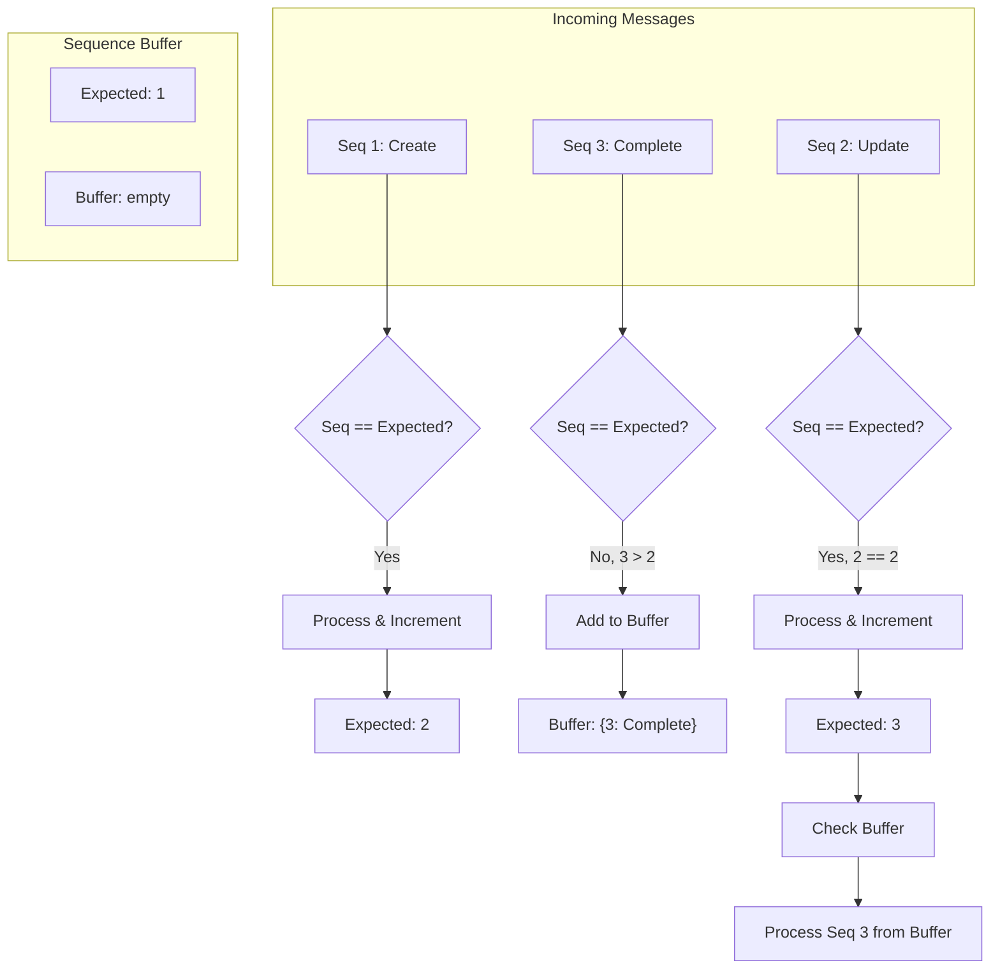
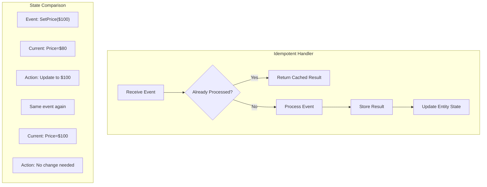

# How to Fix 'Message Ordering' Issues in Event-Driven Systems

Author: [nawazdhandala](https://www.github.com/nawazdhandala)

Tags: Message Ordering, Event-Driven Architecture, Kafka, RabbitMQ, Distributed Systems, Message Queue, Event Sourcing

Description: A practical guide to understanding, diagnosing, and fixing message ordering issues in event-driven systems using partitioning, sequencing, and idempotency patterns.

---

Message ordering issues cause subtle bugs that are hard to reproduce and diagnose. When events arrive out of order, you might apply an update before a create, process a cancellation after a completion, or double-charge customers. This guide covers practical patterns to handle message ordering in event-driven architectures.

## Understanding Message Ordering Challenges

Event-driven systems do not guarantee global ordering by default. Understanding why helps you design around the limitations.



## Diagnosing Ordering Problems

### Detecting Out-of-Order Messages

```python
# ordering_detector.py - Detect and log ordering violations
from dataclasses import dataclass, field
from datetime import datetime
from typing import Dict, List, Optional
import logging
from collections import defaultdict

logger = logging.getLogger(__name__)

@dataclass
class MessageMetadata:
    message_id: str
    entity_id: str
    sequence_number: int
    event_type: str
    timestamp: datetime
    producer_timestamp: datetime

@dataclass
class OrderingViolation:
    entity_id: str
    expected_sequence: int
    received_sequence: int
    message_id: str
    gap_size: int
    timestamp: datetime

class OrderingDetector:
    """Detect message ordering violations."""

    def __init__(self):
        # Track last seen sequence per entity
        self.last_sequence: Dict[str, int] = defaultdict(int)
        self.violations: List[OrderingViolation] = []
        self.pending_messages: Dict[str, List[MessageMetadata]] = defaultdict(list)

    def check_message(self, metadata: MessageMetadata) -> Optional[OrderingViolation]:
        """Check if message is out of order."""
        entity_id = metadata.entity_id
        expected_seq = self.last_sequence[entity_id] + 1
        received_seq = metadata.sequence_number

        if received_seq < expected_seq:
            # Duplicate or old message
            logger.warning(
                f"Duplicate/old message for {entity_id}: "
                f"expected >= {expected_seq}, got {received_seq}"
            )
            return None

        if received_seq > expected_seq:
            # Gap detected - messages missing
            violation = OrderingViolation(
                entity_id=entity_id,
                expected_sequence=expected_seq,
                received_sequence=received_seq,
                message_id=metadata.message_id,
                gap_size=received_seq - expected_seq,
                timestamp=datetime.now()
            )
            self.violations.append(violation)

            logger.error(
                f"Ordering violation for {entity_id}: "
                f"expected {expected_seq}, got {received_seq}, "
                f"gap of {violation.gap_size} messages"
            )

            # Store for potential reordering
            self.pending_messages[entity_id].append(metadata)
            return violation

        # Message is in order
        self.last_sequence[entity_id] = received_seq
        return None

    def get_violation_stats(self) -> Dict:
        """Get statistics about ordering violations."""
        if not self.violations:
            return {"total_violations": 0}

        gaps = [v.gap_size for v in self.violations]
        return {
            "total_violations": len(self.violations),
            "affected_entities": len(set(v.entity_id for v in self.violations)),
            "avg_gap_size": sum(gaps) / len(gaps),
            "max_gap_size": max(gaps),
            "recent_violations": [
                {
                    "entity_id": v.entity_id,
                    "gap_size": v.gap_size,
                    "timestamp": v.timestamp.isoformat()
                }
                for v in self.violations[-10:]
            ]
        }


# Middleware for message processing
class OrderingMiddleware:
    """Middleware to handle ordering in message consumers."""

    def __init__(self, detector: OrderingDetector):
        self.detector = detector

    def process(self, message: dict, handler):
        """Process message with ordering checks."""
        metadata = MessageMetadata(
            message_id=message['id'],
            entity_id=message['entity_id'],
            sequence_number=message['sequence'],
            event_type=message['type'],
            timestamp=datetime.now(),
            producer_timestamp=datetime.fromisoformat(message['timestamp'])
        )

        violation = self.detector.check_message(metadata)

        if violation:
            # Handle based on strategy
            return self._handle_violation(message, violation, handler)

        return handler(message)

    def _handle_violation(self, message, violation, handler):
        """Handle ordering violation based on configured strategy."""
        # Options: skip, buffer, fail
        strategy = os.getenv('ORDERING_VIOLATION_STRATEGY', 'log_and_process')

        if strategy == 'skip':
            logger.warning(f"Skipping out-of-order message: {message['id']}")
            return None

        elif strategy == 'fail':
            raise OrderingViolationError(
                f"Message {message['id']} is out of order"
            )

        else:  # log_and_process
            logger.warning(f"Processing out-of-order message: {message['id']}")
            return handler(message)
```

## Pattern 1: Partition-Based Ordering

Kafka guarantees ordering within a partition. Route related messages to the same partition.



```python
# kafka_ordering.py - Ensure ordering with Kafka partitioning
from kafka import KafkaProducer, KafkaConsumer
from kafka.partitioner import Partitioner
import json
import hashlib

class EntityPartitioner(Partitioner):
    """Partition by entity ID to ensure ordering."""

    def __call__(self, key, all_partitions, available_partitions):
        """Route message to partition based on key."""
        if key is None:
            # No key - use round-robin
            return self._round_robin(available_partitions)

        # Hash key to get consistent partition
        key_bytes = key if isinstance(key, bytes) else key.encode('utf-8')
        hash_value = int(hashlib.md5(key_bytes).hexdigest(), 16)

        # Use available partitions only
        return available_partitions[hash_value % len(available_partitions)]

    def _round_robin(self, partitions):
        if not hasattr(self, '_counter'):
            self._counter = 0
        self._counter += 1
        return partitions[self._counter % len(partitions)]


class OrderedEventProducer:
    """Producer that ensures ordered delivery per entity."""

    def __init__(self, bootstrap_servers: str, topic: str):
        self.topic = topic
        self.producer = KafkaProducer(
            bootstrap_servers=bootstrap_servers,
            key_serializer=lambda k: k.encode('utf-8'),
            value_serializer=lambda v: json.dumps(v).encode('utf-8'),
            partitioner=EntityPartitioner(),
            # Ensure messages are written in order
            acks='all',
            retries=3,
            max_in_flight_requests_per_connection=1  # Critical for ordering
        )

    def publish(self, entity_id: str, event: dict):
        """Publish event with entity ID as key."""
        # Use entity_id as key to ensure partition affinity
        future = self.producer.send(
            self.topic,
            key=entity_id,
            value=event
        )

        # Wait for confirmation to maintain ordering
        record_metadata = future.get(timeout=10)

        return {
            'partition': record_metadata.partition,
            'offset': record_metadata.offset
        }


class OrderedEventConsumer:
    """Consumer that maintains ordering guarantees."""

    def __init__(
        self,
        bootstrap_servers: str,
        topic: str,
        group_id: str,
        handler
    ):
        self.consumer = KafkaConsumer(
            topic,
            bootstrap_servers=bootstrap_servers,
            group_id=group_id,
            key_deserializer=lambda k: k.decode('utf-8'),
            value_deserializer=lambda v: json.loads(v.decode('utf-8')),
            # Ordering settings
            enable_auto_commit=False,  # Manual commit for reliability
            auto_offset_reset='earliest',
            max_poll_records=100
        )
        self.handler = handler

    def consume(self):
        """Consume messages maintaining order."""
        for message in self.consumer:
            try:
                # Process single message
                self.handler(
                    key=message.key,
                    value=message.value,
                    partition=message.partition,
                    offset=message.offset
                )

                # Commit after successful processing
                self.consumer.commit()

            except Exception as e:
                logger.error(f"Error processing message: {e}")
                # Do not commit - message will be reprocessed
                raise
```

## Pattern 2: Sequence Numbers and Buffering

Add sequence numbers to messages and buffer out-of-order messages until gaps are filled.



```python
# sequence_buffer.py - Buffer and reorder messages
from dataclasses import dataclass
from typing import Dict, Optional, Callable, Any
from collections import defaultdict
import heapq
import threading
import time
import logging

logger = logging.getLogger(__name__)

@dataclass
class SequencedMessage:
    sequence: int
    payload: Any
    received_at: float

    def __lt__(self, other):
        return self.sequence < other.sequence

class SequenceBuffer:
    """Buffer messages and deliver in sequence order."""

    def __init__(
        self,
        handler: Callable,
        max_buffer_size: int = 1000,
        max_wait_seconds: float = 30.0
    ):
        self.handler = handler
        self.max_buffer_size = max_buffer_size
        self.max_wait_seconds = max_wait_seconds

        # Per-entity state
        self.expected_sequence: Dict[str, int] = defaultdict(lambda: 1)
        self.buffers: Dict[str, list] = defaultdict(list)  # Min-heap per entity
        self.lock = threading.Lock()

        # Start cleanup thread
        self._start_cleanup_thread()

    def receive(self, entity_id: str, sequence: int, payload: Any) -> bool:
        """Receive a message, buffer if out of order."""
        with self.lock:
            expected = self.expected_sequence[entity_id]

            if sequence < expected:
                # Old/duplicate message
                logger.debug(f"Ignoring old message: seq {sequence} < expected {expected}")
                return False

            if sequence == expected:
                # In order - process immediately
                self._process_message(entity_id, sequence, payload)
                # Check buffer for next messages
                self._drain_buffer(entity_id)
                return True

            # Out of order - buffer it
            if len(self.buffers[entity_id]) >= self.max_buffer_size:
                logger.error(f"Buffer full for {entity_id}, dropping message")
                return False

            msg = SequencedMessage(
                sequence=sequence,
                payload=payload,
                received_at=time.time()
            )
            heapq.heappush(self.buffers[entity_id], msg)
            logger.debug(f"Buffered message seq {sequence} for {entity_id}")
            return True

    def _process_message(self, entity_id: str, sequence: int, payload: Any):
        """Process a single message."""
        try:
            self.handler(entity_id, payload)
            self.expected_sequence[entity_id] = sequence + 1
        except Exception as e:
            logger.error(f"Error processing message for {entity_id}: {e}")
            raise

    def _drain_buffer(self, entity_id: str):
        """Process buffered messages that are now in order."""
        buffer = self.buffers[entity_id]

        while buffer:
            # Peek at smallest sequence in buffer
            next_msg = buffer[0]

            if next_msg.sequence == self.expected_sequence[entity_id]:
                # Pop and process
                heapq.heappop(buffer)
                self._process_message(
                    entity_id,
                    next_msg.sequence,
                    next_msg.payload
                )
            else:
                # Gap still exists
                break

    def _start_cleanup_thread(self):
        """Start thread to handle stuck messages."""
        def cleanup_loop():
            while True:
                time.sleep(5)
                self._cleanup_expired()

        thread = threading.Thread(target=cleanup_loop, daemon=True)
        thread.start()

    def _cleanup_expired(self):
        """Handle messages that have waited too long."""
        now = time.time()

        with self.lock:
            for entity_id, buffer in list(self.buffers.items()):
                if not buffer:
                    continue

                oldest = buffer[0]
                wait_time = now - oldest.received_at

                if wait_time > self.max_wait_seconds:
                    # Skip the gap and process what we have
                    logger.warning(
                        f"Gap timeout for {entity_id}: jumping from "
                        f"{self.expected_sequence[entity_id]} to {oldest.sequence}"
                    )
                    self.expected_sequence[entity_id] = oldest.sequence
                    self._drain_buffer(entity_id)

    def get_stats(self) -> Dict:
        """Get buffer statistics."""
        with self.lock:
            return {
                "entities_with_buffers": len([b for b in self.buffers.values() if b]),
                "total_buffered_messages": sum(len(b) for b in self.buffers.values()),
                "buffer_sizes": {
                    entity_id: len(buffer)
                    for entity_id, buffer in self.buffers.items()
                    if buffer
                }
            }
```

## Pattern 3: Idempotent Processing

Design handlers to be idempotent so order does not matter for final state.



```python
# idempotent_handler.py - Idempotent message processing
from dataclasses import dataclass
from typing import Dict, Optional, Set
from datetime import datetime, timedelta
import hashlib
import json
import redis
import logging

logger = logging.getLogger(__name__)

class IdempotencyStore:
    """Store processed message IDs to prevent duplicates."""

    def __init__(self, redis_client: redis.Redis, ttl_hours: int = 24):
        self.redis = redis_client
        self.ttl = timedelta(hours=ttl_hours)

    def _key(self, message_id: str) -> str:
        return f"idempotency:{message_id}"

    def is_processed(self, message_id: str) -> bool:
        """Check if message was already processed."""
        return self.redis.exists(self._key(message_id))

    def mark_processed(self, message_id: str, result: Optional[dict] = None):
        """Mark message as processed."""
        value = json.dumps({
            "processed_at": datetime.now().isoformat(),
            "result": result
        })
        self.redis.setex(
            self._key(message_id),
            self.ttl,
            value
        )

    def get_result(self, message_id: str) -> Optional[dict]:
        """Get cached result for already-processed message."""
        data = self.redis.get(self._key(message_id))
        if data:
            return json.loads(data).get("result")
        return None


class IdempotentMessageHandler:
    """Wrapper that makes any handler idempotent."""

    def __init__(self, handler, idempotency_store: IdempotencyStore):
        self.handler = handler
        self.store = idempotency_store

    def handle(self, message: dict):
        """Handle message idempotently."""
        message_id = self._get_message_id(message)

        # Check if already processed
        if self.store.is_processed(message_id):
            logger.info(f"Skipping duplicate message: {message_id}")
            return self.store.get_result(message_id)

        # Process message
        try:
            result = self.handler(message)
            self.store.mark_processed(message_id, result)
            return result
        except Exception as e:
            # Do not mark as processed on failure
            logger.error(f"Failed to process message {message_id}: {e}")
            raise

    def _get_message_id(self, message: dict) -> str:
        """Extract or generate message ID."""
        # Use explicit ID if present
        if 'message_id' in message:
            return message['message_id']

        # Generate deterministic ID from content
        content = json.dumps(message, sort_keys=True)
        return hashlib.sha256(content.encode()).hexdigest()[:32]


# State-based idempotency for aggregates
class IdempotentAggregateHandler:
    """Handle events idempotently using aggregate version."""

    def __init__(self, repository):
        self.repository = repository

    def handle(self, event: dict):
        """Apply event to aggregate idempotently."""
        entity_id = event['entity_id']
        event_sequence = event['sequence']

        # Load current aggregate state
        aggregate = self.repository.get(entity_id)

        if aggregate is None:
            if event['type'] != 'Created':
                logger.warning(
                    f"Received {event['type']} for non-existent entity {entity_id}"
                )
                return None
            aggregate = self._create_aggregate(entity_id)

        # Check if event already applied
        if event_sequence <= aggregate.version:
            logger.debug(
                f"Skipping already-applied event: seq {event_sequence} "
                f"<= version {aggregate.version}"
            )
            return aggregate

        # Check for gap
        if event_sequence > aggregate.version + 1:
            raise EventGapError(
                f"Event gap detected: aggregate at version {aggregate.version}, "
                f"event sequence {event_sequence}"
            )

        # Apply event
        aggregate = self._apply_event(aggregate, event)
        aggregate.version = event_sequence

        self.repository.save(aggregate)
        return aggregate

    def _apply_event(self, aggregate, event):
        """Apply event to aggregate state."""
        event_type = event['type']
        data = event['data']

        if event_type == 'Created':
            aggregate.status = 'created'
            aggregate.created_at = data['timestamp']

        elif event_type == 'Updated':
            for key, value in data.items():
                if hasattr(aggregate, key):
                    setattr(aggregate, key, value)

        elif event_type == 'Completed':
            aggregate.status = 'completed'
            aggregate.completed_at = data['timestamp']

        elif event_type == 'Cancelled':
            aggregate.status = 'cancelled'
            aggregate.cancelled_at = data['timestamp']

        return aggregate
```

## Pattern 4: Event Sourcing with Ordered Event Store

Store events in an ordered log and rebuild state from events.

```python
# event_sourcing.py - Event sourcing with guaranteed ordering
from dataclasses import dataclass, field
from typing import List, Dict, Type, Optional
from datetime import datetime
import uuid
from abc import ABC, abstractmethod

@dataclass
class Event:
    event_id: str
    entity_id: str
    event_type: str
    data: Dict
    sequence: int
    timestamp: datetime
    metadata: Dict = field(default_factory=dict)

class EventStore:
    """Append-only event store with ordering guarantees."""

    def __init__(self, db_connection):
        self.db = db_connection

    def append(self, entity_id: str, events: List[Event], expected_version: int):
        """Append events with optimistic concurrency control."""
        with self.db.transaction() as txn:
            # Check current version
            current_version = txn.execute("""
                SELECT COALESCE(MAX(sequence), 0) as version
                FROM events
                WHERE entity_id = %s
            """, (entity_id,)).fetchone()['version']

            if current_version != expected_version:
                raise ConcurrencyError(
                    f"Expected version {expected_version}, "
                    f"but current is {current_version}"
                )

            # Append events with sequential numbers
            for i, event in enumerate(events):
                sequence = expected_version + i + 1
                txn.execute("""
                    INSERT INTO events (
                        event_id, entity_id, event_type, data,
                        sequence, timestamp, metadata
                    ) VALUES (%s, %s, %s, %s, %s, %s, %s)
                """, (
                    event.event_id,
                    entity_id,
                    event.event_type,
                    json.dumps(event.data),
                    sequence,
                    event.timestamp,
                    json.dumps(event.metadata)
                ))

            return current_version + len(events)

    def get_events(
        self,
        entity_id: str,
        from_sequence: int = 0
    ) -> List[Event]:
        """Get events for entity in order."""
        rows = self.db.execute("""
            SELECT * FROM events
            WHERE entity_id = %s AND sequence > %s
            ORDER BY sequence ASC
        """, (entity_id, from_sequence)).fetchall()

        return [
            Event(
                event_id=row['event_id'],
                entity_id=row['entity_id'],
                event_type=row['event_type'],
                data=json.loads(row['data']),
                sequence=row['sequence'],
                timestamp=row['timestamp'],
                metadata=json.loads(row['metadata'])
            )
            for row in rows
        ]


class Aggregate(ABC):
    """Base class for event-sourced aggregates."""

    def __init__(self, entity_id: str):
        self.entity_id = entity_id
        self.version = 0
        self._uncommitted_events: List[Event] = []

    def apply_event(self, event: Event):
        """Apply event to update state."""
        handler_name = f"_apply_{event.event_type}"
        handler = getattr(self, handler_name, None)

        if handler:
            handler(event.data)

        self.version = event.sequence

    def raise_event(self, event_type: str, data: Dict):
        """Raise new event."""
        event = Event(
            event_id=str(uuid.uuid4()),
            entity_id=self.entity_id,
            event_type=event_type,
            data=data,
            sequence=self.version + len(self._uncommitted_events) + 1,
            timestamp=datetime.now()
        )

        # Apply to self
        self.apply_event(event)
        self._uncommitted_events.append(event)

    def get_uncommitted_events(self) -> List[Event]:
        return self._uncommitted_events

    def mark_events_committed(self):
        self._uncommitted_events = []


class Order(Aggregate):
    """Order aggregate with event sourcing."""

    def __init__(self, entity_id: str):
        super().__init__(entity_id)
        self.status = None
        self.items = []
        self.total = 0

    # Command handlers
    def create(self, items: List[Dict]):
        if self.status is not None:
            raise InvalidOperationError("Order already exists")

        self.raise_event("OrderCreated", {
            "items": items,
            "total": sum(item['price'] * item['quantity'] for item in items)
        })

    def add_item(self, item: Dict):
        if self.status != 'pending':
            raise InvalidOperationError("Cannot modify non-pending order")

        self.raise_event("ItemAdded", {"item": item})

    def complete(self):
        if self.status != 'pending':
            raise InvalidOperationError("Cannot complete non-pending order")

        self.raise_event("OrderCompleted", {"completed_at": datetime.now().isoformat()})

    # Event handlers
    def _apply_OrderCreated(self, data: Dict):
        self.status = 'pending'
        self.items = data['items']
        self.total = data['total']

    def _apply_ItemAdded(self, data: Dict):
        self.items.append(data['item'])
        self.total += data['item']['price'] * data['item']['quantity']

    def _apply_OrderCompleted(self, data: Dict):
        self.status = 'completed'


class OrderRepository:
    """Repository for Order aggregate."""

    def __init__(self, event_store: EventStore):
        self.event_store = event_store

    def get(self, order_id: str) -> Optional[Order]:
        """Load order from events."""
        events = self.event_store.get_events(order_id)

        if not events:
            return None

        order = Order(order_id)
        for event in events:
            order.apply_event(event)

        return order

    def save(self, order: Order):
        """Save order events."""
        events = order.get_uncommitted_events()
        if not events:
            return

        expected_version = order.version - len(events)
        self.event_store.append(order.entity_id, events, expected_version)
        order.mark_events_committed()
```

## Monitoring and Alerting

```yaml
# prometheus-alerts.yaml - Ordering issue alerts
groups:
  - name: message_ordering
    rules:
      - alert: HighMessageReorderingRate
        expr: |
          rate(message_ordering_violations_total[5m]) > 10
        for: 5m
        labels:
          severity: warning
        annotations:
          summary: "High message reordering rate"
          description: "{{ $value }} ordering violations per second in {{ $labels.service }}"

      - alert: LargeSequenceGaps
        expr: |
          histogram_quantile(0.99, message_sequence_gap_bucket) > 100
        for: 10m
        labels:
          severity: critical
        annotations:
          summary: "Large sequence gaps detected"
          description: "99th percentile sequence gap is {{ $value }} messages"

      - alert: BufferBacklogGrowing
        expr: |
          increase(message_buffer_size[10m]) > 1000
        for: 5m
        labels:
          severity: warning
        annotations:
          summary: "Message buffer growing"
          description: "Buffer for {{ $labels.entity_type }} has grown by {{ $value }}"
```

```python
# metrics.py - Ordering metrics
from prometheus_client import Counter, Histogram, Gauge

ordering_violations = Counter(
    'message_ordering_violations_total',
    'Number of ordering violations detected',
    ['service', 'event_type']
)

sequence_gap = Histogram(
    'message_sequence_gap',
    'Size of sequence gaps when violations occur',
    ['service', 'entity_type'],
    buckets=[1, 5, 10, 50, 100, 500, 1000]
)

buffer_size = Gauge(
    'message_buffer_size',
    'Current number of buffered out-of-order messages',
    ['service', 'entity_type']
)

processing_lag = Histogram(
    'message_processing_lag_seconds',
    'Time between message production and processing',
    ['service', 'event_type'],
    buckets=[0.1, 0.5, 1, 5, 10, 30, 60]
)
```

Message ordering is a fundamental challenge in distributed systems. Choose your pattern based on your requirements: partition-based ordering for simplicity, sequence buffers for flexibility, idempotent handlers for resilience, or event sourcing for complete ordering guarantees. Often, combining multiple patterns provides the most robust solution.
