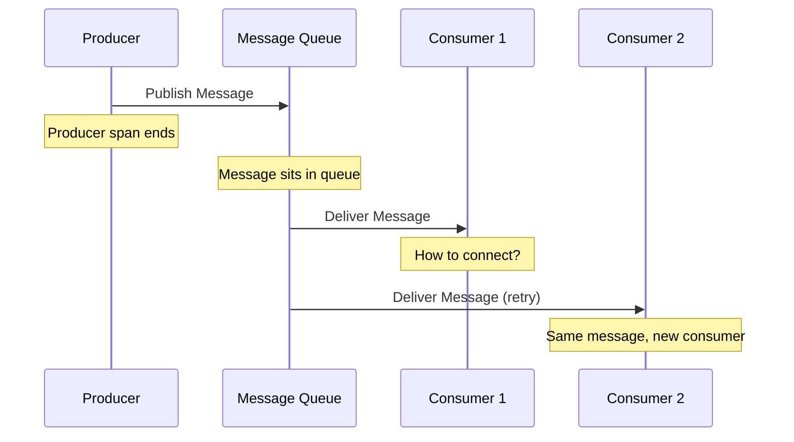
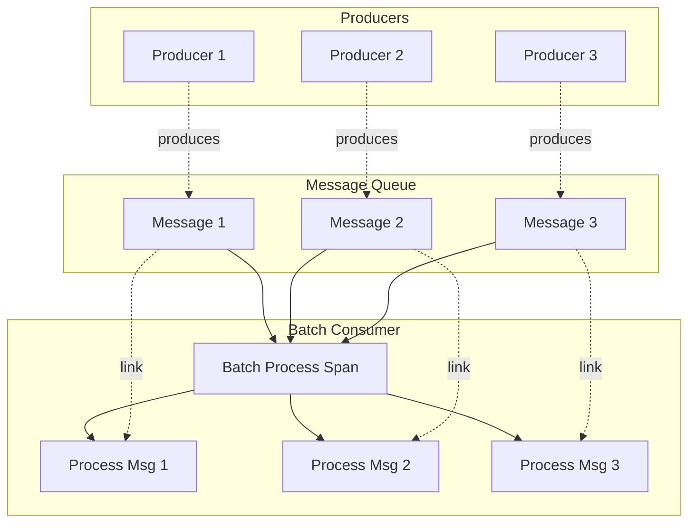
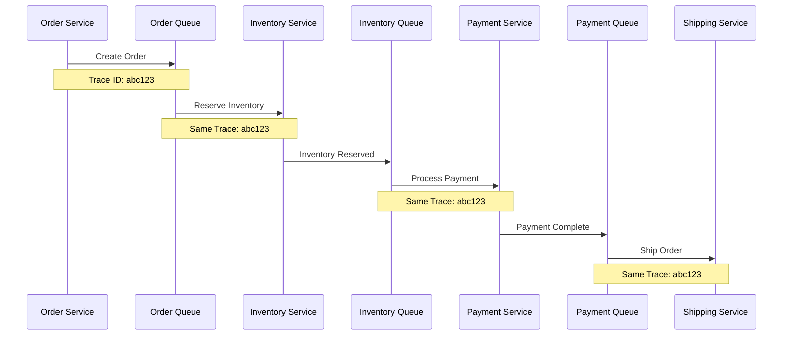

# How to Configure OpenTelemetry for Message Queue Tracing

Author: [nawazdhandala](https://www.github.com/nawazdhandala)

Tags: OpenTelemetry, Message Queues, Distributed Tracing, Kafka, RabbitMQ, SQS, Observability

Description: A practical guide to configuring OpenTelemetry for tracing messages through Kafka, RabbitMQ, SQS, and other message queues.

---

Message queues introduce complexity into distributed tracing because messages decouple producers from consumers temporally and spatially. This guide covers how to properly configure OpenTelemetry to maintain trace continuity across message queue boundaries.

## Understanding Message Queue Tracing Challenges

Traditional tracing assumes synchronous request-response patterns. Message queues break this model.



## Core Concepts for Message Queue Tracing

### Context Propagation via Message Headers

The key to message queue tracing is propagating trace context through message headers.

```python
from opentelemetry import trace
from opentelemetry.propagate import inject, extract
from opentelemetry.trace import SpanKind

tracer = trace.get_tracer(__name__)

def publish_message(queue, message_body):
    """Publish a message with trace context."""
    # Create a PRODUCER span
    with tracer.start_as_current_span(
        f"{queue} publish",
        kind=SpanKind.PRODUCER,
        attributes={
            "messaging.system": "kafka",
            "messaging.destination": queue,
            "messaging.operation": "publish"
        }
    ) as span:
        # Create headers dict for context propagation
        headers = {}

        # Inject trace context into headers
        inject(headers)

        # Publish message with headers
        queue_client.publish(
            queue=queue,
            body=message_body,
            headers=headers
        )

        span.set_attribute("messaging.message_id", message_body.get("id"))

def consume_message(queue, message):
    """Consume a message and continue the trace."""
    # Extract context from message headers
    ctx = extract(message.headers)

    # Create a CONSUMER span linked to the producer
    with tracer.start_as_current_span(
        f"{queue} process",
        context=ctx,
        kind=SpanKind.CONSUMER,
        attributes={
            "messaging.system": "kafka",
            "messaging.destination": queue,
            "messaging.operation": "process"
        }
    ) as span:
        span.set_attribute("messaging.message_id", message.body.get("id"))

        # Process the message
        process_message(message)
```

## Kafka Tracing Configuration

### Producer Configuration

```python
from opentelemetry import trace
from opentelemetry.propagate import inject
from opentelemetry.trace import SpanKind
from confluent_kafka import Producer

tracer = trace.get_tracer(__name__)

class TracedKafkaProducer:
    """Kafka producer with OpenTelemetry tracing."""

    def __init__(self, config):
        self.producer = Producer(config)

    def produce(self, topic, value, key=None):
        """Produce a message with trace context."""
        with tracer.start_as_current_span(
            f"{topic} send",
            kind=SpanKind.PRODUCER,
            attributes={
                "messaging.system": "kafka",
                "messaging.destination": topic,
                "messaging.destination_kind": "topic",
                "messaging.operation": "send"
            }
        ) as span:
            # Prepare headers for context propagation
            headers = []
            carrier = {}
            inject(carrier)

            # Convert to Kafka header format
            for k, v in carrier.items():
                headers.append((k, v.encode("utf-8")))

            # Add message key to span if present
            if key:
                span.set_attribute("messaging.kafka.message_key", key)

            # Delivery callback to record partition and offset
            def delivery_callback(err, msg):
                if err:
                    span.set_status(trace.Status(trace.StatusCode.ERROR, str(err)))
                else:
                    span.set_attribute("messaging.kafka.partition", msg.partition())
                    span.set_attribute("messaging.kafka.offset", msg.offset())

            self.producer.produce(
                topic=topic,
                value=value,
                key=key,
                headers=headers,
                callback=delivery_callback
            )

            # Wait for delivery
            self.producer.flush()

# Usage
producer = TracedKafkaProducer({
    "bootstrap.servers": "localhost:9092"
})

producer.produce("orders", b'{"order_id": "123"}', key="order-123")
```

### Consumer Configuration

```python
from opentelemetry import trace
from opentelemetry.propagate import extract
from opentelemetry.trace import SpanKind, Link
from confluent_kafka import Consumer

tracer = trace.get_tracer(__name__)

class TracedKafkaConsumer:
    """Kafka consumer with OpenTelemetry tracing."""

    def __init__(self, config):
        self.consumer = Consumer(config)

    def consume_messages(self, topics, handler):
        """Consume messages with tracing."""
        self.consumer.subscribe(topics)

        while True:
            msg = self.consumer.poll(timeout=1.0)

            if msg is None:
                continue

            if msg.error():
                print(f"Consumer error: {msg.error()}")
                continue

            # Extract trace context from message headers
            headers_dict = {}
            if msg.headers():
                for key, value in msg.headers():
                    if value:
                        headers_dict[key] = value.decode("utf-8")

            ctx = extract(headers_dict)

            # Create consumer span
            with tracer.start_as_current_span(
                f"{msg.topic()} process",
                context=ctx,
                kind=SpanKind.CONSUMER,
                attributes={
                    "messaging.system": "kafka",
                    "messaging.destination": msg.topic(),
                    "messaging.destination_kind": "topic",
                    "messaging.operation": "process",
                    "messaging.kafka.partition": msg.partition(),
                    "messaging.kafka.offset": msg.offset(),
                    "messaging.kafka.consumer_group": self.consumer._group_id
                }
            ) as span:
                try:
                    # Process the message
                    handler(msg)
                    span.set_status(trace.Status(trace.StatusCode.OK))
                except Exception as e:
                    span.set_status(trace.Status(trace.StatusCode.ERROR, str(e)))
                    span.record_exception(e)
                    raise

# Usage
consumer = TracedKafkaConsumer({
    "bootstrap.servers": "localhost:9092",
    "group.id": "order-processor",
    "auto.offset.reset": "earliest"
})

def process_order(msg):
    print(f"Processing order: {msg.value()}")

consumer.consume_messages(["orders"], process_order)
```

## RabbitMQ Tracing Configuration

### Publisher Configuration

```python
from opentelemetry import trace
from opentelemetry.propagate import inject
from opentelemetry.trace import SpanKind
import pika

tracer = trace.get_tracer(__name__)

class TracedRabbitMQPublisher:
    """RabbitMQ publisher with OpenTelemetry tracing."""

    def __init__(self, connection_params):
        self.connection = pika.BlockingConnection(connection_params)
        self.channel = self.connection.channel()

    def publish(self, exchange, routing_key, body):
        """Publish a message with trace context."""
        with tracer.start_as_current_span(
            f"{exchange or 'default'} publish",
            kind=SpanKind.PRODUCER,
            attributes={
                "messaging.system": "rabbitmq",
                "messaging.destination": exchange or "default",
                "messaging.rabbitmq.routing_key": routing_key,
                "messaging.operation": "publish"
            }
        ) as span:
            # Inject trace context into headers
            headers = {}
            inject(headers)

            # Create AMQP properties with headers
            properties = pika.BasicProperties(
                headers=headers,
                delivery_mode=2  # Persistent
            )

            self.channel.basic_publish(
                exchange=exchange,
                routing_key=routing_key,
                body=body,
                properties=properties
            )

            span.set_attribute("messaging.message_payload_size_bytes", len(body))

# Usage
publisher = TracedRabbitMQPublisher(
    pika.ConnectionParameters(host="localhost")
)

publisher.publish("", "task_queue", b'{"task": "process_order"}')
```

### Consumer Configuration

```python
from opentelemetry import trace
from opentelemetry.propagate import extract
from opentelemetry.trace import SpanKind
import pika

tracer = trace.get_tracer(__name__)

class TracedRabbitMQConsumer:
    """RabbitMQ consumer with OpenTelemetry tracing."""

    def __init__(self, connection_params):
        self.connection = pika.BlockingConnection(connection_params)
        self.channel = self.connection.channel()

    def consume(self, queue, handler):
        """Consume messages with tracing."""

        def traced_callback(ch, method, properties, body):
            # Extract trace context from message headers
            headers = properties.headers or {}
            ctx = extract(headers)

            with tracer.start_as_current_span(
                f"{queue} process",
                context=ctx,
                kind=SpanKind.CONSUMER,
                attributes={
                    "messaging.system": "rabbitmq",
                    "messaging.destination": queue,
                    "messaging.operation": "process",
                    "messaging.rabbitmq.routing_key": method.routing_key,
                    "messaging.message_payload_size_bytes": len(body)
                }
            ) as span:
                try:
                    handler(body)
                    ch.basic_ack(delivery_tag=method.delivery_tag)
                    span.set_status(trace.Status(trace.StatusCode.OK))
                except Exception as e:
                    span.set_status(trace.Status(trace.StatusCode.ERROR, str(e)))
                    span.record_exception(e)
                    ch.basic_nack(delivery_tag=method.delivery_tag, requeue=True)

        self.channel.basic_qos(prefetch_count=1)
        self.channel.basic_consume(queue=queue, on_message_callback=traced_callback)
        self.channel.start_consuming()

# Usage
consumer = TracedRabbitMQConsumer(
    pika.ConnectionParameters(host="localhost")
)

def process_task(body):
    print(f"Processing: {body}")

consumer.consume("task_queue", process_task)
```

## AWS SQS Tracing Configuration

### Publisher Configuration

```python
from opentelemetry import trace
from opentelemetry.propagate import inject
from opentelemetry.trace import SpanKind
import boto3
import json

tracer = trace.get_tracer(__name__)

class TracedSQSPublisher:
    """AWS SQS publisher with OpenTelemetry tracing."""

    def __init__(self, region_name="us-east-1"):
        self.sqs = boto3.client("sqs", region_name=region_name)

    def send_message(self, queue_url, message_body):
        """Send a message to SQS with trace context."""
        queue_name = queue_url.split("/")[-1]

        with tracer.start_as_current_span(
            f"{queue_name} send",
            kind=SpanKind.PRODUCER,
            attributes={
                "messaging.system": "aws_sqs",
                "messaging.destination": queue_name,
                "messaging.url": queue_url,
                "messaging.operation": "send"
            }
        ) as span:
            # Inject trace context into message attributes
            carrier = {}
            inject(carrier)

            # Convert to SQS message attributes format
            message_attributes = {}
            for key, value in carrier.items():
                message_attributes[key] = {
                    "DataType": "String",
                    "StringValue": value
                }

            response = self.sqs.send_message(
                QueueUrl=queue_url,
                MessageBody=json.dumps(message_body),
                MessageAttributes=message_attributes
            )

            span.set_attribute("messaging.message_id", response["MessageId"])

            return response

# Usage
publisher = TracedSQSPublisher()
publisher.send_message(
    "https://sqs.us-east-1.amazonaws.com/123456789/my-queue",
    {"order_id": "123", "action": "process"}
)
```

### Consumer Configuration

```python
from opentelemetry import trace
from opentelemetry.propagate import extract
from opentelemetry.trace import SpanKind
import boto3
import json

tracer = trace.get_tracer(__name__)

class TracedSQSConsumer:
    """AWS SQS consumer with OpenTelemetry tracing."""

    def __init__(self, region_name="us-east-1"):
        self.sqs = boto3.client("sqs", region_name=region_name)

    def poll_messages(self, queue_url, handler, max_messages=10):
        """Poll and process messages with tracing."""
        queue_name = queue_url.split("/")[-1]

        while True:
            # Receive messages
            response = self.sqs.receive_message(
                QueueUrl=queue_url,
                MaxNumberOfMessages=max_messages,
                MessageAttributeNames=["All"],
                WaitTimeSeconds=20  # Long polling
            )

            messages = response.get("Messages", [])

            for message in messages:
                self._process_message(queue_url, queue_name, message, handler)

    def _process_message(self, queue_url, queue_name, message, handler):
        """Process a single message with tracing."""
        # Extract trace context from message attributes
        carrier = {}
        for key, attr in message.get("MessageAttributes", {}).items():
            if attr["DataType"] == "String":
                carrier[key] = attr["StringValue"]

        ctx = extract(carrier)

        with tracer.start_as_current_span(
            f"{queue_name} process",
            context=ctx,
            kind=SpanKind.CONSUMER,
            attributes={
                "messaging.system": "aws_sqs",
                "messaging.destination": queue_name,
                "messaging.operation": "process",
                "messaging.message_id": message["MessageId"]
            }
        ) as span:
            try:
                body = json.loads(message["Body"])
                handler(body)

                # Delete message on success
                self.sqs.delete_message(
                    QueueUrl=queue_url,
                    ReceiptHandle=message["ReceiptHandle"]
                )
                span.set_status(trace.Status(trace.StatusCode.OK))

            except Exception as e:
                span.set_status(trace.Status(trace.StatusCode.ERROR, str(e)))
                span.record_exception(e)
                raise

# Usage
consumer = TracedSQSConsumer()

def process_order(body):
    print(f"Processing order: {body}")

consumer.poll_messages(
    "https://sqs.us-east-1.amazonaws.com/123456789/my-queue",
    process_order
)
```

## Advanced Patterns

### Batch Message Processing

When processing messages in batches, create a parent span for the batch with links to individual messages.



```python
from opentelemetry import trace
from opentelemetry.propagate import extract
from opentelemetry.trace import SpanKind, Link

tracer = trace.get_tracer(__name__)

def process_batch(messages):
    """Process a batch of messages with proper tracing."""
    # Create links to all producer spans
    links = []
    contexts = []

    for message in messages:
        ctx = extract(message.headers)
        contexts.append(ctx)

        # Get the span context from the extracted context
        span_ctx = trace.get_current_span(ctx).get_span_context()
        if span_ctx.is_valid:
            links.append(Link(
                context=span_ctx,
                attributes={"message.id": message.id}
            ))

    # Create batch processing span with links to all producers
    with tracer.start_as_current_span(
        "process_batch",
        kind=SpanKind.CONSUMER,
        links=links,
        attributes={
            "messaging.batch_size": len(messages),
            "messaging.operation": "process_batch"
        }
    ) as batch_span:
        results = []

        for i, message in enumerate(messages):
            # Create child span for each message
            with tracer.start_as_current_span(
                f"process_message_{i}",
                context=contexts[i],
                attributes={
                    "messaging.message_id": message.id
                }
            ) as msg_span:
                try:
                    result = process_single_message(message)
                    results.append(result)
                except Exception as e:
                    msg_span.record_exception(e)
                    raise

        return results
```

### Dead Letter Queue Tracing

Track messages that fail processing and go to dead letter queues.

```python
from opentelemetry import trace
from opentelemetry.propagate import inject, extract
from opentelemetry.trace import SpanKind

tracer = trace.get_tracer(__name__)

def send_to_dlq(original_message, error, dlq_url):
    """Send a failed message to DLQ with tracing context."""
    # Extract original context
    original_ctx = extract(original_message.headers)

    with tracer.start_as_current_span(
        "send_to_dlq",
        context=original_ctx,
        kind=SpanKind.PRODUCER,
        attributes={
            "messaging.system": "aws_sqs",
            "messaging.destination": "dead-letter-queue",
            "messaging.operation": "send",
            "error.type": type(error).__name__,
            "error.message": str(error),
            "original.message_id": original_message.id
        }
    ) as span:
        # Prepare DLQ message with error context
        dlq_headers = {}
        inject(dlq_headers)

        # Add error metadata
        dlq_headers["x-original-message-id"] = original_message.id
        dlq_headers["x-error-type"] = type(error).__name__
        dlq_headers["x-error-message"] = str(error)
        dlq_headers["x-retry-count"] = str(original_message.retry_count)

        # Send to DLQ
        sqs_client.send_message(
            QueueUrl=dlq_url,
            MessageBody=original_message.body,
            MessageAttributes=format_as_sqs_attributes(dlq_headers)
        )
```

### Saga Pattern Tracing

For distributed transactions using the saga pattern, maintain trace continuity across all steps.



```python
from opentelemetry import trace
from opentelemetry.propagate import inject, extract
from opentelemetry.trace import SpanKind

tracer = trace.get_tracer(__name__)

class SagaOrchestrator:
    """Orchestrator for saga transactions with tracing."""

    def __init__(self, queue_client):
        self.queue_client = queue_client

    def start_saga(self, saga_id, initial_data):
        """Start a new saga with tracing."""
        with tracer.start_as_current_span(
            "saga_start",
            kind=SpanKind.INTERNAL,
            attributes={
                "saga.id": saga_id,
                "saga.step": "start"
            }
        ) as span:
            # Send first step
            self._send_saga_step(saga_id, "reserve_inventory", initial_data)

    def _send_saga_step(self, saga_id, step_name, data):
        """Send a saga step message."""
        with tracer.start_as_current_span(
            f"saga_step_{step_name}",
            kind=SpanKind.PRODUCER,
            attributes={
                "saga.id": saga_id,
                "saga.step": step_name
            }
        ) as span:
            headers = {
                "saga-id": saga_id,
                "saga-step": step_name
            }
            inject(headers)

            self.queue_client.send(
                queue=f"{step_name}_queue",
                body=data,
                headers=headers
            )

    def handle_step_complete(self, message, next_step, data):
        """Handle completion of a saga step and trigger next."""
        ctx = extract(message.headers)
        saga_id = message.headers.get("saga-id")
        current_step = message.headers.get("saga-step")

        with tracer.start_as_current_span(
            f"saga_step_{current_step}_complete",
            context=ctx,
            kind=SpanKind.CONSUMER,
            attributes={
                "saga.id": saga_id,
                "saga.step": current_step
            }
        ) as span:
            if next_step:
                self._send_saga_step(saga_id, next_step, data)
            else:
                span.set_attribute("saga.status", "completed")
```

## Collector Configuration for Message Queue Telemetry

Configure the collector to handle message queue specific telemetry.

```yaml
# otel-collector-mq-config.yaml
receivers:
  otlp:
    protocols:
      grpc:
        endpoint: 0.0.0.0:4317

processors:
  batch:
    send_batch_size: 1000
    timeout: 10s

  # Add messaging-specific attributes
  attributes/messaging:
    actions:
      - key: messaging.client_id
        from_attribute: resource.service.instance.id
        action: upsert

  # Filter out health check messages
  filter/messaging:
    traces:
      span:
        - 'attributes["messaging.destination"] == "health-check"'

exporters:
  otlp:
    endpoint: "backend:4317"

service:
  pipelines:
    traces:
      receivers: [otlp]
      processors: [attributes/messaging, filter/messaging, batch]
      exporters: [otlp]
```

## Best Practices

1. **Always propagate context through message headers** to maintain trace continuity.

2. **Use semantic conventions** for messaging attributes (messaging.system, messaging.destination, etc.).

3. **Create PRODUCER spans** when publishing and CONSUMER spans when processing.

4. **Use span links** for batch processing to connect multiple producer spans to a single consumer span.

5. **Track retries and DLQ** messages to understand failure patterns.

6. **Add message-specific attributes** like message ID, partition, and offset for debugging.

7. **Handle async acknowledgment** by extending span duration or using events.

## Conclusion

Tracing messages through queues requires careful context propagation through message headers. By following the patterns in this guide for Kafka, RabbitMQ, SQS, and other message systems, you can maintain end-to-end visibility across your distributed system. Remember to use appropriate span kinds, leverage span links for batch processing, and track messages through retries and dead letter queues.
