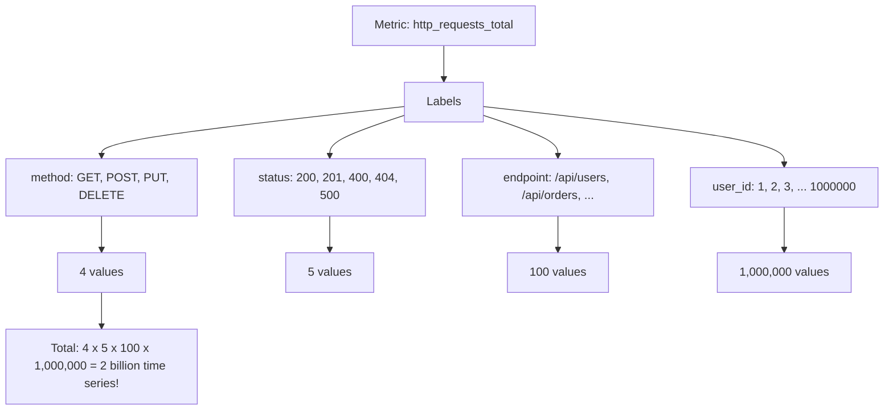
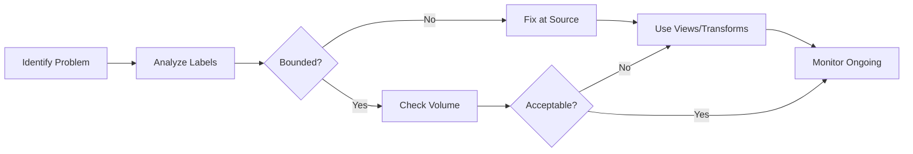

# How to Fix "Metric Cardinality Too High" Issues

Author: [nawazdhandala](https://www.github.com/nawazdhandala)

Tags: OpenTelemetry, Metrics, Observability, Performance, Cardinality

Description: Learn how to diagnose and fix high metric cardinality issues in OpenTelemetry that cause memory bloat, slow queries, and increased costs.

---

High metric cardinality is one of the most common and costly problems in observability systems. When your metrics have too many unique label combinations, it can lead to memory exhaustion, slow queries, and skyrocketing storage costs. This guide will help you identify, diagnose, and fix metric cardinality issues in your OpenTelemetry instrumentation.

## Understanding Metric Cardinality

Metric cardinality refers to the number of unique time series created by a metric. Each unique combination of metric name and label values creates a new time series.



## Symptoms of High Cardinality

Before diving into fixes, recognize these warning signs:

1. **Memory pressure** - Collector or backend running out of memory
2. **Slow queries** - Dashboard and alert queries timing out
3. **High costs** - Unexpected bills from your observability vendor
4. **Missing data** - Metrics being dropped due to limits

## Identifying High Cardinality Metrics

### Using OpenTelemetry Collector Metrics

First, enable the collector's internal metrics to monitor cardinality:

```yaml
# otel-collector-config.yaml
# Enable internal telemetry to monitor the collector itself
service:
  telemetry:
    metrics:
      # Expose collector metrics on port 8888
      address: 0.0.0.0:8888
      level: detailed
```

### Query for High Cardinality

If you are using Prometheus as a backend, use these queries to find problematic metrics:

```promql
# Find metrics with the highest number of time series
# This query counts unique series per metric name
topk(10, count by (__name__)({__name__=~".+"}))

# Find label combinations causing cardinality explosion
# Groups by metric and shows which labels have many values
count by (__name__, job) ({__name__=~".+"}) > 1000
```

## Common Causes and Fixes

### Problem 1: High-Cardinality Labels

The most common issue is using unbounded values as labels.

**Bad Practice - Using User IDs as Labels:**

```python
# BAD: This creates a new time series for every user
# If you have 1 million users, you get 1 million time series
from opentelemetry import metrics

meter = metrics.get_meter("my-service")
request_counter = meter.create_counter("http_requests")

def handle_request(user_id, endpoint):
    # DON'T DO THIS - user_id is unbounded
    request_counter.add(1, {
        "user_id": user_id,  # Creates millions of time series
        "endpoint": endpoint
    })
```

**Good Practice - Use Bounded Labels:**

```python
# GOOD: Use bounded labels and move high-cardinality data to logs/traces
from opentelemetry import metrics, trace

meter = metrics.get_meter("my-service")
tracer = trace.get_tracer("my-service")
request_counter = meter.create_counter("http_requests")

def handle_request(user_id, endpoint, user_tier):
    # Use bounded labels for metrics
    request_counter.add(1, {
        "user_tier": user_tier,  # Limited values: free, pro, enterprise
        "endpoint": endpoint
    })

    # Put high-cardinality data in traces instead
    with tracer.start_as_current_span("handle_request") as span:
        span.set_attribute("user_id", user_id)  # Traces handle this well
```

### Problem 2: Dynamic Endpoint Paths

REST APIs with path parameters create cardinality explosions.

**Bad Practice:**

```javascript
// BAD: Each unique URL creates a new time series
// /api/users/1, /api/users/2, ... creates unlimited series
const { metrics } = require('@opentelemetry/api');

const meter = metrics.getMeter('api-service');
const requestDuration = meter.createHistogram('http_request_duration');

app.use((req, res, next) => {
    const start = Date.now();
    res.on('finish', () => {
        requestDuration.record(Date.now() - start, {
            path: req.url,  // DON'T DO THIS - includes path parameters
            method: req.method
        });
    });
    next();
});
```

**Good Practice - Normalize Paths:**

```javascript
// GOOD: Normalize paths to remove dynamic segments
const { metrics } = require('@opentelemetry/api');

const meter = metrics.getMeter('api-service');
const requestDuration = meter.createHistogram('http_request_duration');

// Function to normalize URL paths by replacing IDs with placeholders
function normalizePath(url) {
    return url
        // Replace numeric IDs: /users/123 becomes /users/:id
        .replace(/\/\d+/g, '/:id')
        // Replace UUIDs: /orders/abc-123-def becomes /orders/:uuid
        .replace(/\/[a-f0-9-]{36}/gi, '/:uuid')
        // Replace other common patterns as needed
        .replace(/\/[a-f0-9]{24}/gi, '/:objectId');
}

app.use((req, res, next) => {
    const start = Date.now();
    res.on('finish', () => {
        requestDuration.record(Date.now() - start, {
            // Use normalized path instead of raw URL
            path: normalizePath(req.path),
            method: req.method,
            status_code: res.statusCode
        });
    });
    next();
});
```

### Problem 3: Error Messages as Labels

Never use error messages or stack traces as metric labels.

**Bad Practice:**

```go
// BAD: Error messages are unbounded and unique
// Each different error creates a new time series
errorCounter.Add(ctx, 1, attribute.String("error", err.Error()))
```

**Good Practice:**

```go
// GOOD: Use error categories with bounded values
package main

import (
    "context"
    "go.opentelemetry.io/otel/attribute"
    "go.opentelemetry.io/otel/metric"
)

// Define a bounded set of error categories
func categorizeError(err error) string {
    switch {
    case isTimeoutError(err):
        return "timeout"
    case isConnectionError(err):
        return "connection_failed"
    case isAuthError(err):
        return "authentication"
    case isValidationError(err):
        return "validation"
    default:
        return "unknown"
    }
}

func recordError(ctx context.Context, errorCounter metric.Int64Counter, err error) {
    // Use bounded error category for metrics
    errorCounter.Add(ctx, 1, attribute.String("error_type", categorizeError(err)))

    // Log the full error details separately
    // Logs can handle unbounded data
    log.Printf("Error details: %v", err)
}
```

## Using Views to Control Cardinality

OpenTelemetry Views let you modify metrics at the SDK level to drop or aggregate problematic labels.

### Dropping High-Cardinality Attributes

```python
# Use Views to remove high-cardinality attributes before export
from opentelemetry import metrics
from opentelemetry.sdk.metrics import MeterProvider
from opentelemetry.sdk.metrics.view import View, ExplicitBucketHistogramAggregation

# Create a view that drops the 'request_id' attribute from all metrics
# This prevents cardinality explosion from unique request IDs
drop_request_id_view = View(
    instrument_name="*",  # Apply to all instruments
    attribute_keys=[],    # Empty list means drop all attributes
    # Or specify which to KEEP:
    # attribute_keys=["method", "status", "endpoint"]
)

# Create a view specifically for http_requests metric
# Only keep bounded attributes, drop everything else
http_requests_view = View(
    instrument_name="http_requests",
    attribute_keys=["method", "status_code", "endpoint_pattern"],
)

# Configure the meter provider with these views
provider = MeterProvider(
    views=[drop_request_id_view, http_requests_view]
)
metrics.set_meter_provider(provider)
```

### Aggregating Labels

```python
# Aggregate high-cardinality labels into buckets
from opentelemetry.sdk.metrics.view import View

# Create a view that buckets response times
# This reduces cardinality while preserving useful information
latency_view = View(
    instrument_name="http_request_duration",
    # Define custom histogram buckets for latency
    aggregation=ExplicitBucketHistogramAggregation(
        boundaries=[0.005, 0.01, 0.025, 0.05, 0.1, 0.25, 0.5, 1.0, 2.5, 5.0, 10.0]
    ),
    # Only keep these bounded attributes
    attribute_keys=["method", "route", "status_class"]  # status_class: 2xx, 4xx, 5xx
)
```

## Collector-Level Cardinality Control

Use the OpenTelemetry Collector to filter and transform metrics before they reach your backend.

### Filter Processor

```yaml
# otel-collector-config.yaml
processors:
  # Filter processor to drop high-cardinality metrics entirely
  filter/drop-high-cardinality:
    metrics:
      # Exclude metrics that match these patterns
      exclude:
        match_type: regexp
        metric_names:
          # Drop metrics known to have cardinality issues
          - ".*_by_user_id"
          - ".*_by_request_id"
          - "debug_.*"

  # Filter based on attribute values
  filter/drop-debug:
    metrics:
      exclude:
        match_type: strict
        resource_attributes:
          - key: environment
            value: debug
```

### Transform Processor

```yaml
# otel-collector-config.yaml
processors:
  # Transform processor to modify attributes
  transform/normalize:
    metric_statements:
      - context: datapoint
        statements:
          # Remove high-cardinality attributes from all metrics
          - delete_key(attributes, "request_id")
          - delete_key(attributes, "trace_id")
          - delete_key(attributes, "user_id")

          # Normalize endpoint paths
          # Replace /users/123 with /users/:id
          - replace_pattern(attributes["http.route"], "/[0-9]+", "/:id")

          # Bucket status codes into classes (2xx, 4xx, 5xx)
          - set(attributes["status_class"], "2xx") where attributes["http.status_code"] >= 200 and attributes["http.status_code"] < 300
          - set(attributes["status_class"], "4xx") where attributes["http.status_code"] >= 400 and attributes["http.status_code"] < 500
          - set(attributes["status_class"], "5xx") where attributes["http.status_code"] >= 500
```

### Attributes Processor

```yaml
# otel-collector-config.yaml
processors:
  # Attributes processor for fine-grained control
  attributes/remove-high-cardinality:
    actions:
      # Delete specific high-cardinality attributes
      - key: user_id
        action: delete
      - key: session_id
        action: delete
      - key: request_id
        action: delete

      # Hash sensitive data instead of removing it
      # This preserves uniqueness for debugging while limiting cardinality
      - key: customer_id
        action: hash
```

## Complete Pipeline Configuration

Here is a complete collector configuration that implements cardinality controls:

```yaml
# otel-collector-config.yaml
receivers:
  otlp:
    protocols:
      grpc:
        endpoint: 0.0.0.0:4317
      http:
        endpoint: 0.0.0.0:4318

processors:
  # Memory limiter to prevent OOM from cardinality explosions
  memory_limiter:
    check_interval: 1s
    limit_mib: 1000
    spike_limit_mib: 200

  # Batch processor for efficient export
  batch:
    timeout: 10s
    send_batch_size: 1000

  # Remove high-cardinality attributes
  attributes/cardinality:
    actions:
      - key: request_id
        action: delete
      - key: user_id
        action: delete
      - key: trace_id
        action: delete

  # Transform to normalize paths
  transform/normalize:
    metric_statements:
      - context: datapoint
        statements:
          - replace_pattern(attributes["http.target"], "/[0-9]+", "/:id")
          - replace_pattern(attributes["url.path"], "/[0-9]+", "/:id")

  # Filter out known problematic metrics
  filter/cardinality:
    metrics:
      exclude:
        match_type: regexp
        metric_names:
          - ".*_by_id$"

exporters:
  otlp:
    endpoint: "your-backend:4317"
    tls:
      insecure: false

service:
  pipelines:
    metrics:
      receivers: [otlp]
      # Order matters - process in this sequence
      processors: [memory_limiter, attributes/cardinality, transform/normalize, filter/cardinality, batch]
      exporters: [otlp]
```

## Monitoring Cardinality Over Time

Set up alerts to catch cardinality issues before they become critical:

```yaml
# prometheus-alerts.yaml
groups:
  - name: cardinality-alerts
    rules:
      # Alert when total time series count is too high
      - alert: HighMetricCardinality
        expr: sum(scrape_series_added) > 1000000
        for: 5m
        labels:
          severity: warning
        annotations:
          summary: "High metric cardinality detected"
          description: "Total time series count exceeds 1 million"

      # Alert on rapid cardinality growth
      - alert: CardinalityGrowthRate
        expr: rate(scrape_series_added[1h]) > 1000
        for: 15m
        labels:
          severity: warning
        annotations:
          summary: "Rapid cardinality growth"
          description: "Time series growing at {{ $value }} per second"
```

## Summary

High metric cardinality is preventable with proper instrumentation practices:



Key takeaways:

1. **Design for bounded cardinality** - Never use unbounded values like user IDs, request IDs, or error messages as metric labels
2. **Normalize dynamic paths** - Convert `/users/123` to `/users/:id`
3. **Use Views** - Filter attributes at the SDK level
4. **Configure the Collector** - Transform and filter metrics before export
5. **Monitor continuously** - Set up alerts for cardinality growth

By following these practices, you will keep your observability costs under control while maintaining meaningful metrics for your applications.
