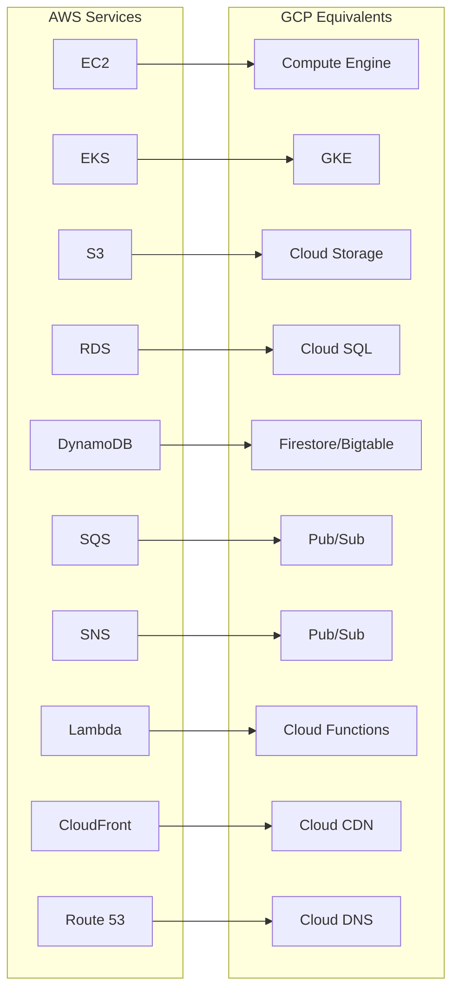
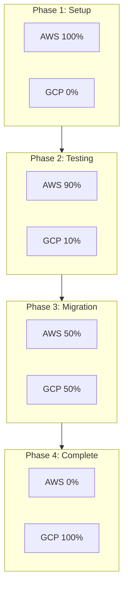

# How to Migrate from AWS to GCP

Author: [nawazdhandala](https://www.github.com/nawazdhandala)

Tags: GCP, Google Cloud, AWS, Migration, Cloud Migration, DevOps, Infrastructure, Multi-Cloud

Description: A comprehensive guide to migrating workloads from AWS to Google Cloud Platform, covering service mappings, data migration strategies, and best practices for a successful transition.

---

Migrating from AWS to GCP requires careful planning and execution. The services don't map one-to-one, networking models differ, and IAM works fundamentally differently. This guide provides a systematic approach to planning and executing your migration, from initial assessment through final cutover.

## AWS to GCP Service Mapping

Understanding service equivalents helps you plan your target architecture:



## Phase 1: Assessment and Planning

### Inventory Your AWS Resources

```bash
#!/bin/bash
# aws-inventory.sh - Catalog AWS resources

echo "=== EC2 Instances ==="
aws ec2 describe-instances \
    --query 'Reservations[].Instances[].[InstanceId,InstanceType,State.Name,Tags[?Key==`Name`].Value|[0]]' \
    --output table

echo -e "\n=== RDS Instances ==="
aws rds describe-db-instances \
    --query 'DBInstances[].[DBInstanceIdentifier,DBInstanceClass,Engine,EngineVersion]' \
    --output table

echo -e "\n=== S3 Buckets ==="
for bucket in $(aws s3api list-buckets --query 'Buckets[].Name' --output text); do
    size=$(aws s3 ls s3://$bucket --recursive --summarize | grep "Total Size" | awk '{print $3, $4}')
    echo "$bucket: $size"
done

echo -e "\n=== Lambda Functions ==="
aws lambda list-functions \
    --query 'Functions[].[FunctionName,Runtime,MemorySize]' \
    --output table

echo -e "\n=== EKS Clusters ==="
aws eks list-clusters --output table
```

### Map Instance Types

```python
# instance_mapping.py
AWS_TO_GCP_INSTANCE_MAP = {
    # General purpose
    't3.micro': 'e2-micro',
    't3.small': 'e2-small',
    't3.medium': 'e2-medium',
    't3.large': 'e2-standard-2',
    't3.xlarge': 'e2-standard-4',

    'm5.large': 'n2-standard-2',
    'm5.xlarge': 'n2-standard-4',
    'm5.2xlarge': 'n2-standard-8',
    'm5.4xlarge': 'n2-standard-16',

    # Compute optimized
    'c5.large': 'c2-standard-4',
    'c5.xlarge': 'c2-standard-8',
    'c5.2xlarge': 'c2-standard-16',

    # Memory optimized
    'r5.large': 'n2-highmem-2',
    'r5.xlarge': 'n2-highmem-4',
    'r5.2xlarge': 'n2-highmem-8',

    # GPU instances
    'p3.2xlarge': 'n1-standard-8 + nvidia-tesla-v100',
    'p3.8xlarge': 'n1-standard-32 + 4x nvidia-tesla-v100',
}

def get_gcp_instance(aws_type):
    """Get equivalent GCP instance type."""
    return AWS_TO_GCP_INSTANCE_MAP.get(aws_type, 'custom-mapping-required')
```

## Phase 2: Network Architecture

### Design GCP Network

```bash
# Create VPC network
gcloud compute networks create production-vpc \
    --subnet-mode=custom \
    --bgp-routing-mode=global

# Create subnets (mirror your AWS VPC structure)
gcloud compute networks subnets create us-central1-subnet \
    --network=production-vpc \
    --region=us-central1 \
    --range=10.0.1.0/24 \
    --secondary-range=pods=10.1.0.0/16,services=10.2.0.0/20

gcloud compute networks subnets create us-east1-subnet \
    --network=production-vpc \
    --region=us-east1 \
    --range=10.0.2.0/24

# Create firewall rules
gcloud compute firewall-rules create allow-internal \
    --network=production-vpc \
    --allow=tcp,udp,icmp \
    --source-ranges=10.0.0.0/8

gcloud compute firewall-rules create allow-ssh \
    --network=production-vpc \
    --allow=tcp:22 \
    --source-ranges=YOUR_ADMIN_IP/32 \
    --target-tags=allow-ssh

gcloud compute firewall-rules create allow-https \
    --network=production-vpc \
    --allow=tcp:443 \
    --source-ranges=0.0.0.0/0 \
    --target-tags=web-server
```

### Set Up Hybrid Connectivity

```bash
# Option 1: VPN for initial migration
gcloud compute vpn-gateways create aws-vpn-gateway \
    --network=production-vpc \
    --region=us-central1

gcloud compute vpn-tunnels create aws-tunnel-1 \
    --vpn-gateway=aws-vpn-gateway \
    --peer-gcp-gateway=projects/peer-project/regions/us-central1/vpnGateways/peer-gateway \
    --region=us-central1 \
    --ike-version=2 \
    --shared-secret=YOUR_SHARED_SECRET \
    --router=production-router \
    --vpn-gateway-interface=0

# Option 2: Dedicated Interconnect for production
gcloud compute interconnects attachments dedicated create aws-interconnect \
    --router=production-router \
    --region=us-central1 \
    --interconnect=your-interconnect \
    --candidate-subnets=169.254.0.0/29
```

## Phase 3: Data Migration

### Migrate S3 to Cloud Storage

```bash
# Install and configure gsutil
pip install gsutil

# Set up AWS credentials for gsutil
gsutil config -a  # Add AWS credentials

# Copy data from S3 to GCS
gsutil -m cp -r s3://source-bucket/* gs://destination-bucket/

# For large transfers, use Storage Transfer Service
gcloud transfer jobs create s3://source-bucket gs://destination-bucket \
    --source-creds-file=aws-creds.json \
    --name=s3-to-gcs-migration \
    --schedule-starts=$(date -u +%Y-%m-%dT%H:%M:%SZ) \
    --schedule-repeats-every=0  # One-time transfer
```

### Migrate RDS to Cloud SQL

```bash
# Export from RDS
aws rds create-db-snapshot \
    --db-instance-identifier source-database \
    --db-snapshot-identifier migration-snapshot

# Export snapshot to S3
aws rds start-export-task \
    --export-task-identifier export-migration \
    --source-arn arn:aws:rds:region:account:snapshot:migration-snapshot \
    --s3-bucket-name rds-exports \
    --iam-role-arn arn:aws:iam::account:role/rds-export-role \
    --kms-key-id your-kms-key

# Create Cloud SQL instance
gcloud sql instances create production-db \
    --database-version=POSTGRES_14 \
    --tier=db-custom-4-16384 \
    --region=us-central1 \
    --availability-type=REGIONAL \
    --storage-type=SSD \
    --storage-size=100GB

# Import to Cloud SQL
gcloud sql import sql production-db \
    gs://migration-bucket/export.sql \
    --database=myapp
```

### Use Database Migration Service

```bash
# Create migration job for continuous replication
gcloud database-migration migration-jobs create rds-to-cloudsql \
    --region=us-central1 \
    --type=CONTINUOUS \
    --source=rds-connection-profile \
    --destination=cloudsql-connection-profile \
    --display-name="RDS to Cloud SQL Migration"

# Start the migration
gcloud database-migration migration-jobs start rds-to-cloudsql \
    --region=us-central1

# Monitor progress
gcloud database-migration migration-jobs describe rds-to-cloudsql \
    --region=us-central1
```

## Phase 4: Application Migration

### Migrate EKS to GKE

```bash
# Create GKE cluster
gcloud container clusters create production-cluster \
    --zone=us-central1-a \
    --num-nodes=3 \
    --machine-type=e2-standard-4 \
    --enable-autoscaling \
    --min-nodes=3 \
    --max-nodes=10 \
    --workload-pool=my-project.svc.id.goog \
    --enable-ip-alias \
    --network=production-vpc \
    --subnetwork=us-central1-subnet

# Export Kubernetes manifests from EKS
kubectl get deployments,services,configmaps,secrets -o yaml > eks-resources.yaml

# Transform AWS-specific configurations
# 1. Replace AWS ALB Ingress with GKE Ingress
# 2. Update storage classes
# 3. Replace IAM roles with Workload Identity
# 4. Update container registry URLs
```

### Transform Kubernetes Manifests

```yaml
# Before (AWS EKS)
apiVersion: apps/v1
kind: Deployment
metadata:
  name: my-app
spec:
  template:
    spec:
      serviceAccountName: my-app
      containers:
        - name: app
          image: 123456789.dkr.ecr.us-east-1.amazonaws.com/my-app:latest
          env:
            - name: AWS_REGION
              value: us-east-1
---
# After (GCP GKE)
apiVersion: apps/v1
kind: Deployment
metadata:
  name: my-app
spec:
  template:
    spec:
      serviceAccountName: my-app-ksa  # Workload Identity enabled
      containers:
        - name: app
          image: gcr.io/my-project/my-app:latest
          env:
            - name: GOOGLE_CLOUD_PROJECT
              value: my-project
```

### Migrate Lambda to Cloud Functions

```python
# AWS Lambda function
import boto3
import json

def lambda_handler(event, context):
    s3 = boto3.client('s3')

    for record in event['Records']:
        bucket = record['s3']['bucket']['name']
        key = record['s3']['object']['key']

        # Process file
        response = s3.get_object(Bucket=bucket, Key=key)
        data = json.loads(response['Body'].read())

        # Your logic here
        process_data(data)

    return {'statusCode': 200}
```

```python
# Equivalent Google Cloud Function
from google.cloud import storage
import json

def gcs_trigger(event, context):
    """Triggered by Cloud Storage event."""
    storage_client = storage.Client()

    bucket_name = event['bucket']
    file_name = event['name']

    bucket = storage_client.bucket(bucket_name)
    blob = bucket.blob(file_name)

    # Process file
    data = json.loads(blob.download_as_text())

    # Your logic here
    process_data(data)
```

## Phase 5: Cutover Strategy

### Blue-Green Migration with Traffic Splitting



### DNS-Based Traffic Migration

```bash
# Use Cloud DNS with weighted routing
gcloud dns record-sets create api.example.com \
    --zone=my-zone \
    --type=A \
    --ttl=60 \
    --routing-policy-type=WRR \
    --routing-policy-data="AWS_IP=0.9;GCP_IP=0.1"

# Gradually shift traffic
gcloud dns record-sets update api.example.com \
    --zone=my-zone \
    --type=A \
    --routing-policy-data="AWS_IP=0.5;GCP_IP=0.5"

# Complete migration
gcloud dns record-sets update api.example.com \
    --zone=my-zone \
    --type=A \
    --routing-policy-data="GCP_IP=1.0"
```

## Post-Migration Checklist

### Verify Migration Success

```bash
#!/bin/bash
# post-migration-check.sh

echo "=== Compute Resources ==="
gcloud compute instances list --format="table(name,zone,status)"

echo -e "\n=== GKE Clusters ==="
gcloud container clusters list

echo -e "\n=== Cloud SQL ==="
gcloud sql instances list

echo -e "\n=== Storage Buckets ==="
gsutil ls -L | grep -E "(gs://|Total size)"

echo -e "\n=== Running Health Checks ==="
# Add your application health check endpoints
curl -s https://api.example.com/health | jq .

echo -e "\n=== Monitoring Dashboards ==="
gcloud monitoring dashboards list
```

### Update Monitoring and Alerting

```bash
# Create uptime checks
gcloud monitoring uptime-check-configs create api-health-check \
    --display-name="API Health Check" \
    --resource-type=uptime-url \
    --hostname=api.example.com \
    --path=/health \
    --check-interval=60s

# Set up alert policies
gcloud monitoring policies create \
    --notification-channels=CHANNEL_ID \
    --policy-from-file=alert-policy.yaml
```

---

Migrating from AWS to GCP is a significant undertaking that requires careful planning and execution in phases. Start with a thorough assessment, establish hybrid connectivity, migrate data first, then applications. Use traffic splitting for gradual cutover to minimize risk. The key to success is taking it one service at a time and validating thoroughly at each step before proceeding to the next.
