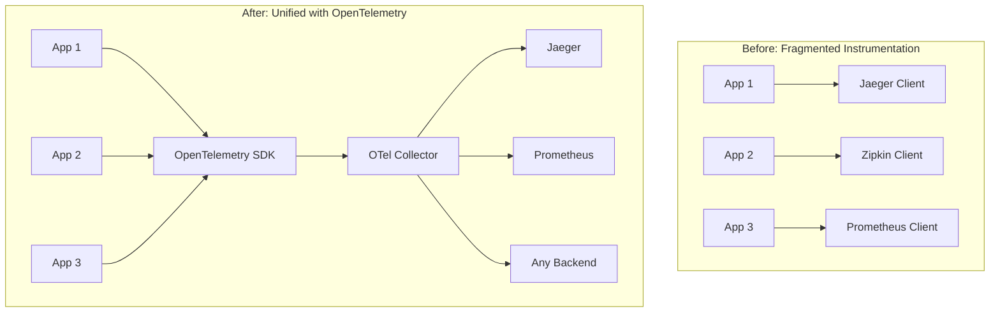
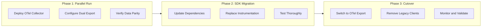
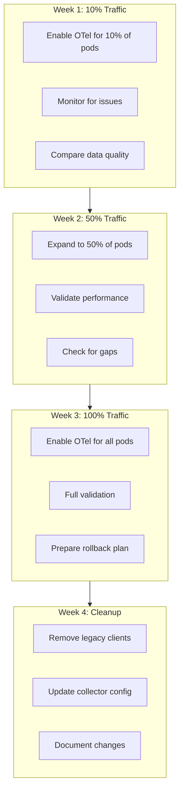

# How to Migrate from Jaeger/Zipkin to OpenTelemetry

Author: [nawazdhandala](https://www.github.com/nawazdhandala)

Tags: OpenTelemetry, Jaeger, Zipkin, Migration, Distributed Tracing, Observability, OTLP

Description: A comprehensive guide to migrating your distributed tracing infrastructure from Jaeger or Zipkin to OpenTelemetry.

---

Migrating from Jaeger or Zipkin to OpenTelemetry is a common modernization path for organizations looking to standardize on vendor-neutral observability. OpenTelemetry provides a unified approach to collecting traces, metrics, and logs while maintaining backward compatibility with existing backends. This guide provides a step-by-step migration strategy that minimizes risk and downtime.

## Why Migrate to OpenTelemetry?



Benefits of migrating to OpenTelemetry:

- Vendor-neutral instrumentation
- Single SDK for traces, metrics, and logs
- Broader ecosystem support
- Active development and community
- Standardized semantic conventions

## Migration Strategy Overview



## Phase 1: Deploy OpenTelemetry Collector

The first step is deploying the OpenTelemetry Collector to receive data from both legacy and new instrumentation.

### Collector Configuration for Migration

```yaml
# otel-collector-config.yaml
# Collector configured to receive Jaeger, Zipkin, and OTLP formats

receivers:
  # OTLP receiver for OpenTelemetry native data
  otlp:
    protocols:
      grpc:
        endpoint: 0.0.0.0:4317
      http:
        endpoint: 0.0.0.0:4318

  # Jaeger receiver for existing Jaeger clients
  jaeger:
    protocols:
      # Thrift compact (default Jaeger agent port)
      thrift_compact:
        endpoint: 0.0.0.0:6831
      # Thrift binary
      thrift_binary:
        endpoint: 0.0.0.0:6832
      # Thrift HTTP
      thrift_http:
        endpoint: 0.0.0.0:14268
      # gRPC (Jaeger collector port)
      grpc:
        endpoint: 0.0.0.0:14250

  # Zipkin receiver for existing Zipkin clients
  zipkin:
    endpoint: 0.0.0.0:9411

processors:
  # Batch spans for efficient export
  batch:
    timeout: 10s
    send_batch_size: 1000

  # Add resource attributes for migration tracking
  resource:
    attributes:
      - key: migration.phase
        value: parallel
        action: upsert

  # Transform to add migration metadata
  transform:
    trace_statements:
      - context: span
        statements:
          # Track which receiver the span came from
          - set(attributes["telemetry.source"], "jaeger") where attributes["jaeger.version"] != nil
          - set(attributes["telemetry.source"], "zipkin") where attributes["zipkin.version"] != nil
          - set(attributes["telemetry.source"], "otlp") where attributes["telemetry.source"] == nil

exporters:
  # Export to existing Jaeger backend (for comparison)
  jaeger:
    endpoint: jaeger-collector:14250
    tls:
      insecure: true

  # Export to new OTLP backend
  otlp:
    endpoint: new-backend:4317
    tls:
      insecure: true

  # Debug exporter for verification
  logging:
    verbosity: detailed
    sampling_initial: 5
    sampling_thereafter: 200

service:
  pipelines:
    traces:
      receivers: [otlp, jaeger, zipkin]
      processors: [batch, resource, transform]
      exporters: [jaeger, otlp, logging]
```

### Deploy the Collector

```yaml
# kubernetes/otel-collector-deployment.yaml
apiVersion: apps/v1
kind: Deployment
metadata:
  name: otel-collector
  namespace: observability
spec:
  replicas: 2
  selector:
    matchLabels:
      app: otel-collector
  template:
    metadata:
      labels:
        app: otel-collector
    spec:
      containers:
        - name: collector
          image: otel/opentelemetry-collector-contrib:0.92.0
          args:
            - --config=/etc/otel-collector/config.yaml
          ports:
            # OTLP
            - containerPort: 4317
              name: otlp-grpc
            - containerPort: 4318
              name: otlp-http
            # Jaeger
            - containerPort: 6831
              name: jaeger-compact
              protocol: UDP
            - containerPort: 6832
              name: jaeger-binary
              protocol: UDP
            - containerPort: 14268
              name: jaeger-http
            - containerPort: 14250
              name: jaeger-grpc
            # Zipkin
            - containerPort: 9411
              name: zipkin
          volumeMounts:
            - name: config
              mountPath: /etc/otel-collector
      volumes:
        - name: config
          configMap:
            name: otel-collector-config
---
apiVersion: v1
kind: Service
metadata:
  name: otel-collector
  namespace: observability
spec:
  selector:
    app: otel-collector
  ports:
    # OTLP ports
    - name: otlp-grpc
      port: 4317
      targetPort: 4317
    - name: otlp-http
      port: 4318
      targetPort: 4318
    # Jaeger ports (so existing clients can connect)
    - name: jaeger-compact
      port: 6831
      targetPort: 6831
      protocol: UDP
    - name: jaeger-binary
      port: 6832
      targetPort: 6832
      protocol: UDP
    - name: jaeger-http
      port: 14268
      targetPort: 14268
    - name: jaeger-grpc
      port: 14250
      targetPort: 14250
    # Zipkin port
    - name: zipkin
      port: 9411
      targetPort: 9411
```

## Phase 2: Migrate SDK Instrumentation

### Migrating from Jaeger Client (Node.js)

**Before: Jaeger Client**

```javascript
// OLD: Jaeger client configuration
const { initTracer } = require('jaeger-client');

const config = {
  serviceName: 'my-service',
  sampler: {
    type: 'const',
    param: 1,
  },
  reporter: {
    logSpans: true,
    agentHost: 'jaeger-agent',
    agentPort: 6831,
  },
};

const options = {
  tags: {
    'my-service.version': '1.0.0',
  },
};

const tracer = initTracer(config, options);

// Create a span
const span = tracer.startSpan('operation-name');
span.setTag('http.method', 'GET');
span.log({ event: 'request-started' });
span.finish();
```

**After: OpenTelemetry SDK**

```javascript
// NEW: OpenTelemetry configuration
const { NodeTracerProvider } = require('@opentelemetry/sdk-trace-node');
const { BatchSpanProcessor } = require('@opentelemetry/sdk-trace-base');
const { OTLPTraceExporter } = require('@opentelemetry/exporter-trace-otlp-grpc');
const { Resource } = require('@opentelemetry/resources');
const {
  SemanticResourceAttributes,
} = require('@opentelemetry/semantic-conventions');
const { trace, SpanStatusCode } = require('@opentelemetry/api');
const { registerInstrumentations } = require('@opentelemetry/instrumentation');
const { HttpInstrumentation } = require('@opentelemetry/instrumentation-http');
const {
  ExpressInstrumentation,
} = require('@opentelemetry/instrumentation-express');

// Create resource with service information
const resource = new Resource({
  [SemanticResourceAttributes.SERVICE_NAME]: 'my-service',
  [SemanticResourceAttributes.SERVICE_VERSION]: '1.0.0',
  // Migration tracking attribute
  'migration.source': 'jaeger',
});

// Configure OTLP exporter
// During migration, point to the OTel Collector
const exporter = new OTLPTraceExporter({
  url: 'grpc://otel-collector:4317',
});

// Create and configure the tracer provider
const provider = new NodeTracerProvider({
  resource: resource,
});

// Add batch processor for efficient export
provider.addSpanProcessor(
  new BatchSpanProcessor(exporter, {
    maxExportBatchSize: 512,
    maxQueueSize: 2048,
    scheduledDelayMillis: 5000,
  })
);

// Register as global tracer provider
provider.register();

// Register automatic instrumentations
registerInstrumentations({
  instrumentations: [
    new HttpInstrumentation({
      // Ignore health check endpoints
      ignoreIncomingPaths: ['/health', '/ready'],
    }),
    new ExpressInstrumentation(),
  ],
});

// Get a tracer for manual instrumentation
const tracer = trace.getTracer('my-service');

// Create a span (OpenTelemetry style)
const span = tracer.startSpan('operation-name');
span.setAttribute('http.method', 'GET');
span.addEvent('request-started');
span.setStatus({ code: SpanStatusCode.OK });
span.end();
```

### Migrating from Zipkin Client (Python)

**Before: Zipkin Client**

```python
# OLD: Zipkin (py_zipkin) configuration
from py_zipkin import Encoding
from py_zipkin.zipkin import zipkin_span
from py_zipkin.transport import BaseTransportHandler
import requests

class HttpTransport(BaseTransportHandler):
    def get_max_payload_bytes(self):
        return None

    def send(self, encoded_span):
        requests.post(
            'http://zipkin:9411/api/v2/spans',
            data=encoded_span,
            headers={'Content-Type': 'application/json'},
        )

transport = HttpTransport()

# Create a span
with zipkin_span(
    service_name='my-service',
    span_name='operation-name',
    transport_handler=transport,
    encoding=Encoding.V2_JSON,
    sample_rate=1.0,
) as span:
    span.update_binary_annotations({'http.method': 'GET'})
    # Do work
    pass
```

**After: OpenTelemetry SDK**

```python
# NEW: OpenTelemetry configuration
from opentelemetry import trace
from opentelemetry.sdk.trace import TracerProvider
from opentelemetry.sdk.trace.export import BatchSpanProcessor
from opentelemetry.exporter.otlp.proto.grpc.trace_exporter import OTLPSpanExporter
from opentelemetry.sdk.resources import Resource, SERVICE_NAME, SERVICE_VERSION
from opentelemetry.trace import Status, StatusCode
from opentelemetry.instrumentation.requests import RequestsInstrumentor
from opentelemetry.instrumentation.flask import FlaskInstrumentor

# Create resource with service information
resource = Resource.create({
    SERVICE_NAME: "my-service",
    SERVICE_VERSION: "1.0.0",
    "migration.source": "zipkin",
})

# Create tracer provider
provider = TracerProvider(resource=resource)

# Configure OTLP exporter (point to OTel Collector during migration)
exporter = OTLPSpanExporter(
    endpoint="otel-collector:4317",
    insecure=True,
)

# Add batch processor
provider.add_span_processor(
    BatchSpanProcessor(
        exporter,
        max_export_batch_size=512,
        max_queue_size=2048,
        schedule_delay_millis=5000,
    )
)

# Set as global tracer provider
trace.set_tracer_provider(provider)

# Auto-instrument libraries
RequestsInstrumentor().instrument()
FlaskInstrumentor().instrument()

# Get a tracer for manual instrumentation
tracer = trace.get_tracer("my-service")

# Create a span (OpenTelemetry style)
with tracer.start_as_current_span("operation-name") as span:
    span.set_attribute("http.method", "GET")
    span.add_event("request-started")
    # Do work
    span.set_status(Status(StatusCode.OK))
```

### Migrating from Jaeger Client (Go)

**Before: Jaeger Client**

```go
// OLD: Jaeger client configuration
package main

import (
	"io"
	"log"

	"github.com/opentracing/opentracing-go"
	"github.com/uber/jaeger-client-go"
	"github.com/uber/jaeger-client-go/config"
)

func initJaeger(service string) (opentracing.Tracer, io.Closer) {
	cfg := config.Configuration{
		ServiceName: service,
		Sampler: &config.SamplerConfig{
			Type:  jaeger.SamplerTypeConst,
			Param: 1,
		},
		Reporter: &config.ReporterConfig{
			LogSpans:           true,
			LocalAgentHostPort: "jaeger-agent:6831",
		},
	}

	tracer, closer, err := cfg.NewTracer()
	if err != nil {
		log.Fatal(err)
	}

	opentracing.SetGlobalTracer(tracer)
	return tracer, closer
}

func main() {
	tracer, closer := initJaeger("my-service")
	defer closer.Close()

	// Create a span
	span := tracer.StartSpan("operation-name")
	span.SetTag("http.method", "GET")
	span.LogKV("event", "request-started")
	span.Finish()
}
```

**After: OpenTelemetry SDK**

```go
// NEW: OpenTelemetry configuration
package main

import (
	"context"
	"log"
	"time"

	"go.opentelemetry.io/otel"
	"go.opentelemetry.io/otel/attribute"
	"go.opentelemetry.io/otel/exporters/otlp/otlptrace/otlptracegrpc"
	"go.opentelemetry.io/otel/sdk/resource"
	sdktrace "go.opentelemetry.io/otel/sdk/trace"
	semconv "go.opentelemetry.io/otel/semconv/v1.21.0"
	"go.opentelemetry.io/otel/trace"
	"google.golang.org/grpc"
	"google.golang.org/grpc/credentials/insecure"
)

func initTracer(ctx context.Context) (*sdktrace.TracerProvider, error) {
	// Create OTLP exporter
	conn, err := grpc.DialContext(ctx, "otel-collector:4317",
		grpc.WithTransportCredentials(insecure.NewCredentials()),
		grpc.WithBlock(),
	)
	if err != nil {
		return nil, err
	}

	exporter, err := otlptracegrpc.New(ctx, otlptracegrpc.WithGRPCConn(conn))
	if err != nil {
		return nil, err
	}

	// Create resource
	res, err := resource.New(ctx,
		resource.WithAttributes(
			semconv.ServiceName("my-service"),
			semconv.ServiceVersion("1.0.0"),
			attribute.String("migration.source", "jaeger"),
		),
	)
	if err != nil {
		return nil, err
	}

	// Create tracer provider
	tp := sdktrace.NewTracerProvider(
		sdktrace.WithBatcher(exporter,
			sdktrace.WithMaxExportBatchSize(512),
			sdktrace.WithBatchTimeout(5*time.Second),
		),
		sdktrace.WithResource(res),
		sdktrace.WithSampler(sdktrace.AlwaysSample()),
	)

	// Set global tracer provider
	otel.SetTracerProvider(tp)

	return tp, nil
}

func main() {
	ctx := context.Background()

	tp, err := initTracer(ctx)
	if err != nil {
		log.Fatal(err)
	}
	defer func() {
		if err := tp.Shutdown(ctx); err != nil {
			log.Printf("Error shutting down tracer provider: %v", err)
		}
	}()

	// Get a tracer
	tracer := otel.Tracer("my-service")

	// Create a span
	ctx, span := tracer.Start(ctx, "operation-name")
	span.SetAttributes(attribute.String("http.method", "GET"))
	span.AddEvent("request-started")
	// Do work
	span.End()
}
```

## Phase 3: Validate and Cut Over

### Validation Script

Create a script to compare traces between old and new systems:

```python
# validate_migration.py
# Compare trace data between Jaeger and new backend

import requests
from datetime import datetime, timedelta
import json

JAEGER_QUERY_URL = "http://jaeger-query:16686"
NEW_BACKEND_URL = "http://new-backend:8080"
SERVICE_NAME = "my-service"

def get_jaeger_traces(service, lookback_hours=1):
    """Fetch traces from Jaeger"""
    end_time = int(datetime.now().timestamp() * 1000000)
    start_time = int((datetime.now() - timedelta(hours=lookback_hours)).timestamp() * 1000000)

    response = requests.get(
        f"{JAEGER_QUERY_URL}/api/traces",
        params={
            "service": service,
            "start": start_time,
            "end": end_time,
            "limit": 100,
        }
    )
    return response.json().get("data", [])

def get_new_backend_traces(service, lookback_hours=1):
    """Fetch traces from new backend (adjust API as needed)"""
    end_time = datetime.now().isoformat()
    start_time = (datetime.now() - timedelta(hours=lookback_hours)).isoformat()

    response = requests.get(
        f"{NEW_BACKEND_URL}/api/traces",
        params={
            "service": service,
            "start": start_time,
            "end": end_time,
            "limit": 100,
        }
    )
    return response.json().get("traces", [])

def compare_trace_counts():
    """Compare trace counts between systems"""
    jaeger_traces = get_jaeger_traces(SERVICE_NAME)
    new_traces = get_new_backend_traces(SERVICE_NAME)

    jaeger_count = len(jaeger_traces)
    new_count = len(new_traces)

    print(f"Jaeger trace count: {jaeger_count}")
    print(f"New backend trace count: {new_count}")

    if jaeger_count > 0:
        parity = (new_count / jaeger_count) * 100
        print(f"Data parity: {parity:.2f}%")

        if parity >= 95:
            print("PASS: Data parity is acceptable (>= 95%)")
            return True
        else:
            print("FAIL: Data parity is below threshold")
            return False
    else:
        print("WARNING: No traces in Jaeger to compare")
        return new_count > 0

def validate_span_attributes():
    """Validate that spans have expected attributes"""
    new_traces = get_new_backend_traces(SERVICE_NAME)

    required_attributes = [
        "service.name",
        "http.method",
        "http.status_code",
    ]

    missing_attributes = []

    for trace in new_traces[:10]:  # Check first 10 traces
        for span in trace.get("spans", []):
            attrs = span.get("attributes", {})
            for attr in required_attributes:
                if attr not in attrs:
                    missing_attributes.append({
                        "trace_id": trace.get("traceId"),
                        "span_id": span.get("spanId"),
                        "missing": attr,
                    })

    if missing_attributes:
        print(f"WARNING: {len(missing_attributes)} spans missing required attributes")
        for ma in missing_attributes[:5]:
            print(f"  - {ma}")
        return False
    else:
        print("PASS: All checked spans have required attributes")
        return True

if __name__ == "__main__":
    print("=== Migration Validation ===")
    print()

    print("1. Checking trace count parity...")
    count_ok = compare_trace_counts()
    print()

    print("2. Validating span attributes...")
    attrs_ok = validate_span_attributes()
    print()

    if count_ok and attrs_ok:
        print("=== MIGRATION VALIDATION PASSED ===")
        exit(0)
    else:
        print("=== MIGRATION VALIDATION FAILED ===")
        exit(1)
```

### Gradual Cutover Strategy



### Feature Flag for Gradual Migration

```javascript
// feature-flags.js - Control migration rollout
const { trace } = require('@opentelemetry/api');

class TracingMigration {
  constructor(options) {
    this.legacyTracer = options.legacyTracer;
    this.otelTracer = trace.getTracer('my-service');
    this.migrationPercentage = options.migrationPercentage || 0;
  }

  shouldUseOpenTelemetry() {
    // Use consistent hashing or feature flag service
    return Math.random() * 100 < this.migrationPercentage;
  }

  startSpan(name, options) {
    if (this.shouldUseOpenTelemetry()) {
      return {
        type: 'otel',
        span: this.otelTracer.startSpan(name, options),
      };
    } else {
      return {
        type: 'legacy',
        span: this.legacyTracer.startSpan(name),
      };
    }
  }

  endSpan(wrapper) {
    if (wrapper.type === 'otel') {
      wrapper.span.end();
    } else {
      wrapper.span.finish();
    }
  }
}

// Usage during migration
const migration = new TracingMigration({
  legacyTracer: jaegerTracer,
  migrationPercentage: 50, // 50% of traces use OpenTelemetry
});

const spanWrapper = migration.startSpan('operation-name');
// Do work
migration.endSpan(spanWrapper);
```

## Post-Migration Cleanup

After successful migration, update the collector to remove legacy receivers:

```yaml
# otel-collector-config-final.yaml
# Final configuration after migration complete

receivers:
  # Only OTLP receiver needed now
  otlp:
    protocols:
      grpc:
        endpoint: 0.0.0.0:4317
      http:
        endpoint: 0.0.0.0:4318

processors:
  batch:
    timeout: 10s
    send_batch_size: 1000

  memory_limiter:
    check_interval: 1s
    limit_mib: 2000
    spike_limit_mib: 400

exporters:
  otlp:
    endpoint: backend:4317
    tls:
      insecure: true

service:
  pipelines:
    traces:
      receivers: [otlp]
      processors: [memory_limiter, batch]
      exporters: [otlp]
    metrics:
      receivers: [otlp]
      processors: [memory_limiter, batch]
      exporters: [otlp]
    logs:
      receivers: [otlp]
      processors: [memory_limiter, batch]
      exporters: [otlp]
```

## Migration Checklist

Use this checklist to track your migration progress:

- [ ] Deploy OpenTelemetry Collector with legacy receivers
- [ ] Configure dual export to old and new backends
- [ ] Verify Collector is receiving data from legacy clients
- [ ] Update one service to OpenTelemetry SDK
- [ ] Validate trace data parity
- [ ] Gradually migrate remaining services
- [ ] Monitor for performance regressions
- [ ] Validate all traces appear in new backend
- [ ] Remove legacy client dependencies
- [ ] Update Collector to remove legacy receivers
- [ ] Document the new architecture

## Conclusion

Migrating from Jaeger or Zipkin to OpenTelemetry requires careful planning but provides significant long-term benefits. By using the OpenTelemetry Collector as a bridge, you can run legacy and new instrumentation in parallel during the transition. Start with one service, validate thoroughly, and gradually expand. The key is to maintain data parity throughout the migration and have a rollback plan if issues arise. Once complete, you will have a modern, vendor-neutral observability foundation that can grow with your needs.
