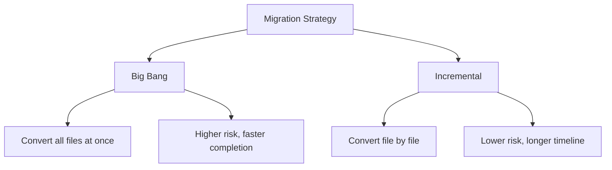

# How to Migrate JavaScript Project to TypeScript

Author: [nawazdhandala](https://github.com/nawazdhandala)

Tags: TypeScript, JavaScript, Migration, Code Quality, Type Safety, Refactoring

Description: A practical step-by-step guide to migrating an existing JavaScript project to TypeScript with minimal disruption and incremental adoption strategies.

---

## Introduction

Migrating a JavaScript project to TypeScript can seem daunting, especially for large codebases. However, TypeScript is designed to allow incremental adoption, meaning you can migrate file by file while keeping your application functional. This guide provides a practical roadmap for migrating projects of any size, from initial setup to full type coverage.

## Planning Your Migration

### Assess Your Project

Before starting, evaluate your project:

1. **Size**: Number of files and lines of code
2. **Dependencies**: Which packages have type definitions available
3. **Test coverage**: Existing tests will help catch regressions
4. **Team readiness**: Does your team have TypeScript experience?

### Choose a Migration Strategy

There are two main approaches:



**Incremental migration** (recommended for most projects):
- Convert files one at a time
- Keep the application working throughout
- Learn TypeScript patterns as you go
- Lower risk of introducing bugs

**Big bang migration** (for smaller projects):
- Convert everything at once
- Faster total time for small codebases
- Requires more TypeScript expertise upfront

## Step 1: Initial Setup

### Install TypeScript

Add TypeScript and necessary type definitions:

```bash
# Install TypeScript as a dev dependency
npm install --save-dev typescript

# Install common type definitions
npm install --save-dev @types/node

# If using popular libraries, install their types
npm install --save-dev @types/express @types/lodash @types/jest
```

### Create tsconfig.json

Start with a permissive configuration that allows JavaScript files:

```json
{
  "compilerOptions": {
    "target": "ES2020",
    "module": "commonjs",
    "lib": ["ES2020"],
    "outDir": "./dist",
    "rootDir": "./src",
    "strict": false,
    "esModuleInterop": true,
    "skipLibCheck": true,
    "forceConsistentCasingInFileNames": true,
    "allowJs": true,
    "checkJs": false,
    "declaration": true,
    "resolveJsonModule": true,
    "moduleResolution": "node"
  },
  "include": ["src/**/*"],
  "exclude": ["node_modules", "dist"]
}
```

Key settings for migration:

- `allowJs: true`: Allows JavaScript files in your project
- `checkJs: false`: Does not type-check JavaScript files yet
- `strict: false`: Disables strict checks initially

### Update package.json Scripts

Modify your build and development scripts:

```json
{
  "scripts": {
    "build": "tsc",
    "build:watch": "tsc --watch",
    "start": "node dist/index.js",
    "dev": "ts-node src/index.ts"
  }
}
```

For development, install ts-node:

```bash
npm install --save-dev ts-node
```

## Step 2: Rename Your Entry Point

Start by converting your main entry file:

```bash
# Rename the entry point
mv src/index.js src/index.ts
```

Fix any immediate errors. Common issues include:

```typescript
// Before (JavaScript)
const express = require("express");

// After (TypeScript with ES imports)
import express from "express";

// Or keep CommonJS if needed
import express = require("express");
```

Verify your application still runs:

```bash
npm run build
npm start
```

## Step 3: Add Basic Types Incrementally

### Convert Files One at a Time

Pick a simple utility file to convert next:

```javascript
// src/utils/formatters.js (before)
function formatCurrency(amount) {
  return "$" + amount.toFixed(2);
}

function formatDate(date) {
  return date.toISOString().split("T")[0];
}

module.exports = { formatCurrency, formatDate };
```

```typescript
// src/utils/formatters.ts (after)
export function formatCurrency(amount: number): string {
  return "$" + amount.toFixed(2);
}

export function formatDate(date: Date): string {
  return date.toISOString().split("T")[0];
}
```

### Update Imports in Other Files

When you convert a file, update imports in files that use it:

```typescript
// Before (importing from .js)
const { formatCurrency } = require("./utils/formatters");

// After (importing from .ts)
import { formatCurrency } from "./utils/formatters";
```

## Step 4: Create Type Definitions

### Define Interfaces for Your Domain

Create a types file for your application's domain models:

```typescript
// src/types/index.ts
export interface User {
  id: string;
  email: string;
  name: string;
  createdAt: Date;
}

export interface Product {
  id: string;
  name: string;
  price: number;
  category: string;
  inStock: boolean;
}

export interface Order {
  id: string;
  userId: string;
  products: OrderItem[];
  total: number;
  status: OrderStatus;
}

export interface OrderItem {
  productId: string;
  quantity: number;
  unitPrice: number;
}

export type OrderStatus = "pending" | "processing" | "shipped" | "delivered";
```

### Use Types in Converted Files

```typescript
// src/services/order-service.ts
import { Order, OrderItem, OrderStatus } from "../types";

export function calculateTotal(items: OrderItem[]): number {
  return items.reduce((sum, item) => sum + item.unitPrice * item.quantity, 0);
}

export function createOrder(userId: string, items: OrderItem[]): Order {
  return {
    id: crypto.randomUUID(),
    userId,
    products: items,
    total: calculateTotal(items),
    status: "pending"
  };
}

export function updateOrderStatus(order: Order, status: OrderStatus): Order {
  return { ...order, status };
}
```

## Step 5: Handle Third-Party Libraries

### Libraries with Built-in Types

Many modern libraries include TypeScript types. Just import and use them:

```typescript
// axios has built-in types
import axios from "axios";

const response = await axios.get<User[]>("/api/users");
// response.data is typed as User[]
```

### Libraries with @types Packages

For libraries without built-in types, check DefinitelyTyped:

```bash
# Search for types
npm search @types/library-name

# Install if available
npm install --save-dev @types/lodash
```

### Libraries Without Types

For libraries without type definitions, create a declaration file:

```typescript
// src/types/legacy-lib.d.ts
declare module "legacy-library" {
  export function doSomething(input: string): string;
  export function processData(data: unknown): void;

  export interface Config {
    apiKey: string;
    timeout?: number;
  }

  export class Client {
    constructor(config: Config);
    connect(): Promise<void>;
    disconnect(): void;
  }
}
```

Or use a minimal declaration to suppress errors temporarily:

```typescript
// src/types/untyped-modules.d.ts
declare module "untyped-library";
declare module "another-untyped-lib";
```

## Step 6: Gradually Enable Strict Checks

### Enable Checks One at a Time

Update tsconfig.json incrementally:

```json
{
  "compilerOptions": {
    // Start enabling these one at a time
    "noImplicitAny": true,
    "strictNullChecks": true,
    "strictFunctionTypes": true,
    "strictBindCallApply": true,
    "strictPropertyInitialization": true,
    "noImplicitThis": true,
    "alwaysStrict": true
  }
}
```

### Fix noImplicitAny Errors

When you enable `noImplicitAny`, add types to function parameters:

```typescript
// Before: Parameter 'user' implicitly has an 'any' type
function greet(user) {
  return `Hello, ${user.name}`;
}

// After: Explicit type annotation
function greet(user: User): string {
  return `Hello, ${user.name}`;
}
```

### Fix strictNullChecks Errors

Handle potentially null or undefined values:

```typescript
// Before: Object is possibly 'undefined'
function getUsername(user?: User) {
  return user.name;  // Error with strictNullChecks
}

// After: Handle the undefined case
function getUsername(user?: User): string {
  if (!user) {
    return "Anonymous";
  }
  return user.name;
}

// Or use optional chaining
function getUsername(user?: User): string | undefined {
  return user?.name;
}
```

## Step 7: Convert Complex Files

### API Route Handlers

```typescript
// src/routes/users.ts
import { Router, Request, Response } from "express";
import { User } from "../types";
import { UserService } from "../services/user-service";

const router = Router();
const userService = new UserService();

// Define request body types
interface CreateUserBody {
  email: string;
  name: string;
}

router.post("/users", async (req: Request<{}, {}, CreateUserBody>, res: Response) => {
  try {
    const { email, name } = req.body;
    const user = await userService.createUser(email, name);
    res.status(201).json(user);
  } catch (error) {
    res.status(500).json({ error: "Failed to create user" });
  }
});

router.get("/users/:id", async (req: Request<{ id: string }>, res: Response) => {
  try {
    const user = await userService.findById(req.params.id);
    if (!user) {
      res.status(404).json({ error: "User not found" });
      return;
    }
    res.json(user);
  } catch (error) {
    res.status(500).json({ error: "Failed to fetch user" });
  }
});

export default router;
```

### Database Models

```typescript
// src/models/user-model.ts
import { User } from "../types";

// Define the database row shape
interface UserRow {
  id: string;
  email: string;
  name: string;
  created_at: string;
}

// Transform database row to domain model
function toUser(row: UserRow): User {
  return {
    id: row.id,
    email: row.email,
    name: row.name,
    createdAt: new Date(row.created_at)
  };
}

export class UserModel {
  async findById(id: string): Promise<User | null> {
    const row = await db.query<UserRow>(
      "SELECT * FROM users WHERE id = $1",
      [id]
    );
    return row ? toUser(row) : null;
  }

  async create(email: string, name: string): Promise<User> {
    const row = await db.query<UserRow>(
      "INSERT INTO users (email, name) VALUES ($1, $2) RETURNING *",
      [email, name]
    );
    return toUser(row);
  }
}
```

## Step 8: Update Testing

### Configure Jest for TypeScript

```bash
npm install --save-dev ts-jest @types/jest
```

Create jest.config.js:

```javascript
module.exports = {
  preset: "ts-jest",
  testEnvironment: "node",
  roots: ["<rootDir>/src"],
  testMatch: ["**/*.test.ts"],
  moduleFileExtensions: ["ts", "js"],
  collectCoverageFrom: ["src/**/*.ts", "!src/**/*.d.ts"]
};
```

### Convert Test Files

```typescript
// src/services/order-service.test.ts
import { calculateTotal, createOrder } from "./order-service";
import { OrderItem } from "../types";

describe("OrderService", () => {
  describe("calculateTotal", () => {
    it("should calculate total correctly", () => {
      const items: OrderItem[] = [
        { productId: "1", quantity: 2, unitPrice: 10 },
        { productId: "2", quantity: 1, unitPrice: 25 }
      ];

      expect(calculateTotal(items)).toBe(45);
    });

    it("should return 0 for empty array", () => {
      expect(calculateTotal([])).toBe(0);
    });
  });

  describe("createOrder", () => {
    it("should create order with pending status", () => {
      const items: OrderItem[] = [
        { productId: "1", quantity: 1, unitPrice: 50 }
      ];

      const order = createOrder("user-1", items);

      expect(order.userId).toBe("user-1");
      expect(order.status).toBe("pending");
      expect(order.total).toBe(50);
    });
  });
});
```

## Step 9: Final Steps

### Enable Full Strict Mode

Once all files are converted and errors are fixed:

```json
{
  "compilerOptions": {
    "strict": true
  }
}
```

### Add Type Checking to CI/CD

```yaml
# .github/workflows/ci.yml
jobs:
  typecheck:
    runs-on: ubuntu-latest
    steps:
      - uses: actions/checkout@v4
      - uses: actions/setup-node@v4
        with:
          node-version: "20"
      - run: npm ci
      - run: npm run build
      - run: npm test
```

### Update Documentation

Document the migration in your README:

```markdown
## Development

This project uses TypeScript. To build:

```bash
npm run build
```

To run type checking without building:

```bash
npx tsc --noEmit
```
```

## Common Pitfalls and Solutions

### Handling any Types

Resist the urge to use `any` everywhere:

```typescript
// Avoid this
function processData(data: any): any {
  return data.value;
}

// Better: Use unknown and narrow
function processData(data: unknown): string {
  if (typeof data === "object" && data !== null && "value" in data) {
    return String((data as { value: unknown }).value);
  }
  throw new Error("Invalid data format");
}

// Best: Define proper types
interface DataPayload {
  value: string;
}

function processData(data: DataPayload): string {
  return data.value;
}
```

### Dealing with Dynamic Data

For truly dynamic data, use type guards:

```typescript
function isUser(obj: unknown): obj is User {
  return (
    typeof obj === "object" &&
    obj !== null &&
    "id" in obj &&
    "email" in obj &&
    "name" in obj
  );
}

function handleApiResponse(data: unknown): User {
  if (!isUser(data)) {
    throw new Error("Invalid user data");
  }
  return data;
}
```

## Conclusion

Migrating from JavaScript to TypeScript is a journey that pays dividends in code quality, developer experience, and bug prevention. By following an incremental approach, you can migrate safely while keeping your application functional.

Key takeaways:

1. Start with permissive settings and tighten gradually
2. Convert files one at a time, starting with simpler utilities
3. Create type definitions for your domain models early
4. Handle third-party library types appropriately
5. Enable strict checks incrementally as you fix issues
6. Update tests to use TypeScript for full coverage

With patience and a systematic approach, even large JavaScript codebases can be successfully migrated to TypeScript.
