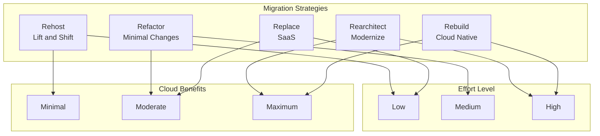
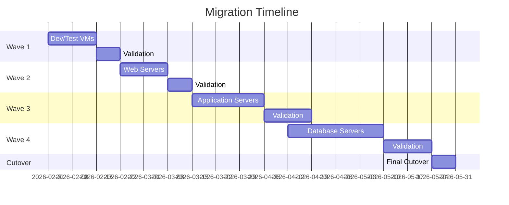
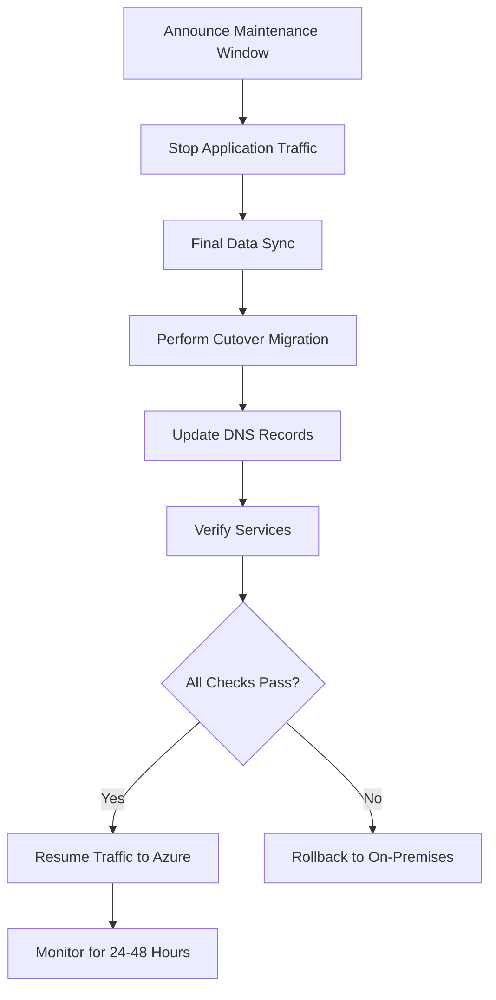

# How to Migrate from On-Premises to Azure

Author: [nawazdhandala](https://www.github.com/nawazdhandala)

Tags: Azure, Migration, Cloud, On-Premises, Azure Migrate, Lift and Shift, Modernization

Description: A comprehensive guide to planning and executing a successful migration from on-premises infrastructure to Microsoft Azure.

---

Migrating from on-premises to Azure is a significant undertaking that requires careful planning, proper tooling, and a phased approach. This guide walks you through the entire migration process, from initial assessment to post-migration optimization.

## Migration Approaches

Before starting, understand the different migration strategies available.



### Choosing the Right Strategy

| Strategy | Best For | Timeline | Risk |
|----------|----------|----------|------|
| Rehost | Quick migration, legacy systems | Short | Low |
| Refactor | Apps needing minor updates | Medium | Medium |
| Rearchitect | Performance-critical apps | Long | High |
| Rebuild | Apps requiring major changes | Long | High |
| Replace | Commodity workloads | Short | Low |

## Phase 1: Assessment and Discovery

Start by understanding your current environment.

### Deploy Azure Migrate

```bash
# Create a resource group for migration resources
az group create \
    --name rg-migration \
    --location eastus

# Create an Azure Migrate project
az migrate project create \
    --name "OnPremMigrationProject" \
    --resource-group rg-migration \
    --location eastus
```

### Install the Azure Migrate Appliance

For VMware environments:

```powershell
# Download the Azure Migrate appliance OVA template
# Deploy it in your VMware environment

# After deployment, configure the appliance
# Access the appliance configuration manager at https://appliance-ip:44368

# Register with Azure Migrate
$projectId = "your-project-id"
$applianceKey = "your-appliance-key"

# Run discovery
Start-AzMigrateDiscovery -ProjectId $projectId
```

### Generate Assessment Report

```bash
# Create an assessment
az migrate assessment create \
    --project-name "OnPremMigrationProject" \
    --resource-group rg-migration \
    --name "InitialAssessment" \
    --azure-location eastus \
    --azure-offer-code PAYG \
    --currency USD \
    --sizing-criterion PerformanceBased \
    --percentile Percentile95

# View assessment results
az migrate assessment show \
    --project-name "OnPremMigrationProject" \
    --resource-group rg-migration \
    --name "InitialAssessment"
```

### Document Dependencies

```bash
# Enable dependency visualization
# This requires Log Analytics workspace

# Create workspace
az monitor log-analytics workspace create \
    --resource-group rg-migration \
    --workspace-name "migration-workspace" \
    --location eastus

# Install dependency agent on discovered machines
# For Windows:
# MicrosoftDependencyAgent.msi /quiet

# For Linux:
# ./InstallDependencyAgent-Linux64.bin -s
```

## Phase 2: Planning

Create a detailed migration plan based on assessment results.

### Define Migration Waves



### Design Target Architecture

```bash
# Create the landing zone infrastructure

# Create VNets
az network vnet create \
    --resource-group rg-production \
    --name vnet-production \
    --address-prefix 10.0.0.0/16 \
    --subnet-name subnet-web \
    --subnet-prefix 10.0.1.0/24

az network vnet subnet create \
    --resource-group rg-production \
    --vnet-name vnet-production \
    --name subnet-app \
    --address-prefix 10.0.2.0/24

az network vnet subnet create \
    --resource-group rg-production \
    --vnet-name vnet-production \
    --name subnet-data \
    --address-prefix 10.0.3.0/24

# Create Network Security Groups
az network nsg create \
    --resource-group rg-production \
    --name nsg-web

az network nsg rule create \
    --resource-group rg-production \
    --nsg-name nsg-web \
    --name AllowHTTPS \
    --priority 100 \
    --destination-port-ranges 443 \
    --access Allow \
    --protocol Tcp
```

### Set Up Hybrid Connectivity

```bash
# Create VPN Gateway for hybrid connectivity
az network vnet-gateway create \
    --resource-group rg-production \
    --name vpn-gateway \
    --public-ip-address vpn-gateway-pip \
    --vnet vnet-production \
    --gateway-type Vpn \
    --vpn-type RouteBased \
    --sku VpnGw2 \
    --no-wait

# Or use ExpressRoute for production workloads
az network express-route create \
    --resource-group rg-production \
    --name expressroute-circuit \
    --bandwidth 1000 \
    --peering-location "Washington DC" \
    --provider "Equinix" \
    --sku-family MeteredData \
    --sku-tier Standard
```

## Phase 3: Migration Execution

### Migrate Virtual Machines

Using Azure Migrate for server migration:

```bash
# Start replication for a VM
az migrate replication-policy create \
    --fabric-name "fabric-name" \
    --resource-group rg-migration \
    --vault-name "migration-vault" \
    --name "ReplicationPolicy" \
    --recovery-point-retention-in-minutes 1440 \
    --app-consistent-snapshot-frequency-in-minutes 240

# Monitor replication status
az migrate replicated-item show \
    --fabric-name "fabric-name" \
    --protection-container "container-name" \
    --resource-group rg-migration \
    --vault-name "migration-vault" \
    --name "vm-name"
```

### Migrate Databases

For SQL Server databases, use Azure Database Migration Service:

```bash
# Create DMS instance
az dms create \
    --resource-group rg-migration \
    --name dms-migration \
    --location eastus \
    --sku-name Premium_4vCores \
    --subnet /subscriptions/.../subnets/dms-subnet

# Create migration project
az dms project create \
    --resource-group rg-migration \
    --service-name dms-migration \
    --name "SQLMigration" \
    --source-platform SQL \
    --target-platform SQLDB
```

For minimal downtime database migration:

```sql
-- On source SQL Server, enable CDC
USE [YourDatabase]
GO
EXEC sys.sp_cdc_enable_db
GO

-- Enable CDC for each table
EXEC sys.sp_cdc_enable_table
    @source_schema = N'dbo',
    @source_name = N'YourTable',
    @role_name = NULL,
    @supports_net_changes = 1
GO
```

### Migrate File Shares

Use Azure File Sync or AzCopy:

```bash
# Install AzCopy and transfer files
# Download from https://aka.ms/downloadazcopy

# Login to Azure
azcopy login

# Copy files to Azure Blob Storage
azcopy copy "/path/to/files/*" \
    "https://storageaccount.blob.core.windows.net/container" \
    --recursive

# Or sync for continuous updates during migration
azcopy sync "/path/to/files" \
    "https://storageaccount.file.core.windows.net/share" \
    --recursive
```

## Phase 4: Testing and Validation

### Run Test Migrations

```bash
# Perform test failover
az migrate replicated-item test-migrate \
    --fabric-name "fabric-name" \
    --protection-container "container-name" \
    --resource-group rg-migration \
    --vault-name "migration-vault" \
    --name "vm-name" \
    --test-network "/subscriptions/.../virtualNetworks/test-vnet"

# Validate the test migration
# Run your application tests against the migrated VM

# Clean up test migration
az migrate replicated-item test-migrate-cleanup \
    --fabric-name "fabric-name" \
    --protection-container "container-name" \
    --resource-group rg-migration \
    --vault-name "migration-vault" \
    --name "vm-name" \
    --comments "Test completed successfully"
```

### Validation Checklist

```bash
#!/bin/bash
# Post-migration validation script

echo "=== Azure Migration Validation ==="

# Check VM health
echo "Checking VM status..."
az vm list \
    --resource-group rg-production \
    --query "[].{Name:name, Status:provisioningState}" \
    --output table

# Check network connectivity
echo "Testing network connectivity..."
az network watcher test-connectivity \
    --resource-group rg-production \
    --source-resource vm-web-01 \
    --dest-resource vm-app-01 \
    --dest-port 8080

# Check DNS resolution
echo "Verifying DNS..."
nslookup myapp.internal.contoso.com

# Check application endpoints
echo "Testing application health..."
curl -s -o /dev/null -w "%{http_code}" https://myapp.azurewebsites.net/health

# Check database connectivity
echo "Testing database connection..."
sqlcmd -S myserver.database.windows.net -d mydb -U admin -P $DB_PASSWORD -Q "SELECT 1"

echo "=== Validation Complete ==="
```

## Phase 5: Cutover and Go-Live

### Execute Final Cutover



### DNS Cutover Script

```bash
#!/bin/bash
# DNS Cutover Script

# Variables
OLD_IP="192.168.1.100"
NEW_IP="20.185.100.50"
DOMAIN="app.contoso.com"

echo "Starting DNS cutover from $OLD_IP to $NEW_IP"

# Lower TTL before migration (do this 24-48 hours before)
# az network dns record-set a update --ttl 300 ...

# Update A record
az network dns record-set a remove-record \
    --resource-group rg-dns \
    --zone-name contoso.com \
    --record-set-name app \
    --ipv4-address $OLD_IP

az network dns record-set a add-record \
    --resource-group rg-dns \
    --zone-name contoso.com \
    --record-set-name app \
    --ipv4-address $NEW_IP

# Verify DNS propagation
echo "Verifying DNS propagation..."
for i in {1..10}; do
    RESOLVED=$(nslookup $DOMAIN 8.8.8.8 | grep "Address:" | tail -1 | awk '{print $2}')
    if [ "$RESOLVED" == "$NEW_IP" ]; then
        echo "DNS propagated successfully!"
        break
    fi
    echo "Waiting for DNS propagation... ($i/10)"
    sleep 60
done

# Increase TTL back to normal after successful cutover
# az network dns record-set a update --ttl 3600 ...
```

## Phase 6: Post-Migration Optimization

### Right-Size Resources

```bash
# Get VM sizing recommendations
az advisor recommendation list \
    --resource-group rg-production \
    --query "[?category=='Cost']" \
    --output table

# Resize over-provisioned VMs
az vm resize \
    --resource-group rg-production \
    --name vm-app-01 \
    --size Standard_D2s_v3
```

### Enable Monitoring

```bash
# Enable Azure Monitor for VMs
az vm extension set \
    --resource-group rg-production \
    --vm-name vm-app-01 \
    --name AzureMonitorLinuxAgent \
    --publisher Microsoft.Azure.Monitor \
    --version 1.0

# Create alerts
az monitor metrics alert create \
    --resource-group rg-production \
    --name "HighCPUAlert" \
    --scopes "/subscriptions/.../resourceGroups/rg-production/providers/Microsoft.Compute/virtualMachines/vm-app-01" \
    --condition "avg Percentage CPU > 80" \
    --action "/subscriptions/.../resourceGroups/rg-production/providers/Microsoft.Insights/actionGroups/ops-team"
```

### Implement Backup and Disaster Recovery

```bash
# Create Recovery Services vault
az backup vault create \
    --resource-group rg-production \
    --name backup-vault \
    --location eastus

# Enable backup for VMs
az backup protection enable-for-vm \
    --resource-group rg-production \
    --vault-name backup-vault \
    --vm vm-app-01 \
    --policy-name DefaultPolicy
```

## Best Practices

1. **Start Small**: Migrate non-critical workloads first to build experience
2. **Maintain Rollback Plans**: Keep on-premises systems running until Azure is fully validated
3. **Document Everything**: Maintain detailed runbooks for each migration step
4. **Train Your Team**: Ensure staff are trained on Azure management before cutover
5. **Monitor Costs**: Set up budget alerts to avoid unexpected charges
6. **Secure from Day One**: Implement Azure security best practices during migration, not after

---

Migrating from on-premises to Azure is a journey that requires careful planning and execution. By following a phased approach with proper assessment, testing, and validation, you can minimize risk and maximize the benefits of cloud adoption. Remember that migration is just the beginning; continuous optimization and modernization will help you fully realize the value of your cloud investment.
