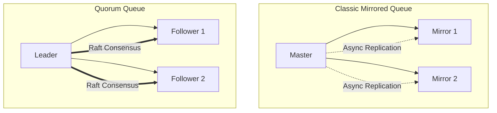
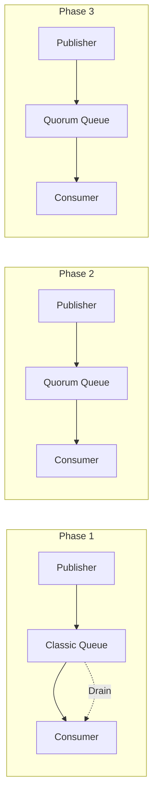
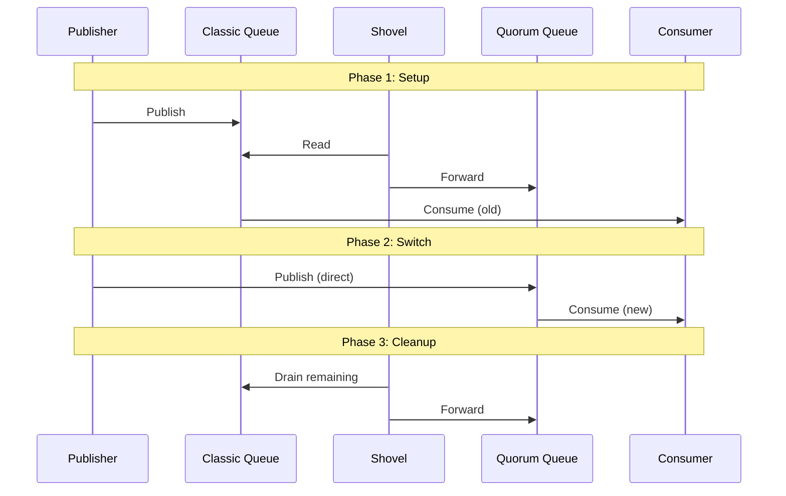
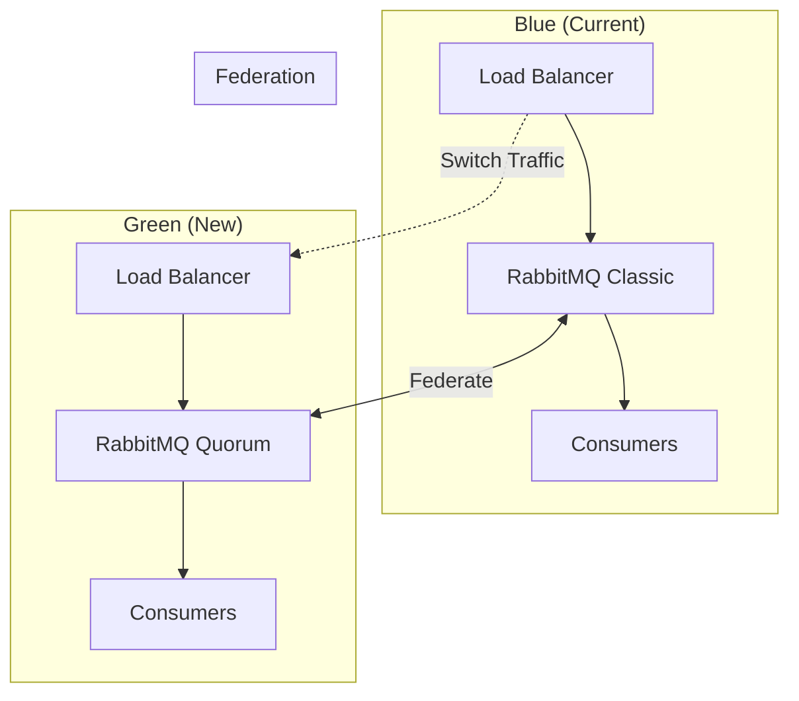
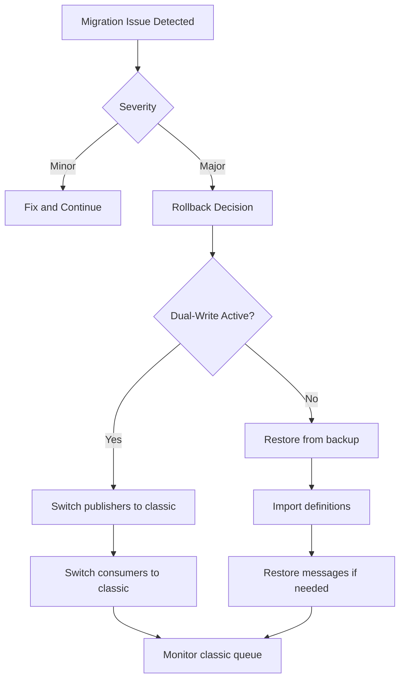

# How to Migrate from RabbitMQ Classic to Quorum Queues

Author: [nawazdhandala](https://www.github.com/nawazdhandala)

Tags: RabbitMQ, Quorum Queues, Classic Queues, Migration, High Availability, Message Queue, DevOps, Upgrade

Description: A step-by-step guide to migrating from RabbitMQ classic mirrored queues to quorum queues with minimal downtime and data loss.

---

> Quorum queues are the recommended replacement for classic mirrored queues in RabbitMQ. They provide better data safety guarantees and more predictable performance under failure conditions. This guide covers migration strategies, from simple greenfield approaches to complex zero-downtime migrations.

RabbitMQ deprecated classic mirrored queues in version 3.9 and recommends migrating to quorum queues for high-availability workloads. Understanding the differences and planning your migration carefully is essential for a successful transition.

---

## Classic vs Quorum Queues



### Key Differences

| Feature | Classic Mirrored | Quorum Queue |
|---------|-----------------|--------------|
| Replication | Asynchronous | Raft consensus |
| Data safety | May lose messages | Guaranteed delivery |
| Performance | Higher throughput | More consistent |
| Memory usage | Lower | Higher (WAL) |
| Message ordering | Weaker guarantees | Strong ordering |
| Poison messages | Manual handling | Built-in delivery limit |
| Leader election | May cause issues | Automatic failover |

---

## Pre-Migration Assessment

### Analyzing Current Queues

```python
#!/usr/bin/env python3
"""
Analyze classic queues for migration readiness
"""

import subprocess
import json

def analyze_queues():
    """Analyze all queues and identify migration candidates"""

    # Get queue information
    result = subprocess.run(
        ['rabbitmqctl', 'list_queues',
         'name', 'type', 'messages', 'consumers', 'memory',
         'policy', 'arguments',
         '--formatter=json'],
        capture_output=True,
        text=True
    )

    queues = json.loads(result.stdout)

    classic_queues = []
    quorum_queues = []
    issues = []

    for queue in queues:
        q_type = queue.get('type', 'classic')
        name = queue['name']
        messages = queue.get('messages', 0)
        memory = queue.get('memory', 0)
        args = queue.get('arguments', {})

        if q_type == 'quorum':
            quorum_queues.append(queue)
            continue

        classic_queues.append(queue)

        # Check for migration issues
        if args.get('x-message-ttl'):
            # TTL is supported in quorum queues
            pass

        if args.get('x-max-priority'):
            issues.append({
                'queue': name,
                'issue': 'Priority queues not supported in quorum queues',
                'severity': 'high'
            })

        if args.get('x-queue-mode') == 'lazy':
            issues.append({
                'queue': name,
                'issue': 'Lazy queues - quorum queues always persist',
                'severity': 'info'
            })

        if memory > 1024 * 1024 * 1024:  # > 1GB
            issues.append({
                'queue': name,
                'issue': f'Large queue ({memory / (1024**3):.2f}GB) - plan for migration time',
                'severity': 'warning'
            })

    # Print report
    print("=" * 60)
    print("RABBITMQ MIGRATION ASSESSMENT REPORT")
    print("=" * 60)

    print(f"\nClassic queues: {len(classic_queues)}")
    print(f"Quorum queues: {len(quorum_queues)}")

    if classic_queues:
        print("\n--- Classic Queues to Migrate ---")
        for q in classic_queues[:20]:
            print(f"  {q['name']}: {q.get('messages', 0)} messages, "
                  f"{q.get('consumers', 0)} consumers")

    if issues:
        print("\n--- Migration Issues ---")
        for issue in issues:
            print(f"  [{issue['severity'].upper()}] {issue['queue']}: {issue['issue']}")

    return {
        'classic_queues': classic_queues,
        'quorum_queues': quorum_queues,
        'issues': issues
    }

if __name__ == '__main__':
    analyze_queues()
```

### Check Feature Compatibility

```bash
#!/bin/bash
# Check for features not supported in quorum queues

echo "Checking for incompatible features..."

# Check for priority queues
echo "Priority queues:"
rabbitmqctl list_queues name arguments --formatter=json | \
    jq -r '.[] | select(.arguments["x-max-priority"] != null) | .name'

# Check for exclusive queues
echo -e "\nExclusive queues (cannot be quorum):"
rabbitmqctl list_queues name exclusive --formatter=json | \
    jq -r '.[] | select(.exclusive == true) | .name'

# Check for auto-delete queues
echo -e "\nAuto-delete queues (cannot be quorum):"
rabbitmqctl list_queues name auto_delete --formatter=json | \
    jq -r '.[] | select(.auto_delete == true) | .name'

# Check for non-durable queues
echo -e "\nNon-durable queues (cannot be quorum):"
rabbitmqctl list_queues name durable --formatter=json | \
    jq -r '.[] | select(.durable == false) | .name'
```

---

## Migration Strategies

### Strategy 1: Greenfield Migration (New Queue Names)



```python
import pika
import time
import threading

class GreenFieldMigration:
    def __init__(self, host='localhost'):
        self.connection = pika.BlockingConnection(
            pika.ConnectionParameters(host)
        )
        self.channel = self.connection.channel()

    def create_quorum_queue(self, queue_name, classic_args=None):
        """Create new quorum queue with compatible settings"""

        quorum_args = {
            'x-queue-type': 'quorum',
            'x-quorum-initial-group-size': 3
        }

        if classic_args:
            # Transfer compatible arguments
            if 'x-message-ttl' in classic_args:
                quorum_args['x-message-ttl'] = classic_args['x-message-ttl']

            if 'x-dead-letter-exchange' in classic_args:
                quorum_args['x-dead-letter-exchange'] = classic_args['x-dead-letter-exchange']

            if 'x-dead-letter-routing-key' in classic_args:
                quorum_args['x-dead-letter-routing-key'] = classic_args['x-dead-letter-routing-key']

            if 'x-max-length' in classic_args:
                quorum_args['x-max-length'] = classic_args['x-max-length']

            # Add delivery limit for poison message handling
            quorum_args['x-delivery-limit'] = 5

        # Create the quorum queue with new name
        new_queue_name = f"{queue_name}-quorum"

        self.channel.queue_declare(
            queue=new_queue_name,
            durable=True,
            arguments=quorum_args
        )

        print(f"Created quorum queue: {new_queue_name}")
        return new_queue_name

    def setup_dual_publishing(self, exchange, classic_queue, quorum_queue):
        """Set up bindings for dual publishing during migration"""

        # Bind both queues to the exchange
        self.channel.queue_bind(
            queue=classic_queue,
            exchange=exchange,
            routing_key=classic_queue
        )

        self.channel.queue_bind(
            queue=quorum_queue,
            exchange=exchange,
            routing_key=classic_queue  # Same routing key
        )

        print(f"Both queues bound to exchange {exchange}")

    def drain_classic_queue(self, classic_queue, callback):
        """Drain remaining messages from classic queue"""

        print(f"Draining classic queue: {classic_queue}")
        drained = 0

        while True:
            method, properties, body = self.channel.basic_get(
                queue=classic_queue,
                auto_ack=False
            )

            if method is None:
                break

            callback(body)
            self.channel.basic_ack(method.delivery_tag)
            drained += 1

        print(f"Drained {drained} messages from {classic_queue}")
        return drained

# Usage
migration = GreenFieldMigration()

# Step 1: Create quorum queue
quorum_queue = migration.create_quorum_queue(
    'orders',
    classic_args={'x-message-ttl': 86400000}
)

# Step 2: Update publishers to write to new queue
# Step 3: Update consumers to read from new queue
# Step 4: Drain classic queue
```

### Strategy 2: In-Place Migration with Shovel



```python
import requests
import pika
import time

class ShovelMigration:
    def __init__(self, host='localhost', mgmt_port=15672, user='admin', password='admin'):
        self.host = host
        self.mgmt_url = f"http://{host}:{mgmt_port}/api"
        self.auth = (user, password)
        self.connection = pika.BlockingConnection(
            pika.ConnectionParameters(host)
        )
        self.channel = self.connection.channel()

    def create_quorum_queue(self, name, arguments=None):
        """Create target quorum queue"""
        args = {
            'x-queue-type': 'quorum',
            'x-quorum-initial-group-size': 3
        }
        if arguments:
            args.update(arguments)

        self.channel.queue_declare(
            queue=name,
            durable=True,
            arguments=args
        )
        print(f"Created quorum queue: {name}")

    def setup_shovel(self, source_queue, dest_queue, shovel_name=None):
        """Configure shovel to move messages"""

        shovel_name = shovel_name or f"migrate-{source_queue}"

        shovel_config = {
            "value": {
                "src-protocol": "amqp091",
                "src-uri": f"amqp://{self.host}",
                "src-queue": source_queue,
                "dest-protocol": "amqp091",
                "dest-uri": f"amqp://{self.host}",
                "dest-queue": dest_queue,
                "ack-mode": "on-confirm",
                "reconnect-delay": 5,
                # Delete shovel after source is empty
                "src-delete-after": "queue-length"
            }
        }

        response = requests.put(
            f"{self.mgmt_url}/parameters/shovel/%2F/{shovel_name}",
            auth=self.auth,
            json=shovel_config
        )
        response.raise_for_status()
        print(f"Shovel configured: {shovel_name}")
        return shovel_name

    def monitor_shovel(self, shovel_name):
        """Monitor shovel progress"""

        while True:
            response = requests.get(
                f"{self.mgmt_url}/shovels",
                auth=self.auth
            )
            shovels = response.json()

            for shovel in shovels:
                if shovel['name'] == shovel_name:
                    state = shovel.get('state', 'unknown')
                    print(f"Shovel {shovel_name}: {state}")

                    if state == 'terminated':
                        print("Shovel completed")
                        return True

            time.sleep(5)

    def delete_classic_queue(self, queue_name):
        """Delete the old classic queue"""
        self.channel.queue_delete(queue=queue_name)
        print(f"Deleted classic queue: {queue_name}")

    def rename_queue_bindings(self, exchange, old_queue, new_queue, routing_key):
        """Update exchange bindings to point to new queue"""

        # Remove old binding
        self.channel.queue_unbind(
            queue=old_queue,
            exchange=exchange,
            routing_key=routing_key
        )

        # Add new binding
        self.channel.queue_bind(
            queue=new_queue,
            exchange=exchange,
            routing_key=routing_key
        )
        print(f"Updated bindings for {exchange}")

    def migrate_queue(self, queue_name, exchange=None, routing_key=None):
        """Complete migration workflow"""

        quorum_name = f"{queue_name}-quorum"

        # Step 1: Create quorum queue
        self.create_quorum_queue(quorum_name)

        # Step 2: Set up shovel
        shovel = self.setup_shovel(queue_name, quorum_name)

        # Step 3: Monitor until complete
        self.monitor_shovel(shovel)

        # Step 4: Update bindings if exchange specified
        if exchange and routing_key:
            self.rename_queue_bindings(exchange, queue_name, quorum_name, routing_key)

        # Step 5: Delete old queue (optional - manual verification recommended)
        # self.delete_classic_queue(queue_name)

        print(f"Migration complete: {queue_name} -> {quorum_name}")
        return quorum_name

# Usage
migration = ShovelMigration()
migration.migrate_queue('orders', exchange='orders-exchange', routing_key='orders')
```

### Strategy 3: Blue-Green Migration



```python
import requests
import time

class BlueGreenMigration:
    def __init__(self, blue_host, green_host, user='admin', password='admin'):
        self.blue_url = f"http://{blue_host}:15672/api"
        self.green_url = f"http://{green_host}:15672/api"
        self.blue_amqp = f"amqp://{user}:{password}@{blue_host}"
        self.green_amqp = f"amqp://{user}:{password}@{green_host}"
        self.auth = (user, password)

    def setup_federation(self, source_host, dest_host, dest_url, queue_pattern):
        """Set up federation to replicate queues"""

        # Create upstream on destination
        upstream_config = {
            "value": {
                "uri": source_host,
                "expires": 3600000,
                "ack-mode": "on-confirm"
            }
        }

        response = requests.put(
            f"{dest_url}/parameters/federation-upstream/%2F/blue-upstream",
            auth=self.auth,
            json=upstream_config
        )
        response.raise_for_status()

        # Create policy to federate queues
        policy_config = {
            "pattern": queue_pattern,
            "definition": {
                "federation-upstream": "blue-upstream"
            },
            "apply-to": "queues"
        }

        response = requests.put(
            f"{dest_url}/policies/%2F/federate-blue",
            auth=self.auth,
            json=policy_config
        )
        response.raise_for_status()

        print("Federation configured")

    def export_definitions(self, source_url):
        """Export definitions from source"""
        response = requests.get(f"{source_url}/definitions", auth=self.auth)
        response.raise_for_status()
        return response.json()

    def import_definitions_as_quorum(self, dest_url, definitions):
        """Import definitions with queues converted to quorum"""

        # Convert queue types
        for queue in definitions.get('queues', []):
            args = queue.get('arguments', {})

            # Skip incompatible queues
            if not queue.get('durable', True):
                print(f"Skipping non-durable queue: {queue['name']}")
                continue

            if queue.get('auto_delete'):
                print(f"Skipping auto-delete queue: {queue['name']}")
                continue

            if args.get('x-max-priority'):
                print(f"Skipping priority queue: {queue['name']}")
                continue

            # Convert to quorum
            args['x-queue-type'] = 'quorum'
            args['x-quorum-initial-group-size'] = 3
            args.setdefault('x-delivery-limit', 5)

        # Import to destination
        response = requests.post(
            f"{dest_url}/definitions",
            auth=self.auth,
            json=definitions
        )
        response.raise_for_status()
        print("Definitions imported as quorum queues")

    def verify_sync(self, blue_queue, green_queue):
        """Verify queues are in sync"""

        blue_info = requests.get(
            f"{self.blue_url}/queues/%2F/{blue_queue}",
            auth=self.auth
        ).json()

        green_info = requests.get(
            f"{self.green_url}/queues/%2F/{green_queue}",
            auth=self.auth
        ).json()

        blue_messages = blue_info.get('messages', 0)
        green_messages = green_info.get('messages', 0)

        print(f"Blue: {blue_messages} messages, Green: {green_messages} messages")
        return abs(blue_messages - green_messages) < 10

    def run_migration(self, queue_pattern=".*"):
        """Run complete blue-green migration"""

        print("Step 1: Export definitions from blue")
        definitions = self.export_definitions(self.blue_url)

        print("Step 2: Import to green as quorum queues")
        self.import_definitions_as_quorum(self.green_url, definitions)

        print("Step 3: Set up federation")
        self.setup_federation(
            self.blue_amqp,
            self.green_amqp,
            self.green_url,
            queue_pattern
        )

        print("Step 4: Wait for sync...")
        time.sleep(30)

        print("Step 5: Verify sync")
        # Verify specific queues
        # self.verify_sync('orders', 'orders')

        print("Migration ready for cutover")
        print("Update load balancer to point to green cluster")

# Usage
migration = BlueGreenMigration(
    blue_host='rabbitmq-blue.example.com',
    green_host='rabbitmq-green.example.com'
)
migration.run_migration()
```

---

## Zero-Downtime Migration

### Dual-Write Pattern

```python
import pika
import threading
from typing import List, Callable

class DualWritePublisher:
    """Publisher that writes to both classic and quorum queues during migration"""

    def __init__(self, host='localhost'):
        self.connection = pika.BlockingConnection(
            pika.ConnectionParameters(host)
        )
        self.channel = self.connection.channel()
        self.channel.confirm_delivery()

        # Migration state
        self.classic_queue = None
        self.quorum_queue = None
        self.migration_mode = 'classic'  # classic, dual, quorum

    def configure_migration(self, classic_queue, quorum_queue):
        """Configure queues for migration"""
        self.classic_queue = classic_queue
        self.quorum_queue = quorum_queue

        # Create quorum queue if it doesn't exist
        self.channel.queue_declare(
            queue=quorum_queue,
            durable=True,
            arguments={
                'x-queue-type': 'quorum',
                'x-quorum-initial-group-size': 3
            }
        )

    def set_mode(self, mode):
        """Switch migration mode: classic, dual, quorum"""
        valid_modes = ['classic', 'dual', 'quorum']
        if mode not in valid_modes:
            raise ValueError(f"Mode must be one of {valid_modes}")

        self.migration_mode = mode
        print(f"Migration mode set to: {mode}")

    def publish(self, message, properties=None):
        """Publish message according to current migration mode"""

        if properties is None:
            properties = pika.BasicProperties(delivery_mode=2)

        if self.migration_mode == 'classic':
            # Write only to classic queue
            self.channel.basic_publish(
                exchange='',
                routing_key=self.classic_queue,
                body=message,
                properties=properties
            )

        elif self.migration_mode == 'dual':
            # Write to both queues
            self.channel.basic_publish(
                exchange='',
                routing_key=self.classic_queue,
                body=message,
                properties=properties
            )
            self.channel.basic_publish(
                exchange='',
                routing_key=self.quorum_queue,
                body=message,
                properties=properties
            )

        elif self.migration_mode == 'quorum':
            # Write only to quorum queue
            self.channel.basic_publish(
                exchange='',
                routing_key=self.quorum_queue,
                body=message,
                properties=properties
            )

# Usage
publisher = DualWritePublisher()
publisher.configure_migration('orders', 'orders-quorum')

# Phase 1: Start with classic
publisher.set_mode('classic')
publisher.publish('{"order_id": 1}')

# Phase 2: Enable dual-write
publisher.set_mode('dual')
publisher.publish('{"order_id": 2}')

# Phase 3: Switch consumers to quorum queue
# Phase 4: Complete migration
publisher.set_mode('quorum')
publisher.publish('{"order_id": 3}')
```

### Consumer Switchover

```python
import pika
import threading
import time

class MigrationConsumer:
    """Consumer that can switch between queues during migration"""

    def __init__(self, host='localhost', callback=None):
        self.host = host
        self.callback = callback
        self.connection = None
        self.channel = None
        self.current_queue = None
        self.running = False
        self.consumer_thread = None

    def connect(self):
        """Establish connection"""
        self.connection = pika.BlockingConnection(
            pika.ConnectionParameters(self.host)
        )
        self.channel = self.connection.channel()
        self.channel.basic_qos(prefetch_count=10)

    def consume_from(self, queue_name):
        """Start consuming from specified queue"""

        if self.running:
            self.stop()

        self.current_queue = queue_name
        self.running = True

        def consume_loop():
            self.connect()

            def wrapped_callback(ch, method, properties, body):
                try:
                    self.callback(body)
                    ch.basic_ack(method.delivery_tag)
                except Exception as e:
                    print(f"Processing error: {e}")
                    ch.basic_nack(method.delivery_tag, requeue=True)

            self.channel.basic_consume(
                queue=queue_name,
                on_message_callback=wrapped_callback,
                auto_ack=False
            )

            while self.running:
                self.connection.process_data_events(time_limit=1)

        self.consumer_thread = threading.Thread(target=consume_loop)
        self.consumer_thread.start()
        print(f"Started consuming from: {queue_name}")

    def switch_to(self, new_queue):
        """Switch to consuming from a different queue"""
        print(f"Switching from {self.current_queue} to {new_queue}")

        # Stop current consumption
        self.stop()

        # Start consuming from new queue
        self.consume_from(new_queue)

    def stop(self):
        """Stop consuming"""
        self.running = False
        if self.consumer_thread:
            self.consumer_thread.join(timeout=5)
        if self.connection and not self.connection.is_closed:
            self.connection.close()

# Usage
def process_message(body):
    print(f"Processing: {body[:50]}")

consumer = MigrationConsumer(callback=process_message)

# Phase 1: Consume from classic
consumer.consume_from('orders')

# Wait for dual-write to be enabled
time.sleep(60)

# Phase 2: Switch to quorum queue
consumer.switch_to('orders-quorum')
```

---

## Migration Validation

### Validation Script

```python
#!/usr/bin/env python3
"""
Validate migration from classic to quorum queues
"""

import subprocess
import json
import time

class MigrationValidator:
    def __init__(self, classic_queue, quorum_queue):
        self.classic_queue = classic_queue
        self.quorum_queue = quorum_queue
        self.issues = []

    def get_queue_info(self, queue_name):
        """Get queue information"""
        result = subprocess.run(
            ['rabbitmqctl', 'list_queues',
             'name', 'type', 'messages', 'consumers', 'memory', 'state',
             '--formatter=json'],
            capture_output=True,
            text=True
        )

        queues = json.loads(result.stdout)
        for q in queues:
            if q['name'] == queue_name:
                return q
        return None

    def validate_quorum_queue_created(self):
        """Check that quorum queue exists"""
        info = self.get_queue_info(self.quorum_queue)

        if info is None:
            self.issues.append(f"Quorum queue {self.quorum_queue} does not exist")
            return False

        if info.get('type') != 'quorum':
            self.issues.append(f"Queue {self.quorum_queue} is not a quorum queue")
            return False

        print(f"[OK] Quorum queue exists: {self.quorum_queue}")
        return True

    def validate_message_count(self, tolerance=10):
        """Check message counts are similar"""
        classic_info = self.get_queue_info(self.classic_queue)
        quorum_info = self.get_queue_info(self.quorum_queue)

        if classic_info and quorum_info:
            classic_msgs = classic_info.get('messages', 0)
            quorum_msgs = quorum_info.get('messages', 0)

            if abs(classic_msgs - quorum_msgs) > tolerance:
                self.issues.append(
                    f"Message count mismatch: classic={classic_msgs}, quorum={quorum_msgs}"
                )
                return False

        print(f"[OK] Message counts match (within tolerance)")
        return True

    def validate_consumers(self):
        """Check consumers are connected to quorum queue"""
        info = self.get_queue_info(self.quorum_queue)

        if info and info.get('consumers', 0) == 0:
            self.issues.append(f"No consumers on quorum queue {self.quorum_queue}")
            return False

        print(f"[OK] Consumers connected: {info.get('consumers', 0)}")
        return True

    def validate_quorum_health(self):
        """Check quorum queue replica health"""
        result = subprocess.run(
            ['rabbitmqctl', 'list_queues',
             'name', 'type', 'leader', 'members', 'online',
             '--formatter=json'],
            capture_output=True,
            text=True
        )

        queues = json.loads(result.stdout)
        for q in queues:
            if q['name'] == self.quorum_queue:
                members = len(q.get('members', []))
                online = len(q.get('online', []))

                if online < members:
                    self.issues.append(
                        f"Quorum queue has offline replicas: {online}/{members}"
                    )
                    return False

                print(f"[OK] All replicas online: {online}/{members}")
                return True

        return False

    def validate_classic_drained(self):
        """Check classic queue is drained"""
        info = self.get_queue_info(self.classic_queue)

        if info and info.get('messages', 0) > 0:
            self.issues.append(
                f"Classic queue still has {info['messages']} messages"
            )
            return False

        print(f"[OK] Classic queue drained")
        return True

    def run_validation(self):
        """Run all validations"""
        print("=" * 50)
        print("MIGRATION VALIDATION")
        print("=" * 50)

        results = {
            'quorum_exists': self.validate_quorum_queue_created(),
            'message_count': self.validate_message_count(),
            'consumers': self.validate_consumers(),
            'quorum_health': self.validate_quorum_health(),
            'classic_drained': self.validate_classic_drained()
        }

        print("\n" + "=" * 50)
        if self.issues:
            print("ISSUES FOUND:")
            for issue in self.issues:
                print(f"  - {issue}")
            return False
        else:
            print("ALL VALIDATIONS PASSED")
            return True

# Usage
validator = MigrationValidator('orders', 'orders-quorum')
success = validator.run_validation()
```

---

## Rollback Procedures



### Rollback Script

```python
#!/usr/bin/env python3
"""
Rollback from quorum to classic queue
"""

import pika
import requests
import subprocess

class MigrationRollback:
    def __init__(self, host='localhost', mgmt_port=15672, user='admin', password='admin'):
        self.host = host
        self.mgmt_url = f"http://{host}:{mgmt_port}/api"
        self.auth = (user, password)
        self.connection = pika.BlockingConnection(
            pika.ConnectionParameters(host)
        )
        self.channel = self.connection.channel()

    def drain_quorum_to_classic(self, quorum_queue, classic_queue):
        """Move messages from quorum queue back to classic"""

        print(f"Draining {quorum_queue} to {classic_queue}")

        # Ensure classic queue exists
        self.channel.queue_declare(
            queue=classic_queue,
            durable=True
        )

        drained = 0
        while True:
            method, properties, body = self.channel.basic_get(
                queue=quorum_queue,
                auto_ack=False
            )

            if method is None:
                break

            # Publish to classic queue
            self.channel.basic_publish(
                exchange='',
                routing_key=classic_queue,
                body=body,
                properties=properties
            )

            self.channel.basic_ack(method.delivery_tag)
            drained += 1

            if drained % 1000 == 0:
                print(f"Drained {drained} messages...")

        print(f"Total drained: {drained} messages")
        return drained

    def delete_quorum_queue(self, queue_name):
        """Delete quorum queue after rollback"""
        self.channel.queue_delete(queue=queue_name)
        print(f"Deleted quorum queue: {queue_name}")

    def remove_shovel(self, shovel_name):
        """Remove migration shovel"""
        response = requests.delete(
            f"{self.mgmt_url}/parameters/shovel/%2F/{shovel_name}",
            auth=self.auth
        )
        if response.status_code in [200, 204, 404]:
            print(f"Shovel removed: {shovel_name}")

    def rollback(self, quorum_queue, classic_queue, delete_quorum=False):
        """Execute complete rollback"""

        print("=" * 50)
        print("EXECUTING ROLLBACK")
        print("=" * 50)

        # Step 1: Drain messages
        self.drain_quorum_to_classic(quorum_queue, classic_queue)

        # Step 2: Remove shovel if exists
        self.remove_shovel(f"migrate-{classic_queue}")

        # Step 3: Optionally delete quorum queue
        if delete_quorum:
            self.delete_quorum_queue(quorum_queue)

        print("Rollback complete")
        print("Remember to update publisher and consumer configurations")

# Usage
rollback = MigrationRollback()
rollback.rollback('orders-quorum', 'orders', delete_quorum=True)
```

---

## Best Practices

### Migration Checklist

1. **Pre-Migration**
   - [ ] Audit all queues for compatibility
   - [ ] Document current queue configurations
   - [ ] Back up definitions
   - [ ] Test migration in staging environment
   - [ ] Plan rollback procedure

2. **During Migration**
   - [ ] Monitor queue depths
   - [ ] Verify consumer connections
   - [ ] Check for message loss
   - [ ] Monitor memory usage

3. **Post-Migration**
   - [ ] Validate all queues migrated
   - [ ] Clean up classic queues
   - [ ] Update documentation
   - [ ] Remove migration infrastructure

### Performance Tuning

```erlang
%% rabbitmq.conf - Quorum queue optimizations

%% Increase Raft segment size for high throughput
raft.segment_max_entries = 65536

%% Configure WAL settings
raft.wal_max_size_bytes = 1073741824

%% Memory management
quorum_queue.memory_limit = 0.4
```

---

## Conclusion

Migrating from classic mirrored queues to quorum queues is an important step in modernizing your RabbitMQ infrastructure. By following a systematic approach - whether greenfield, in-place with shovels, or blue-green - you can migrate with minimal risk and zero downtime.

Key takeaways:
- Assess all queues for quorum compatibility before migration
- Use dual-write patterns for zero-downtime migrations
- Validate thoroughly at each step
- Have a tested rollback procedure ready
- Monitor closely during and after migration

---

*Need help monitoring your RabbitMQ migration? [OneUptime](https://oneuptime.com) provides comprehensive monitoring for queue migrations, including message rates, queue depths, and consumer health metrics.*

**Related Reading:**
- [How to Configure RabbitMQ Quorum Queues](https://oneuptime.com/blog)
- [How to Backup and Restore RabbitMQ](https://oneuptime.com/blog)
