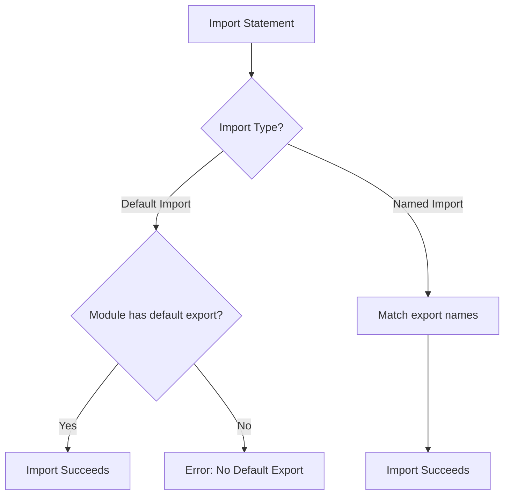

# How to Fix "Module Has No Default Export" Errors

Author: [nawazdhandala](https://www.github.com/nawazdhandala)

Tags: TypeScript, Modules, Imports, ES Modules, CommonJS, Error Handling

Description: Learn how to diagnose and fix the "Module has no default export" error in TypeScript, including understanding named vs default exports and module interoperability.

---

The "Module has no default export" error is a common stumbling block for TypeScript developers, especially when working with third-party libraries or migrating between module systems. In this guide, we will explore why this error occurs and how to resolve it using various techniques.

## Understanding the Error

This error occurs when you try to use a default import on a module that only provides named exports:

```typescript
// math.ts - only has named exports
export function add(a: number, b: number): number {
    return a + b;
}

export function subtract(a: number, b: number): number {
    return a - b;
}

// main.ts - trying to use default import
import math from "./math";  // Error: Module '"./math"' has no default export

math.add(1, 2);  // This will not work
```



## Default vs Named Exports

Understanding the difference between default and named exports is key to fixing this error.

### Named Exports

Named exports require you to import them by their exact name (or use aliases):

```typescript
// utils.ts - named exports
export const PI = 3.14159;

export function square(x: number): number {
    return x * x;
}

export class Calculator {
    add(a: number, b: number): number {
        return a + b;
    }
}

// Importing named exports
import { PI, square, Calculator } from "./utils";

// Using aliases
import { PI as pi, square as sq } from "./utils";

// Import all as namespace
import * as utils from "./utils";
console.log(utils.PI);
```

### Default Exports

A module can have at most one default export:

```typescript
// logger.ts - default export
export default class Logger {
    log(message: string): void {
        console.log(`[LOG] ${message}`);
    }
}

// Importing default export - any name works
import Logger from "./logger";
import MyLogger from "./logger";  // Same thing, different name

const logger = new Logger();
```

### Mixed Exports

A module can have both default and named exports:

```typescript
// api.ts - mixed exports
export const API_VERSION = "v1";

export function createClient(baseUrl: string): ApiClient {
    return new ApiClient(baseUrl);
}

// Default export
export default class ApiClient {
    constructor(private baseUrl: string) {}

    async get(path: string): Promise<Response> {
        return fetch(`${this.baseUrl}/${path}`);
    }
}

// Importing both default and named
import ApiClient, { API_VERSION, createClient } from "./api";
```

## Common Causes and Solutions

### Cause 1: Using Default Import Syntax for Named Exports

The most common cause is simply using the wrong import syntax:

```typescript
// Wrong - default import on named exports
import lodash from "lodash";  // Error if lodash only has named exports

// Correct - namespace import
import * as _ from "lodash";

// Or import specific named exports
import { map, filter, reduce } from "lodash";
```

**Solution: Use named imports or namespace imports.**

```typescript
// Option 1: Import specific functions
import { debounce, throttle } from "lodash";

// Option 2: Import everything as namespace
import * as _ from "lodash";
_.debounce(fn, 300);

// Option 3: With esModuleInterop enabled
import _ from "lodash";  // Works with esModuleInterop
```

### Cause 2: Missing esModuleInterop

Many CommonJS modules do not have true default exports, but `esModuleInterop` can help:

```json
// tsconfig.json
{
    "compilerOptions": {
        "esModuleInterop": true,
        "allowSyntheticDefaultImports": true
    }
}
```

With these options enabled:

```typescript
// Before (without esModuleInterop)
import * as express from "express";
const app = express();

// After (with esModuleInterop)
import express from "express";
const app = express();
```

### Cause 3: CommonJS to ES Module Interop

When importing CommonJS modules into ES modules, you may encounter this error:

```typescript
// CommonJS module (legacy.js)
module.exports = {
    getData: function() { return [1, 2, 3]; },
    processData: function(data) { return data.map(x => x * 2); }
};

// Trying to import in TypeScript ES module
import legacy from "./legacy";  // Error without proper config
```

**Solution: Configure module interop or adjust import style.**

```typescript
// Option 1: Use require (if allowJs is enabled)
const legacy = require("./legacy");

// Option 2: Use namespace import
import * as legacy from "./legacy";

// Option 3: Enable esModuleInterop and use default import
import legacy from "./legacy";  // Works with esModuleInterop

// Option 4: Create a wrapper module
// legacy-wrapper.ts
import * as legacyModule from "./legacy";
export default legacyModule;
```

### Cause 4: Incorrect Type Definitions

Sometimes the error comes from incorrect or missing type definitions:

```typescript
// If a library's types are incorrect
import SomeLib from "some-lib";  // Error: no default export

// Check if there's a @types package
npm install -D @types/some-lib

// Or create a declaration file
// some-lib.d.ts
declare module "some-lib" {
    const lib: {
        doSomething(): void;
        doSomethingElse(): string;
    };
    export default lib;
}
```

### Cause 5: Re-exporting Without Default

When re-exporting from another module, default exports need special handling:

```typescript
// utils/math.ts
export default function calculate(x: number): number {
    return x * 2;
}

// utils/index.ts - Wrong way to re-export
export * from "./math";  // This does NOT re-export the default!

// utils/index.ts - Correct way
export { default as calculate } from "./math";
// Or
export { default } from "./math";

// Now this works
import calculate from "./utils";
// Or
import { calculate } from "./utils";
```

## Working with Third-Party Libraries

### Checking Export Type

Before importing, check what exports a library provides:

```typescript
// Check the library's index.d.ts or main file
// Example: react types
export = React;  // This is a CommonJS-style export
export as namespace React;

// For this, you need namespace import or esModuleInterop
import * as React from "react";
// Or with esModuleInterop
import React from "react";
```

### Common Libraries and Their Import Styles

```typescript
// React (with esModuleInterop)
import React, { useState, useEffect } from "react";

// Express (with esModuleInterop)
import express, { Request, Response } from "express";

// Axios (has actual default export)
import axios from "axios";

// Lodash (namespace import often preferred)
import * as _ from "lodash";
// Or individual imports
import { debounce } from "lodash";
// Or with esModuleInterop
import _ from "lodash";

// UUID (named exports)
import { v4 as uuidv4 } from "uuid";

// Moment (with esModuleInterop)
import moment from "moment";
```

## TypeScript Configuration Options

### esModuleInterop

This option enables emit helpers that create a default export wrapper for CommonJS modules:

```json
{
    "compilerOptions": {
        "esModuleInterop": true
    }
}
```

What it does:

```typescript
// Your TypeScript
import fs from "fs";

// Compiled JavaScript (simplified)
const fs_1 = __importDefault(require("fs"));
const fs = fs_1.default;

// The helper function
function __importDefault(mod) {
    return (mod && mod.__esModule) ? mod : { default: mod };
}
```

### allowSyntheticDefaultImports

This option allows default imports from modules without default exports in the type system only (no emit changes):

```json
{
    "compilerOptions": {
        "allowSyntheticDefaultImports": true
    }
}
```

Use this when your bundler (Webpack, Rollup, etc.) handles module interop.

### moduleResolution

The module resolution strategy affects how TypeScript finds and interprets modules:

```json
{
    "compilerOptions": {
        "moduleResolution": "node",      // Classic Node.js resolution
        "moduleResolution": "node16",    // Node.js 16+ with ESM support
        "moduleResolution": "bundler"    // For bundlers like Webpack/Vite
    }
}
```

## Best Practices

### 1. Be Consistent with Export Style

Choose a consistent export style for your project:

```typescript
// Prefer named exports for most cases
// utils.ts
export function formatDate(date: Date): string {
    return date.toISOString();
}

export function parseDate(str: string): Date {
    return new Date(str);
}

// Use default export for main class/function of a module
// Logger.ts
export default class Logger {
    // implementation
}

// Barrel exports for directories
// components/index.ts
export { Button } from "./Button";
export { Input } from "./Input";
export { Modal } from "./Modal";
```

### 2. Create Type Declarations for Untyped Libraries

When a library lacks types and you encounter this error:

```typescript
// types/untyped-lib.d.ts
declare module "untyped-lib" {
    interface UntypedLib {
        init(config: Config): void;
        process(data: unknown): Result;
    }

    interface Config {
        apiKey: string;
        debug?: boolean;
    }

    interface Result {
        success: boolean;
        data?: unknown;
    }

    const lib: UntypedLib;
    export default lib;
}
```

### 3. Use Import Type for Type-Only Imports

When you only need types, use type-only imports:

```typescript
// This import is removed at compile time
import type { User, Post } from "./types";

// Mixed import
import { createUser, type User } from "./users";
```

### 4. Document Import Requirements

For libraries you publish, document how to import:

```typescript
/**
 * @example
 * // Named import
 * import { createClient } from "my-library";
 *
 * // Default import (with esModuleInterop)
 * import MyLibrary from "my-library";
 *
 * // Namespace import
 * import * as MyLib from "my-library";
 */
```

## Debugging Import Errors

When you encounter this error, follow these steps:

1. **Check the source module's exports:**

```typescript
// Look at the module's index.ts or main file
// Does it have: export default X?
// Or only: export { X, Y, Z }?
```

2. **Check your tsconfig.json:**

```json
{
    "compilerOptions": {
        "esModuleInterop": true,
        "allowSyntheticDefaultImports": true
    }
}
```

3. **Check the module's type definitions:**

```bash
# Look in node_modules/@types/package-name
# Or node_modules/package-name/index.d.ts
```

4. **Try different import styles:**

```typescript
// If default import fails, try:
import * as Module from "module";
// Or
import { specificExport } from "module";
```

## Conclusion

The "Module has no default export" error stems from a mismatch between how you are trying to import a module and how it actually exports its functionality. To fix this error:

1. Understand the difference between default and named exports
2. Check what kind of exports the module provides
3. Use the appropriate import syntax for the export type
4. Configure `esModuleInterop` for CommonJS interoperability
5. Create type declarations for untyped libraries when needed

By following these guidelines, you will be able to quickly diagnose and resolve import errors in your TypeScript projects.

---

**Related Reading:**

- [How to Configure TypeScript with Node.js](https://oneuptime.com/blog/post/2026-01-24-configure-typescript-with-nodejs/view)
- [How to Fix "Cannot Redeclare Block-Scoped Variable"](https://oneuptime.com/blog/post/2026-01-24-cannot-redeclare-block-scoped-variable/view)
- [How to Handle Enums vs Union Types](https://oneuptime.com/blog/post/2026-01-24-enums-vs-union-types/view)
