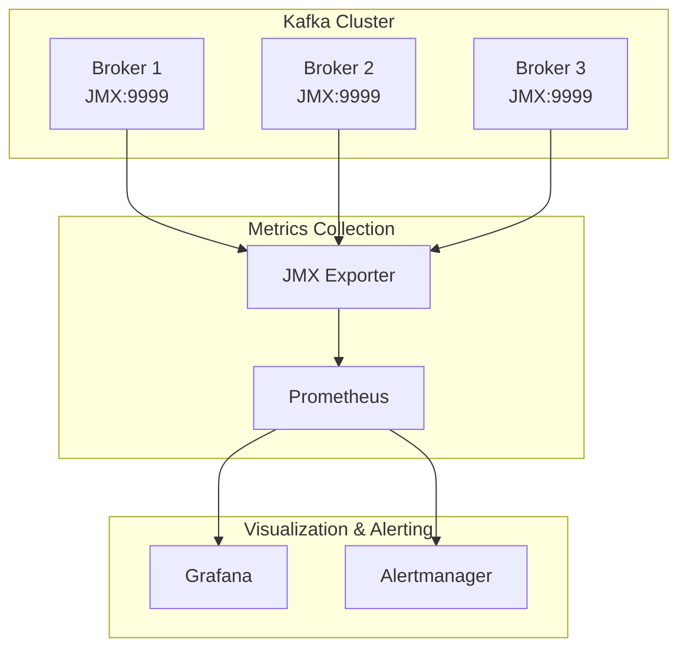
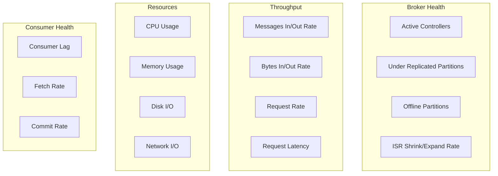

# How to Monitor Kafka with JMX Metrics

Author: [nawazdhandala](https://www.github.com/nawazdhandala)

Tags: Apache Kafka, JMX, Monitoring, Prometheus, Grafana, Observability, DevOps, Metrics

Description: Learn how to monitor Apache Kafka using JMX metrics, including setup, key metrics to track, alerting strategies, and Prometheus integration.

---

Java Management Extensions (JMX) provides comprehensive visibility into Kafka broker, producer, and consumer performance. This guide covers how to expose, collect, and visualize JMX metrics for effective Kafka monitoring.

## JMX Metrics Architecture



## Enabling JMX in Kafka

### Broker Configuration

Enable JMX when starting Kafka brokers:

```bash
# Set JMX environment variables before starting Kafka
export KAFKA_JMX_OPTS="-Dcom.sun.management.jmxremote \
    -Dcom.sun.management.jmxremote.authenticate=false \
    -Dcom.sun.management.jmxremote.ssl=false \
    -Dcom.sun.management.jmxremote.local.only=false \
    -Dcom.sun.management.jmxremote.port=9999 \
    -Dcom.sun.management.jmxremote.rmi.port=9999 \
    -Djava.rmi.server.hostname=localhost"

export JMX_PORT=9999

# Start Kafka
kafka-server-start.sh config/server.properties
```

For Docker deployments:

```yaml
# docker-compose.yml
services:
  kafka:
    image: confluentinc/cp-kafka:7.5.0
    ports:
      - "9092:9092"
      - "9999:9999"
    environment:
      KAFKA_BROKER_ID: 1
      KAFKA_ZOOKEEPER_CONNECT: zookeeper:2181
      KAFKA_ADVERTISED_LISTENERS: PLAINTEXT://kafka:9092
      KAFKA_JMX_PORT: 9999
      KAFKA_JMX_HOSTNAME: kafka
      KAFKA_JMX_OPTS: >-
        -Dcom.sun.management.jmxremote
        -Dcom.sun.management.jmxremote.authenticate=false
        -Dcom.sun.management.jmxremote.ssl=false
        -Dcom.sun.management.jmxremote.local.only=false
        -Dcom.sun.management.jmxremote.rmi.port=9999
```

### Securing JMX (Production)

For production environments, enable authentication and SSL:

```bash
# JMX with authentication and SSL
export KAFKA_JMX_OPTS="-Dcom.sun.management.jmxremote \
    -Dcom.sun.management.jmxremote.authenticate=true \
    -Dcom.sun.management.jmxremote.ssl=true \
    -Dcom.sun.management.jmxremote.port=9999 \
    -Dcom.sun.management.jmxremote.rmi.port=9999 \
    -Dcom.sun.management.jmxremote.password.file=/etc/kafka/jmxremote.password \
    -Dcom.sun.management.jmxremote.access.file=/etc/kafka/jmxremote.access \
    -Djavax.net.ssl.keyStore=/etc/kafka/jmx.keystore.jks \
    -Djavax.net.ssl.keyStorePassword=changeit \
    -Djavax.net.ssl.trustStore=/etc/kafka/jmx.truststore.jks \
    -Djavax.net.ssl.trustStorePassword=changeit"
```

Create access control files:

```bash
# /etc/kafka/jmxremote.access
monitorRole readonly
controlRole readwrite

# /etc/kafka/jmxremote.password
monitorRole monitorPassword
controlRole controlPassword

# Set permissions
chmod 400 /etc/kafka/jmxremote.password
chown kafka:kafka /etc/kafka/jmxremote.password
```

## Setting Up Prometheus JMX Exporter

The JMX Exporter converts JMX metrics to Prometheus format.

### JMX Exporter as Java Agent

Download and configure the JMX exporter:

```bash
# Download JMX exporter
wget https://repo1.maven.org/maven2/io/prometheus/jmx/jmx_prometheus_javaagent/0.19.0/jmx_prometheus_javaagent-0.19.0.jar

# Add to Kafka startup
export KAFKA_OPTS="-javaagent:/opt/jmx_prometheus_javaagent-0.19.0.jar=7071:/etc/kafka/jmx-exporter.yaml"
```

### JMX Exporter Configuration

Create a comprehensive JMX exporter configuration:

```yaml
# /etc/kafka/jmx-exporter.yaml
lowercaseOutputName: true
lowercaseOutputLabelNames: true

rules:
  # Broker metrics
  - pattern: kafka.server<type=BrokerTopicMetrics, name=(.+), topic=(.+)><>Count
    name: kafka_server_brokertopicmetrics_$1_total
    labels:
      topic: $2
    type: COUNTER

  - pattern: kafka.server<type=BrokerTopicMetrics, name=(.+)><>Count
    name: kafka_server_brokertopicmetrics_$1_total
    type: COUNTER

  - pattern: kafka.server<type=BrokerTopicMetrics, name=(.+), topic=(.+)><>OneMinuteRate
    name: kafka_server_brokertopicmetrics_$1_rate
    labels:
      topic: $2
    type: GAUGE

  # Request metrics
  - pattern: kafka.network<type=RequestMetrics, name=RequestsPerSec, request=(.+), version=(.+)><>Count
    name: kafka_network_requestmetrics_requests_total
    labels:
      request: $1
      version: $2
    type: COUNTER

  - pattern: kafka.network<type=RequestMetrics, name=TotalTimeMs, request=(.+)><>(\d+)thPercentile
    name: kafka_network_requestmetrics_totaltime_ms
    labels:
      request: $1
      quantile: 0.$2
    type: GAUGE

  # Partition metrics
  - pattern: kafka.server<type=ReplicaManager, name=(.+)><>Value
    name: kafka_server_replicamanager_$1
    type: GAUGE

  - pattern: kafka.server<type=ReplicaManager, name=(.+)><>Count
    name: kafka_server_replicamanager_$1_total
    type: COUNTER

  # Controller metrics
  - pattern: kafka.controller<type=KafkaController, name=(.+)><>Value
    name: kafka_controller_kafkacontroller_$1
    type: GAUGE

  - pattern: kafka.controller<type=ControllerStats, name=(.+)><>Count
    name: kafka_controller_controllerstats_$1_total
    type: COUNTER

  # Log metrics
  - pattern: kafka.log<type=LogFlushStats, name=LogFlushRateAndTimeMs><>Count
    name: kafka_log_logflushstats_logflush_total
    type: COUNTER

  - pattern: kafka.log<type=Log, name=Size, topic=(.+), partition=(.+)><>Value
    name: kafka_log_log_size_bytes
    labels:
      topic: $1
      partition: $2
    type: GAUGE

  # Consumer group metrics
  - pattern: kafka.server<type=GroupMetadataManager, name=(.+)><>Value
    name: kafka_server_groupmetadatamanager_$1
    type: GAUGE

  # ZooKeeper client metrics (if using ZooKeeper mode)
  - pattern: kafka.server<type=SessionExpireListener, name=(.+)><>Count
    name: kafka_server_sessionexpirelistener_$1_total
    type: COUNTER

  # JVM metrics
  - pattern: java.lang<type=Memory><HeapMemoryUsage>(\w+)
    name: jvm_memory_heap_$1_bytes
    type: GAUGE

  - pattern: java.lang<type=Memory><NonHeapMemoryUsage>(\w+)
    name: jvm_memory_nonheap_$1_bytes
    type: GAUGE

  - pattern: java.lang<type=GarbageCollector, name=(.+)><CollectionCount>
    name: jvm_gc_collection_count
    labels:
      gc: $1
    type: COUNTER

  - pattern: java.lang<type=GarbageCollector, name=(.+)><CollectionTime>
    name: jvm_gc_collection_time_ms
    labels:
      gc: $1
    type: COUNTER

  - pattern: java.lang<type=Threading><ThreadCount>
    name: jvm_threads_current
    type: GAUGE

  # Catch-all for remaining metrics
  - pattern: kafka.(\w+)<type=(.+), name=(.+)><>Value
    name: kafka_$1_$2_$3
    type: GAUGE

  - pattern: kafka.(\w+)<type=(.+), name=(.+)><>Count
    name: kafka_$1_$2_$3_total
    type: COUNTER
```

## Key Metrics to Monitor



### Critical Broker Metrics

| Metric | MBean | Description | Alert Threshold |
|--------|-------|-------------|-----------------|
| Under-replicated partitions | `kafka.server:type=ReplicaManager,name=UnderReplicatedPartitions` | Partitions below replication factor | > 0 |
| Offline partitions | `kafka.controller:type=KafkaController,name=OfflinePartitionsCount` | Partitions without leader | > 0 |
| Active controllers | `kafka.controller:type=KafkaController,name=ActiveControllerCount` | Should be exactly 1 | != 1 |
| ISR shrink rate | `kafka.server:type=ReplicaManager,name=IsrShrinksPerSec` | In-sync replica shrink events | Sudden increase |
| Leader election rate | `kafka.controller:type=ControllerStats,name=LeaderElectionRateAndTimeMs` | Leader elections per second | > 0 sustained |

### Request Performance Metrics

| Metric | MBean | Description | Alert Threshold |
|--------|-------|-------------|-----------------|
| Request queue size | `kafka.network:type=RequestChannel,name=RequestQueueSize` | Pending requests | > 10 |
| Response queue size | `kafka.network:type=RequestChannel,name=ResponseQueueSize` | Pending responses | > 10 |
| Produce latency 99th | `kafka.network:type=RequestMetrics,name=TotalTimeMs,request=Produce` | Produce request time | > 100ms |
| Fetch latency 99th | `kafka.network:type=RequestMetrics,name=TotalTimeMs,request=Fetch` | Fetch request time | > 100ms |

### Throughput Metrics

| Metric | MBean | Description |
|--------|-------|-------------|
| Messages in rate | `kafka.server:type=BrokerTopicMetrics,name=MessagesInPerSec` | Messages received per second |
| Bytes in rate | `kafka.server:type=BrokerTopicMetrics,name=BytesInPerSec` | Bytes received per second |
| Bytes out rate | `kafka.server:type=BrokerTopicMetrics,name=BytesOutPerSec` | Bytes sent per second |
| Fetch request rate | `kafka.network:type=RequestMetrics,name=RequestsPerSec,request=Fetch` | Fetch requests per second |

## Prometheus Configuration

Configure Prometheus to scrape Kafka metrics:

```yaml
# prometheus.yml
global:
  scrape_interval: 15s
  evaluation_interval: 15s

scrape_configs:
  # Kafka brokers
  - job_name: 'kafka'
    static_configs:
      - targets:
          - kafka-1:7071
          - kafka-2:7071
          - kafka-3:7071
    relabel_configs:
      - source_labels: [__address__]
        regex: '([^:]+):\d+'
        target_label: broker
        replacement: '${1}'

  # Kafka Connect
  - job_name: 'kafka-connect'
    static_configs:
      - targets:
          - connect-1:7072
          - connect-2:7072

  # Schema Registry
  - job_name: 'schema-registry'
    static_configs:
      - targets:
          - schema-registry:7073

  # ZooKeeper (if using ZooKeeper mode)
  - job_name: 'zookeeper'
    static_configs:
      - targets:
          - zk-1:7074
          - zk-2:7074
          - zk-3:7074
```

## Alerting Rules

Create Prometheus alerting rules for critical Kafka issues:

```yaml
# kafka-alerts.yaml
groups:
  - name: kafka-broker-alerts
    rules:
      # No active controller
      - alert: KafkaNoActiveController
        expr: sum(kafka_controller_kafkacontroller_activecontrollercount) != 1
        for: 1m
        labels:
          severity: critical
        annotations:
          summary: "No active Kafka controller"
          description: "There should be exactly 1 active controller, found {{ $value }}"

      # Offline partitions
      - alert: KafkaOfflinePartitions
        expr: sum(kafka_controller_kafkacontroller_offlinepartitionscount) > 0
        for: 1m
        labels:
          severity: critical
        annotations:
          summary: "Kafka has offline partitions"
          description: "{{ $value }} partitions are offline"

      # Under-replicated partitions
      - alert: KafkaUnderReplicatedPartitions
        expr: sum(kafka_server_replicamanager_underreplicatedpartitions) > 0
        for: 5m
        labels:
          severity: warning
        annotations:
          summary: "Kafka has under-replicated partitions"
          description: "{{ $value }} partitions are under-replicated"

      # ISR shrinking
      - alert: KafkaISRShrinking
        expr: sum(rate(kafka_server_replicamanager_isrshrinkspersec_total[5m])) > 0
        for: 10m
        labels:
          severity: warning
        annotations:
          summary: "Kafka ISR is shrinking"
          description: "In-sync replicas are shrinking, possible broker issues"

      # High request queue
      - alert: KafkaHighRequestQueueSize
        expr: kafka_network_requestchannel_requestqueuesize > 100
        for: 5m
        labels:
          severity: warning
        annotations:
          summary: "Kafka request queue is high"
          description: "Request queue size is {{ $value }} on {{ $labels.broker }}"

  - name: kafka-performance-alerts
    rules:
      # High produce latency
      - alert: KafkaHighProduceLatency
        expr: kafka_network_requestmetrics_totaltime_ms{request="Produce", quantile="0.99"} > 500
        for: 5m
        labels:
          severity: warning
        annotations:
          summary: "High Kafka produce latency"
          description: "99th percentile produce latency is {{ $value }}ms"

      # High fetch latency
      - alert: KafkaHighFetchLatency
        expr: kafka_network_requestmetrics_totaltime_ms{request="Fetch", quantile="0.99"} > 500
        for: 5m
        labels:
          severity: warning
        annotations:
          summary: "High Kafka fetch latency"
          description: "99th percentile fetch latency is {{ $value }}ms"

      # Low disk space
      - alert: KafkaLowDiskSpace
        expr: kafka_log_log_size_bytes / node_filesystem_size_bytes * 100 > 80
        for: 5m
        labels:
          severity: warning
        annotations:
          summary: "Kafka disk space running low"
          description: "Disk usage is at {{ $value }}%"

  - name: kafka-consumer-alerts
    rules:
      # High consumer lag
      - alert: KafkaConsumerLag
        expr: kafka_consumergroup_lag > 10000
        for: 5m
        labels:
          severity: warning
        annotations:
          summary: "High Kafka consumer lag"
          description: "Consumer group {{ $labels.consumergroup }} has lag of {{ $value }}"

      # Consumer group not active
      - alert: KafkaConsumerGroupInactive
        expr: kafka_consumergroup_members == 0
        for: 10m
        labels:
          severity: warning
        annotations:
          summary: "Kafka consumer group has no members"
          description: "Consumer group {{ $labels.consumergroup }} has no active members"
```

## Grafana Dashboard

Create a comprehensive Kafka dashboard:

```json
{
  "dashboard": {
    "title": "Kafka Cluster Overview",
    "panels": [
      {
        "title": "Active Controllers",
        "type": "stat",
        "targets": [
          {
            "expr": "sum(kafka_controller_kafkacontroller_activecontrollercount)",
            "legendFormat": "Active Controllers"
          }
        ],
        "fieldConfig": {
          "defaults": {
            "thresholds": {
              "steps": [
                {"color": "red", "value": 0},
                {"color": "green", "value": 1},
                {"color": "red", "value": 2}
              ]
            }
          }
        }
      },
      {
        "title": "Under-Replicated Partitions",
        "type": "stat",
        "targets": [
          {
            "expr": "sum(kafka_server_replicamanager_underreplicatedpartitions)",
            "legendFormat": "Under-replicated"
          }
        ],
        "fieldConfig": {
          "defaults": {
            "thresholds": {
              "steps": [
                {"color": "green", "value": 0},
                {"color": "yellow", "value": 1},
                {"color": "red", "value": 10}
              ]
            }
          }
        }
      },
      {
        "title": "Messages In Rate",
        "type": "graph",
        "targets": [
          {
            "expr": "sum(rate(kafka_server_brokertopicmetrics_messagesinpersec_total[5m])) by (broker)",
            "legendFormat": "{{ broker }}"
          }
        ]
      },
      {
        "title": "Bytes In/Out Rate",
        "type": "graph",
        "targets": [
          {
            "expr": "sum(rate(kafka_server_brokertopicmetrics_bytesinpersec_total[5m]))",
            "legendFormat": "Bytes In"
          },
          {
            "expr": "sum(rate(kafka_server_brokertopicmetrics_bytesoutpersec_total[5m]))",
            "legendFormat": "Bytes Out"
          }
        ]
      },
      {
        "title": "Request Latency (99th percentile)",
        "type": "graph",
        "targets": [
          {
            "expr": "kafka_network_requestmetrics_totaltime_ms{quantile=\"0.99\"}",
            "legendFormat": "{{ request }}"
          }
        ]
      },
      {
        "title": "Consumer Lag by Group",
        "type": "graph",
        "targets": [
          {
            "expr": "sum(kafka_consumergroup_lag) by (consumergroup)",
            "legendFormat": "{{ consumergroup }}"
          }
        ]
      },
      {
        "title": "JVM Heap Usage",
        "type": "graph",
        "targets": [
          {
            "expr": "jvm_memory_heap_used_bytes / jvm_memory_heap_max_bytes * 100",
            "legendFormat": "{{ broker }}"
          }
        ]
      },
      {
        "title": "GC Time",
        "type": "graph",
        "targets": [
          {
            "expr": "rate(jvm_gc_collection_time_ms[5m])",
            "legendFormat": "{{ broker }} - {{ gc }}"
          }
        ]
      }
    ]
  }
}
```

## Consumer Lag Monitoring

Monitor consumer lag with the Kafka Lag Exporter:

```yaml
# docker-compose.yml
services:
  kafka-lag-exporter:
    image: seglo/kafka-lag-exporter:latest
    environment:
      KAFKA_LAG_EXPORTER_BOOTSTRAP_SERVERS: kafka-1:9092,kafka-2:9092,kafka-3:9092
      KAFKA_LAG_EXPORTER_CLUSTERS_0_NAME: main-cluster
      KAFKA_LAG_EXPORTER_CLUSTERS_0_BOOTSTRAP_SERVERS: kafka-1:9092,kafka-2:9092,kafka-3:9092
    ports:
      - "8000:8000"
```

Or use Burrow for advanced lag monitoring:

```yaml
# burrow.toml
[general]
pidfile="burrow.pid"
stdout-logfile="burrow.out"

[logging]
filename="burrow.log"
level="info"

[zookeeper]
servers=["zk-1:2181", "zk-2:2181", "zk-3:2181"]
timeout=6
root-path="/burrow"

[client-profile.kafka-profile]
kafka-version="2.8.0"
client-id="burrow-client"

[cluster.main]
class-name="kafka"
client-profile="kafka-profile"
servers=["kafka-1:9092", "kafka-2:9092", "kafka-3:9092"]
topic-refresh=60
offset-refresh=30

[consumer.main]
class-name="kafka"
cluster="main"
servers=["kafka-1:9092", "kafka-2:9092", "kafka-3:9092"]
client-profile="kafka-profile"
group-allowlist=".*"
offset-refresh=30

[httpserver.default]
address=":8000"
```

## Complete Monitoring Stack

Deploy a complete monitoring stack with Docker Compose:

```yaml
# docker-compose-monitoring.yml
version: '3.8'

services:
  prometheus:
    image: prom/prometheus:latest
    volumes:
      - ./prometheus.yml:/etc/prometheus/prometheus.yml
      - ./kafka-alerts.yaml:/etc/prometheus/kafka-alerts.yaml
      - prometheus-data:/prometheus
    command:
      - '--config.file=/etc/prometheus/prometheus.yml'
      - '--storage.tsdb.path=/prometheus'
      - '--web.enable-lifecycle'
    ports:
      - "9090:9090"

  grafana:
    image: grafana/grafana:latest
    volumes:
      - grafana-data:/var/lib/grafana
      - ./grafana/provisioning:/etc/grafana/provisioning
    environment:
      GF_SECURITY_ADMIN_PASSWORD: admin
      GF_INSTALL_PLUGINS: grafana-piechart-panel
    ports:
      - "3000:3000"

  alertmanager:
    image: prom/alertmanager:latest
    volumes:
      - ./alertmanager.yml:/etc/alertmanager/alertmanager.yml
    ports:
      - "9093:9093"

  kafka-lag-exporter:
    image: seglo/kafka-lag-exporter:latest
    environment:
      KAFKA_LAG_EXPORTER_CLUSTERS_0_NAME: main
      KAFKA_LAG_EXPORTER_CLUSTERS_0_BOOTSTRAP_SERVERS: kafka-1:9092,kafka-2:9092,kafka-3:9092
    ports:
      - "8000:8000"

volumes:
  prometheus-data:
  grafana-data:
```

## Querying JMX Directly

For debugging, query JMX metrics directly:

```bash
# Using jmxterm
java -jar jmxterm.jar -l kafka-1:9999

# List all MBeans
beans

# Get specific metric
get -b kafka.server:type=BrokerTopicMetrics,name=MessagesInPerSec OneMinuteRate

# Using JConsole (GUI)
jconsole kafka-1:9999

# Using cmdline-jmxclient
java -jar cmdline-jmxclient.jar - kafka-1:9999 \
    kafka.server:type=ReplicaManager,name=UnderReplicatedPartitions
```

## Best Practices

1. **Monitor all critical metrics** - Under-replicated partitions, offline partitions, active controllers
2. **Set appropriate alert thresholds** - Balance between noise and missing issues
3. **Track consumer lag** - Critical for end-to-end latency monitoring
4. **Monitor JVM metrics** - GC pauses impact Kafka performance
5. **Use histograms for latency** - Track percentiles, not just averages
6. **Retain metrics history** - Enable trend analysis and capacity planning
7. **Secure JMX endpoints** - Enable authentication in production
8. **Correlate with logs** - Link metrics to log events for debugging
9. **Dashboard for different audiences** - Ops, developers, business
10. **Test alerting regularly** - Ensure alerts reach the right people

---

Effective Kafka monitoring with JMX metrics provides visibility into cluster health, performance, and consumer behavior. By setting up proper metrics collection, alerting, and visualization, you can detect and resolve issues before they impact your applications. Start with critical metrics like under-replicated partitions and consumer lag, then expand coverage as your monitoring matures.
