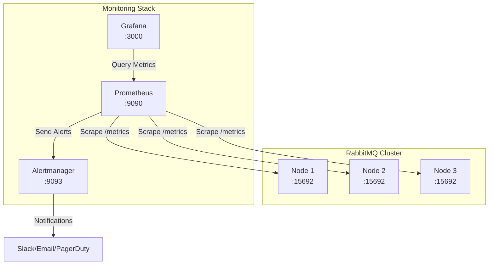
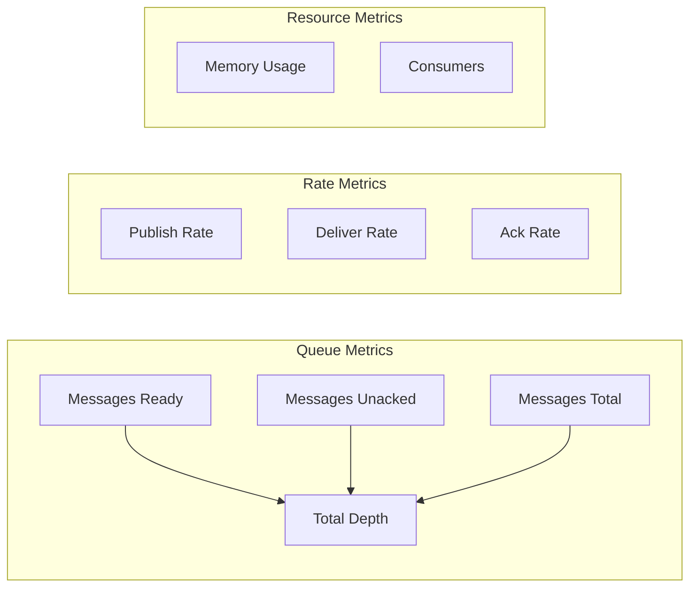
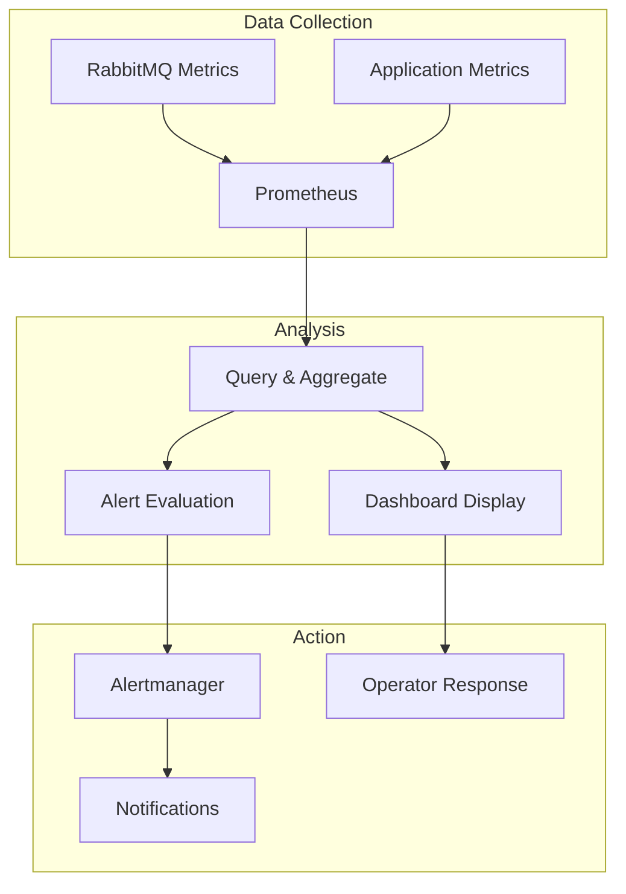

# How to Monitor RabbitMQ with Prometheus

Author: [nawazdhandala](https://www.github.com/nawazdhandala)

Tags: RabbitMQ, Prometheus, Monitoring, Metrics, Grafana, Observability, Message Queue, DevOps

Description: A complete guide to setting up Prometheus monitoring for RabbitMQ, including metric collection, alerting rules, and Grafana dashboards.

---

> Effective monitoring is essential for maintaining healthy RabbitMQ clusters. Prometheus provides a powerful metrics collection and alerting system that integrates seamlessly with RabbitMQ's built-in metrics endpoint. This guide covers the complete setup from enabling metrics to creating actionable dashboards.

RabbitMQ 3.8+ includes native Prometheus metrics support, making it straightforward to collect detailed metrics about your message broker's performance, queue depths, connection counts, and resource utilization.

---

## Architecture Overview



---

## Enabling Prometheus Metrics in RabbitMQ

### Method 1: Enable the Plugin

```bash
# Enable the Prometheus plugin on all nodes
rabbitmq-plugins enable rabbitmq_prometheus

# Verify the plugin is enabled
rabbitmq-plugins list | grep prometheus

# Check that metrics endpoint is accessible
curl http://localhost:15692/metrics
```

### Method 2: Configuration File

```erlang
%% rabbitmq.conf

%% Enable Prometheus plugin
prometheus.return_per_object_metrics = true
prometheus.path = /metrics

%% Configure metrics port (default is 15692)
prometheus.tcp.port = 15692

%% Enable detailed per-queue metrics
prometheus.return_per_object_metrics = true
```

### Metrics Endpoint Verification

```bash
# Test the metrics endpoint
curl -s http://localhost:15692/metrics | head -50

# Check specific metric families
curl -s http://localhost:15692/metrics | grep "rabbitmq_queue_messages"

# Get metrics in different formats
curl -s http://localhost:15692/metrics/detailed
curl -s http://localhost:15692/metrics/per-object
```

---

## Configuring Prometheus

### Basic Prometheus Configuration

```yaml
# prometheus.yml
global:
  scrape_interval: 15s
  evaluation_interval: 15s

alerting:
  alertmanagers:
    - static_configs:
        - targets:
          - alertmanager:9093

rule_files:
  - "rabbitmq_alerts.yml"

scrape_configs:
  # Scrape RabbitMQ cluster nodes
  - job_name: 'rabbitmq'
    # More frequent scraping for message queues
    scrape_interval: 10s
    scrape_timeout: 10s

    static_configs:
      - targets:
          - rabbitmq-node1:15692
          - rabbitmq-node2:15692
          - rabbitmq-node3:15692
        labels:
          cluster: 'production'

    # Relabel to add node name
    relabel_configs:
      - source_labels: [__address__]
        target_label: instance
        regex: '([^:]+):\d+'
        replacement: '${1}'
```

### Service Discovery Configuration

```yaml
# prometheus.yml - Using Kubernetes service discovery
scrape_configs:
  - job_name: 'rabbitmq-k8s'
    kubernetes_sd_configs:
      - role: endpoints
        namespaces:
          names:
            - messaging

    relabel_configs:
      # Keep only RabbitMQ endpoints
      - source_labels: [__meta_kubernetes_service_name]
        regex: rabbitmq
        action: keep

      # Use the Prometheus metrics port
      - source_labels: [__meta_kubernetes_endpoint_port_name]
        regex: prometheus
        action: keep

      # Add pod name as label
      - source_labels: [__meta_kubernetes_pod_name]
        target_label: pod

      # Add node name as label
      - source_labels: [__meta_kubernetes_pod_node_name]
        target_label: kubernetes_node
```

### Docker Compose Setup

```yaml
# docker-compose.yml
version: '3.8'

services:
  rabbitmq:
    image: rabbitmq:3.12-management
    ports:
      - "5672:5672"
      - "15672:15672"
      - "15692:15692"
    environment:
      RABBITMQ_DEFAULT_USER: admin
      RABBITMQ_DEFAULT_PASS: admin
    command: >
      bash -c "rabbitmq-plugins enable rabbitmq_prometheus &&
               rabbitmq-server"
    volumes:
      - rabbitmq_data:/var/lib/rabbitmq
    networks:
      - monitoring

  prometheus:
    image: prom/prometheus:v2.47.0
    ports:
      - "9090:9090"
    volumes:
      - ./prometheus.yml:/etc/prometheus/prometheus.yml
      - ./rabbitmq_alerts.yml:/etc/prometheus/rabbitmq_alerts.yml
      - prometheus_data:/prometheus
    command:
      - '--config.file=/etc/prometheus/prometheus.yml'
      - '--storage.tsdb.path=/prometheus'
      - '--web.enable-lifecycle'
    networks:
      - monitoring

  grafana:
    image: grafana/grafana:10.1.0
    ports:
      - "3000:3000"
    environment:
      GF_SECURITY_ADMIN_PASSWORD: admin
    volumes:
      - grafana_data:/var/lib/grafana
      - ./grafana/provisioning:/etc/grafana/provisioning
    networks:
      - monitoring

  alertmanager:
    image: prom/alertmanager:v0.26.0
    ports:
      - "9093:9093"
    volumes:
      - ./alertmanager.yml:/etc/alertmanager/alertmanager.yml
    networks:
      - monitoring

volumes:
  rabbitmq_data:
  prometheus_data:
  grafana_data:

networks:
  monitoring:
    driver: bridge
```

---

## Key RabbitMQ Metrics

### Queue Metrics



### Important Metrics Reference

```promql
# Queue depth - messages ready to be delivered
rabbitmq_queue_messages_ready

# Unacknowledged messages - being processed
rabbitmq_queue_messages_unacked

# Total messages in queue
rabbitmq_queue_messages

# Message rates (per second)
rabbitmq_queue_messages_published_total
rabbitmq_queue_messages_delivered_total
rabbitmq_queue_messages_acknowledged_total
rabbitmq_queue_messages_redelivered_total

# Connection metrics
rabbitmq_connections
rabbitmq_connections_opened_total
rabbitmq_connections_closed_total

# Channel metrics
rabbitmq_channels
rabbitmq_channels_opened_total
rabbitmq_channels_closed_total

# Consumer metrics
rabbitmq_consumers

# Memory metrics
rabbitmq_process_resident_memory_bytes
rabbitmq_resident_memory_limit_bytes

# Disk metrics
rabbitmq_disk_space_available_bytes
rabbitmq_disk_space_available_limit_bytes

# Erlang VM metrics
rabbitmq_erlang_processes_used
rabbitmq_erlang_gc_runs_total
rabbitmq_erlang_scheduler_run_queue
```

---

## Alerting Rules

### Alert Configuration File

```yaml
# rabbitmq_alerts.yml
groups:
  - name: rabbitmq_cluster_health
    rules:
      # Alert when a node is down
      - alert: RabbitMQNodeDown
        expr: up{job="rabbitmq"} == 0
        for: 1m
        labels:
          severity: critical
        annotations:
          summary: "RabbitMQ node {{ $labels.instance }} is down"
          description: "RabbitMQ node has been unreachable for more than 1 minute."

      # Alert on memory alarm
      - alert: RabbitMQMemoryAlarm
        expr: rabbitmq_alarms_memory_used_watermark == 1
        for: 0m
        labels:
          severity: critical
        annotations:
          summary: "RabbitMQ memory alarm on {{ $labels.instance }}"
          description: "Memory usage has exceeded the high watermark threshold."

      # Alert on disk alarm
      - alert: RabbitMQDiskAlarm
        expr: rabbitmq_alarms_free_disk_space_watermark == 1
        for: 0m
        labels:
          severity: critical
        annotations:
          summary: "RabbitMQ disk alarm on {{ $labels.instance }}"
          description: "Disk free space is below the configured threshold."

  - name: rabbitmq_queue_health
    rules:
      # Alert on high queue depth
      - alert: RabbitMQQueueDepthHigh
        expr: rabbitmq_queue_messages > 10000
        for: 5m
        labels:
          severity: warning
        annotations:
          summary: "Queue {{ $labels.queue }} has high message count"
          description: "Queue has {{ $value }} messages (threshold: 10000)"

      # Alert on queue growing rapidly
      - alert: RabbitMQQueueGrowing
        expr: |
          rate(rabbitmq_queue_messages[5m]) > 100
          and
          rabbitmq_queue_messages > 1000
        for: 10m
        labels:
          severity: warning
        annotations:
          summary: "Queue {{ $labels.queue }} is growing rapidly"
          description: "Queue is growing at {{ $value }} messages/second"

      # Alert on no consumers
      - alert: RabbitMQQueueNoConsumers
        expr: |
          rabbitmq_queue_consumers == 0
          and
          rabbitmq_queue_messages > 0
        for: 5m
        labels:
          severity: warning
        annotations:
          summary: "Queue {{ $labels.queue }} has no consumers"
          description: "Queue has {{ $value }} messages but no consumers"

  - name: rabbitmq_connection_health
    rules:
      # Alert on too many connections
      - alert: RabbitMQTooManyConnections
        expr: rabbitmq_connections > 1000
        for: 5m
        labels:
          severity: warning
        annotations:
          summary: "Too many connections on {{ $labels.instance }}"
          description: "Current connections: {{ $value }}"

      # Alert on blocked connections
      - alert: RabbitMQConnectionsBlocked
        expr: rabbitmq_connections_state{state="blocked"} > 0
        for: 2m
        labels:
          severity: critical
        annotations:
          summary: "Blocked connections on {{ $labels.instance }}"
          description: "{{ $value }} connections are blocked"

  - name: rabbitmq_performance
    rules:
      # Alert on high message rate
      - alert: RabbitMQHighPublishRate
        expr: |
          sum(rate(rabbitmq_queue_messages_published_total[1m])) by (instance) > 10000
        for: 5m
        labels:
          severity: info
        annotations:
          summary: "High publish rate on {{ $labels.instance }}"
          description: "Publishing {{ $value }} messages/second"

      # Alert on consumer lag
      - alert: RabbitMQConsumerLag
        expr: |
          (
            rate(rabbitmq_queue_messages_published_total[5m])
            -
            rate(rabbitmq_queue_messages_acknowledged_total[5m])
          ) > 100
        for: 10m
        labels:
          severity: warning
        annotations:
          summary: "Consumer lag detected on {{ $labels.queue }}"
          description: "Consumers are falling behind by {{ $value }} messages/second"

  - name: rabbitmq_resources
    rules:
      # Memory usage warning
      - alert: RabbitMQMemoryUsageHigh
        expr: |
          (rabbitmq_process_resident_memory_bytes / rabbitmq_resident_memory_limit_bytes) > 0.8
        for: 5m
        labels:
          severity: warning
        annotations:
          summary: "High memory usage on {{ $labels.instance }}"
          description: "Memory usage is at {{ $value | humanizePercentage }}"

      # File descriptor warning
      - alert: RabbitMQFileDescriptorsHigh
        expr: |
          (rabbitmq_process_open_fds / rabbitmq_process_max_fds) > 0.8
        for: 5m
        labels:
          severity: warning
        annotations:
          summary: "High file descriptor usage on {{ $labels.instance }}"
          description: "FD usage is at {{ $value | humanizePercentage }}"
```

---

## Grafana Dashboards

### Dashboard JSON Configuration

```json
{
  "dashboard": {
    "title": "RabbitMQ Overview",
    "uid": "rabbitmq-overview",
    "panels": [
      {
        "title": "Total Messages",
        "type": "stat",
        "gridPos": {"h": 4, "w": 6, "x": 0, "y": 0},
        "targets": [
          {
            "expr": "sum(rabbitmq_queue_messages)",
            "legendFormat": "Messages"
          }
        ],
        "fieldConfig": {
          "defaults": {
            "thresholds": {
              "steps": [
                {"color": "green", "value": null},
                {"color": "yellow", "value": 10000},
                {"color": "red", "value": 100000}
              ]
            }
          }
        }
      },
      {
        "title": "Connections",
        "type": "stat",
        "gridPos": {"h": 4, "w": 6, "x": 6, "y": 0},
        "targets": [
          {
            "expr": "sum(rabbitmq_connections)",
            "legendFormat": "Connections"
          }
        ]
      },
      {
        "title": "Message Rate",
        "type": "graph",
        "gridPos": {"h": 8, "w": 12, "x": 0, "y": 4},
        "targets": [
          {
            "expr": "sum(rate(rabbitmq_queue_messages_published_total[1m]))",
            "legendFormat": "Published/s"
          },
          {
            "expr": "sum(rate(rabbitmq_queue_messages_delivered_total[1m]))",
            "legendFormat": "Delivered/s"
          },
          {
            "expr": "sum(rate(rabbitmq_queue_messages_acknowledged_total[1m]))",
            "legendFormat": "Acknowledged/s"
          }
        ]
      },
      {
        "title": "Queue Depth by Queue",
        "type": "graph",
        "gridPos": {"h": 8, "w": 12, "x": 12, "y": 4},
        "targets": [
          {
            "expr": "topk(10, rabbitmq_queue_messages)",
            "legendFormat": "{{ queue }}"
          }
        ]
      },
      {
        "title": "Memory Usage",
        "type": "gauge",
        "gridPos": {"h": 6, "w": 6, "x": 0, "y": 12},
        "targets": [
          {
            "expr": "rabbitmq_process_resident_memory_bytes / rabbitmq_resident_memory_limit_bytes",
            "legendFormat": "Memory %"
          }
        ],
        "fieldConfig": {
          "defaults": {
            "max": 1,
            "thresholds": {
              "steps": [
                {"color": "green", "value": null},
                {"color": "yellow", "value": 0.6},
                {"color": "red", "value": 0.8}
              ]
            },
            "unit": "percentunit"
          }
        }
      }
    ]
  }
}
```

### Grafana Provisioning

```yaml
# grafana/provisioning/datasources/datasources.yml
apiVersion: 1

datasources:
  - name: Prometheus
    type: prometheus
    access: proxy
    url: http://prometheus:9090
    isDefault: true
    editable: false
```

```yaml
# grafana/provisioning/dashboards/dashboards.yml
apiVersion: 1

providers:
  - name: 'RabbitMQ'
    orgId: 1
    folder: 'RabbitMQ'
    type: file
    disableDeletion: false
    updateIntervalSeconds: 30
    options:
      path: /etc/grafana/provisioning/dashboards
```

---

## Useful PromQL Queries

### Queue Health Queries

```promql
# Top 10 queues by message count
topk(10, rabbitmq_queue_messages)

# Queues with no consumers
rabbitmq_queue_messages > 0 and rabbitmq_queue_consumers == 0

# Queue depth over time (5 minute moving average)
avg_over_time(rabbitmq_queue_messages[5m])

# Message accumulation rate
rate(rabbitmq_queue_messages[5m])

# Consumer utilization (messages delivered per consumer)
rate(rabbitmq_queue_messages_delivered_total[5m]) / rabbitmq_queue_consumers
```

### Performance Queries

```promql
# Overall publish rate across all queues
sum(rate(rabbitmq_queue_messages_published_total[1m]))

# Publish vs consume rate (positive = growing)
sum(rate(rabbitmq_queue_messages_published_total[5m]))
-
sum(rate(rabbitmq_queue_messages_acknowledged_total[5m]))

# Average message latency (requires application-level metrics)
histogram_quantile(0.95,
  sum(rate(message_processing_duration_bucket[5m])) by (le, queue)
)

# Redelivery rate (indicates consumer failures)
rate(rabbitmq_queue_messages_redelivered_total[5m])
```

### Cluster Health Queries

```promql
# Node count (should match expected cluster size)
count(up{job="rabbitmq"})

# Memory pressure across cluster
max(rabbitmq_process_resident_memory_bytes / rabbitmq_resident_memory_limit_bytes)

# Disk space available (minimum across nodes)
min(rabbitmq_disk_space_available_bytes)

# Connection distribution across nodes
rabbitmq_connections by (instance)

# Erlang process count (high values may indicate issues)
rabbitmq_erlang_processes_used
```

---

## Custom Metrics with Python

### Publishing Custom Metrics

```python
from prometheus_client import start_http_server, Counter, Gauge, Histogram
import pika
import time

# Define custom metrics
messages_published = Counter(
    'app_rabbitmq_messages_published_total',
    'Total messages published',
    ['queue', 'status']
)

message_size = Histogram(
    'app_rabbitmq_message_size_bytes',
    'Size of published messages',
    ['queue'],
    buckets=[100, 500, 1000, 5000, 10000, 50000, 100000]
)

publish_latency = Histogram(
    'app_rabbitmq_publish_latency_seconds',
    'Time to publish message',
    ['queue'],
    buckets=[0.001, 0.005, 0.01, 0.025, 0.05, 0.1, 0.25, 0.5, 1.0]
)

connection_status = Gauge(
    'app_rabbitmq_connection_status',
    'Connection status (1=connected, 0=disconnected)'
)

class InstrumentedPublisher:
    def __init__(self, host='localhost'):
        self.host = host
        self.connection = None
        self.channel = None

    def connect(self):
        try:
            self.connection = pika.BlockingConnection(
                pika.ConnectionParameters(self.host)
            )
            self.channel = self.connection.channel()
            self.channel.confirm_delivery()
            connection_status.set(1)
        except Exception as e:
            connection_status.set(0)
            raise e

    def publish(self, queue, message):
        start_time = time.time()

        try:
            # Record message size
            message_bytes = message.encode() if isinstance(message, str) else message
            message_size.labels(queue=queue).observe(len(message_bytes))

            # Publish message
            self.channel.basic_publish(
                exchange='',
                routing_key=queue,
                body=message_bytes,
                properties=pika.BasicProperties(delivery_mode=2)
            )

            # Record success
            messages_published.labels(queue=queue, status='success').inc()

        except Exception as e:
            # Record failure
            messages_published.labels(queue=queue, status='failure').inc()
            raise e

        finally:
            # Record latency
            duration = time.time() - start_time
            publish_latency.labels(queue=queue).observe(duration)

# Start metrics server
start_http_server(8000)

# Use the instrumented publisher
publisher = InstrumentedPublisher()
publisher.connect()

while True:
    publisher.publish('test-queue', 'Hello World')
    time.sleep(0.1)
```

### Consumer Metrics

```python
from prometheus_client import start_http_server, Counter, Histogram, Gauge
import pika
import time

# Consumer metrics
messages_consumed = Counter(
    'app_rabbitmq_messages_consumed_total',
    'Total messages consumed',
    ['queue', 'status']
)

processing_time = Histogram(
    'app_rabbitmq_processing_time_seconds',
    'Time to process message',
    ['queue'],
    buckets=[0.01, 0.05, 0.1, 0.25, 0.5, 1.0, 2.5, 5.0, 10.0]
)

queue_depth = Gauge(
    'app_rabbitmq_queue_depth',
    'Current queue depth (local view)',
    ['queue']
)

consumer_lag = Gauge(
    'app_rabbitmq_consumer_lag_messages',
    'Estimated consumer lag',
    ['queue']
)

class InstrumentedConsumer:
    def __init__(self, host='localhost'):
        self.host = host
        self.connection = None
        self.channel = None

    def connect(self):
        self.connection = pika.BlockingConnection(
            pika.ConnectionParameters(self.host)
        )
        self.channel = self.connection.channel()
        self.channel.basic_qos(prefetch_count=10)

    def consume(self, queue, callback):
        # Declare queue and get message count
        result = self.channel.queue_declare(queue=queue, passive=True)
        queue_depth.labels(queue=queue).set(result.method.message_count)

        def wrapped_callback(ch, method, properties, body):
            start_time = time.time()

            try:
                # Call actual callback
                callback(body)

                # Acknowledge message
                ch.basic_ack(delivery_tag=method.delivery_tag)
                messages_consumed.labels(queue=queue, status='success').inc()

            except Exception as e:
                # Reject message
                ch.basic_nack(delivery_tag=method.delivery_tag, requeue=True)
                messages_consumed.labels(queue=queue, status='failure').inc()

            finally:
                duration = time.time() - start_time
                processing_time.labels(queue=queue).observe(duration)

                # Update queue depth estimate
                queue_depth.labels(queue=queue).dec()

        self.channel.basic_consume(
            queue=queue,
            on_message_callback=wrapped_callback,
            auto_ack=False
        )

        self.channel.start_consuming()

# Start metrics server
start_http_server(8001)

# Define message handler
def process_message(body):
    print(f"Processing: {body[:50]}")
    time.sleep(0.1)  # Simulate work

# Start consumer
consumer = InstrumentedConsumer()
consumer.connect()
consumer.consume('test-queue', process_message)
```

---

## Monitoring Best Practices

### Metrics Collection Flow



### Retention and Sampling

```yaml
# prometheus.yml - Storage configuration
global:
  scrape_interval: 15s

storage:
  tsdb:
    # Retain metrics for 30 days
    retention.time: 30d
    # Limit storage size
    retention.size: 50GB
```

### Recording Rules for Performance

```yaml
# recording_rules.yml
groups:
  - name: rabbitmq_aggregations
    interval: 30s
    rules:
      # Pre-compute total messages
      - record: rabbitmq:queue_messages:total
        expr: sum(rabbitmq_queue_messages)

      # Pre-compute message rate
      - record: rabbitmq:messages_published:rate5m
        expr: sum(rate(rabbitmq_queue_messages_published_total[5m]))

      # Pre-compute consumer lag
      - record: rabbitmq:consumer_lag:rate5m
        expr: |
          sum(rate(rabbitmq_queue_messages_published_total[5m]))
          -
          sum(rate(rabbitmq_queue_messages_acknowledged_total[5m]))
```

---

## Conclusion

Effective RabbitMQ monitoring with Prometheus provides visibility into queue health, message throughput, and resource utilization. By setting up proper metrics collection, alerting rules, and dashboards, you can proactively identify issues before they impact your applications.

Key takeaways:
- Enable the rabbitmq_prometheus plugin for native metrics
- Configure Prometheus to scrape all cluster nodes
- Set up alerts for memory, disk, and queue depth thresholds
- Use Grafana dashboards for visualization
- Add application-level metrics for end-to-end visibility

---

*Looking for comprehensive RabbitMQ monitoring? [OneUptime](https://oneuptime.com) integrates with Prometheus to provide unified monitoring, alerting, and incident management for your message queue infrastructure.*

**Related Reading:**
- [How to Configure RabbitMQ Quorum Queues](https://oneuptime.com/blog)
- [How to Fix "Connection Blocked" Errors in RabbitMQ](https://oneuptime.com/blog)
