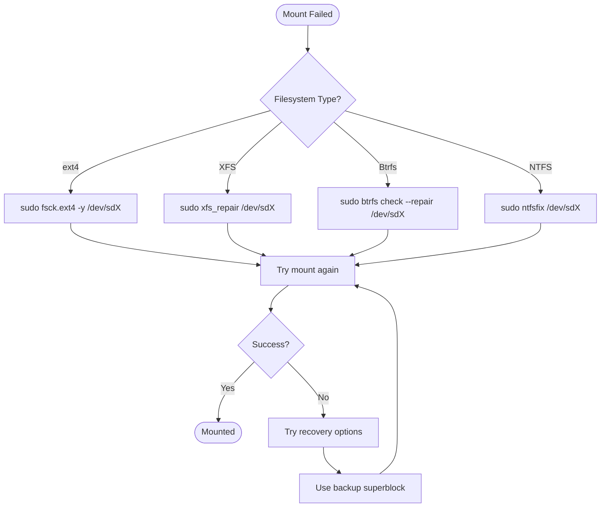
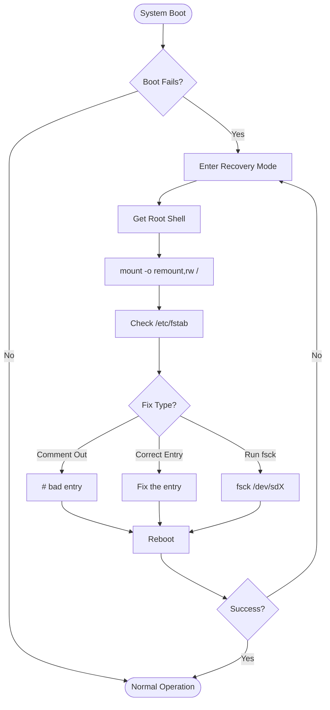

# How to Fix "Mount Failed" File System Errors

Author: [nawazdhandala](https://www.github.com/nawazdhandala)

Tags: Mount, File System, Linux, Troubleshooting, fstab, ext4, XFS, NFS, System Administration

Description: Learn how to diagnose and fix common mount failed errors including corrupted filesystems, fstab misconfigurations, and permission issues on Linux systems.

---

> A failed mount can prevent your system from booting or block access to critical data. Whether it is a corrupted filesystem, a misconfigured fstab entry, or a hardware issue, knowing how to diagnose and fix mount errors is essential for any system administrator.

Your server is stuck at boot with "mount failed" errors. Let's get it back up and running.

---

## Understanding the Mount Process

When Linux mounts a filesystem, several components work together:

```mermaid
flowchart TD
    subgraph "Mount Request"
        User[User/System]
        Mount[mount command]
        Fstab[/etc/fstab]
    end

    subgraph "Kernel"
        VFS[Virtual File System]
        FSDriver[Filesystem Driver]
        BlockLayer[Block Layer]
    end

    subgraph "Storage"
        Device[Block Device]
        FS[Filesystem]
    end

    User --> Mount
    Mount --> Fstab
    Fstab --> VFS
    Mount --> VFS
    VFS --> FSDriver
    FSDriver --> BlockLayer
    BlockLayer --> Device
    Device --> FS

    VFS -->|Success| Mounted[Mounted at mountpoint]
    VFS -->|Failure| Error[Mount Failed]
```

---

## Common Mount Error Messages

Different errors require different solutions:

| Error Message | Typical Cause | Solution |
|--------------|---------------|----------|
| `mount: wrong fs type` | Incorrect filesystem type | Specify correct type with `-t` |
| `mount: special device does not exist` | Device path incorrect or missing | Verify device exists |
| `mount: structure needs cleaning` | Filesystem corruption | Run fsck |
| `mount: can't find in /etc/fstab` | Entry missing from fstab | Add entry or use full mount command |
| `mount: permission denied` | Permission or SELinux issue | Check permissions and contexts |
| `mount: already mounted` | Device already in use | Unmount first or check mtab |
| `mount: /mnt: mount point does not exist` | Directory missing | Create the mount point |

---

## Initial Diagnosis

Start with these commands to understand the problem:

```bash
# Check current mounts
mount | column -t

# View mount errors in system log
sudo dmesg | grep -i mount
sudo journalctl -b | grep -i mount

# Check fstab syntax
cat /etc/fstab

# Verify device exists
ls -la /dev/sd*
lsblk

# Check filesystem type
sudo blkid /dev/sda1

# Test mount manually with verbose output
sudo mount -v /dev/sda1 /mnt
```

---

## Error 1: Wrong Filesystem Type

This error occurs when the mount command cannot identify or use the filesystem:

```bash
# Error message
mount: /mnt: wrong fs type, bad option, bad superblock on /dev/sdb1

# Solution 1: Specify filesystem type explicitly
sudo mount -t ext4 /dev/sdb1 /mnt
sudo mount -t xfs /dev/sdb1 /mnt
sudo mount -t ntfs-3g /dev/sdb1 /mnt

# Solution 2: Check actual filesystem type
sudo blkid /dev/sdb1
# Output: /dev/sdb1: UUID="xxx" TYPE="xfs"

# Solution 3: Install missing filesystem driver
# For NTFS
sudo apt install ntfs-3g

# For exFAT
sudo apt install exfat-fuse exfat-utils

# For Btrfs
sudo apt install btrfs-progs
```

---

## Error 2: Filesystem Corruption

When the filesystem is corrupted, you need to run fsck:

```bash
# Error message
mount: /dev/sdb1: can't read superblock
# or
mount: structure needs cleaning

# Step 1: Unmount the filesystem (if mounted)
sudo umount /dev/sdb1

# Step 2: Check and repair ext4 filesystem
sudo fsck.ext4 -y /dev/sdb1

# For XFS filesystem
sudo xfs_repair /dev/sdb1

# For Btrfs filesystem
sudo btrfs check --repair /dev/sdb1

# Step 3: Try mounting again
sudo mount /dev/sdb1 /mnt
```

Filesystem repair flowchart:



### Advanced ext4 Recovery

```bash
# Find backup superblock locations
sudo mke2fs -n /dev/sdb1

# Output shows backup superblocks:
# Superblock backups stored on blocks:
#     32768, 98304, 163840, 229376, 294912

# Use backup superblock for repair
sudo e2fsck -b 32768 /dev/sdb1

# Force check even if filesystem seems clean
sudo e2fsck -f /dev/sdb1
```

### Advanced XFS Recovery

```bash
# Check XFS filesystem
sudo xfs_repair -n /dev/sdb1  # dry run first

# Repair XFS filesystem
sudo xfs_repair /dev/sdb1

# If xfs_repair fails, try clearing the log
sudo xfs_repair -L /dev/sdb1  # WARNING: loses log data

# Mount with recovery disabled (read-only)
sudo mount -o ro,norecovery /dev/sdb1 /mnt
```

---

## Error 3: Device Does Not Exist

The specified device path is not found:

```bash
# Error message
mount: special device /dev/sdb1 does not exist

# Step 1: List all block devices
lsblk
ls -la /dev/sd*
ls -la /dev/nvme*

# Step 2: Check if device was renamed
dmesg | grep -E "sd|nvme"

# Step 3: Find device by UUID (more reliable)
sudo blkid

# Step 4: Update fstab to use UUID instead of device path
# Before: /dev/sdb1  /data  ext4  defaults  0  2
# After:  UUID=abc-123  /data  ext4  defaults  0  2

# Mount using UUID
sudo mount UUID=abc-123-def-456 /data
```

---

## Error 4: Mount Point Does Not Exist

The target directory for mounting is missing:

```bash
# Error message
mount: /data: mount point does not exist

# Solution: Create the mount point
sudo mkdir -p /data

# Set appropriate ownership if needed
sudo chown user:group /data

# Now mount
sudo mount /dev/sdb1 /data
```

---

## Error 5: Already Mounted

The device is already mounted somewhere:

```bash
# Error message
mount: /dev/sdb1 is already mounted or /mnt busy

# Check where it's mounted
mount | grep sdb1
findmnt /dev/sdb1

# Option 1: Unmount first
sudo umount /dev/sdb1

# Option 2: If busy, find what's using it
sudo lsof +D /mnt
sudo fuser -mv /mnt

# Option 3: Force unmount (use with caution)
sudo umount -l /mnt  # lazy unmount
sudo umount -f /mnt  # force unmount
```

---

## Error 6: Permission Denied

Permission issues can prevent mounting:

```bash
# Error message
mount: /mnt: permission denied

# Solution 1: Use sudo
sudo mount /dev/sdb1 /mnt

# Solution 2: Check user mount permissions in fstab
# Add 'user' or 'users' option:
/dev/sdb1  /mnt  ext4  defaults,user  0  2

# Solution 3: Check SELinux context
ls -laZ /mnt
sudo restorecon -Rv /mnt

# Solution 4: Check AppArmor profiles
sudo aa-status
```

---

## Fixing fstab Issues

A misconfigured /etc/fstab can prevent booting:

### Understanding fstab Format

```bash
# Format: <device> <mountpoint> <fstype> <options> <dump> <fsck>
# Example entries:
UUID=abc-123  /            ext4   defaults               0  1
UUID=def-456  /home        ext4   defaults               0  2
UUID=ghi-789  /data        xfs    defaults,noatime       0  2
/dev/sdb1     /backup      ext4   defaults,nofail        0  2
192.168.1.10:/share  /nfs  nfs    defaults,_netdev       0  0
```

### Common fstab Options

| Option | Description |
|--------|-------------|
| `defaults` | rw, suid, dev, exec, auto, nouser, async |
| `noatime` | Do not update access times (performance) |
| `nofail` | Do not fail boot if mount fails |
| `_netdev` | Wait for network before mounting |
| `ro` | Mount read-only |
| `user` | Allow regular users to mount |
| `noexec` | Prevent execution of binaries |

### Fixing fstab Syntax Errors

```bash
# Validate fstab before rebooting
sudo mount -a -v

# If system fails to boot due to fstab:
# 1. Boot into recovery mode
# 2. Remount root as read-write
mount -o remount,rw /

# 3. Edit fstab
nano /etc/fstab

# 4. Comment out problematic line
#UUID=bad-uuid  /broken  ext4  defaults  0  2

# 5. Reboot
reboot
```

### Adding nofail for Non-Critical Mounts

```bash
# Prevent boot failures for optional mounts
# Add nofail option:
UUID=abc-123  /data  ext4  defaults,nofail  0  2

# For network mounts, also add _netdev:
192.168.1.10:/share  /nfs  nfs  defaults,nofail,_netdev  0  0
```

---

## Recovery Mode Procedures

When the system will not boot due to mount errors:



### Step-by-Step Recovery

```bash
# 1. At GRUB menu, select "Advanced options"
# 2. Choose "Recovery mode"
# 3. Select "Root shell"

# 4. Remount root filesystem as read-write
mount -o remount,rw /

# 5. Check fstab for issues
cat /etc/fstab

# 6. Identify the problematic entry and fix it
nano /etc/fstab

# 7. Test all mounts
mount -a

# 8. Exit and reboot
exit
reboot
```

---

## NFS Mount Failures

Network filesystem mounts have additional considerations:

```bash
# Error messages
mount.nfs: Connection timed out
mount.nfs: access denied by server

# Step 1: Check network connectivity
ping 192.168.1.10

# Step 2: Check if NFS service is running on server
# On server:
sudo systemctl status nfs-server

# Step 3: Check exports on server
showmount -e 192.168.1.10

# Step 4: Check firewall on server
sudo firewall-cmd --list-all

# Step 5: Mount with verbose output
sudo mount -v -t nfs 192.168.1.10:/share /mnt

# Step 6: Check for port issues
rpcinfo -p 192.168.1.10
```

### NFS fstab Entry

```bash
# Basic NFS mount
192.168.1.10:/share  /mnt/nfs  nfs  defaults,_netdev  0  0

# NFS mount with options
192.168.1.10:/share  /mnt/nfs  nfs  defaults,_netdev,nofail,soft,timeo=100,retrans=3  0  0

# NFSv4 specific
192.168.1.10:/share  /mnt/nfs  nfs4  defaults,_netdev,nofail  0  0
```

---

## CIFS/SMB Mount Failures

Windows share mounts have their own challenges:

```bash
# Error messages
mount error(13): Permission denied
mount error(112): Host is down

# Install CIFS utilities
sudo apt install cifs-utils

# Basic mount command
sudo mount -t cifs //server/share /mnt -o username=user,password=pass

# Mount with credentials file (more secure)
# Create /root/.smbcredentials:
username=user
password=secret
domain=WORKGROUP

# Set permissions
chmod 600 /root/.smbcredentials

# Mount using credentials file
sudo mount -t cifs //server/share /mnt -o credentials=/root/.smbcredentials

# fstab entry
//server/share  /mnt/share  cifs  credentials=/root/.smbcredentials,_netdev,nofail  0  0
```

---

## LVM Mount Issues

Logical Volume Manager adds complexity:

```bash
# Error: mount: /dev/mapper/vg-lv does not exist

# Step 1: Scan for volume groups
sudo vgscan

# Step 2: Activate volume groups
sudo vgchange -ay

# Step 3: List logical volumes
sudo lvs

# Step 4: Mount the logical volume
sudo mount /dev/vg_name/lv_name /mnt

# If LV is corrupted, check physical volumes
sudo pvs
sudo pvck /dev/sda2
```

---

## Encrypted Volume Mount Issues

LUKS encrypted volumes require extra steps:

```bash
# Error: mount: unknown filesystem type 'crypto_LUKS'

# Step 1: Open the encrypted volume
sudo cryptsetup luksOpen /dev/sdb1 encrypted_data

# Step 2: Mount the decrypted volume
sudo mount /dev/mapper/encrypted_data /mnt

# For automatic mounting, use crypttab
# /etc/crypttab:
encrypted_data  UUID=abc-123  none  luks

# Then fstab:
/dev/mapper/encrypted_data  /data  ext4  defaults  0  2
```

---

## systemd Mount Units

Modern systems use systemd for mounting:

```bash
# View mount units
systemctl list-units --type=mount

# Check specific mount unit status
systemctl status mnt-data.mount

# Reload mount units after fstab changes
sudo systemctl daemon-reload

# Mount using systemd
sudo systemctl start mnt-data.mount

# Enable mount at boot
sudo systemctl enable mnt-data.mount
```

Creating a custom mount unit:

```ini
# /etc/systemd/system/mnt-data.mount
[Unit]
Description=Mount Data Drive
After=local-fs.target

[Mount]
What=/dev/sdb1
Where=/mnt/data
Type=ext4
Options=defaults,noatime

[Install]
WantedBy=multi-user.target
```

---

## Debugging Mount Issues

Advanced debugging techniques:

```bash
# Enable mount debugging
sudo mount -v -t ext4 /dev/sdb1 /mnt 2>&1 | tee mount.log

# Check kernel messages during mount
dmesg -w &
sudo mount /dev/sdb1 /mnt

# Trace mount system calls
sudo strace -f mount /dev/sdb1 /mnt

# Check filesystem health without mounting
sudo dumpe2fs /dev/sdb1 | head -50  # ext4
sudo xfs_info /dev/sdb1              # XFS

# Check for bad blocks
sudo badblocks -v /dev/sdb1
```

---

## Preventive Measures

Avoid mount issues with these practices:

```bash
# 1. Always use UUIDs in fstab
sudo blkid
# Add: UUID=abc-123-def  /data  ext4  defaults  0  2

# 2. Add nofail for non-critical mounts
UUID=abc-123  /data  ext4  defaults,nofail  0  2

# 3. Test fstab changes before rebooting
sudo mount -a -v

# 4. Create mount point directories before adding fstab entries
sudo mkdir -p /mnt/data

# 5. Regular filesystem checks
sudo tune2fs -l /dev/sda1 | grep "Last checked"

# 6. Schedule periodic fsck (ext4)
sudo tune2fs -c 30 /dev/sda1  # check every 30 mounts
sudo tune2fs -i 1m /dev/sda1  # check every month
```

---

## Quick Reference: Mount Command Examples

```bash
# Basic mount
sudo mount /dev/sdb1 /mnt

# Mount with filesystem type
sudo mount -t ext4 /dev/sdb1 /mnt

# Mount read-only
sudo mount -o ro /dev/sdb1 /mnt

# Mount with specific options
sudo mount -o defaults,noatime,nodiratime /dev/sdb1 /mnt

# Remount with different options
sudo mount -o remount,rw /mnt

# Mount using UUID
sudo mount UUID=abc-123-def /mnt

# Mount using LABEL
sudo mount LABEL=DATA /mnt

# Mount all filesystems in fstab
sudo mount -a

# Bind mount (mount directory to another location)
sudo mount --bind /source /destination

# Mount ISO image
sudo mount -o loop image.iso /mnt/iso

# Mount RAM disk
sudo mount -t tmpfs -o size=1G tmpfs /mnt/ramdisk
```

---

## Summary

When facing mount failures:

1. **Check the error message**: It usually tells you the problem
2. **Verify the device exists**: `lsblk`, `blkid`
3. **Check filesystem health**: `fsck`, `xfs_repair`
4. **Validate fstab syntax**: `mount -a -v`
5. **Use UUIDs**: More reliable than device paths
6. **Add nofail**: Prevent boot failures for optional mounts
7. **Use recovery mode**: When the system will not boot

Remember that mount issues can range from simple typos in fstab to serious filesystem corruption. Start with the simple checks before attempting repairs, and always have backups before running filesystem repair tools.
