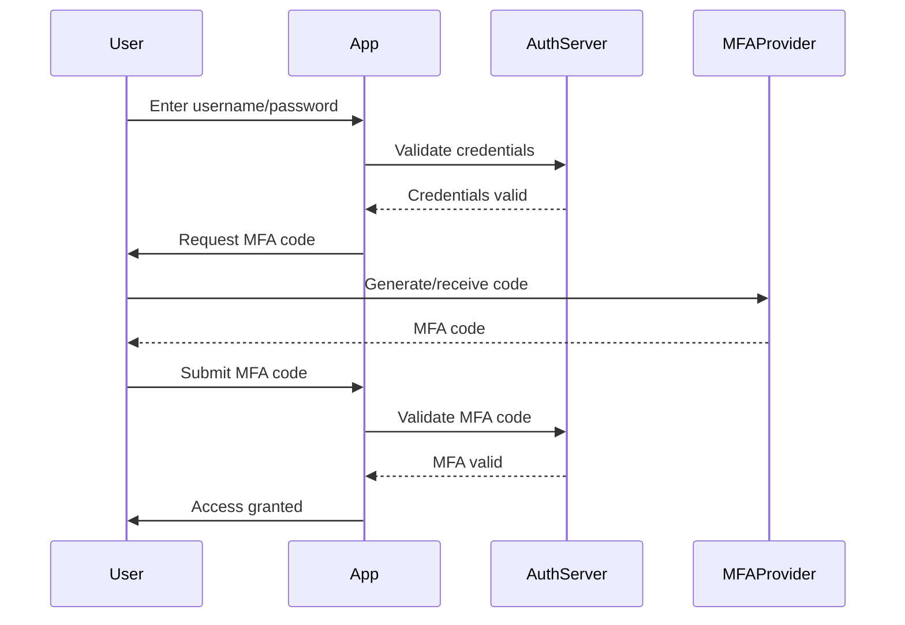
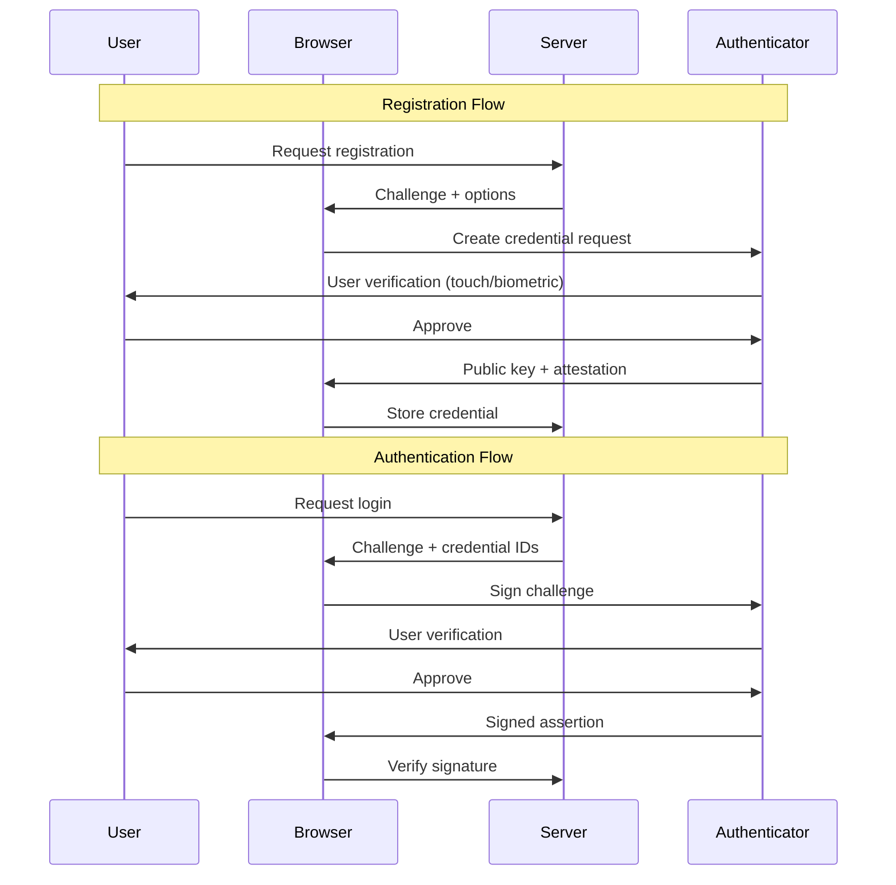
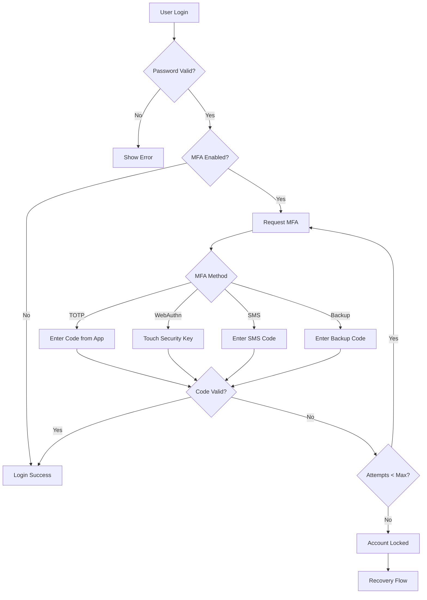

# How to Configure Multi-Factor Authentication

Author: [nawazdhandala](https://www.github.com/nawazdhandala)

Tags: MFA, Authentication, Security, TOTP, WebAuthn, Two-Factor Authentication

Description: A comprehensive guide to implementing multi-factor authentication (MFA) in your applications using TOTP, SMS, and WebAuthn methods.

---

> Multi-factor authentication adds critical security layers beyond passwords. When credentials are compromised, MFA can be the difference between a breach and a blocked attack.

This guide covers practical MFA implementations including Time-based One-Time Passwords (TOTP), SMS verification, and modern WebAuthn standards. You will learn how to integrate these methods into your applications securely.

---

## Understanding MFA Factors

MFA combines multiple authentication factors to verify identity:

| Factor Type | Description | Examples |
|-------------|-------------|----------|
| **Something you know** | Information only the user knows | Password, PIN, security questions |
| **Something you have** | Physical possession | Phone, hardware key, smart card |
| **Something you are** | Biometric characteristics | Fingerprint, face recognition, voice |

---

## MFA Authentication Flow



---

## Implementing TOTP Authentication

TOTP (Time-based One-Time Password) is the most common MFA method. It generates codes that change every 30 seconds using a shared secret.

### Python Implementation with pyotp

```python
import pyotp
import qrcode
from io import BytesIO
import base64

class TOTPManager:
    """
    Manages TOTP-based multi-factor authentication.
    Uses RFC 6238 compliant time-based one-time passwords.
    """

    def __init__(self, issuer_name: str = "MyApp"):
        # Issuer name appears in authenticator apps
        self.issuer_name = issuer_name

    def generate_secret(self) -> str:
        """
        Generate a new TOTP secret for a user.
        Returns a base32-encoded secret key.
        """
        # Generate a random 160-bit secret (32 base32 characters)
        # This secret must be stored securely in your database
        return pyotp.random_base32()

    def get_provisioning_uri(self, secret: str, user_email: str) -> str:
        """
        Generate the provisioning URI for QR code generation.
        This URI follows the otpauth:// scheme.
        """
        totp = pyotp.TOTP(secret)
        return totp.provisioning_uri(
            name=user_email,
            issuer_name=self.issuer_name
        )

    def generate_qr_code(self, provisioning_uri: str) -> str:
        """
        Generate a QR code image as base64 for the provisioning URI.
        Users scan this with their authenticator app.
        """
        # Create QR code instance
        qr = qrcode.QRCode(
            version=1,
            error_correction=qrcode.constants.ERROR_CORRECT_L,
            box_size=10,
            border=4,
        )
        qr.add_data(provisioning_uri)
        qr.make(fit=True)

        # Generate image
        img = qr.make_image(fill_color="black", back_color="white")

        # Convert to base64 for embedding in HTML
        buffer = BytesIO()
        img.save(buffer, format='PNG')
        return base64.b64encode(buffer.getvalue()).decode()

    def verify_code(self, secret: str, code: str, valid_window: int = 1) -> bool:
        """
        Verify a TOTP code against the stored secret.

        Args:
            secret: The user's stored TOTP secret
            code: The 6-digit code entered by the user
            valid_window: Number of 30-second windows to check
                          (1 means check current, previous, and next)
        """
        totp = pyotp.TOTP(secret)
        # valid_window allows for clock drift between server and device
        return totp.verify(code, valid_window=valid_window)

    def get_current_code(self, secret: str) -> str:
        """
        Get the current TOTP code (for testing purposes only).
        Never use this in production to show users their codes.
        """
        totp = pyotp.TOTP(secret)
        return totp.now()


# Example usage in a Flask application
from flask import Flask, request, jsonify, session
from functools import wraps

app = Flask(__name__)
totp_manager = TOTPManager(issuer_name="SecureApp")

def require_mfa(f):
    """
    Decorator to require MFA verification for protected routes.
    """
    @wraps(f)
    def decorated_function(*args, **kwargs):
        if not session.get('mfa_verified'):
            return jsonify({'error': 'MFA verification required'}), 401
        return f(*args, **kwargs)
    return decorated_function

@app.route('/api/mfa/setup', methods=['POST'])
def setup_mfa():
    """
    Initialize MFA setup for a user.
    Returns QR code and backup codes.
    """
    user_id = session.get('user_id')
    user_email = get_user_email(user_id)  # Your user lookup function

    # Generate new TOTP secret
    secret = totp_manager.generate_secret()

    # Store secret temporarily until user confirms setup
    # In production, encrypt this before storing
    store_pending_mfa_secret(user_id, secret)

    # Generate provisioning URI and QR code
    uri = totp_manager.get_provisioning_uri(secret, user_email)
    qr_base64 = totp_manager.generate_qr_code(uri)

    # Generate backup codes for account recovery
    backup_codes = generate_backup_codes(8)  # 8 single-use codes
    store_backup_codes(user_id, backup_codes)

    return jsonify({
        'qr_code': f'data:image/png;base64,{qr_base64}',
        'secret': secret,  # Allow manual entry if QR scan fails
        'backup_codes': backup_codes
    })

@app.route('/api/mfa/verify', methods=['POST'])
def verify_mfa():
    """
    Verify MFA code during login.
    """
    user_id = session.get('pending_user_id')
    code = request.json.get('code')

    # Get user's TOTP secret from database
    secret = get_user_mfa_secret(user_id)

    if totp_manager.verify_code(secret, code):
        # MFA verified, complete login
        session['user_id'] = user_id
        session['mfa_verified'] = True
        session.pop('pending_user_id', None)
        return jsonify({'success': True})

    # Check if it's a backup code
    if verify_backup_code(user_id, code):
        session['user_id'] = user_id
        session['mfa_verified'] = True
        return jsonify({
            'success': True,
            'warning': 'Backup code used. Consider generating new codes.'
        })

    return jsonify({'error': 'Invalid MFA code'}), 401
```

---

## Implementing WebAuthn (FIDO2)

WebAuthn provides phishing-resistant authentication using hardware security keys or platform authenticators (fingerprint, face recognition).



### Python WebAuthn Implementation

```python
from webauthn import (
    generate_registration_options,
    verify_registration_response,
    generate_authentication_options,
    verify_authentication_response,
)
from webauthn.helpers.structs import (
    AuthenticatorSelectionCriteria,
    UserVerificationRequirement,
    ResidentKeyRequirement,
)
from webauthn.helpers import bytes_to_base64url, base64url_to_bytes
import json

class WebAuthnManager:
    """
    Manages WebAuthn (FIDO2) authentication for passwordless
    and second-factor authentication.
    """

    def __init__(self, rp_id: str, rp_name: str, origin: str):
        """
        Initialize WebAuthn manager.

        Args:
            rp_id: Relying Party ID (your domain, e.g., "example.com")
            rp_name: Human-readable name shown to users
            origin: Full origin URL (e.g., "https://example.com")
        """
        self.rp_id = rp_id
        self.rp_name = rp_name
        self.origin = origin

    def start_registration(self, user_id: bytes, user_name: str,
                          user_display_name: str,
                          existing_credentials: list = None):
        """
        Generate registration options for a new credential.
        """
        # Exclude existing credentials to prevent duplicate registrations
        exclude_credentials = []
        if existing_credentials:
            exclude_credentials = [
                {"id": cred["credential_id"], "type": "public-key"}
                for cred in existing_credentials
            ]

        options = generate_registration_options(
            rp_id=self.rp_id,
            rp_name=self.rp_name,
            user_id=user_id,
            user_name=user_name,
            user_display_name=user_display_name,
            exclude_credentials=exclude_credentials,
            authenticator_selection=AuthenticatorSelectionCriteria(
                # Require user verification (PIN/biometric)
                user_verification=UserVerificationRequirement.REQUIRED,
                # Support both roaming (USB) and platform (built-in) authenticators
                resident_key=ResidentKeyRequirement.PREFERRED,
            ),
        )

        return options

    def complete_registration(self, credential_response: dict,
                             expected_challenge: bytes):
        """
        Verify and store a new credential.
        """
        verification = verify_registration_response(
            credential=credential_response,
            expected_challenge=expected_challenge,
            expected_rp_id=self.rp_id,
            expected_origin=self.origin,
        )

        # Return credential data to store in database
        return {
            "credential_id": bytes_to_base64url(verification.credential_id),
            "public_key": bytes_to_base64url(verification.credential_public_key),
            "sign_count": verification.sign_count,
            "credential_type": "webauthn",
        }

    def start_authentication(self, user_credentials: list):
        """
        Generate authentication options for login.

        Args:
            user_credentials: List of user's registered credentials
        """
        allow_credentials = [
            {
                "id": base64url_to_bytes(cred["credential_id"]),
                "type": "public-key",
            }
            for cred in user_credentials
        ]

        options = generate_authentication_options(
            rp_id=self.rp_id,
            allow_credentials=allow_credentials,
            user_verification=UserVerificationRequirement.REQUIRED,
        )

        return options

    def complete_authentication(self, credential_response: dict,
                               expected_challenge: bytes,
                               stored_credential: dict):
        """
        Verify an authentication assertion.
        """
        verification = verify_authentication_response(
            credential=credential_response,
            expected_challenge=expected_challenge,
            expected_rp_id=self.rp_id,
            expected_origin=self.origin,
            credential_public_key=base64url_to_bytes(
                stored_credential["public_key"]
            ),
            credential_current_sign_count=stored_credential["sign_count"],
        )

        # Return new sign count to update in database
        # Sign count helps detect cloned authenticators
        return {
            "verified": True,
            "new_sign_count": verification.new_sign_count,
        }


# Flask routes for WebAuthn
webauthn_manager = WebAuthnManager(
    rp_id="example.com",
    rp_name="Example Application",
    origin="https://example.com"
)

@app.route('/api/webauthn/register/start', methods=['POST'])
def webauthn_register_start():
    """
    Start WebAuthn credential registration.
    """
    user_id = session.get('user_id')
    user = get_user(user_id)
    existing_creds = get_user_webauthn_credentials(user_id)

    options = webauthn_manager.start_registration(
        user_id=user_id.encode(),
        user_name=user['email'],
        user_display_name=user['display_name'],
        existing_credentials=existing_creds
    )

    # Store challenge for verification
    session['webauthn_challenge'] = bytes_to_base64url(options.challenge)

    return jsonify(options)

@app.route('/api/webauthn/register/complete', methods=['POST'])
def webauthn_register_complete():
    """
    Complete WebAuthn credential registration.
    """
    user_id = session.get('user_id')
    credential_response = request.json
    challenge = base64url_to_bytes(session.pop('webauthn_challenge'))

    try:
        credential = webauthn_manager.complete_registration(
            credential_response=credential_response,
            expected_challenge=challenge
        )

        # Store credential in database
        store_webauthn_credential(user_id, credential)

        return jsonify({'success': True})
    except Exception as e:
        return jsonify({'error': str(e)}), 400
```

---

## SMS-Based MFA

While less secure than TOTP or WebAuthn, SMS remains widely used. Implement it with rate limiting and fraud detection.

```python
import secrets
import time
from datetime import datetime, timedelta

class SMSVerification:
    """
    SMS-based verification with security controls.
    Note: SMS is vulnerable to SIM swapping attacks.
    Consider TOTP or WebAuthn for higher security needs.
    """

    def __init__(self, sms_provider, redis_client):
        self.sms = sms_provider
        self.redis = redis_client
        self.code_length = 6
        self.code_expiry = 300  # 5 minutes
        self.max_attempts = 3
        self.rate_limit_window = 3600  # 1 hour
        self.max_codes_per_hour = 5

    def send_code(self, phone_number: str, user_id: str) -> dict:
        """
        Generate and send SMS verification code.
        """
        # Check rate limits
        rate_key = f"sms_rate:{phone_number}"
        current_count = self.redis.get(rate_key)

        if current_count and int(current_count) >= self.max_codes_per_hour:
            return {
                'success': False,
                'error': 'Too many verification attempts. Try again later.'
            }

        # Generate secure random code
        code = ''.join(secrets.choice('0123456789')
                       for _ in range(self.code_length))

        # Store code with metadata
        code_key = f"sms_code:{user_id}"
        code_data = {
            'code': code,
            'phone': phone_number,
            'attempts': 0,
            'created_at': time.time()
        }

        # Store with expiration
        self.redis.setex(code_key, self.code_expiry, json.dumps(code_data))

        # Update rate limit counter
        pipe = self.redis.pipeline()
        pipe.incr(rate_key)
        pipe.expire(rate_key, self.rate_limit_window)
        pipe.execute()

        # Send SMS
        self.sms.send(
            to=phone_number,
            message=f"Your verification code is: {code}. "
                    f"Valid for {self.code_expiry // 60} minutes."
        )

        return {'success': True, 'expires_in': self.code_expiry}

    def verify_code(self, user_id: str, submitted_code: str) -> dict:
        """
        Verify submitted SMS code.
        """
        code_key = f"sms_code:{user_id}"
        stored_data = self.redis.get(code_key)

        if not stored_data:
            return {'verified': False, 'error': 'Code expired or not found'}

        data = json.loads(stored_data)

        # Check attempt limit
        if data['attempts'] >= self.max_attempts:
            self.redis.delete(code_key)
            return {
                'verified': False,
                'error': 'Too many failed attempts. Request a new code.'
            }

        # Increment attempts
        data['attempts'] += 1
        self.redis.setex(
            code_key,
            self.code_expiry - int(time.time() - data['created_at']),
            json.dumps(data)
        )

        # Constant-time comparison to prevent timing attacks
        if secrets.compare_digest(submitted_code, data['code']):
            self.redis.delete(code_key)
            return {'verified': True}

        remaining = self.max_attempts - data['attempts']
        return {
            'verified': False,
            'error': f'Invalid code. {remaining} attempts remaining.'
        }
```

---

## MFA Recovery and Backup Codes

Always provide recovery options when users lose access to their MFA device.

```python
import hashlib
import secrets

class BackupCodeManager:
    """
    Manages single-use backup codes for MFA recovery.
    Each code can only be used once.
    """

    def __init__(self, db):
        self.db = db
        self.code_length = 8
        self.num_codes = 10

    def generate_codes(self, user_id: str) -> list:
        """
        Generate a new set of backup codes.
        Invalidates any existing codes.
        """
        # Delete existing codes
        self.db.execute(
            "DELETE FROM backup_codes WHERE user_id = ?",
            [user_id]
        )

        codes = []
        for _ in range(self.num_codes):
            # Generate readable code (alphanumeric, no ambiguous chars)
            alphabet = 'ABCDEFGHJKLMNPQRSTUVWXYZ23456789'
            code = ''.join(secrets.choice(alphabet)
                          for _ in range(self.code_length))

            # Format as XXXX-XXXX for readability
            formatted_code = f"{code[:4]}-{code[4:]}"
            codes.append(formatted_code)

            # Store hashed code (never store plaintext)
            code_hash = hashlib.sha256(
                code.encode()
            ).hexdigest()

            self.db.execute(
                """INSERT INTO backup_codes
                   (user_id, code_hash, used)
                   VALUES (?, ?, FALSE)""",
                [user_id, code_hash]
            )

        self.db.commit()

        # Return plaintext codes to show user once
        return codes

    def verify_code(self, user_id: str, code: str) -> bool:
        """
        Verify and consume a backup code.
        """
        # Normalize code (remove dashes, uppercase)
        normalized = code.replace('-', '').upper()
        code_hash = hashlib.sha256(normalized.encode()).hexdigest()

        # Find and mark code as used (atomic operation)
        result = self.db.execute(
            """UPDATE backup_codes
               SET used = TRUE, used_at = CURRENT_TIMESTAMP
               WHERE user_id = ? AND code_hash = ? AND used = FALSE
               RETURNING id""",
            [user_id, code_hash]
        )

        self.db.commit()
        return result.fetchone() is not None

    def get_remaining_count(self, user_id: str) -> int:
        """
        Get count of unused backup codes.
        """
        result = self.db.execute(
            """SELECT COUNT(*) FROM backup_codes
               WHERE user_id = ? AND used = FALSE""",
            [user_id]
        )
        return result.fetchone()[0]
```

---

## Database Schema for MFA

```sql
-- User MFA settings
CREATE TABLE user_mfa_settings (
    user_id UUID PRIMARY KEY REFERENCES users(id),
    mfa_enabled BOOLEAN DEFAULT FALSE,
    totp_secret TEXT,  -- Encrypted with application key
    totp_enabled_at TIMESTAMP,
    preferred_method VARCHAR(20) DEFAULT 'totp',
    created_at TIMESTAMP DEFAULT CURRENT_TIMESTAMP,
    updated_at TIMESTAMP DEFAULT CURRENT_TIMESTAMP
);

-- WebAuthn credentials
CREATE TABLE webauthn_credentials (
    id UUID PRIMARY KEY DEFAULT gen_random_uuid(),
    user_id UUID REFERENCES users(id),
    credential_id TEXT UNIQUE NOT NULL,
    public_key TEXT NOT NULL,
    sign_count INTEGER DEFAULT 0,
    device_name VARCHAR(100),
    created_at TIMESTAMP DEFAULT CURRENT_TIMESTAMP,
    last_used_at TIMESTAMP,
    INDEX idx_user_credentials (user_id)
);

-- Backup codes
CREATE TABLE backup_codes (
    id UUID PRIMARY KEY DEFAULT gen_random_uuid(),
    user_id UUID REFERENCES users(id),
    code_hash VARCHAR(64) NOT NULL,
    used BOOLEAN DEFAULT FALSE,
    used_at TIMESTAMP,
    created_at TIMESTAMP DEFAULT CURRENT_TIMESTAMP,
    INDEX idx_user_backup_codes (user_id, used)
);

-- MFA audit log
CREATE TABLE mfa_audit_log (
    id UUID PRIMARY KEY DEFAULT gen_random_uuid(),
    user_id UUID REFERENCES users(id),
    event_type VARCHAR(50) NOT NULL,
    method VARCHAR(20),
    success BOOLEAN,
    ip_address INET,
    user_agent TEXT,
    created_at TIMESTAMP DEFAULT CURRENT_TIMESTAMP,
    INDEX idx_user_mfa_audit (user_id, created_at)
);
```

---

## Security Best Practices

### Rate Limiting MFA Attempts

```python
from functools import wraps
from flask import request, jsonify
import time

class MFARateLimiter:
    """
    Rate limiter specifically for MFA verification attempts.
    Uses exponential backoff after failures.
    """

    def __init__(self, redis_client):
        self.redis = redis_client
        self.base_lockout = 30  # 30 seconds
        self.max_lockout = 3600  # 1 hour

    def check_rate_limit(self, user_id: str) -> tuple:
        """
        Check if user is rate limited.
        Returns (is_limited, seconds_remaining).
        """
        lockout_key = f"mfa_lockout:{user_id}"
        lockout_until = self.redis.get(lockout_key)

        if lockout_until:
            remaining = float(lockout_until) - time.time()
            if remaining > 0:
                return True, int(remaining)

        return False, 0

    def record_failure(self, user_id: str):
        """
        Record a failed MFA attempt and apply exponential backoff.
        """
        failures_key = f"mfa_failures:{user_id}"
        lockout_key = f"mfa_lockout:{user_id}"

        # Increment failure count
        failures = self.redis.incr(failures_key)
        self.redis.expire(failures_key, 3600)  # Reset after 1 hour of no failures

        # Calculate lockout duration with exponential backoff
        if failures >= 3:
            lockout_duration = min(
                self.base_lockout * (2 ** (failures - 3)),
                self.max_lockout
            )
            lockout_until = time.time() + lockout_duration
            self.redis.setex(lockout_key, int(lockout_duration) + 1, lockout_until)

    def record_success(self, user_id: str):
        """
        Clear failure count on successful verification.
        """
        self.redis.delete(f"mfa_failures:{user_id}")
        self.redis.delete(f"mfa_lockout:{user_id}")


def mfa_rate_limited(limiter):
    """
    Decorator to apply MFA rate limiting to verification endpoints.
    """
    def decorator(f):
        @wraps(f)
        def decorated_function(*args, **kwargs):
            user_id = session.get('pending_user_id') or session.get('user_id')

            is_limited, remaining = limiter.check_rate_limit(user_id)
            if is_limited:
                return jsonify({
                    'error': 'Too many attempts',
                    'retry_after': remaining
                }), 429

            return f(*args, **kwargs)
        return decorated_function
    return decorator
```

---

## Complete MFA Flow Diagram



---

## Testing MFA Implementation

```python
import pytest
from unittest.mock import Mock, patch

class TestTOTPManager:
    """
    Test suite for TOTP authentication.
    """

    def setup_method(self):
        self.manager = TOTPManager(issuer_name="TestApp")

    def test_generate_secret_length(self):
        """Secret should be 32 characters (160 bits base32)."""
        secret = self.manager.generate_secret()
        assert len(secret) == 32

    def test_generate_secret_uniqueness(self):
        """Each generated secret should be unique."""
        secrets = [self.manager.generate_secret() for _ in range(100)]
        assert len(set(secrets)) == 100

    def test_verify_valid_code(self):
        """Valid TOTP code should verify successfully."""
        secret = self.manager.generate_secret()
        # Get current valid code
        current_code = self.manager.get_current_code(secret)
        assert self.manager.verify_code(secret, current_code)

    def test_verify_invalid_code(self):
        """Invalid code should fail verification."""
        secret = self.manager.generate_secret()
        assert not self.manager.verify_code(secret, "000000")

    def test_verify_with_window(self):
        """Code from adjacent time window should verify."""
        secret = self.manager.generate_secret()
        # With valid_window=1, codes from -30s to +30s should work
        current_code = self.manager.get_current_code(secret)
        assert self.manager.verify_code(secret, current_code, valid_window=1)

    def test_provisioning_uri_format(self):
        """Provisioning URI should follow otpauth format."""
        secret = self.manager.generate_secret()
        uri = self.manager.get_provisioning_uri(secret, "test@example.com")
        assert uri.startswith("otpauth://totp/")
        assert "TestApp" in uri
        assert "test@example.com" in uri


class TestBackupCodes:
    """
    Test suite for backup code management.
    """

    def setup_method(self):
        self.db = Mock()
        self.manager = BackupCodeManager(self.db)

    def test_generate_codes_count(self):
        """Should generate correct number of codes."""
        self.db.execute.return_value.fetchone.return_value = None
        codes = self.manager.generate_codes("user123")
        assert len(codes) == 10

    def test_code_format(self):
        """Codes should be in XXXX-XXXX format."""
        self.db.execute.return_value.fetchone.return_value = None
        codes = self.manager.generate_codes("user123")
        for code in codes:
            assert len(code) == 9  # 8 chars + 1 dash
            assert code[4] == '-'

    def test_codes_are_unique(self):
        """All generated codes should be unique."""
        self.db.execute.return_value.fetchone.return_value = None
        codes = self.manager.generate_codes("user123")
        assert len(set(codes)) == len(codes)
```

---

## Summary

Implementing MFA significantly improves application security. Key takeaways:

1. **Use TOTP as the primary method** - It is secure, does not require network access, and works offline
2. **Offer WebAuthn for high-security scenarios** - Phishing-resistant and user-friendly
3. **Always provide backup codes** - Users will lose access to their devices
4. **Implement rate limiting** - Prevent brute force attacks on MFA codes
5. **Log all MFA events** - Essential for security auditing and incident response
6. **Consider SMS as a fallback only** - It is vulnerable to SIM swapping attacks

Start with TOTP implementation, then add WebAuthn support as your user base grows. Always prioritize user experience while maintaining security - frustrated users will disable MFA if it is too cumbersome.
