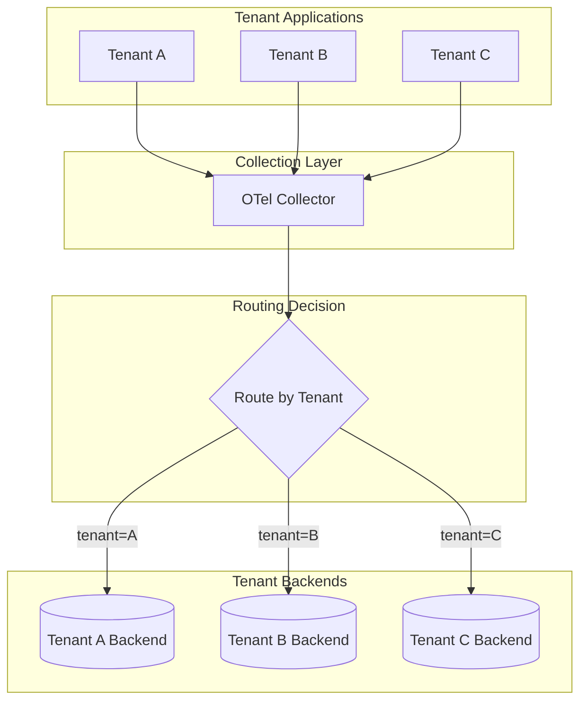
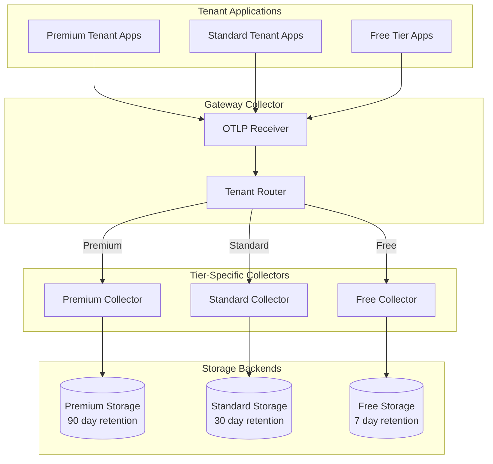
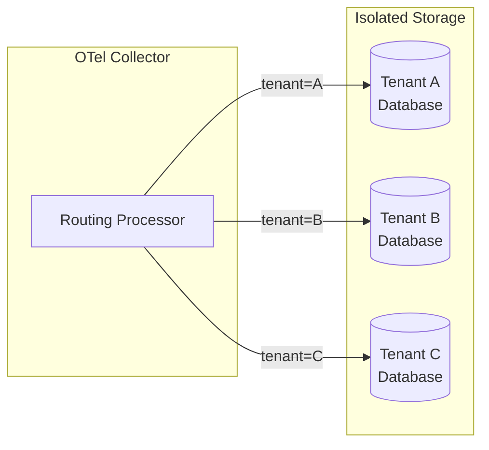

# How to Handle Multi-Tenancy in OpenTelemetry

Author: [nawazdhandala](https://www.github.com/nawazdhandala)

Tags: OpenTelemetry, Multi-Tenancy, Observability, Distributed Systems, SaaS, Tracing

Description: A comprehensive guide to implementing multi-tenancy in OpenTelemetry for SaaS applications with proper tenant isolation and routing.

---

Multi-tenancy in observability systems presents unique challenges. You need to isolate tenant data, route telemetry to the right backends, and maintain performance while serving multiple customers from shared infrastructure. This guide covers practical patterns for implementing multi-tenancy in OpenTelemetry.

## Understanding Multi-Tenancy Challenges

When building multi-tenant observability, you face several key challenges.



## Adding Tenant Context to Telemetry

### Method 1: Resource Attributes

The most straightforward approach is adding tenant information as resource attributes.

```python
from opentelemetry import trace
from opentelemetry.sdk.trace import TracerProvider
from opentelemetry.sdk.resources import Resource

def create_tenant_tracer_provider(tenant_id, tenant_name):
    """Create a TracerProvider with tenant-specific resource attributes."""

    # Define resource attributes including tenant information
    resource = Resource.create({
        "service.name": "my-service",
        "service.version": "1.0.0",
        # Tenant-specific attributes
        "tenant.id": tenant_id,
        "tenant.name": tenant_name,
        "deployment.environment": "production"
    })

    # Create the provider with tenant resource
    provider = TracerProvider(resource=resource)

    return provider

# Usage for a specific tenant
tenant_provider = create_tenant_tracer_provider(
    tenant_id="tenant-123",
    tenant_name="Acme Corp"
)
trace.set_tracer_provider(tenant_provider)
```

### Method 2: Span Attributes

For request-level tenant context, add attributes to individual spans.

```python
from opentelemetry import trace
from functools import wraps

tracer = trace.get_tracer(__name__)

def with_tenant_context(func):
    """Decorator to add tenant context to spans."""
    @wraps(func)
    def wrapper(*args, **kwargs):
        # Extract tenant from request context
        tenant_id = get_current_tenant_id()
        tenant_tier = get_tenant_tier(tenant_id)

        span = trace.get_current_span()
        if span.is_recording():
            # Add tenant attributes to the current span
            span.set_attribute("tenant.id", tenant_id)
            span.set_attribute("tenant.tier", tenant_tier)
            span.set_attribute("tenant.region", get_tenant_region(tenant_id))

        return func(*args, **kwargs)
    return wrapper

@with_tenant_context
def handle_request(request):
    """Handle a request with tenant context automatically added."""
    with tracer.start_as_current_span("process_request") as span:
        # Additional processing attributes
        span.set_attribute("request.type", request.type)
        return process(request)
```

### Method 3: Baggage for Cross-Service Propagation

Use OpenTelemetry Baggage to propagate tenant context across service boundaries.

```python
from opentelemetry import baggage, trace
from opentelemetry.propagate import inject, extract

tracer = trace.get_tracer(__name__)

def set_tenant_baggage(tenant_id, tenant_tier):
    """Set tenant information in baggage for propagation."""
    ctx = baggage.set_baggage("tenant.id", tenant_id)
    ctx = baggage.set_baggage("tenant.tier", tenant_tier, context=ctx)
    return ctx

def get_tenant_from_baggage():
    """Retrieve tenant information from baggage."""
    tenant_id = baggage.get_baggage("tenant.id")
    tenant_tier = baggage.get_baggage("tenant.tier")
    return tenant_id, tenant_tier

# In your HTTP client middleware
def outgoing_request_middleware(request):
    """Add tenant baggage to outgoing requests."""
    tenant_id = get_current_tenant_id()
    tenant_tier = get_tenant_tier(tenant_id)

    # Set baggage in current context
    ctx = set_tenant_baggage(tenant_id, tenant_tier)

    # Inject context into request headers
    headers = {}
    inject(headers, context=ctx)
    request.headers.update(headers)

    return request

# In your service handler
def incoming_request_handler(request):
    """Extract tenant baggage from incoming requests."""
    # Extract context from request headers
    ctx = extract(request.headers)

    # Get tenant information from baggage
    tenant_id, tenant_tier = get_tenant_from_baggage()

    with tracer.start_as_current_span(
        "handle_request",
        context=ctx
    ) as span:
        span.set_attribute("tenant.id", tenant_id)
        span.set_attribute("tenant.tier", tenant_tier)
        return process_request(request)
```

## OpenTelemetry Collector Multi-Tenant Configuration

### Routing Telemetry by Tenant

Use the routing processor to send telemetry to different backends based on tenant.

```yaml
# otel-collector-config.yaml
receivers:
  otlp:
    protocols:
      grpc:
        endpoint: 0.0.0.0:4317
      http:
        endpoint: 0.0.0.0:4318

processors:
  # Add tenant attribute from headers if not present
  attributes/extract_tenant:
    actions:
      - key: tenant.id
        from_context: metadata.tenant-id
        action: upsert

  # Batch processor for efficiency
  batch:
    send_batch_size: 1000
    timeout: 10s

  # Route based on tenant attributes
  routing:
    from_attribute: tenant.id
    default_exporters:
      - otlp/default
    table:
      - value: tenant-premium-1
        exporters: [otlp/premium]
      - value: tenant-premium-2
        exporters: [otlp/premium]
      - value: tenant-standard-*
        exporters: [otlp/standard]

exporters:
  # Default backend for unmatched tenants
  otlp/default:
    endpoint: "default-backend:4317"
    tls:
      insecure: false

  # Premium tier backend with higher retention
  otlp/premium:
    endpoint: "premium-backend:4317"
    tls:
      insecure: false
    headers:
      X-Tenant-Tier: premium

  # Standard tier backend
  otlp/standard:
    endpoint: "standard-backend:4317"
    tls:
      insecure: false
    headers:
      X-Tenant-Tier: standard

service:
  pipelines:
    traces:
      receivers: [otlp]
      processors: [attributes/extract_tenant, batch, routing]
      exporters: [otlp/default, otlp/premium, otlp/standard]
```

### Multi-Tenant Architecture with Dedicated Collectors

For larger deployments, consider dedicated collectors per tenant tier.



### Gateway Collector Configuration

```yaml
# gateway-collector-config.yaml
receivers:
  otlp:
    protocols:
      grpc:
        endpoint: 0.0.0.0:4317

processors:
  # Extract tenant tier from attributes
  attributes/tenant:
    actions:
      - key: tenant.tier
        from_attribute: resource.tenant.tier
        action: upsert

exporters:
  # Forward to tier-specific collectors
  otlp/premium:
    endpoint: "premium-collector:4317"
    tls:
      insecure: true

  otlp/standard:
    endpoint: "standard-collector:4317"
    tls:
      insecure: true

  otlp/free:
    endpoint: "free-collector:4317"
    tls:
      insecure: true

connectors:
  routing:
    default_pipelines: [traces/free]
    error_mode: ignore
    table:
      - statement: route() where attributes["tenant.tier"] == "premium"
        pipelines: [traces/premium]
      - statement: route() where attributes["tenant.tier"] == "standard"
        pipelines: [traces/standard]

service:
  pipelines:
    traces:
      receivers: [otlp]
      processors: [attributes/tenant]
      exporters: [routing]

    traces/premium:
      receivers: [routing]
      exporters: [otlp/premium]

    traces/standard:
      receivers: [routing]
      exporters: [otlp/standard]

    traces/free:
      receivers: [routing]
      exporters: [otlp/free]
```

## Rate Limiting by Tenant

Implement per-tenant rate limiting to prevent noisy neighbors.

### Custom Rate Limiter in Python

```python
from opentelemetry.sdk.trace.export import SpanExporter, SpanExportResult
from collections import defaultdict
import time
import threading

class TenantRateLimitedExporter(SpanExporter):
    """Exporter that rate limits spans per tenant."""

    def __init__(self, wrapped_exporter, limits_config):
        """
        Initialize the rate-limited exporter.

        Args:
            wrapped_exporter: The actual exporter to send spans to
            limits_config: Dict mapping tenant tiers to spans per second
        """
        self.wrapped_exporter = wrapped_exporter
        self.limits_config = limits_config
        self.tenant_counts = defaultdict(int)
        self.tenant_windows = defaultdict(float)
        self.lock = threading.Lock()

    def export(self, spans):
        """Export spans with per-tenant rate limiting."""
        current_time = time.time()
        allowed_spans = []
        dropped_counts = defaultdict(int)

        with self.lock:
            for span in spans:
                tenant_id = self._get_tenant_id(span)
                tenant_tier = self._get_tenant_tier(span)
                limit = self.limits_config.get(tenant_tier, 100)

                # Reset counter if window has passed (1 second window)
                if current_time - self.tenant_windows[tenant_id] >= 1.0:
                    self.tenant_counts[tenant_id] = 0
                    self.tenant_windows[tenant_id] = current_time

                # Check if under limit
                if self.tenant_counts[tenant_id] < limit:
                    self.tenant_counts[tenant_id] += 1
                    allowed_spans.append(span)
                else:
                    dropped_counts[tenant_id] += 1

        # Log dropped spans for monitoring
        for tenant_id, count in dropped_counts.items():
            print(f"Rate limited {count} spans for tenant {tenant_id}")

        if allowed_spans:
            return self.wrapped_exporter.export(allowed_spans)
        return SpanExportResult.SUCCESS

    def _get_tenant_id(self, span):
        """Extract tenant ID from span."""
        for attr in span.attributes:
            if attr == "tenant.id":
                return span.attributes[attr]
        return "unknown"

    def _get_tenant_tier(self, span):
        """Extract tenant tier from span."""
        for attr in span.attributes:
            if attr == "tenant.tier":
                return span.attributes[attr]
        return "free"

    def shutdown(self):
        """Shutdown the wrapped exporter."""
        return self.wrapped_exporter.shutdown()

    def force_flush(self, timeout_millis=30000):
        """Force flush the wrapped exporter."""
        return self.wrapped_exporter.force_flush(timeout_millis)

# Usage
from opentelemetry.exporter.otlp.proto.grpc.trace_exporter import OTLPSpanExporter

base_exporter = OTLPSpanExporter(endpoint="collector:4317")
rate_limits = {
    "premium": 10000,   # 10k spans per second
    "standard": 1000,   # 1k spans per second
    "free": 100         # 100 spans per second
}

rate_limited_exporter = TenantRateLimitedExporter(base_exporter, rate_limits)
```

### Collector-Level Rate Limiting

```yaml
# collector-config-with-limits.yaml
receivers:
  otlp:
    protocols:
      grpc:
        endpoint: 0.0.0.0:4317

processors:
  # Memory limiter to prevent OOM
  memory_limiter:
    check_interval: 1s
    limit_mib: 1000
    spike_limit_mib: 200

  # Probabilistic sampling based on tenant tier
  probabilistic_sampler/premium:
    sampling_percentage: 100

  probabilistic_sampler/standard:
    sampling_percentage: 50

  probabilistic_sampler/free:
    sampling_percentage: 10

  batch:
    send_batch_size: 1000
    timeout: 10s

exporters:
  otlp:
    endpoint: "backend:4317"

service:
  pipelines:
    traces/premium:
      receivers: [otlp]
      processors: [memory_limiter, probabilistic_sampler/premium, batch]
      exporters: [otlp]

    traces/standard:
      receivers: [otlp]
      processors: [memory_limiter, probabilistic_sampler/standard, batch]
      exporters: [otlp]

    traces/free:
      receivers: [otlp]
      processors: [memory_limiter, probabilistic_sampler/free, batch]
      exporters: [otlp]
```

## Tenant Isolation Strategies

### Data Isolation with Separate Databases



### Namespace Isolation with Shared Storage

```python
from opentelemetry.sdk.trace.export import SpanExporter, SpanExportResult

class NamespacedExporter(SpanExporter):
    """Exporter that adds tenant namespace to all spans."""

    def __init__(self, wrapped_exporter):
        self.wrapped_exporter = wrapped_exporter

    def export(self, spans):
        """Export spans with tenant namespacing."""
        namespaced_spans = []

        for span in spans:
            tenant_id = self._get_tenant_id(span)

            # Create namespaced span name
            # Original: "GET /api/users"
            # Namespaced: "tenant-123:GET /api/users"
            namespaced_name = f"{tenant_id}:{span.name}"

            # Note: In practice, you would create a modified span
            # This is a simplified example
            span._name = namespaced_name
            namespaced_spans.append(span)

        return self.wrapped_exporter.export(namespaced_spans)

    def _get_tenant_id(self, span):
        """Extract tenant ID from span attributes."""
        return span.attributes.get("tenant.id", "unknown")

    def shutdown(self):
        return self.wrapped_exporter.shutdown()

    def force_flush(self, timeout_millis=30000):
        return self.wrapped_exporter.force_flush(timeout_millis)
```

## Monitoring Multi-Tenant Systems

Create dashboards to monitor per-tenant telemetry volume and health.

```python
from opentelemetry import metrics
from opentelemetry.sdk.metrics import MeterProvider
from opentelemetry.sdk.metrics.export import PeriodicExportingMetricReader
from opentelemetry.exporter.otlp.proto.grpc.metric_exporter import OTLPMetricExporter

# Set up metrics
exporter = OTLPMetricExporter(endpoint="collector:4317")
reader = PeriodicExportingMetricReader(exporter, export_interval_millis=10000)
provider = MeterProvider(metric_readers=[reader])
metrics.set_meter_provider(provider)

meter = metrics.get_meter(__name__)

# Create per-tenant metrics
spans_processed = meter.create_counter(
    name="spans_processed_total",
    description="Total spans processed per tenant",
    unit="1"
)

spans_dropped = meter.create_counter(
    name="spans_dropped_total",
    description="Total spans dropped per tenant due to rate limiting",
    unit="1"
)

def record_span_processed(tenant_id, tenant_tier):
    """Record that a span was processed for a tenant."""
    spans_processed.add(
        1,
        attributes={
            "tenant.id": tenant_id,
            "tenant.tier": tenant_tier
        }
    )

def record_span_dropped(tenant_id, tenant_tier, reason):
    """Record that a span was dropped."""
    spans_dropped.add(
        1,
        attributes={
            "tenant.id": tenant_id,
            "tenant.tier": tenant_tier,
            "drop.reason": reason
        }
    )
```

## Best Practices for Multi-Tenant OpenTelemetry

1. **Always include tenant context** in resource attributes for consistent identification.

2. **Use baggage for cross-service propagation** to ensure tenant context flows through your entire system.

3. **Implement rate limiting** at multiple levels (SDK, collector, backend) to prevent noisy neighbors.

4. **Design for tenant isolation** from the start, whether through separate backends or namespace isolation.

5. **Monitor per-tenant metrics** to identify issues and usage patterns.

6. **Document your multi-tenancy strategy** so all team members understand how tenant data flows through the system.

7. **Test with realistic tenant loads** to ensure your rate limiting and isolation work correctly under pressure.

## Conclusion

Multi-tenancy in OpenTelemetry requires careful planning around data isolation, routing, and resource management. By using resource attributes for tenant identification, configuring the collector for tenant-aware routing, and implementing appropriate rate limiting, you can build a robust multi-tenant observability system. Remember to monitor per-tenant metrics and test your isolation boundaries to ensure a good experience for all tenants.
