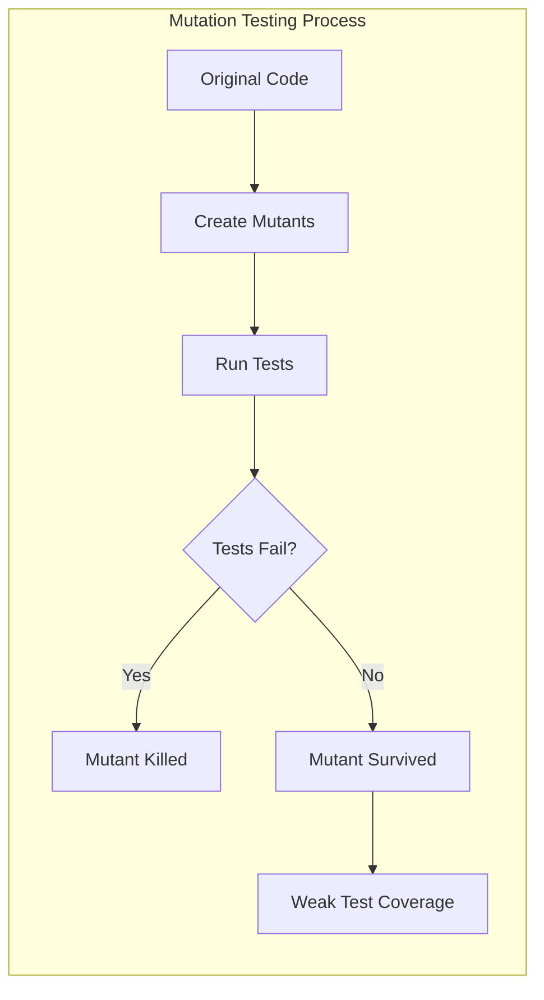
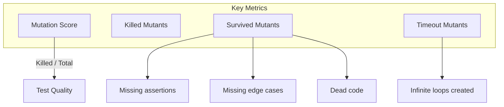

# How to Handle Mutation Testing

Author: [nawazdhandala](https://www.github.com/nawazdhandala)

Tags: Testing, Mutation Testing, Code Quality, Test Coverage, Java, Python, JavaScript

Description: Learn how to use mutation testing to evaluate the quality of your test suite by introducing small code changes and checking if tests catch them.

---

Code coverage tells you what code your tests execute. It does not tell you if your tests actually verify anything. You can have 100% coverage with tests that assert nothing. Mutation testing solves this by modifying your code and checking if tests fail. If a mutation survives, your tests are not thorough enough.

## What is Mutation Testing?

Mutation testing introduces small changes (mutations) to your code and runs your tests. If tests pass despite the mutation, that mutation "survived" and reveals a weakness in your test suite.



Common mutation operators include:

| Operator | Original | Mutated |
|----------|----------|---------|
| Arithmetic | `a + b` | `a - b` |
| Relational | `a > b` | `a >= b` |
| Logical | `a && b` | `a \|\| b` |
| Negation | `if (condition)` | `if (!condition)` |
| Return | `return true` | `return false` |

## Setting Up Mutation Testing

### JavaScript/TypeScript with Stryker

```bash
# Install Stryker
npm install --save-dev @stryker-mutator/core @stryker-mutator/jest-runner
```

```javascript
// stryker.conf.js
module.exports = {
  packageManager: 'npm',
  reporters: ['html', 'clear-text', 'progress'],
  testRunner: 'jest',
  coverageAnalysis: 'perTest',
  jest: {
    projectType: 'custom',
    configFile: 'jest.config.js'
  },
  mutate: [
    'src/**/*.ts',
    '!src/**/*.test.ts',
    '!src/**/*.spec.ts'
  ],
  thresholds: {
    high: 80,
    low: 60,
    break: 50  // Fail if mutation score drops below 50%
  }
};
```

```bash
# Run mutation testing
npx stryker run
```

### Java with PIT (Pitest)

```xml
<!-- pom.xml -->
<plugin>
    <groupId>org.pitest</groupId>
    <artifactId>pitest-maven</artifactId>
    <version>1.15.3</version>
    <configuration>
        <targetClasses>
            <param>com.example.*</param>
        </targetClasses>
        <targetTests>
            <param>com.example.*Test</param>
        </targetTests>
        <mutators>
            <mutator>DEFAULTS</mutator>
            <mutator>STRONGER</mutator>
        </mutators>
        <outputFormats>
            <outputFormat>HTML</outputFormat>
        </outputFormats>
        <mutationThreshold>60</mutationThreshold>
    </configuration>
</plugin>
```

```bash
# Run mutation testing
mvn org.pitest:pitest-maven:mutationCoverage
```

### Python with mutmut

```bash
# Install mutmut
pip install mutmut
```

```ini
# setup.cfg
[mutmut]
paths_to_mutate=src/
tests_dir=tests/
runner=python -m pytest
```

```bash
# Run mutation testing
mutmut run

# View results
mutmut results

# View specific surviving mutant
mutmut show 42
```

## Example: Improving Tests Based on Mutation Results

Consider this simple function and test:

```javascript
// calculator.js
function calculateDiscount(price, isPremiumMember) {
  if (price > 100 && isPremiumMember) {
    return price * 0.2;  // 20% discount
  }
  if (price > 100) {
    return price * 0.1;  // 10% discount
  }
  return 0;
}
```

```javascript
// calculator.test.js - Initial weak tests
describe('calculateDiscount', () => {
  it('should return discount for premium member', () => {
    const result = calculateDiscount(150, true);
    expect(result).toBeGreaterThan(0);  // Weak assertion!
  });
});
```

Running Stryker reveals surviving mutants:

```
Mutant survived: Changed price > 100 to price >= 100
Mutant survived: Changed price * 0.2 to price * 0.1
Mutant survived: Changed && to ||
```

Now we improve the tests:

```javascript
// calculator.test.js - Improved tests
describe('calculateDiscount', () => {
  describe('premium member', () => {
    it('should return 20% discount for price over 100', () => {
      expect(calculateDiscount(200, true)).toBe(40);  // Exact value
    });

    it('should return 0 for price of 100 or less', () => {
      expect(calculateDiscount(100, true)).toBe(0);  // Boundary test
      expect(calculateDiscount(50, true)).toBe(0);
    });
  });

  describe('regular member', () => {
    it('should return 10% discount for price over 100', () => {
      expect(calculateDiscount(200, false)).toBe(20);
    });

    it('should return 0 for price of 100 or less', () => {
      expect(calculateDiscount(100, false)).toBe(0);
      expect(calculateDiscount(50, false)).toBe(0);
    });
  });

  describe('boundary conditions', () => {
    it('should handle price exactly at 100', () => {
      expect(calculateDiscount(100, true)).toBe(0);
      expect(calculateDiscount(100, false)).toBe(0);
    });

    it('should handle price just above 100', () => {
      expect(calculateDiscount(101, true)).toBe(20.2);
      expect(calculateDiscount(101, false)).toBe(10.1);
    });
  });
});
```

## Interpreting Mutation Testing Results



### Mutation Score

```
Mutation Score = (Killed Mutants / Total Mutants) * 100
```

| Score | Interpretation |
|-------|----------------|
| 90%+ | Excellent test coverage |
| 70-90% | Good, but room for improvement |
| 50-70% | Needs attention |
| <50% | Tests are inadequate |

### Handling Surviving Mutants

Not all surviving mutants indicate problems:

```java
// Equivalent mutant - behavior unchanged
// Original
if (x >= 0)
// Mutated to
if (x > -1)  // Same behavior for integers

// Handling: Mark as equivalent or exclude from mutation
```

```javascript
// stryker.conf.js - Exclude false positives
module.exports = {
  mutate: [
    'src/**/*.ts',
    '!src/**/constants.ts',  // Don't mutate constants
    '!src/**/types.ts'       // Don't mutate type definitions
  ],
  // Ignore specific mutants
  ignorers: ['string-literal'],
};
```

## Integration with CI/CD

### GitHub Actions

```yaml
# .github/workflows/mutation.yml
name: Mutation Testing

on:
  pull_request:
    branches: [main]
  schedule:
    - cron: '0 0 * * 0'  # Weekly full run

jobs:
  mutation:
    runs-on: ubuntu-latest
    steps:
      - uses: actions/checkout@v4

      - name: Setup Node.js
        uses: actions/setup-node@v4
        with:
          node-version: '20'

      - name: Install dependencies
        run: npm ci

      - name: Run mutation testing
        run: npx stryker run
        env:
          STRYKER_DASHBOARD_API_KEY: ${{ secrets.STRYKER_API_KEY }}

      - name: Upload mutation report
        uses: actions/upload-artifact@v4
        with:
          name: mutation-report
          path: reports/mutation/

      - name: Check mutation score
        run: |
          SCORE=$(cat reports/mutation/mutation-report.json | jq '.mutationScore')
          if (( $(echo "$SCORE < 60" | bc -l) )); then
            echo "Mutation score $SCORE% is below threshold"
            exit 1
          fi
```

### Incremental Mutation Testing

Full mutation testing is slow. Run incrementally on changed files:

```bash
# Only mutate changed files (Git diff)
npx stryker run --mutate "$(git diff --name-only main | grep -E '\.ts$' | tr '\n' ',')"
```

```python
# mutmut with specific files
mutmut run --paths-to-mutate src/changed_file.py
```

## Best Practices

### 1. Start with Critical Code

Do not try to mutation test everything at once. Focus on business-critical code first.

```javascript
// stryker.conf.js
module.exports = {
  mutate: [
    'src/billing/**/*.ts',     // Critical: billing logic
    'src/auth/**/*.ts',        // Critical: authentication
    // Leave out less critical code initially
  ]
};
```

### 2. Use Appropriate Mutators

```java
// PIT - Configure mutators based on your needs
<configuration>
    <mutators>
        <mutator>CONDITIONALS_BOUNDARY</mutator>
        <mutator>INCREMENTS</mutator>
        <mutator>MATH</mutator>
        <mutator>NEGATE_CONDITIONALS</mutator>
        <mutator>RETURN_VALS</mutator>
    </mutators>
</configuration>
```

### 3. Handle Performance

Mutation testing is slow. Optimize for faster feedback:

```javascript
// stryker.conf.js
module.exports = {
  concurrency: 4,  // Run 4 test processes in parallel
  timeoutMS: 10000,  // Kill slow mutants
  coverageAnalysis: 'perTest',  // Only run affected tests
};
```

### 4. Track Progress Over Time

```yaml
# Stryker Dashboard integration
name: Track Mutation Score

on:
  push:
    branches: [main]

jobs:
  report:
    runs-on: ubuntu-latest
    steps:
      - uses: actions/checkout@v4

      - name: Run Stryker with dashboard reporter
        run: npx stryker run --reporters dashboard
        env:
          STRYKER_DASHBOARD_API_KEY: ${{ secrets.STRYKER_API_KEY }}
```

### 5. Document Equivalent Mutants

```typescript
// When a mutant cannot be killed because it's equivalent
// Document it so future maintainers understand

/**
 * @mutationNote The boundary mutation `> 0` to `>= 0` is equivalent
 * because the input is always positive (validated elsewhere).
 * This is intentional and does not indicate weak tests.
 */
function processPositiveNumber(n: number): number {
  if (n > 0) {
    return n * 2;
  }
  throw new Error('Invalid input');
}
```

## When Not to Use Mutation Testing

1. **Generated code** - No point testing code you do not write
2. **Simple getters/setters** - ROI is low
3. **Third-party integrations** - Test with integration tests instead
4. **Performance-critical CI** - Use sampling or run nightly

---

Mutation testing reveals the true quality of your test suite. Code coverage lies to you; mutation scores tell the truth. Start with your most critical code, use the results to guide test improvements, and gradually expand coverage. Your tests will become genuinely effective at catching bugs, not just executing code.
