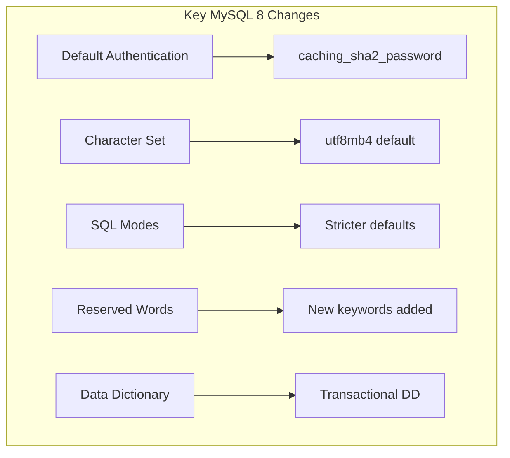
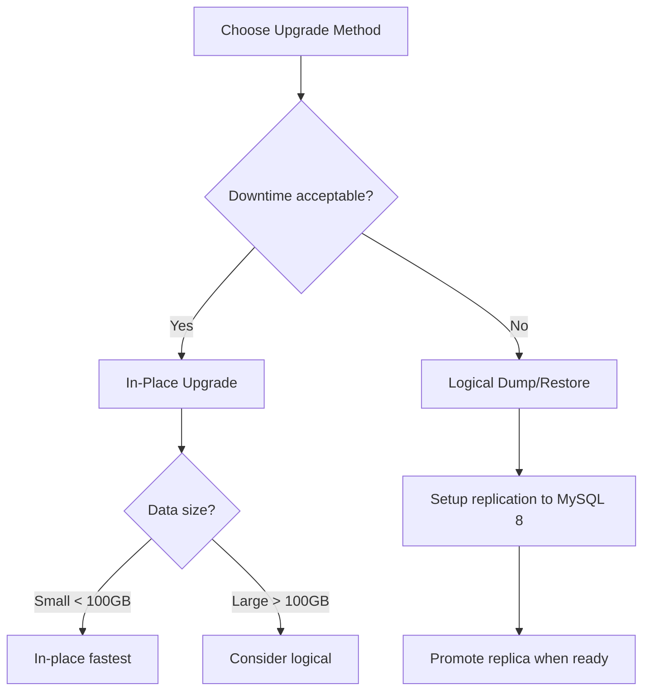

# How to Migrate from MySQL 5.7 to MySQL 8

Author: [nawazdhandala](https://www.github.com/nawazdhandala)

Tags: MySQL, Database, Migration, Upgrade, MySQL 8, MySQL 5.7, DevOps

Description: Learn how to safely migrate from MySQL 5.7 to MySQL 8 with step-by-step instructions, compatibility checks, and rollback strategies.

---

MySQL 5.7 reached end of life in October 2023. Upgrading to MySQL 8 brings better performance, new features like window functions and CTEs, and continued security updates. But the migration requires careful planning since MySQL 8 introduces breaking changes.

This guide walks through the complete migration process from pre-upgrade checks to post-migration validation.

## Understanding the Changes in MySQL 8

MySQL 8 introduces significant changes that affect compatibility:



Major changes to prepare for:

- **Authentication**: Default changed from mysql_native_password to caching_sha2_password
- **Character set**: Default changed from latin1 to utf8mb4
- **GROUP BY**: No longer implicitly sorts results
- **Reserved words**: RANK, GROUPS, FUNCTION, and others are now reserved
- **Query cache**: Completely removed

## Pre-Upgrade Assessment

Run the MySQL Shell upgrade checker to identify issues:

```bash
# Install MySQL Shell if not present
sudo apt-get install mysql-shell

# Run the upgrade checker
mysqlsh -- util checkForServerUpgrade root@localhost:3306 --target-version=8.0.35 --output-format=JSON > upgrade_report.json

# Or run interactively
mysqlsh
\connect root@localhost:3306
util.checkForServerUpgrade()
```

The checker identifies:

- Deprecated features in use
- Reserved word conflicts
- Character set issues
- Partitioning problems
- Incompatible SQL modes

## Step 1: Fix Identified Issues

Address issues found by the upgrade checker before proceeding.

### Reserved Word Conflicts

```sql
-- Find tables/columns using reserved words
SELECT
    TABLE_SCHEMA,
    TABLE_NAME,
    COLUMN_NAME
FROM information_schema.COLUMNS
WHERE COLUMN_NAME IN ('rank', 'groups', 'function', 'row', 'rows', 'system');

-- Rename columns that conflict (example)
ALTER TABLE users CHANGE `rank` `user_rank` INT;

-- Or quote them in queries (less ideal)
SELECT `rank` FROM users;
```

### Character Set Updates

```sql
-- Check current character sets
SELECT
    TABLE_SCHEMA,
    TABLE_NAME,
    TABLE_COLLATION
FROM information_schema.TABLES
WHERE TABLE_COLLATION NOT LIKE 'utf8mb4%'
AND TABLE_SCHEMA NOT IN ('mysql', 'information_schema', 'performance_schema');

-- Convert tables to utf8mb4
ALTER TABLE users
CONVERT TO CHARACTER SET utf8mb4
COLLATE utf8mb4_unicode_ci;
```

### SQL Mode Compatibility

```sql
-- Check current SQL mode
SELECT @@sql_mode;

-- Test with MySQL 8 default modes
SET sql_mode = 'ONLY_FULL_GROUP_BY,STRICT_TRANS_TABLES,NO_ZERO_IN_DATE,NO_ZERO_DATE,ERROR_FOR_DIVISION_BY_ZERO,NO_ENGINE_SUBSTITUTION';

-- Run your application tests with this mode
```

### GROUP BY Changes

MySQL 8 enforces ONLY_FULL_GROUP_BY strictly:

```sql
-- This worked in 5.7 but fails in 8.0
SELECT name, department, MAX(salary)
FROM employees
GROUP BY department;  -- Error: name not in GROUP BY

-- Fix: Include all non-aggregated columns
SELECT name, department, MAX(salary)
FROM employees
GROUP BY name, department;

-- Or use ANY_VALUE for columns you do not care about
SELECT ANY_VALUE(name), department, MAX(salary)
FROM employees
GROUP BY department;
```

## Step 2: Create a Full Backup

Never upgrade without a complete backup:

```bash
# Stop application writes if possible
# Or use --single-transaction for InnoDB

# Full logical backup
mysqldump \
    --single-transaction \
    --routines \
    --triggers \
    --events \
    --all-databases \
    -u root -p > full_backup_5.7.sql

# Verify backup integrity
mysql -u root -p -e "SELECT 'Backup verification'" < full_backup_5.7.sql > /dev/null && echo "Backup OK"

# Also backup data directory for faster recovery
sudo systemctl stop mysql
sudo cp -r /var/lib/mysql /var/lib/mysql_5.7_backup
sudo systemctl start mysql
```

## Step 3: Test the Upgrade in Staging

Always test the upgrade in a non-production environment first:

```bash
# Create a staging server
# Restore your backup there
mysql -u root -p < full_backup_5.7.sql

# Perform the upgrade on staging
# Run your full test suite
# Monitor for errors and performance changes
```

## Step 4: Choose Your Upgrade Method



### Option A: In-Place Upgrade (Shorter Downtime)

```bash
# 1. Stop MySQL 5.7
sudo systemctl stop mysql

# 2. Remove MySQL 5.7 packages (keep data)
sudo apt-get remove mysql-server mysql-client

# 3. Add MySQL 8 repository
wget https://dev.mysql.com/get/mysql-apt-config_0.8.29-1_all.deb
sudo dpkg -i mysql-apt-config_0.8.29-1_all.deb
# Select MySQL 8.0 when prompted
sudo apt-get update

# 4. Install MySQL 8
sudo apt-get install mysql-server

# 5. MySQL automatically runs mysql_upgrade
# Verify upgrade completed
sudo tail -100 /var/log/mysql/error.log
```

### Option B: Logical Dump/Restore (Zero Downtime Possible)

```bash
# 1. Install MySQL 8 on a new server

# 2. Import the backup
mysql -u root -p < full_backup_5.7.sql

# 3. Set up replication from MySQL 5.7 to MySQL 8
# On MySQL 8 replica:
CHANGE REPLICATION SOURCE TO
    SOURCE_HOST='mysql57-server',
    SOURCE_USER='repl_user',
    SOURCE_PASSWORD='password',
    SOURCE_LOG_FILE='mysql-bin.000001',
    SOURCE_LOG_POS=12345;

START REPLICA;

# 4. When caught up, switch application to MySQL 8
```

## Step 5: Update Authentication

If your applications use older MySQL connectors, they may not support caching_sha2_password:

```sql
-- Option 1: Change user authentication to native password
ALTER USER 'app_user'@'%'
IDENTIFIED WITH mysql_native_password BY 'password';

-- Option 2: Set default for new users (in my.cnf)
-- [mysqld]
-- default_authentication_plugin=mysql_native_password

-- Option 3: Update your application's MySQL connector
-- Preferred long-term solution
```

## Step 6: Post-Upgrade Validation

Run these checks after upgrading:

```sql
-- Verify MySQL version
SELECT VERSION();

-- Check for upgrade errors
SHOW WARNINGS;

-- Verify all tables are accessible
SELECT
    TABLE_SCHEMA,
    TABLE_NAME,
    ENGINE
FROM information_schema.TABLES
WHERE TABLE_SCHEMA NOT IN ('mysql', 'information_schema', 'performance_schema', 'sys');

-- Check table status for errors
CHECK TABLE your_important_table;

-- Verify user accounts work
SELECT User, Host, plugin FROM mysql.user;
```

Run your application's test suite:

```bash
# Run integration tests
./run_tests.sh

# Monitor error logs during testing
tail -f /var/log/mysql/error.log
```

## Step 7: Update Configuration

MySQL 8 has new configuration options and deprecates old ones:

```ini
# /etc/mysql/mysql.conf.d/mysqld.cnf

[mysqld]
# Removed in MySQL 8 - delete these lines
# query_cache_type = 1
# query_cache_size = 128M

# Updated for MySQL 8
default_authentication_plugin = mysql_native_password  # If needed for compatibility

# New MySQL 8 optimizations
innodb_dedicated_server = ON  # Auto-tunes based on system resources
innodb_redo_log_capacity = 1G  # Replaces innodb_log_file_size

# Character set (already default, but explicit is good)
character_set_server = utf8mb4
collation_server = utf8mb4_unicode_ci
```

## Handling Common Migration Issues

### Error: Table uses obsolete partitioning

```sql
-- Check partition format
SELECT TABLE_NAME, PARTITION_METHOD
FROM information_schema.PARTITIONS
WHERE TABLE_SCHEMA = 'your_database';

-- Upgrade partitions
ALTER TABLE partitioned_table UPGRADE PARTITIONING;
```

### Error: Unknown collation

```sql
-- Some collations changed names
-- utf8_general_ci becomes utf8mb3_general_ci

-- Update table collation
ALTER TABLE old_table
CHARACTER SET utf8mb4
COLLATE utf8mb4_general_ci;
```

### Application Errors with GROUP BY

```sql
-- Quick fix: disable ONLY_FULL_GROUP_BY
SET GLOBAL sql_mode = (SELECT REPLACE(@@sql_mode, 'ONLY_FULL_GROUP_BY', ''));

-- Better fix: update your queries to be compliant
-- See Step 1 for examples
```

## Rollback Plan

If the upgrade fails, restore from backup:

```bash
# For in-place upgrade rollback
sudo systemctl stop mysql

# Restore data directory
sudo rm -rf /var/lib/mysql
sudo cp -r /var/lib/mysql_5.7_backup /var/lib/mysql
sudo chown -R mysql:mysql /var/lib/mysql

# Reinstall MySQL 5.7
sudo apt-get remove mysql-server
# Add MySQL 5.7 repository and install

# Start MySQL 5.7
sudo systemctl start mysql
```

For logical backup rollback, simply point your application back to the old server.

## Performance Comparison

After migration, compare performance:

```sql
-- Enable performance schema if not already
UPDATE performance_schema.setup_instruments
SET ENABLED = 'YES', TIMED = 'YES'
WHERE NAME LIKE '%statement%';

-- Compare query execution times
SELECT
    DIGEST_TEXT,
    COUNT_STAR,
    AVG_TIMER_WAIT/1000000000 as avg_ms
FROM performance_schema.events_statements_summary_by_digest
ORDER BY AVG_TIMER_WAIT DESC
LIMIT 20;
```

## Best Practices

1. **Run the upgrade checker multiple times** as you fix issues. New issues may appear.

2. **Test with production-like data volumes.** Performance issues often only appear at scale.

3. **Update your MySQL connectors.** Old connectors may have compatibility issues.

4. **Plan for a maintenance window.** Even "zero downtime" methods need time for validation.

5. **Keep MySQL 5.7 running in parallel** for at least a week after migration for quick rollback.

6. **Monitor closely after migration.** Watch for slow queries, connection errors, and application errors.

Migrating from MySQL 5.7 to 8 is a significant undertaking, but the new features and continued support make it worthwhile. Take your time with testing, and do not skip the pre-upgrade checks.
