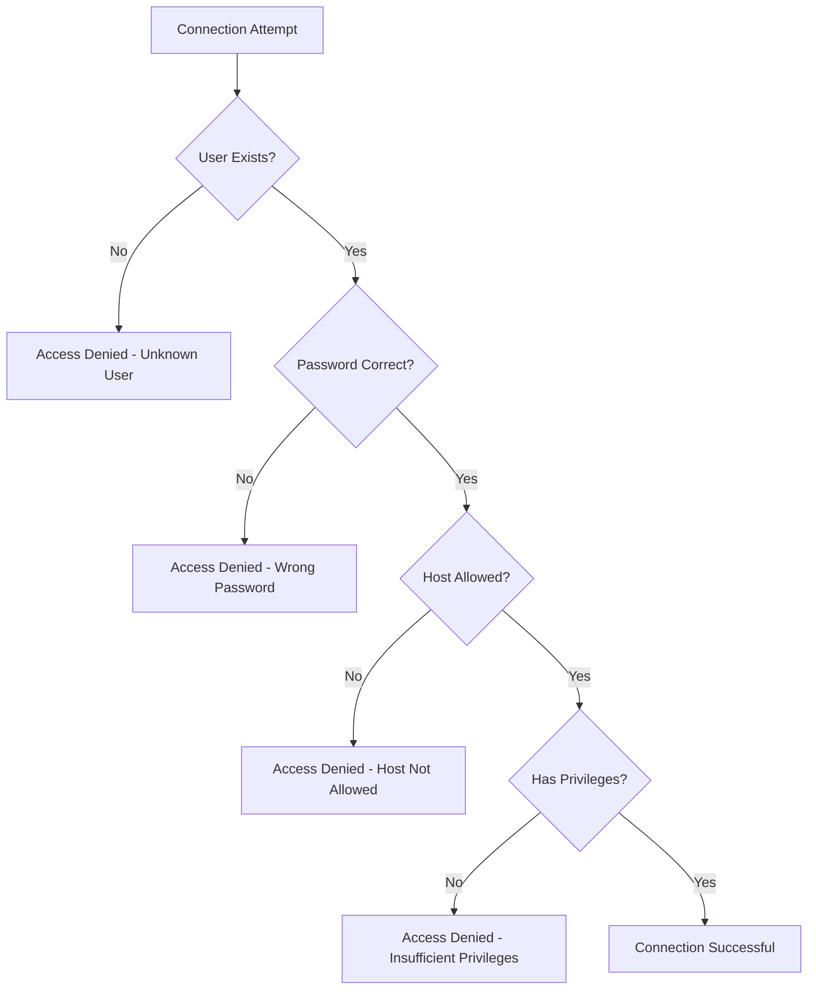

# How to Fix "Access Denied for User" Errors in MySQL

Author: [nawazdhandala](https://github.com/nawazdhandala)

Tags: MySQL, Database, Security, Authentication, Troubleshooting, DevOps

Description: Learn how to diagnose and fix MySQL access denied errors including authentication failures, privilege issues, and connection problems with practical solutions.

---

The "Access Denied for User" error is one of the most common issues MySQL administrators encounter. This error occurs when MySQL rejects a connection attempt due to authentication failures, insufficient privileges, or misconfigured user accounts. Understanding the root causes helps you resolve these issues quickly and prevent them from recurring.

## Understanding the Error

MySQL access denied errors typically look like this:

```
ERROR 1045 (28000): Access denied for user 'username'@'host' (using password: YES)
ERROR 1045 (28000): Access denied for user 'username'@'host' (using password: NO)
ERROR 1142 (42000): SELECT command denied to user 'username'@'host' for table 'tablename'
```

The error message contains important information. The `username@host` combination tells you exactly which user account MySQL tried to authenticate, and whether a password was provided.



## Common Causes and Solutions

### 1. Wrong Password or Username

The most frequent cause is simply entering the wrong credentials. Verify your credentials by checking the user exists in MySQL.

```sql
-- Connect as root or admin user first
mysql -u root -p

-- Check if the user exists
SELECT User, Host FROM mysql.user WHERE User = 'myuser';

-- Expected output shows the user and allowed hosts:
-- +--------+-----------+
-- | User   | Host      |
-- +--------+-----------+
-- | myuser | localhost |
-- | myuser | %         |
-- +--------+-----------+
```

If the user does not exist, create it:

```sql
-- Create user with password
-- The host part determines where connections can originate from
CREATE USER 'myuser'@'localhost' IDENTIFIED BY 'secure_password';

-- For remote connections, use % as wildcard or specific IP
CREATE USER 'myuser'@'%' IDENTIFIED BY 'secure_password';

-- Or allow connections from specific IP range
CREATE USER 'myuser'@'192.168.1.%' IDENTIFIED BY 'secure_password';
```

### 2. Host Mismatch

MySQL authenticates users based on both username AND host. A user `'myuser'@'localhost'` is different from `'myuser'@'%'`. This is a common source of confusion.

```sql
-- Check which hosts are allowed for a user
SELECT User, Host, authentication_string FROM mysql.user
WHERE User = 'myuser';

-- Common issue: User exists for localhost but you're connecting remotely
-- Solution: Add the user for the connecting host

-- Allow from any host
CREATE USER 'myuser'@'%' IDENTIFIED BY 'secure_password';

-- Or allow from specific host
CREATE USER 'myuser'@'192.168.1.100' IDENTIFIED BY 'secure_password';

-- Apply changes
FLUSH PRIVILEGES;
```

The host matching follows specific rules. MySQL finds the most specific match first:

```sql
-- MySQL host matching priority (most specific first):
-- 1. Exact IP match: '192.168.1.100'
-- 2. IP with wildcard: '192.168.1.%'
-- 3. Hostname: 'webserver.example.com'
-- 4. Wildcard: '%'

-- Example: If both exist, connection from 192.168.1.100 uses the first:
-- myuser@192.168.1.100 (used)
-- myuser@% (ignored for this connection)
```

### 3. Authentication Plugin Issues

MySQL 8.0 uses `caching_sha2_password` by default, which older clients may not support. This causes access denied errors even with correct credentials.

```sql
-- Check the authentication plugin for a user
SELECT User, Host, plugin FROM mysql.user WHERE User = 'myuser';

-- Output showing the default MySQL 8.0 plugin:
-- +--------+-----------+-----------------------+
-- | User   | Host      | plugin                |
-- +--------+-----------+-----------------------+
-- | myuser | localhost | caching_sha2_password |
-- +--------+-----------+-----------------------+

-- Change to mysql_native_password for compatibility with older clients
ALTER USER 'myuser'@'localhost'
IDENTIFIED WITH mysql_native_password BY 'secure_password';

-- Or set default authentication plugin in my.cnf for new users
-- [mysqld]
-- default_authentication_plugin=mysql_native_password
```

### 4. Password Reset for Root User

If you have lost the root password, you can reset it using safe mode.

```bash
# Stop MySQL service
sudo systemctl stop mysql

# Start MySQL without authentication (be careful - anyone can connect!)
sudo mysqld_safe --skip-grant-tables &

# Connect without password
mysql -u root

# Reset the password
FLUSH PRIVILEGES;
ALTER USER 'root'@'localhost' IDENTIFIED BY 'new_secure_password';

# Exit and restart MySQL normally
exit
sudo systemctl stop mysql
sudo systemctl start mysql
```

For MySQL 8.0, you may need this alternative approach:

```bash
# Create an init file with the password reset command
echo "ALTER USER 'root'@'localhost' IDENTIFIED BY 'new_password';" > /tmp/mysql-init

# Start MySQL with the init file
sudo mysqld --init-file=/tmp/mysql-init &

# Wait for MySQL to start, then restart normally
sleep 10
sudo systemctl restart mysql

# Clean up the init file (contains password!)
rm /tmp/mysql-init
```

### 5. Privilege Issues

Access denied for specific operations means the user lacks required privileges.

```sql
-- Check current privileges for a user
SHOW GRANTS FOR 'myuser'@'localhost';

-- Grant specific privileges on a database
GRANT SELECT, INSERT, UPDATE, DELETE ON mydb.* TO 'myuser'@'localhost';

-- Grant all privileges on a database
GRANT ALL PRIVILEGES ON mydb.* TO 'myuser'@'localhost';

-- Grant privileges on specific tables
GRANT SELECT ON mydb.users TO 'myuser'@'localhost';
GRANT INSERT, UPDATE ON mydb.orders TO 'myuser'@'localhost';

-- Apply changes
FLUSH PRIVILEGES;
```

Here is a reference for common privilege requirements:

```sql
-- Read-only access (reports, dashboards)
GRANT SELECT ON mydb.* TO 'readonly_user'@'%';

-- Application user (typical CRUD operations)
GRANT SELECT, INSERT, UPDATE, DELETE ON mydb.* TO 'app_user'@'%';

-- Migration user (needs schema modification rights)
GRANT SELECT, INSERT, UPDATE, DELETE, CREATE, ALTER, DROP, INDEX
ON mydb.* TO 'migration_user'@'%';

-- Backup user (needs read access to all databases)
GRANT SELECT, LOCK TABLES, SHOW VIEW, EVENT, TRIGGER
ON *.* TO 'backup_user'@'localhost';

-- Replication user (for MySQL replication)
GRANT REPLICATION SLAVE, REPLICATION CLIENT ON *.* TO 'repl_user'@'%';
```

## Debugging Connection Issues

When troubleshooting, gather information systematically.

```bash
# Test connection with verbose output
mysql -u myuser -p -h hostname --verbose

# Check if MySQL is listening on the expected port
netstat -tlnp | grep 3306

# Verify MySQL allows remote connections (check bind-address)
grep bind-address /etc/mysql/mysql.conf.d/mysqld.cnf
# bind-address = 127.0.0.1  means localhost only
# bind-address = 0.0.0.0    means all interfaces

# Test network connectivity
telnet hostname 3306
```

Enable the general log temporarily to see connection attempts:

```sql
-- Enable general log to see all connection attempts
SET GLOBAL general_log = 'ON';
SET GLOBAL general_log_file = '/var/log/mysql/general.log';

-- Check the log for connection details
-- Then disable when done (performance impact)
SET GLOBAL general_log = 'OFF';
```

## Application Configuration

When configuring your application, ensure the connection string matches the MySQL user configuration.

```javascript
// Node.js with mysql2
const mysql = require('mysql2/promise');

const pool = mysql.createPool({
  host: process.env.DB_HOST,      // Must match the host in user@host
  port: process.env.DB_PORT || 3306,
  user: process.env.DB_USER,
  password: process.env.DB_PASSWORD,
  database: process.env.DB_NAME,

  // Connection settings that can affect authentication
  connectTimeout: 10000,
  // For MySQL 8.0 with older clients, you might need:
  // authPlugins: { mysql_native_password: () => () => Buffer.from(password) }
});

// Test the connection on startup
async function testConnection() {
  try {
    const connection = await pool.getConnection();
    console.log('Database connected successfully');
    connection.release();
  } catch (error) {
    console.error('Database connection failed:', error.message);
    // Common errors:
    // ER_ACCESS_DENIED_ERROR - wrong credentials
    // ER_BAD_DB_ERROR - database doesn't exist
    // ECONNREFUSED - MySQL not running or wrong host/port
    process.exit(1);
  }
}
```

```python
# Python with PyMySQL
import pymysql
import os

try:
    connection = pymysql.connect(
        host=os.environ.get('DB_HOST', 'localhost'),
        port=int(os.environ.get('DB_PORT', 3306)),
        user=os.environ['DB_USER'],
        password=os.environ['DB_PASSWORD'],
        database=os.environ['DB_NAME'],
        connect_timeout=10,
        # For authentication plugin issues:
        # auth_plugin_map={'mysql_native_password': 'pymysql.auth.mysql_native_password'}
    )
    print("Connected successfully")
except pymysql.err.OperationalError as e:
    error_code = e.args[0]
    if error_code == 1045:
        print("Access denied - check username and password")
    elif error_code == 1049:
        print("Unknown database")
    else:
        print(f"Connection error: {e}")
```

## Security Best Practices

When fixing access issues, avoid creating security vulnerabilities.

```sql
-- DON'T: Grant all privileges on all databases
-- GRANT ALL PRIVILEGES ON *.* TO 'app_user'@'%';

-- DO: Grant minimum required privileges on specific database
GRANT SELECT, INSERT, UPDATE, DELETE ON app_database.* TO 'app_user'@'%';

-- DON'T: Allow connections from anywhere with weak password
-- CREATE USER 'admin'@'%' IDENTIFIED BY '123456';

-- DO: Restrict host and use strong password
CREATE USER 'admin'@'10.0.0.%' IDENTIFIED BY 'complex_password_here';

-- DON'T: Leave root accessible remotely
-- CREATE USER 'root'@'%' IDENTIFIED BY 'password';

-- DO: Keep root local only
-- Root should already exist as 'root'@'localhost'
```

## Quick Reference

| Error | Likely Cause | Solution |
|-------|-------------|----------|
| using password: YES | Wrong password | Verify password, reset if needed |
| using password: NO | Password not sent | Check connection config |
| Unknown user | User doesn't exist | Create the user |
| Host not allowed | Host mismatch | Add user for correct host |
| Command denied | Missing privilege | Grant required privilege |

Access denied errors are almost always configuration issues. Start by verifying the exact user and host combination MySQL expects, then check the password and privileges. With systematic debugging, these issues are straightforward to resolve.
