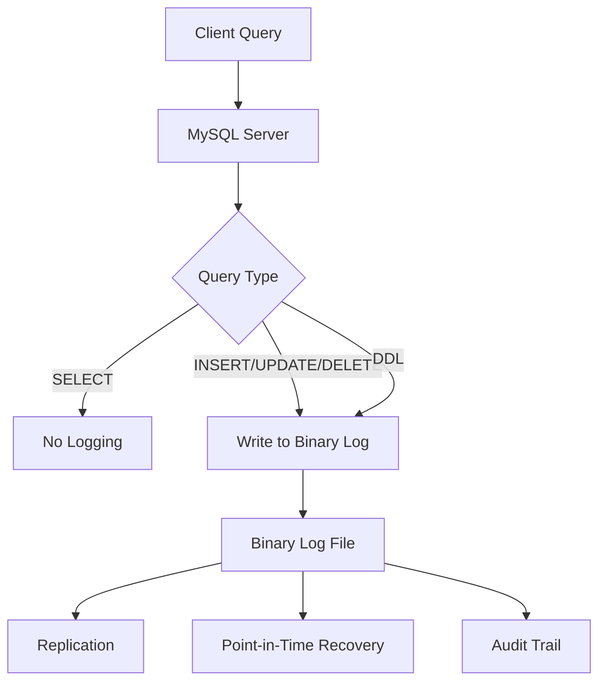
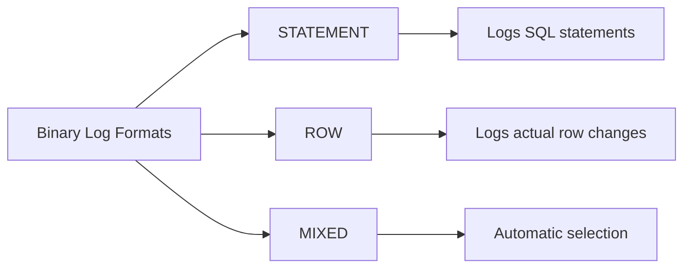
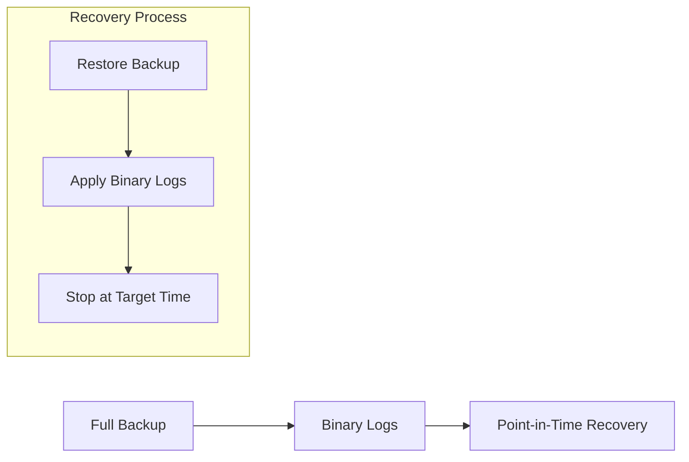

# How to Configure MySQL Binary Logging

Author: [nawazdhandala](https://www.github.com/nawazdhandala)

Tags: MySQL, Database, Binary Logging, Replication, Backup, Recovery, DevOps

Description: Learn how to configure MySQL binary logging for replication, point-in-time recovery, and auditing with practical examples.

---

Binary logging records all changes to your MySQL database. It is essential for replication, point-in-time recovery, and auditing. This guide covers how to configure, manage, and use binary logs effectively.

## Understanding Binary Logs



Binary logs contain:
- All data-changing statements (INSERT, UPDATE, DELETE)
- Data definition statements (CREATE, ALTER, DROP)
- Transaction information
- Timestamps and server IDs

## Enabling Binary Logging

### Basic Configuration

Edit your MySQL configuration file (`my.cnf` or `my.ini`):

```ini
[mysqld]
# Enable binary logging
log_bin = /var/lib/mysql/mysql-bin

# Server ID (required for replication, should be unique)
server_id = 1

# Binary log format: ROW, STATEMENT, or MIXED
binlog_format = ROW

# Expire binary logs after 7 days
binlog_expire_logs_seconds = 604800

# Maximum size of each binary log file (default 1GB)
max_binlog_size = 500M

# Sync binary log to disk after each write (safest, slower)
sync_binlog = 1
```

Restart MySQL to apply changes:

```bash
sudo systemctl restart mysql
```

### Verify Binary Logging is Enabled

```sql
-- Check if binary logging is enabled
SHOW VARIABLES LIKE 'log_bin';

-- Check binary log settings
SHOW VARIABLES LIKE 'binlog%';

-- List current binary log files
SHOW BINARY LOGS;

-- Show current binary log file and position
SHOW MASTER STATUS;
```

## Binary Log Formats

MySQL supports three binary log formats:



### STATEMENT Format

Logs the actual SQL statements:

```ini
binlog_format = STATEMENT
```

**Pros:**
- Smaller log files
- Easier to read and audit

**Cons:**
- Non-deterministic functions (NOW(), UUID()) cause issues
- Some statements may produce different results on replicas

### ROW Format (Recommended)

Logs the actual row changes:

```ini
binlog_format = ROW
```

**Pros:**
- Most accurate replication
- Works with all statements
- Required for some features (e.g., parallel replication)

**Cons:**
- Larger log files
- Harder to read directly

### MIXED Format

MySQL automatically chooses the format:

```ini
binlog_format = MIXED
```

Uses STATEMENT by default, switches to ROW when needed for safety.

## Managing Binary Logs

### Viewing Binary Log Contents

```bash
# Decode binary log to readable format
mysqlbinlog /var/lib/mysql/mysql-bin.000001

# View specific time range
mysqlbinlog --start-datetime="2026-01-24 00:00:00" \
            --stop-datetime="2026-01-24 12:00:00" \
            /var/lib/mysql/mysql-bin.000001

# View specific position range
mysqlbinlog --start-position=4 \
            --stop-position=1000 \
            /var/lib/mysql/mysql-bin.000001

# For ROW format, add verbose flags
mysqlbinlog -v --base64-output=DECODE-ROWS /var/lib/mysql/mysql-bin.000001
```

### Rotating Binary Logs

```sql
-- Force rotation to a new binary log file
FLUSH BINARY LOGS;

-- Check the new file
SHOW MASTER STATUS;
```

### Purging Old Binary Logs

```sql
-- Purge logs older than a specific file
PURGE BINARY LOGS TO 'mysql-bin.000005';

-- Purge logs older than a specific date
PURGE BINARY LOGS BEFORE '2026-01-20 00:00:00';

-- Automatic purging (set in config)
-- binlog_expire_logs_seconds = 604800  (7 days)
```

## Point-in-Time Recovery

Binary logs enable recovery to any point in time:



### Step 1: Restore Full Backup

```bash
# Restore from mysqldump
mysql -u root -p < full_backup.sql
```

### Step 2: Identify Recovery Point

```bash
# Find the transaction to recover to
mysqlbinlog --start-datetime="2026-01-24 10:00:00" \
            --stop-datetime="2026-01-24 12:00:00" \
            /var/lib/mysql/mysql-bin.* | grep -i "drop table"

# Note the position before the bad statement
```

### Step 3: Apply Binary Logs Up to That Point

```bash
# Apply logs from backup position to just before the problem
mysqlbinlog --start-position=154 \
            --stop-position=12345 \
            /var/lib/mysql/mysql-bin.000010 | mysql -u root -p

# Or use datetime
mysqlbinlog --start-datetime="2026-01-24 00:00:00" \
            --stop-datetime="2026-01-24 11:59:59" \
            /var/lib/mysql/mysql-bin.* | mysql -u root -p
```

### Automated Recovery Script

```bash
#!/bin/bash
# Point-in-time recovery script

BACKUP_FILE="$1"
STOP_TIME="$2"
BINLOG_DIR="/var/lib/mysql"

if [ -z "$BACKUP_FILE" ] || [ -z "$STOP_TIME" ]; then
    echo "Usage: $0 <backup_file> <stop_datetime>"
    echo "Example: $0 backup.sql '2026-01-24 11:59:59'"
    exit 1
fi

echo "Restoring backup..."
mysql -u root -p < "$BACKUP_FILE"

echo "Applying binary logs up to $STOP_TIME..."
mysqlbinlog --stop-datetime="$STOP_TIME" \
    "$BINLOG_DIR"/mysql-bin.* | mysql -u root -p

echo "Recovery complete."
```

## Replication Configuration

Binary logs are the foundation of MySQL replication:

### Source (Master) Configuration

```ini
[mysqld]
server_id = 1
log_bin = /var/lib/mysql/mysql-bin
binlog_format = ROW

# For GTID-based replication (recommended)
gtid_mode = ON
enforce_gtid_consistency = ON
```

### Create Replication User

```sql
-- Create user for replication
CREATE USER 'repl_user'@'%' IDENTIFIED BY 'secure_password';
GRANT REPLICATION SLAVE ON *.* TO 'repl_user'@'%';
FLUSH PRIVILEGES;

-- Note the binary log position
SHOW MASTER STATUS;
```

### Replica (Slave) Configuration

```ini
[mysqld]
server_id = 2
relay_log = /var/lib/mysql/relay-bin
read_only = ON

# For GTID-based replication
gtid_mode = ON
enforce_gtid_consistency = ON
```

### Start Replication

```sql
-- On the replica
CHANGE REPLICATION SOURCE TO
    SOURCE_HOST = 'master_host',
    SOURCE_USER = 'repl_user',
    SOURCE_PASSWORD = 'secure_password',
    SOURCE_AUTO_POSITION = 1;  -- For GTID

-- Start replication
START REPLICA;

-- Check status
SHOW REPLICA STATUS\G
```

## Performance Tuning

### Optimize Write Performance

```ini
[mysqld]
# Buffer binary log writes (less safe, faster)
# 0 = OS decides when to flush
# 1 = Flush every transaction (safest)
# N = Flush every N transactions
sync_binlog = 1

# Group commit settings for better performance
binlog_group_commit_sync_delay = 100  # microseconds
binlog_group_commit_sync_no_delay_count = 10
```

### Reduce Binary Log Size

```ini
[mysqld]
# Use ROW format with minimal logging
binlog_format = ROW
binlog_row_image = minimal  # Only log changed columns

# Compress binary logs (MySQL 8.0.20+)
binlog_transaction_compression = ON
```

### Filter What Gets Logged

```ini
[mysqld]
# Only log specific databases
binlog_do_db = production_db
binlog_do_db = important_db

# Or exclude specific databases
binlog_ignore_db = test_db
binlog_ignore_db = temp_db
```

## Monitoring Binary Logs

### Check Binary Log Status

```sql
-- Current binary log file and position
SHOW MASTER STATUS;

-- List all binary log files with sizes
SHOW BINARY LOGS;

-- Total size of binary logs
SELECT
    ROUND(SUM(FILE_SIZE)/1024/1024, 2) AS 'Total Size (MB)'
FROM performance_schema.binary_log_status;
```

### Monitor Binary Log Events

```sql
-- View events in current binary log
SHOW BINLOG EVENTS;

-- View events in specific file
SHOW BINLOG EVENTS IN 'mysql-bin.000010';

-- View limited events
SHOW BINLOG EVENTS IN 'mysql-bin.000010' LIMIT 10;
```

### Automated Monitoring Script

```bash
#!/bin/bash
# Monitor binary log growth

BINLOG_DIR="/var/lib/mysql"
MAX_SIZE_GB=50
ALERT_EMAIL="dba@company.com"

# Calculate total size of binary logs
TOTAL_SIZE=$(du -sb "$BINLOG_DIR"/mysql-bin.* 2>/dev/null | awk '{sum+=$1} END {print sum}')
TOTAL_SIZE_GB=$(echo "scale=2; $TOTAL_SIZE / 1073741824" | bc)

echo "Binary log total size: ${TOTAL_SIZE_GB}GB"

if (( $(echo "$TOTAL_SIZE_GB > $MAX_SIZE_GB" | bc -l) )); then
    echo "WARNING: Binary logs exceed ${MAX_SIZE_GB}GB" | \
        mail -s "MySQL Binary Log Alert" "$ALERT_EMAIL"
fi
```

## Security Considerations

### Encrypt Binary Logs (MySQL 8.0+)

```ini
[mysqld]
# Enable binary log encryption
binlog_encryption = ON
```

### Restrict Binary Log Access

```bash
# Set proper permissions on binary log files
chmod 640 /var/lib/mysql/mysql-bin.*
chown mysql:mysql /var/lib/mysql/mysql-bin.*
```

### Secure Replication Connections

```sql
-- Require SSL for replication
CHANGE REPLICATION SOURCE TO
    SOURCE_HOST = 'master_host',
    SOURCE_USER = 'repl_user',
    SOURCE_PASSWORD = 'secure_password',
    SOURCE_SSL = 1,
    SOURCE_AUTO_POSITION = 1;
```

## Complete Production Configuration

```ini
[mysqld]
# Binary logging
log_bin = /var/lib/mysql/mysql-bin
binlog_format = ROW
binlog_row_image = full
max_binlog_size = 500M
binlog_expire_logs_seconds = 604800

# Replication
server_id = 1
gtid_mode = ON
enforce_gtid_consistency = ON

# Safety
sync_binlog = 1

# Performance
binlog_group_commit_sync_delay = 100
binlog_group_commit_sync_no_delay_count = 10

# Security (MySQL 8.0+)
binlog_encryption = ON
```

## Troubleshooting Checklist

When experiencing binary log issues:

- [ ] Verify binary logging is enabled: `SHOW VARIABLES LIKE 'log_bin'`
- [ ] Check available disk space for binary logs
- [ ] Verify binary log format matches your needs
- [ ] Ensure binlog_expire_logs_seconds is set to prevent disk fill
- [ ] Check replication status if using replicas
- [ ] Verify binary log permissions
- [ ] Monitor binary log growth over time

---

Binary logging is essential for MySQL replication and disaster recovery. Use ROW format for the most reliable replication, enable sync_binlog=1 for data safety, and set appropriate expiration to manage disk space. Regular monitoring and proper backup integration will ensure your binary logs serve you well when you need them most.
