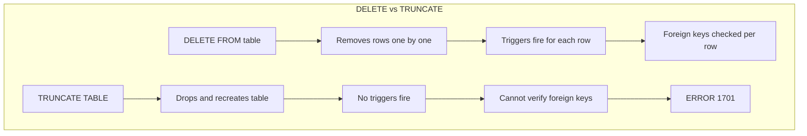
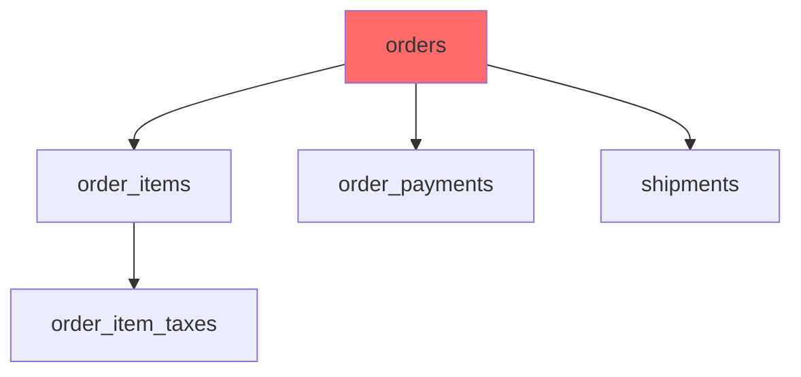

# How to Fix "Cannot Truncate Table" Errors

Author: [nawazdhandala](https://www.github.com/nawazdhandala)

Tags: MySQL, Database, Errors, Foreign Keys, TRUNCATE, Troubleshooting

Description: Learn how to diagnose and fix MySQL "Cannot truncate a table referenced in a foreign key constraint" errors with safe workarounds.

---

You try to empty a table quickly with TRUNCATE, and MySQL responds with "Cannot truncate a table referenced in a foreign key constraint." This happens because TRUNCATE handles data differently than DELETE, and MySQL cannot guarantee referential integrity during the operation.

This guide explains why this error occurs and provides safe solutions to work around it.

## Understanding the Error

The full error message looks like this:

```
ERROR 1701 (42000): Cannot truncate a table referenced in a foreign key constraint
(`database`.`child_table`, CONSTRAINT `fk_parent_id` FOREIGN KEY (`parent_id`)
REFERENCES `database`.`parent_table` (`id`))
```

This error occurs because TRUNCATE is a DDL (Data Definition Language) operation, not a DML operation like DELETE. MySQL drops and recreates the table internally, which breaks foreign key relationships.



## Quick Fix: Disable Foreign Key Checks

The fastest solution is to temporarily disable foreign key checks:

```sql
-- Disable foreign key checks
SET FOREIGN_KEY_CHECKS = 0;

-- Now truncate works
TRUNCATE TABLE orders;

-- Re-enable foreign key checks immediately
SET FOREIGN_KEY_CHECKS = 1;
```

Warning: This approach is dangerous because it can leave orphaned records in child tables. Only use it when you are truncating related tables together or when you are certain no dependent data exists.

```sql
-- Safe pattern: truncate child tables first, then parent
SET FOREIGN_KEY_CHECKS = 0;

-- Truncate in dependency order (children before parents)
TRUNCATE TABLE order_items;      -- Child table
TRUNCATE TABLE order_payments;   -- Child table
TRUNCATE TABLE orders;           -- Parent table

SET FOREIGN_KEY_CHECKS = 1;
```

## Safer Alternative: DELETE with LIMIT

If you need to preserve referential integrity, use DELETE instead:

```sql
-- DELETE respects foreign key constraints
DELETE FROM orders;

-- For very large tables, delete in batches to avoid long locks
DELETE FROM orders LIMIT 10000;
-- Repeat until table is empty
```

For large tables, batch deletion prevents lock timeouts:

```sql
-- Batch delete script
DELIMITER //
CREATE PROCEDURE batch_delete_orders()
BEGIN
    DECLARE rows_affected INT DEFAULT 1;

    WHILE rows_affected > 0 DO
        DELETE FROM orders LIMIT 10000;
        SET rows_affected = ROW_COUNT();

        -- Brief pause to allow other transactions
        DO SLEEP(0.1);
    END WHILE;
END //
DELIMITER ;

CALL batch_delete_orders();
DROP PROCEDURE batch_delete_orders;
```

## Using Cascading Deletes

If your foreign keys are set up with ON DELETE CASCADE, deleting from the parent automatically removes child records:

```sql
-- Check current foreign key definition
SELECT
    CONSTRAINT_NAME,
    TABLE_NAME,
    REFERENCED_TABLE_NAME,
    DELETE_RULE
FROM information_schema.REFERENTIAL_CONSTRAINTS
WHERE CONSTRAINT_SCHEMA = 'your_database'
AND REFERENCED_TABLE_NAME = 'orders';
```

If DELETE_RULE is CASCADE, you can safely delete:

```sql
-- This deletes orders AND all related order_items automatically
DELETE FROM orders;
```

If DELETE_RULE is RESTRICT or NO ACTION, you need to modify the constraint:

```sql
-- Drop the existing constraint
ALTER TABLE order_items
DROP FOREIGN KEY fk_order_items_order_id;

-- Recreate with CASCADE
ALTER TABLE order_items
ADD CONSTRAINT fk_order_items_order_id
FOREIGN KEY (order_id) REFERENCES orders(id)
ON DELETE CASCADE;
```

## Finding All Related Tables

Before truncating, identify all tables that reference your target table:

```sql
-- Find all tables that reference the 'orders' table
SELECT
    TABLE_NAME AS referencing_table,
    COLUMN_NAME AS referencing_column,
    CONSTRAINT_NAME,
    REFERENCED_COLUMN_NAME
FROM information_schema.KEY_COLUMN_USAGE
WHERE REFERENCED_TABLE_SCHEMA = DATABASE()
AND REFERENCED_TABLE_NAME = 'orders';
```

Build a dependency map:



Truncate in reverse dependency order:

```sql
SET FOREIGN_KEY_CHECKS = 0;

-- Level 2 (grandchildren)
TRUNCATE TABLE order_item_taxes;

-- Level 1 (children)
TRUNCATE TABLE order_items;
TRUNCATE TABLE order_payments;
TRUNCATE TABLE shipments;

-- Level 0 (parent)
TRUNCATE TABLE orders;

SET FOREIGN_KEY_CHECKS = 1;
```

## Automated Truncate Script

Here is a stored procedure that truncates a table and all its dependents:

```sql
DELIMITER //

CREATE PROCEDURE truncate_with_dependencies(IN target_table VARCHAR(64))
BEGIN
    DECLARE done INT DEFAULT FALSE;
    DECLARE child_table VARCHAR(64);

    -- Cursor for child tables
    DECLARE child_cursor CURSOR FOR
        SELECT TABLE_NAME
        FROM information_schema.KEY_COLUMN_USAGE
        WHERE REFERENCED_TABLE_SCHEMA = DATABASE()
        AND REFERENCED_TABLE_NAME = target_table;

    DECLARE CONTINUE HANDLER FOR NOT FOUND SET done = TRUE;

    -- Disable foreign key checks
    SET FOREIGN_KEY_CHECKS = 0;

    -- Recursively truncate child tables first
    OPEN child_cursor;
    read_loop: LOOP
        FETCH child_cursor INTO child_table;
        IF done THEN
            LEAVE read_loop;
        END IF;

        -- Recursive call for nested dependencies
        CALL truncate_with_dependencies(child_table);
    END LOOP;
    CLOSE child_cursor;

    -- Truncate the target table
    SET @sql = CONCAT('TRUNCATE TABLE ', target_table);
    PREPARE stmt FROM @sql;
    EXECUTE stmt;
    DEALLOCATE PREPARE stmt;

    -- Re-enable foreign key checks
    SET FOREIGN_KEY_CHECKS = 1;
END //

DELIMITER ;

-- Usage
CALL truncate_with_dependencies('orders');
```

## Handling Self-Referencing Tables

Tables with self-referencing foreign keys (like hierarchical data) need special handling:

```sql
-- Example: categories with parent_id referencing itself
CREATE TABLE categories (
    id INT PRIMARY KEY,
    name VARCHAR(100),
    parent_id INT,
    FOREIGN KEY (parent_id) REFERENCES categories(id)
);

-- Cannot truncate due to self-reference
-- Solution 1: Set parent_id to NULL first
UPDATE categories SET parent_id = NULL;
TRUNCATE TABLE categories;

-- Solution 2: Disable checks
SET FOREIGN_KEY_CHECKS = 0;
TRUNCATE TABLE categories;
SET FOREIGN_KEY_CHECKS = 1;
```

## The Nuclear Option: Drop and Recreate

For development or testing, dropping and recreating is sometimes easiest:

```sql
-- Get the CREATE TABLE statement
SHOW CREATE TABLE orders\G

-- Save it, then drop
DROP TABLE order_items;  -- Children first
DROP TABLE orders;

-- Recreate from saved statements
CREATE TABLE orders (...);
CREATE TABLE order_items (...);
```

Automate with mysqldump:

```bash
# Dump just the schema (no data)
mysqldump -u root -p --no-data database_name orders order_items > schema.sql

# Drop tables
mysql -u root -p -e "SET FOREIGN_KEY_CHECKS=0; DROP TABLE order_items, orders; SET FOREIGN_KEY_CHECKS=1;" database_name

# Recreate from schema
mysql -u root -p database_name < schema.sql
```

## Prevention: Design Considerations

Consider these patterns when designing your schema:

### Soft Deletes Instead of Truncate

```sql
-- Add a deleted flag
ALTER TABLE orders ADD COLUMN deleted_at TIMESTAMP NULL;

-- "Delete" by setting timestamp
UPDATE orders SET deleted_at = NOW() WHERE deleted_at IS NULL;

-- Filter deleted records in queries
SELECT * FROM orders WHERE deleted_at IS NULL;

-- Periodically clean up truly deleted records
DELETE FROM orders WHERE deleted_at < DATE_SUB(NOW(), INTERVAL 30 DAY);
```

### Partitioning for Easy Cleanup

```sql
-- Partition by date for easy truncation
CREATE TABLE logs (
    id INT,
    message TEXT,
    created_at DATE
) PARTITION BY RANGE (YEAR(created_at) * 100 + MONTH(created_at)) (
    PARTITION p202601 VALUES LESS THAN (202602),
    PARTITION p202602 VALUES LESS THAN (202603),
    PARTITION p202603 VALUES LESS THAN (202604)
);

-- Drop old partitions instantly (no foreign key issues)
ALTER TABLE logs DROP PARTITION p202601;
```

## Best Practices

1. **Always identify dependencies first.** Query information_schema before truncating.

2. **Use transactions with DELETE when possible.** This maintains integrity and allows rollback.

3. **Minimize foreign key check disabling.** Re-enable immediately after truncating.

4. **Truncate in dependency order.** Children before parents prevents orphans.

5. **Consider soft deletes for production.** They preserve audit trails and allow recovery.

6. **Test in development first.** Truncating with disabled checks can corrupt data relationships.

The "cannot truncate" error protects your data integrity. Work with it rather than against it, and your database relationships will stay consistent.
