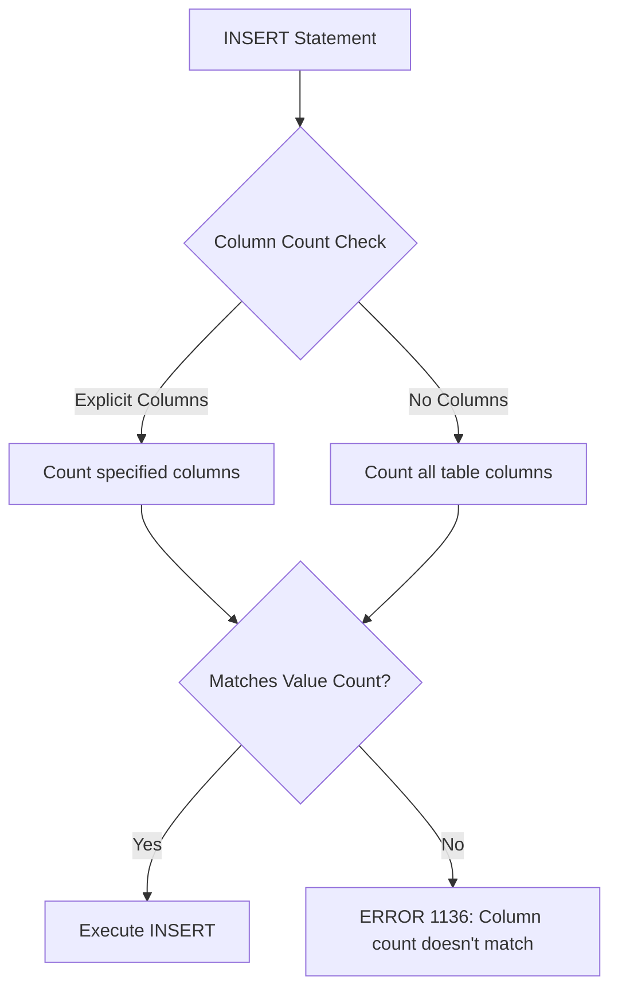
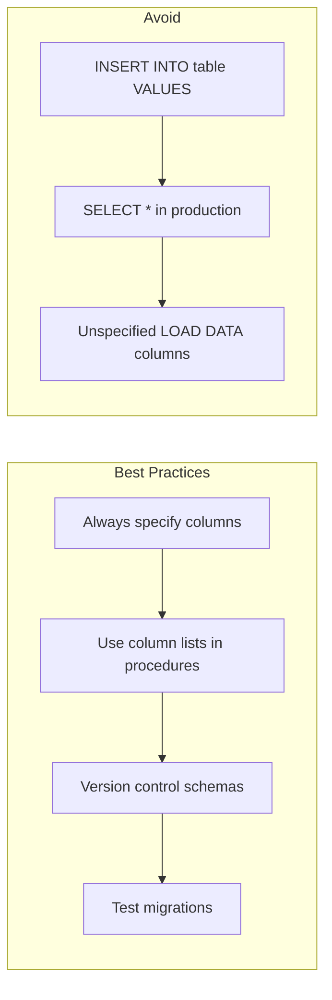

# How to Fix 'Column Count Doesn't Match' Errors

Author: [nawazdhandala](https://github.com/nawazdhandala)

Tags: MySQL, Database, Troubleshooting, SQL, Data Migration

Description: Learn how to diagnose and fix MySQL 'Column count doesn't match value count' errors in INSERT statements, views, stored procedures, and data imports.

---

The "Column count doesn't match value count at row X" error is one of the most common MySQL errors. It occurs when the number of columns in your INSERT statement does not match the number of values provided. While the error message is straightforward, the causes can be subtle and the fixes depend on your specific situation.

## Understanding the Error



## Common Error Messages

```
ERROR 1136 (21S01): Column count doesn't match value count at row 1
ERROR 1136 (21S01): Column count doesn't match value count at row 5
```

## Scenario 1: Basic INSERT Mismatch

### The Problem

```sql
-- Table definition
CREATE TABLE users (
    id INT AUTO_INCREMENT PRIMARY KEY,
    username VARCHAR(50),
    email VARCHAR(100),
    created_at TIMESTAMP DEFAULT CURRENT_TIMESTAMP
);

-- Error: 4 columns but only 2 values
INSERT INTO users VALUES ('john_doe', 'john@example.com');
```

### The Fix

**Option 1: Specify columns explicitly (recommended)**

```sql
-- Specify which columns you're inserting
INSERT INTO users (username, email)
VALUES ('john_doe', 'john@example.com');
```

**Option 2: Provide all values including auto-generated ones**

```sql
-- Provide all values (use NULL or DEFAULT for auto columns)
INSERT INTO users VALUES (NULL, 'john_doe', 'john@example.com', NOW());

-- Or use DEFAULT keyword
INSERT INTO users VALUES (DEFAULT, 'john_doe', 'john@example.com', DEFAULT);
```

## Scenario 2: Multiple Row INSERT Errors

### The Problem

```sql
-- Error occurs at row 3 (one value missing)
INSERT INTO users (username, email) VALUES
    ('alice', 'alice@example.com'),
    ('bob', 'bob@example.com'),
    ('charlie'),  -- Missing email!
    ('diana', 'diana@example.com');
```

### The Fix

```sql
-- Ensure all rows have the same number of values
INSERT INTO users (username, email) VALUES
    ('alice', 'alice@example.com'),
    ('bob', 'bob@example.com'),
    ('charlie', 'charlie@example.com'),  -- Fixed
    ('diana', 'diana@example.com');
```

### Finding the Problematic Row

For large INSERT statements, find the issue programmatically:

```python
import re

insert_sql = """
INSERT INTO users (username, email) VALUES
    ('alice', 'alice@example.com'),
    ('bob', 'bob@example.com'),
    ('charlie'),
    ('diana', 'diana@example.com');
"""

# Extract and validate each row
values_pattern = r"\(([^)]+)\)"
matches = re.findall(values_pattern, insert_sql)

expected_columns = 2  # username, email

for i, row in enumerate(matches, 1):
    # Count values (simple approach - may need refinement for complex data)
    values = [v.strip() for v in row.split(',')]
    if len(values) != expected_columns:
        print(f"Row {i}: Expected {expected_columns} values, found {len(values)}")
        print(f"  Content: ({row})")
```

## Scenario 3: INSERT INTO ... SELECT Mismatch

### The Problem

```sql
-- Source table has different column count
CREATE TABLE users_backup (
    id INT,
    username VARCHAR(50),
    email VARCHAR(100),
    phone VARCHAR(20),  -- Extra column!
    created_at TIMESTAMP
);

-- Error: Target has 4 columns, source SELECT returns 5
INSERT INTO users
SELECT * FROM users_backup;
```

### The Fix

**Option 1: Specify columns explicitly**

```sql
-- Select only the columns you need
INSERT INTO users (id, username, email, created_at)
SELECT id, username, email, created_at
FROM users_backup;
```

**Option 2: Exclude specific columns**

```sql
-- Create a column list dynamically (for many columns)
SELECT GROUP_CONCAT(COLUMN_NAME)
FROM INFORMATION_SCHEMA.COLUMNS
WHERE TABLE_SCHEMA = 'mydb'
  AND TABLE_NAME = 'users_backup'
  AND COLUMN_NAME != 'phone';
```

## Scenario 4: View Column Mismatch

### The Problem

Views can cause confusion when the underlying table changes:

```sql
-- Original table
CREATE TABLE products (
    id INT PRIMARY KEY,
    name VARCHAR(100),
    price DECIMAL(10,2)
);

-- View created
CREATE VIEW product_view AS SELECT * FROM products;

-- Later, table is altered
ALTER TABLE products ADD COLUMN category VARCHAR(50);

-- Now this fails!
INSERT INTO product_view VALUES (1, 'Widget', 29.99);
-- Error: Column count doesn't match (view expects 4 columns now)
```

### The Fix

```sql
-- Option 1: Update the view definition
CREATE OR REPLACE VIEW product_view AS
SELECT id, name, price FROM products;

-- Option 2: Specify columns in INSERT
INSERT INTO product_view (id, name, price)
VALUES (1, 'Widget', 29.99);

-- Option 3: Check view definition
SHOW CREATE VIEW product_view;
```

## Scenario 5: Stored Procedure Issues

### The Problem

```sql
DELIMITER //

CREATE PROCEDURE insert_user(
    IN p_username VARCHAR(50),
    IN p_email VARCHAR(100)
)
BEGIN
    -- Table was altered to add a required column
    INSERT INTO users VALUES (NULL, p_username, p_email, NOW());
    -- Error if table now has 5 columns instead of 4
END //

DELIMITER ;
```

### The Fix

```sql
DELIMITER //

CREATE PROCEDURE insert_user(
    IN p_username VARCHAR(50),
    IN p_email VARCHAR(100)
)
BEGIN
    -- Always specify column names in stored procedures
    INSERT INTO users (username, email)
    VALUES (p_username, p_email);
END //

DELIMITER ;
```

## Scenario 6: Data Import Errors

### CSV Import Mismatch

```sql
-- Table structure
CREATE TABLE sales (
    id INT AUTO_INCREMENT PRIMARY KEY,
    product_name VARCHAR(100),
    quantity INT,
    price DECIMAL(10,2),
    sale_date DATE
);

-- CSV file has: product_name,quantity,price,sale_date (no id column)
-- This fails:
LOAD DATA INFILE '/path/to/sales.csv'
INTO TABLE sales
FIELDS TERMINATED BY ','
LINES TERMINATED BY '\n'
IGNORE 1 ROWS;
```

### The Fix

```sql
-- Specify which columns the CSV maps to
LOAD DATA INFILE '/path/to/sales.csv'
INTO TABLE sales
FIELDS TERMINATED BY ','
LINES TERMINATED BY '\n'
IGNORE 1 ROWS
(product_name, quantity, price, sale_date);  -- Explicitly list CSV columns
```

### Handling Extra CSV Columns

```sql
-- CSV has: product_name,quantity,price,discount,sale_date
-- But table doesn't have discount column

LOAD DATA INFILE '/path/to/sales.csv'
INTO TABLE sales
FIELDS TERMINATED BY ','
LINES TERMINATED BY '\n'
IGNORE 1 ROWS
(product_name, quantity, price, @ignore_discount, sale_date);
```

## Scenario 7: Dynamic SQL Issues

### The Problem

```sql
DELIMITER //

CREATE PROCEDURE dynamic_insert(IN table_name VARCHAR(64), IN values_str TEXT)
BEGIN
    SET @sql = CONCAT('INSERT INTO ', table_name, ' VALUES (', values_str, ')');
    PREPARE stmt FROM @sql;
    EXECUTE stmt;
    DEALLOCATE PREPARE stmt;
END //

DELIMITER ;

-- This might fail if column count changes
CALL dynamic_insert('users', '"john", "john@example.com"');
```

### The Fix

```sql
DELIMITER //

CREATE PROCEDURE safe_dynamic_insert(
    IN table_name VARCHAR(64),
    IN column_list TEXT,
    IN values_str TEXT
)
BEGIN
    -- Validate column count matches value count
    SET @col_count = LENGTH(column_list) - LENGTH(REPLACE(column_list, ',', '')) + 1;
    SET @val_count = LENGTH(values_str) - LENGTH(REPLACE(values_str, ',', '')) + 1;

    IF @col_count != @val_count THEN
        SIGNAL SQLSTATE '45000'
            SET MESSAGE_TEXT = 'Column count does not match value count';
    END IF;

    SET @sql = CONCAT('INSERT INTO ', table_name, ' (', column_list, ') VALUES (', values_str, ')');
    PREPARE stmt FROM @sql;
    EXECUTE stmt;
    DEALLOCATE PREPARE stmt;
END //

DELIMITER ;
```

## Diagnostic Queries

### Check Table Column Count

```sql
-- Get column count for a table
SELECT COUNT(*) AS column_count
FROM INFORMATION_SCHEMA.COLUMNS
WHERE TABLE_SCHEMA = 'your_database'
  AND TABLE_NAME = 'your_table';

-- Get detailed column information
SELECT
    COLUMN_NAME,
    ORDINAL_POSITION,
    IS_NULLABLE,
    COLUMN_DEFAULT,
    DATA_TYPE
FROM INFORMATION_SCHEMA.COLUMNS
WHERE TABLE_SCHEMA = 'your_database'
  AND TABLE_NAME = 'your_table'
ORDER BY ORDINAL_POSITION;
```

### Compare Two Tables

```sql
-- Compare column structures between two tables
SELECT
    t1.COLUMN_NAME AS table1_column,
    t2.COLUMN_NAME AS table2_column,
    CASE
        WHEN t1.COLUMN_NAME IS NULL THEN 'Missing in table1'
        WHEN t2.COLUMN_NAME IS NULL THEN 'Missing in table2'
        ELSE 'Present in both'
    END AS status
FROM (
    SELECT COLUMN_NAME FROM INFORMATION_SCHEMA.COLUMNS
    WHERE TABLE_SCHEMA = 'mydb' AND TABLE_NAME = 'table1'
) t1
LEFT JOIN (
    SELECT COLUMN_NAME FROM INFORMATION_SCHEMA.COLUMNS
    WHERE TABLE_SCHEMA = 'mydb' AND TABLE_NAME = 'table2'
) t2 ON t1.COLUMN_NAME = t2.COLUMN_NAME

UNION

SELECT
    t1.COLUMN_NAME,
    t2.COLUMN_NAME,
    'Missing in table1'
FROM (
    SELECT COLUMN_NAME FROM INFORMATION_SCHEMA.COLUMNS
    WHERE TABLE_SCHEMA = 'mydb' AND TABLE_NAME = 'table2'
) t2
LEFT JOIN (
    SELECT COLUMN_NAME FROM INFORMATION_SCHEMA.COLUMNS
    WHERE TABLE_SCHEMA = 'mydb' AND TABLE_NAME = 'table1'
) t1 ON t1.COLUMN_NAME = t2.COLUMN_NAME
WHERE t1.COLUMN_NAME IS NULL;
```

## Prevention Best Practices



| Practice | Why |
|----------|-----|
| Always list columns in INSERT | Schema changes won't break queries |
| Avoid SELECT * in INSERT...SELECT | Explicit columns are safer |
| Document expected column counts | Helps debugging |
| Use transactions for bulk inserts | Allows rollback on errors |
| Test with small datasets first | Catch issues before full import |

## Summary

The "Column count doesn't match" error always comes down to a mismatch between expected and provided column counts. The best prevention is to always explicitly specify column names in your INSERT statements rather than relying on implicit column ordering. This practice makes your code resilient to schema changes and easier to debug when issues arise.

Key fixes:
- Specify columns explicitly in INSERT statements
- Match SELECT columns to target table in INSERT...SELECT
- Verify CSV column mapping in LOAD DATA statements
- Update views and stored procedures after schema changes
- Use diagnostic queries to compare expected versus actual column counts
