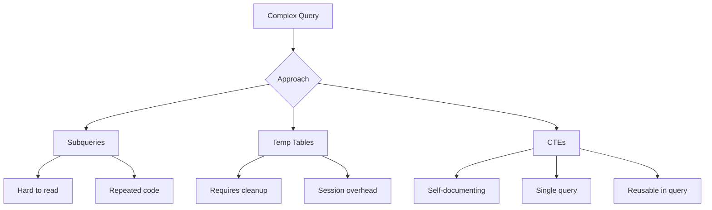

# How to Handle Common Table Expressions in MySQL 8

Author: [nawazdhandala](https://www.github.com/nawazdhandala)

Tags: MySQL, Database, SQL, CTE, Query Optimization, MySQL 8

Description: Learn how to use Common Table Expressions (CTEs) in MySQL 8 for cleaner queries, recursive data traversal, and improved readability.

---

Common Table Expressions (CTEs) arrived in MySQL 8.0, bringing powerful query organization capabilities that PostgreSQL and SQL Server users have enjoyed for years. CTEs let you define temporary named result sets that exist only for the duration of a query, making complex SQL more readable and maintainable. This guide covers practical CTE usage patterns for real-world applications.

## Basic CTE Syntax

A CTE starts with the WITH keyword, followed by a name, optional column list, and the query definition. You can then reference this name in the main query as if it were a table.

```sql
-- Basic CTE structure
WITH cte_name AS (
    SELECT column1, column2
    FROM some_table
    WHERE condition
)
SELECT * FROM cte_name;

-- CTE with explicit column names
WITH monthly_sales (month, total_amount, order_count) AS (
    SELECT
        DATE_FORMAT(order_date, '%Y-%m'),
        SUM(amount),
        COUNT(*)
    FROM orders
    WHERE order_date >= '2024-01-01'
    GROUP BY DATE_FORMAT(order_date, '%Y-%m')
)
SELECT * FROM monthly_sales
WHERE total_amount > 10000;
```

## Why Use CTEs?

CTEs provide several advantages over subqueries and temporary tables.



### Readability Comparison

```sql
-- Complex query without CTE (hard to read)
SELECT
    c.customer_name,
    recent.recent_total,
    lifetime.lifetime_total
FROM customers c
JOIN (
    SELECT customer_id, SUM(amount) as recent_total
    FROM orders
    WHERE order_date >= DATE_SUB(CURDATE(), INTERVAL 30 DAY)
    GROUP BY customer_id
) recent ON c.id = recent.customer_id
JOIN (
    SELECT customer_id, SUM(amount) as lifetime_total
    FROM orders
    GROUP BY customer_id
) lifetime ON c.id = lifetime.customer_id
WHERE recent.recent_total > 1000;

-- Same query with CTEs (much clearer)
WITH recent_orders AS (
    SELECT
        customer_id,
        SUM(amount) as recent_total
    FROM orders
    WHERE order_date >= DATE_SUB(CURDATE(), INTERVAL 30 DAY)
    GROUP BY customer_id
),
lifetime_orders AS (
    SELECT
        customer_id,
        SUM(amount) as lifetime_total
    FROM orders
    GROUP BY customer_id
)
SELECT
    c.customer_name,
    r.recent_total,
    l.lifetime_total
FROM customers c
JOIN recent_orders r ON c.id = r.customer_id
JOIN lifetime_orders l ON c.id = l.customer_id
WHERE r.recent_total > 1000;
```

## Multiple CTEs

Chain multiple CTEs together for step-by-step data transformation.

```sql
-- Multi-step analysis with chained CTEs
WITH
-- Step 1: Get daily sales
daily_sales AS (
    SELECT
        DATE(order_date) as sale_date,
        SUM(amount) as daily_total
    FROM orders
    WHERE order_date >= DATE_SUB(CURDATE(), INTERVAL 90 DAY)
    GROUP BY DATE(order_date)
),
-- Step 2: Calculate 7-day moving average
moving_average AS (
    SELECT
        sale_date,
        daily_total,
        AVG(daily_total) OVER (
            ORDER BY sale_date
            ROWS BETWEEN 6 PRECEDING AND CURRENT ROW
        ) as avg_7day
    FROM daily_sales
),
-- Step 3: Identify anomalies
anomalies AS (
    SELECT
        sale_date,
        daily_total,
        avg_7day,
        CASE
            WHEN daily_total > avg_7day * 1.5 THEN 'spike'
            WHEN daily_total < avg_7day * 0.5 THEN 'drop'
            ELSE 'normal'
        END as status
    FROM moving_average
)
-- Final: Show only anomalies
SELECT * FROM anomalies
WHERE status != 'normal'
ORDER BY sale_date;
```

## Recursive CTEs

Recursive CTEs are powerful for traversing hierarchical data like org charts, category trees, or bill of materials.

```sql
-- Employee hierarchy traversal
WITH RECURSIVE org_chart AS (
    -- Base case: top-level managers (no manager_id)
    SELECT
        id,
        name,
        manager_id,
        1 as level,
        CAST(name AS CHAR(1000)) as path
    FROM employees
    WHERE manager_id IS NULL

    UNION ALL

    -- Recursive case: employees with managers
    SELECT
        e.id,
        e.name,
        e.manager_id,
        oc.level + 1,
        CONCAT(oc.path, ' > ', e.name)
    FROM employees e
    JOIN org_chart oc ON e.manager_id = oc.id
    WHERE oc.level < 10  -- Prevent infinite loops
)
SELECT
    id,
    CONCAT(REPEAT('  ', level - 1), name) as indented_name,
    level,
    path
FROM org_chart
ORDER BY path;
```

### Category Tree Example

```sql
-- Product category hierarchy
CREATE TABLE categories (
    id INT PRIMARY KEY,
    name VARCHAR(100),
    parent_id INT
);

-- Find all subcategories of "Electronics"
WITH RECURSIVE category_tree AS (
    -- Start with Electronics
    SELECT id, name, parent_id, 0 as depth
    FROM categories
    WHERE name = 'Electronics'

    UNION ALL

    -- Get all children recursively
    SELECT c.id, c.name, c.parent_id, ct.depth + 1
    FROM categories c
    JOIN category_tree ct ON c.parent_id = ct.id
    WHERE ct.depth < 5
)
SELECT * FROM category_tree;

-- Get full category path for a product
WITH RECURSIVE category_path AS (
    -- Start from the product's immediate category
    SELECT id, name, parent_id, name as path
    FROM categories
    WHERE id = 42  -- product's category_id

    UNION ALL

    -- Walk up the tree
    SELECT c.id, c.name, c.parent_id,
           CONCAT(c.name, ' > ', cp.path)
    FROM categories c
    JOIN category_path cp ON c.id = cp.parent_id
)
SELECT path
FROM category_path
WHERE parent_id IS NULL;
-- Result: "Electronics > Computers > Laptops > Gaming Laptops"
```

### Number and Date Series Generation

```sql
-- Generate a series of numbers
WITH RECURSIVE numbers AS (
    SELECT 1 as n
    UNION ALL
    SELECT n + 1 FROM numbers WHERE n < 100
)
SELECT n FROM numbers;

-- Generate date range for reporting
WITH RECURSIVE date_range AS (
    SELECT DATE('2024-01-01') as date
    UNION ALL
    SELECT DATE_ADD(date, INTERVAL 1 DAY)
    FROM date_range
    WHERE date < '2024-12-31'
)
SELECT
    dr.date,
    COALESCE(o.order_count, 0) as orders,
    COALESCE(o.total_amount, 0) as revenue
FROM date_range dr
LEFT JOIN (
    SELECT
        DATE(order_date) as order_date,
        COUNT(*) as order_count,
        SUM(amount) as total_amount
    FROM orders
    GROUP BY DATE(order_date)
) o ON dr.date = o.order_date
ORDER BY dr.date;
```

## CTEs with INSERT, UPDATE, DELETE

MySQL 8 allows CTEs in data modification statements.

```sql
-- Insert using CTE
WITH high_value_customers AS (
    SELECT customer_id
    FROM orders
    GROUP BY customer_id
    HAVING SUM(amount) > 10000
)
INSERT INTO vip_customers (customer_id, enrolled_at)
SELECT customer_id, NOW()
FROM high_value_customers
ON DUPLICATE KEY UPDATE enrolled_at = NOW();

-- Update using CTE
WITH inactive_accounts AS (
    SELECT id
    FROM users
    WHERE last_login < DATE_SUB(NOW(), INTERVAL 1 YEAR)
)
UPDATE users
SET status = 'inactive'
WHERE id IN (SELECT id FROM inactive_accounts);

-- Delete using CTE
WITH duplicate_emails AS (
    SELECT id FROM (
        SELECT id, ROW_NUMBER() OVER (
            PARTITION BY email
            ORDER BY created_at
        ) as rn
        FROM users
    ) ranked
    WHERE rn > 1
)
DELETE FROM users
WHERE id IN (SELECT id FROM duplicate_emails);
```

## Performance Considerations

CTEs in MySQL are "inlined" by default, meaning the optimizer may execute them multiple times if referenced multiple times. Understand when to use CTEs versus derived tables.

```sql
-- CTE referenced multiple times - may execute twice
WITH order_totals AS (
    SELECT customer_id, SUM(amount) as total
    FROM orders
    GROUP BY customer_id
)
SELECT
    (SELECT AVG(total) FROM order_totals) as avg_total,
    (SELECT MAX(total) FROM order_totals) as max_total;

-- Better for multiple references: use a derived table once
SELECT
    AVG(total) as avg_total,
    MAX(total) as max_total
FROM (
    SELECT customer_id, SUM(amount) as total
    FROM orders
    GROUP BY customer_id
) as order_totals;

-- Or use variables to materialize once
WITH order_totals AS (
    SELECT customer_id, SUM(amount) as total
    FROM orders
    GROUP BY customer_id
)
SELECT
    AVG(total) as avg_total,
    MAX(total) as max_total,
    COUNT(*) as customer_count
FROM order_totals;  -- Single reference is fine
```

### Indexing for CTE Performance

```sql
-- CTEs don't have indexes - the base tables do
-- Ensure proper indexes exist for CTE source queries

-- Bad: CTE scans entire table
WITH recent_orders AS (
    SELECT * FROM orders
    WHERE created_at > DATE_SUB(NOW(), INTERVAL 7 DAY)
)
SELECT * FROM recent_orders WHERE customer_id = 100;

-- Good: Index supports both filter conditions
CREATE INDEX idx_orders_created_customer
ON orders(created_at, customer_id);

-- Even better: Filter in CTE if possible
WITH recent_customer_orders AS (
    SELECT * FROM orders
    WHERE created_at > DATE_SUB(NOW(), INTERVAL 7 DAY)
    AND customer_id = 100  -- Pushed down to index
)
SELECT * FROM recent_customer_orders;
```

## Practical Examples

### Running Totals and Comparisons

```sql
-- Year over year comparison
WITH current_year AS (
    SELECT
        MONTH(order_date) as month,
        SUM(amount) as revenue
    FROM orders
    WHERE YEAR(order_date) = YEAR(CURDATE())
    GROUP BY MONTH(order_date)
),
previous_year AS (
    SELECT
        MONTH(order_date) as month,
        SUM(amount) as revenue
    FROM orders
    WHERE YEAR(order_date) = YEAR(CURDATE()) - 1
    GROUP BY MONTH(order_date)
)
SELECT
    cy.month,
    cy.revenue as current_revenue,
    py.revenue as previous_revenue,
    ROUND((cy.revenue - py.revenue) / py.revenue * 100, 1) as growth_pct
FROM current_year cy
LEFT JOIN previous_year py ON cy.month = py.month
ORDER BY cy.month;
```

### Cohort Analysis

```sql
-- Customer cohort retention analysis
WITH cohorts AS (
    SELECT
        customer_id,
        DATE_FORMAT(MIN(order_date), '%Y-%m') as cohort_month
    FROM orders
    GROUP BY customer_id
),
cohort_activity AS (
    SELECT
        c.cohort_month,
        DATE_FORMAT(o.order_date, '%Y-%m') as activity_month,
        COUNT(DISTINCT o.customer_id) as customers
    FROM cohorts c
    JOIN orders o ON c.customer_id = o.customer_id
    GROUP BY c.cohort_month, DATE_FORMAT(o.order_date, '%Y-%m')
),
cohort_size AS (
    SELECT cohort_month, COUNT(*) as size
    FROM cohorts
    GROUP BY cohort_month
)
SELECT
    ca.cohort_month,
    ca.activity_month,
    ca.customers,
    cs.size as cohort_size,
    ROUND(ca.customers / cs.size * 100, 1) as retention_pct
FROM cohort_activity ca
JOIN cohort_size cs ON ca.cohort_month = cs.cohort_month
ORDER BY ca.cohort_month, ca.activity_month;
```

## Summary

| Use Case | CTE Type | Benefit |
|----------|----------|---------|
| Complex joins | Non-recursive | Improved readability |
| Multi-step transformations | Chained CTEs | Step-by-step logic |
| Hierarchical data | Recursive | Tree traversal |
| Date/number series | Recursive | Gap filling |
| Data modification | With INSERT/UPDATE | Cleaner DML |

CTEs make SQL more maintainable by breaking complex queries into named, logical steps. Use them to replace deeply nested subqueries and to traverse hierarchical data with recursive CTEs. Watch performance with multiple references to the same CTE, and ensure underlying tables have proper indexes for the CTE's source queries.
