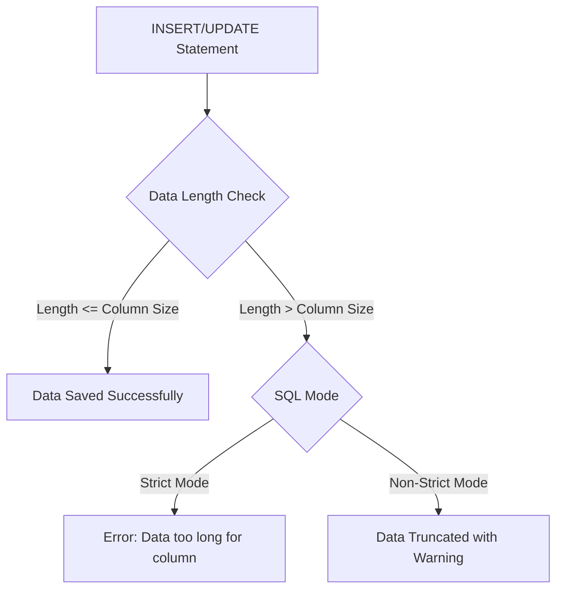

# How to Fix "Data Too Long for Column" Errors in MySQL

Author: [nawazdhandala](https://www.github.com/nawazdhandala)

Tags: MySQL, Database, Troubleshooting, Data Types, Schema, SQL

Description: Learn how to diagnose and fix MySQL "Data too long for column" errors by understanding column limits, SQL modes, and proper schema design.

---

The "Data too long for column" error occurs when you try to insert or update data that exceeds the maximum length defined for a column. This guide explains why this happens and how to fix it properly.

## Understanding the Error



When you see this error:

```
ERROR 1406 (22001): Data too long for column 'column_name' at row 1
```

It means the data you are trying to store exceeds the column's defined maximum length. In strict SQL mode (the default since MySQL 5.7), this causes an error rather than silently truncating your data.

## Quick Diagnosis

First, check the column definition and the data you are trying to insert:

```sql
-- Check table structure
DESCRIBE your_table;

-- Or get more detail
SHOW CREATE TABLE your_table;

-- Check the actual length of your data
SELECT LENGTH('your data here');

-- For multi-byte characters, check character length
SELECT CHAR_LENGTH('your data here');
```

## Common Causes and Solutions

### Cause 1: VARCHAR/CHAR Column Too Small

The most common cause is trying to store a string longer than the column allows.

```sql
-- Table with a small VARCHAR column
CREATE TABLE users (
    id INT PRIMARY KEY,
    username VARCHAR(20)
);

-- This fails if the name is longer than 20 characters
INSERT INTO users (id, username) VALUES (1, 'this_is_a_very_long_username_that_exceeds_limit');
-- Error: Data too long for column 'username' at row 1
```

**Solution: Increase the column size**

```sql
-- Check current max length in your data
SELECT MAX(LENGTH(username)) FROM users;

-- Alter the column to accommodate larger values
ALTER TABLE users MODIFY COLUMN username VARCHAR(100);

-- Now the insert works
INSERT INTO users (id, username) VALUES (1, 'this_is_a_very_long_username_that_exceeds_limit');
```

### Cause 2: TEXT Column Type Limits

Different TEXT types have different limits:

| Type       | Maximum Length      | Storage  |
|------------|---------------------|----------|
| TINYTEXT   | 255 bytes           | L + 1    |
| TEXT       | 65,535 bytes        | L + 2    |
| MEDIUMTEXT | 16,777,215 bytes    | L + 3    |
| LONGTEXT   | 4,294,967,295 bytes | L + 4    |

```sql
-- TINYTEXT is only 255 bytes
CREATE TABLE posts (
    id INT PRIMARY KEY,
    content TINYTEXT
);

-- This fails for content longer than 255 bytes
INSERT INTO posts (id, content) VALUES (1, 'Very long content...');
```

**Solution: Use a larger TEXT type**

```sql
-- Upgrade to TEXT or MEDIUMTEXT based on your needs
ALTER TABLE posts MODIFY COLUMN content TEXT;

-- Or for very large content
ALTER TABLE posts MODIFY COLUMN content MEDIUMTEXT;
```

### Cause 3: Character Set and Multi-byte Characters

UTF-8 characters can use up to 4 bytes per character. A VARCHAR(100) in utf8mb4 can store 100 characters, but those characters might require up to 400 bytes.

```sql
-- Check the character set
SHOW CREATE TABLE your_table;

-- Check actual byte length vs character length
SELECT
    LENGTH(column_name) as bytes,
    CHAR_LENGTH(column_name) as characters
FROM your_table;
```


**Solution: Account for character encoding**

```sql
-- If you need 100 emoji characters (4 bytes each)
-- Make sure your column can handle it
ALTER TABLE messages
MODIFY COLUMN content VARCHAR(100)
CHARACTER SET utf8mb4 COLLATE utf8mb4_unicode_ci;
```

### Cause 4: Binary Data in String Columns

Trying to store binary data in a VARCHAR or TEXT column can cause issues:

```sql
-- Wrong: Using VARCHAR for binary data
CREATE TABLE files (
    id INT PRIMARY KEY,
    data VARCHAR(10000)
);

-- Inserting binary data fails or corrupts
INSERT INTO files (id, data) VALUES (1, LOAD_FILE('/path/to/binary/file'));
```

**Solution: Use BLOB types for binary data**

```sql
-- Correct: Use BLOB for binary data
ALTER TABLE files MODIFY COLUMN data MEDIUMBLOB;

-- BLOB types:
-- TINYBLOB:   255 bytes
-- BLOB:       65,535 bytes
-- MEDIUMBLOB: 16,777,215 bytes
-- LONGBLOB:   4,294,967,295 bytes
```

### Cause 5: Numeric Overflow in String Representation

When converting numbers to strings, the result might exceed column size:

```sql
CREATE TABLE logs (
    id INT PRIMARY KEY,
    value VARCHAR(5)
);

-- This fails if the number has more than 5 digits
INSERT INTO logs (id, value) VALUES (1, CAST(123456789 AS CHAR));
```

**Solution: Size columns appropriately for numeric strings**

```sql
-- For integers up to BIGINT, you need up to 20 characters (including sign)
ALTER TABLE logs MODIFY COLUMN value VARCHAR(20);
```

## Handling the Error in Applications

### Application-Level Validation

Validate data before sending to the database:

**Python:**

```python
MAX_USERNAME_LENGTH = 100

def create_user(username, email):
    # Validate before database operation
    if len(username) > MAX_USERNAME_LENGTH:
        raise ValueError(f"Username must be {MAX_USERNAME_LENGTH} characters or less")

    # Proceed with database insert
    cursor.execute(
        "INSERT INTO users (username, email) VALUES (%s, %s)",
        (username, email)
    )
```

**Node.js:**

```javascript
const MAX_USERNAME_LENGTH = 100;

function createUser(username, email) {
    // Validate length
    if (username.length > MAX_USERNAME_LENGTH) {
        throw new Error(`Username must be ${MAX_USERNAME_LENGTH} characters or less`);
    }

    // Proceed with insert
    return db.query(
        'INSERT INTO users (username, email) VALUES (?, ?)',
        [username, email]
    );
}
```

### Graceful Truncation (When Appropriate)

Sometimes truncation is acceptable for non-critical fields:

```python
def safe_insert_log(message, max_length=1000):
    """Insert log message, truncating if necessary."""
    if len(message) > max_length:
        # Truncate and add indicator
        message = message[:max_length - 3] + '...'

    cursor.execute(
        "INSERT INTO logs (message) VALUES (%s)",
        (message,)
    )
```

### Handling Errors Gracefully

```python
import mysql.connector
from mysql.connector import errorcode

def insert_data(data):
    try:
        cursor.execute("INSERT INTO table_name (column) VALUES (%s)", (data,))
        connection.commit()
    except mysql.connector.Error as err:
        if err.errno == errorcode.ER_DATA_TOO_LONG:
            # Handle data too long error
            print(f"Data too long: {len(data)} characters")
            # Log, notify, or handle appropriately
        else:
            raise
```

## SQL Mode Configuration

MySQL's SQL mode affects how data truncation is handled:

```sql
-- Check current SQL mode
SELECT @@sql_mode;

-- Strict mode (default) - errors on data too long
-- STRICT_TRANS_TABLES or STRICT_ALL_TABLES

-- To allow truncation with warning (not recommended for production):
SET SESSION sql_mode = '';
-- Or remove only strict mode
SET SESSION sql_mode = REPLACE(@@sql_mode, 'STRICT_TRANS_TABLES', '');
```

**Warning**: Disabling strict mode can lead to silent data corruption. It is better to fix the schema or validate data properly.

## Schema Design Best Practices


### Choose the Right Data Type

```sql
-- Email addresses: RFC 5321 allows up to 254 characters
email VARCHAR(254)

-- URLs: Modern browsers support very long URLs
url VARCHAR(2048)

-- Phone numbers: International format with extensions
phone VARCHAR(20)

-- Names: Be generous but reasonable
first_name VARCHAR(100)
last_name VARCHAR(100)

-- Descriptions: Use TEXT for unlimited user input
description TEXT

-- JSON data: Use JSON type or LONGTEXT
metadata JSON
-- or
metadata LONGTEXT
```

### Add CHECK Constraints (MySQL 8.0+)

```sql
CREATE TABLE users (
    id INT PRIMARY KEY,
    username VARCHAR(50),
    email VARCHAR(254),
    CONSTRAINT chk_username_length CHECK (CHAR_LENGTH(username) >= 3),
    CONSTRAINT chk_email_format CHECK (email LIKE '%@%.%')
);
```

### Migration Strategy for Existing Tables

When you need to increase column sizes in production:

```sql
-- 1. Check current data sizes
SELECT
    MAX(LENGTH(column_name)) as max_bytes,
    MAX(CHAR_LENGTH(column_name)) as max_chars
FROM your_table;

-- 2. Plan the new size (current max + buffer for growth)
-- If max is 80, consider VARCHAR(150) or VARCHAR(255)

-- 3. Test the migration on a copy first
CREATE TABLE your_table_copy LIKE your_table;
ALTER TABLE your_table_copy MODIFY COLUMN column_name VARCHAR(255);

-- 4. Apply to production (this may lock the table briefly)
ALTER TABLE your_table MODIFY COLUMN column_name VARCHAR(255);

-- For large tables, use pt-online-schema-change to avoid locks
-- pt-online-schema-change --alter "MODIFY COLUMN column_name VARCHAR(255)" D=db,t=table
```

## Troubleshooting Checklist

When you encounter "Data too long for column":

- [ ] Identify the column causing the error
- [ ] Check the column's current definition with `DESCRIBE table`
- [ ] Measure the length of data you are trying to insert
- [ ] Consider character encoding (UTF-8 multi-byte characters)
- [ ] Decide: increase column size or validate/truncate data
- [ ] If increasing size, choose an appropriate new limit
- [ ] For TEXT types, verify you are using the right variant
- [ ] Test the fix with the problematic data

---

The "Data too long for column" error is MySQL protecting your data integrity. Rather than working around it by disabling strict mode, fix the root cause by either sizing your columns appropriately or validating data before insertion. Always consider character encoding when calculating column sizes for international applications.
