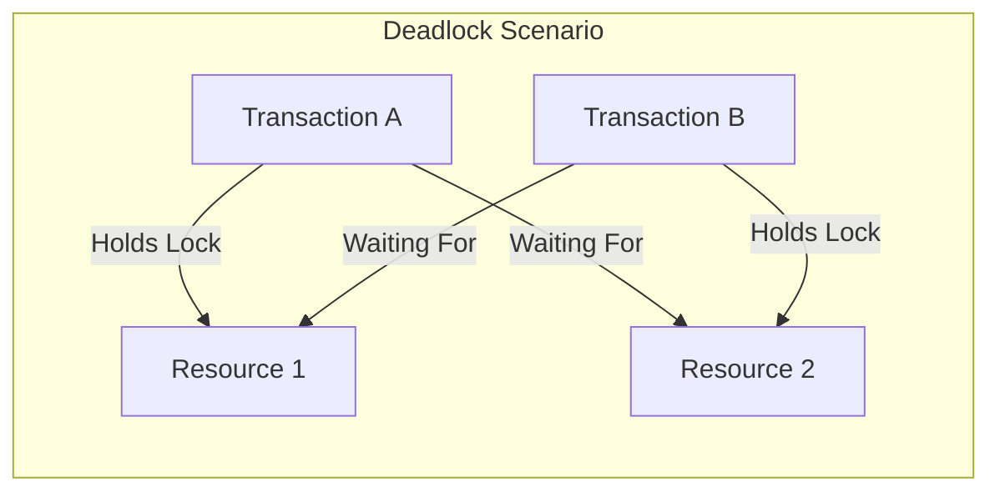
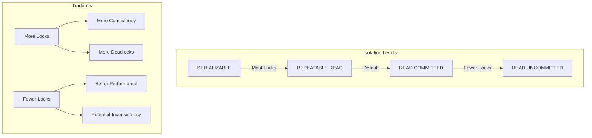

# How to Handle Deadlock Detection in MySQL

Author: [nawazdhandala](https://www.github.com/nawazdhandala)

Tags: MySQL, Database, Deadlock, InnoDB, Performance, Troubleshooting

Description: Learn how to detect, analyze, and resolve deadlocks in MySQL using InnoDB's built-in tools and best practices for prevention.

---

Deadlocks are one of the most frustrating issues you will encounter when working with MySQL databases. They occur when two or more transactions are waiting for each other to release locks, creating a circular dependency that cannot be resolved without intervention. In this guide, we will explore how MySQL handles deadlocks, how to detect them, and most importantly, how to prevent them.

## Understanding Deadlocks

A deadlock happens when Transaction A holds a lock on Resource 1 and wants Resource 2, while Transaction B holds a lock on Resource 2 and wants Resource 1. Neither can proceed because each is waiting for the other.



MySQL's InnoDB storage engine has automatic deadlock detection. When it detects a deadlock, it automatically rolls back one of the transactions (usually the one with fewer changes) and allows the other to proceed.

## Detecting Deadlocks

### Check the Latest Deadlock Information

The first step in handling deadlocks is knowing when they occur. Use the following command to see the most recent deadlock:

```sql
-- Show the latest deadlock information
SHOW ENGINE INNODB STATUS\G
```

Look for the section labeled `LATEST DETECTED DEADLOCK`. This provides detailed information about which transactions were involved and what locks they were holding.

### Enable Deadlock Logging

For production systems, you should enable persistent deadlock logging:

```sql
-- Enable logging of all deadlocks to the error log
SET GLOBAL innodb_print_all_deadlocks = ON;
```

Add this to your MySQL configuration file to make it permanent:

```ini
# my.cnf or my.ini
[mysqld]
innodb_print_all_deadlocks = 1
```

### Monitor Deadlock Frequency

Create a monitoring query to track deadlock patterns:

```sql
-- Check InnoDB metrics for deadlock count
SELECT
    NAME,
    COUNT
FROM information_schema.INNODB_METRICS
WHERE NAME = 'lock_deadlocks';
```

## Analyzing Deadlock Output

When you run `SHOW ENGINE INNODB STATUS`, the deadlock section looks something like this:

```
------------------------
LATEST DETECTED DEADLOCK
------------------------
2026-01-24 10:15:32 0x7f1234567890
*** (1) TRANSACTION:
TRANSACTION 12345, ACTIVE 5 sec starting index read
mysql tables in use 1, locked 1
LOCK WAIT 3 lock struct(s), heap size 1136, 2 row lock(s)
MySQL thread id 100, query id 5000 updating
UPDATE orders SET status = 'processing' WHERE id = 1

*** (2) TRANSACTION:
TRANSACTION 12346, ACTIVE 3 sec starting index read
mysql tables in use 1, locked 1
3 lock struct(s), heap size 1136, 2 row lock(s)
MySQL thread id 101, query id 5001 updating
UPDATE orders SET status = 'shipped' WHERE id = 2

*** WE ROLL BACK TRANSACTION (1)
```

Key information to extract:
- Which tables are involved
- What queries caused the deadlock
- Which transaction was rolled back
- The timing and duration of each transaction

## Common Causes and Solutions

### Cause 1: Inconsistent Lock Order

The most common cause of deadlocks is accessing resources in different orders.

```sql
-- Transaction 1 (Bad Practice)
BEGIN;
UPDATE accounts SET balance = balance - 100 WHERE id = 1;
UPDATE accounts SET balance = balance + 100 WHERE id = 2;
COMMIT;

-- Transaction 2 (Bad Practice)
BEGIN;
UPDATE accounts SET balance = balance - 50 WHERE id = 2;
UPDATE accounts SET balance = balance + 50 WHERE id = 1;
COMMIT;
```

The solution is to always access resources in a consistent order:

```sql
-- Transaction 1 (Good Practice - always update lower ID first)
BEGIN;
UPDATE accounts SET balance = balance - 100 WHERE id = 1;
UPDATE accounts SET balance = balance + 100 WHERE id = 2;
COMMIT;

-- Transaction 2 (Good Practice - same order)
BEGIN;
UPDATE accounts SET balance = balance - 50 WHERE id = 1;
UPDATE accounts SET balance = balance + 50 WHERE id = 2;
COMMIT;
```

### Cause 2: Long-Running Transactions

Long transactions hold locks for extended periods, increasing deadlock probability.

```sql
-- Bad: Single long transaction
BEGIN;
-- Process thousands of records one by one
UPDATE inventory SET quantity = quantity - 1 WHERE product_id = 1;
-- ... many more updates
COMMIT;

-- Good: Break into smaller batches
DELIMITER //
CREATE PROCEDURE process_inventory_batch(IN batch_size INT)
BEGIN
    DECLARE done INT DEFAULT 0;

    WHILE done = 0 DO
        START TRANSACTION;

        -- Process a small batch
        UPDATE inventory
        SET quantity = quantity - 1
        WHERE product_id IN (
            SELECT product_id FROM pending_orders LIMIT batch_size
        );

        -- Check if more work remains
        IF ROW_COUNT() = 0 THEN
            SET done = 1;
        END IF;

        COMMIT;
    END WHILE;
END //
DELIMITER ;
```

### Cause 3: Missing Indexes

Without proper indexes, MySQL performs full table scans and locks more rows than necessary.

```sql
-- Check which indexes exist on your table
SHOW INDEX FROM orders;

-- Add indexes to reduce lock scope
CREATE INDEX idx_orders_status ON orders(status);
CREATE INDEX idx_orders_customer_date ON orders(customer_id, created_at);
```

## Building Deadlock-Resistant Applications

### Implement Retry Logic

Since deadlocks can happen even with perfect code design, your application should handle them gracefully:

```python
import mysql.connector
from mysql.connector import Error
import time

def execute_with_retry(connection, query, params, max_retries=3):
    """
    Execute a query with automatic retry on deadlock.
    """
    retries = 0

    while retries < max_retries:
        try:
            cursor = connection.cursor()
            cursor.execute(query, params)
            connection.commit()
            return cursor

        except Error as e:
            # Error code 1213 is ER_LOCK_DEADLOCK
            if e.errno == 1213:
                retries += 1
                # Exponential backoff
                wait_time = (2 ** retries) * 0.1
                print(f"Deadlock detected, retry {retries}/{max_retries} after {wait_time}s")
                time.sleep(wait_time)
                connection.rollback()
            else:
                raise

    raise Exception("Max retries exceeded due to deadlocks")

# Usage example
connection = mysql.connector.connect(
    host='localhost',
    database='myapp',
    user='user',
    password='password'
)

execute_with_retry(
    connection,
    "UPDATE accounts SET balance = balance - %s WHERE id = %s",
    (100, 1)
)
```

### Use Appropriate Isolation Levels

Sometimes reducing the isolation level can help prevent deadlocks:

```sql
-- Check current isolation level
SELECT @@transaction_isolation;

-- For read-heavy workloads, consider READ COMMITTED
SET SESSION TRANSACTION ISOLATION LEVEL READ COMMITTED;

-- Or use it for specific transactions
SET TRANSACTION ISOLATION LEVEL READ COMMITTED;
BEGIN;
-- Your queries here
COMMIT;
```



### Use SELECT FOR UPDATE Wisely

When you need to lock rows before updating them, use `SELECT FOR UPDATE` but be mindful of the order:

```sql
-- Lock rows in a consistent order
BEGIN;

-- Select and lock in order by primary key
SELECT * FROM inventory
WHERE product_id IN (1, 5, 3)
ORDER BY product_id
FOR UPDATE;

-- Now perform your updates
UPDATE inventory SET quantity = quantity - 1 WHERE product_id = 1;
UPDATE inventory SET quantity = quantity - 2 WHERE product_id = 3;
UPDATE inventory SET quantity = quantity - 1 WHERE product_id = 5;

COMMIT;
```

## Monitoring and Alerting

Set up proactive monitoring to catch deadlock patterns before they become critical:

```sql
-- Create a deadlock monitoring table
CREATE TABLE deadlock_monitor (
    id INT AUTO_INCREMENT PRIMARY KEY,
    check_time TIMESTAMP DEFAULT CURRENT_TIMESTAMP,
    deadlock_count BIGINT
);

-- Scheduled job to track deadlock frequency
INSERT INTO deadlock_monitor (deadlock_count)
SELECT COUNT
FROM information_schema.INNODB_METRICS
WHERE NAME = 'lock_deadlocks';
```

You can integrate this with your monitoring system to alert when deadlock frequency exceeds a threshold.

## Best Practices Summary

1. **Access resources in consistent order** across all transactions
2. **Keep transactions short** by processing in batches
3. **Add proper indexes** to reduce lock scope
4. **Implement retry logic** in your application code
5. **Monitor deadlock frequency** and investigate spikes
6. **Use appropriate isolation levels** for your workload
7. **Review the InnoDB status** regularly to understand patterns

Deadlocks are not always avoidable, but with proper design and monitoring, you can minimize their impact on your application. The key is to make your application resilient by expecting deadlocks and handling them gracefully through retries and proper transaction design.
