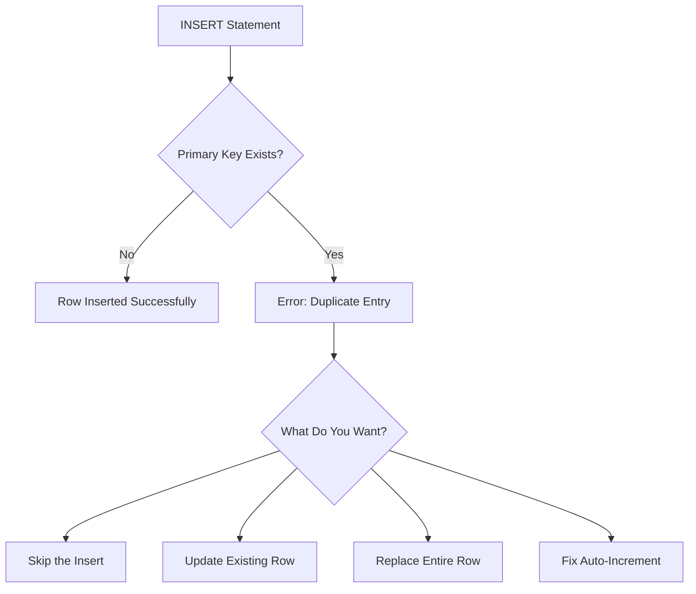

# How to Fix 'Duplicate Entry' Primary Key Errors

Author: [nawazdhandala](https://www.github.com/nawazdhandala)

Tags: MySQL, Database, Primary Key, Duplicate Entry, SQL, Troubleshooting

Description: Learn how to diagnose and fix MySQL duplicate entry errors for primary keys including auto-increment issues, upsert patterns, and data migration conflicts.

---

The "Duplicate entry for key 'PRIMARY'" error stops inserts cold. It means you are trying to insert a row with a primary key value that already exists. While the cause seems obvious, the fix depends on your specific situation. This guide covers all the common scenarios and their solutions.

## Understanding the Error



The error looks like this:

```
ERROR 1062 (23000): Duplicate entry '5' for key 'users.PRIMARY'
```

This tells you:
- Error code 1062 indicates a duplicate key violation
- The value '5' already exists
- It is the PRIMARY key constraint on the users table

## Problem 1: Auto-Increment Out of Sync

After importing data, restoring backups, or manual inserts, the auto-increment counter can fall behind the actual maximum ID.

**Diagnose the issue:**

```sql
-- Check current auto-increment value
SHOW TABLE STATUS WHERE Name = 'users'\G

-- Compare with actual max ID
SELECT MAX(id) FROM users;

-- If auto_increment <= MAX(id), you have a problem
```

**Fix: Reset the auto-increment counter:**

```sql
-- Set auto-increment to max + 1
ALTER TABLE users AUTO_INCREMENT = 1;
-- MySQL automatically adjusts to MAX(id) + 1

-- Or explicitly set it higher
SELECT MAX(id) + 1 INTO @next_id FROM users;
SET @sql = CONCAT('ALTER TABLE users AUTO_INCREMENT = ', @next_id);
PREPARE stmt FROM @sql;
EXECUTE stmt;
DEALLOCATE PREPARE stmt;
```

**After data import, always reset auto-increment:**

```sql
-- Script to fix all tables in a database
SELECT CONCAT(
    'ALTER TABLE `', TABLE_NAME, '` AUTO_INCREMENT = 1;'
) AS reset_statement
FROM INFORMATION_SCHEMA.TABLES
WHERE TABLE_SCHEMA = 'your_database'
  AND AUTO_INCREMENT IS NOT NULL;
```

## Problem 2: Intentional Duplicate Handling

Sometimes duplicates are expected and you need to handle them gracefully.

**Option 1: INSERT IGNORE - Skip duplicates silently:**

```sql
-- Insert only if not exists, no error on duplicate
INSERT IGNORE INTO users (id, email, name)
VALUES (1, 'john@example.com', 'John Doe');

-- Check affected rows
SELECT ROW_COUNT();  -- Returns 0 if skipped, 1 if inserted
```

**Option 2: ON DUPLICATE KEY UPDATE - Upsert pattern:**

```sql
-- Insert or update if exists
INSERT INTO users (id, email, name, updated_at)
VALUES (1, 'john@example.com', 'John Doe', NOW())
ON DUPLICATE KEY UPDATE
    name = VALUES(name),
    updated_at = NOW();

-- More explicit using the new MySQL 8 alias syntax
INSERT INTO users (id, email, name, updated_at)
VALUES (1, 'john@example.com', 'John Doe', NOW()) AS new_values
ON DUPLICATE KEY UPDATE
    name = new_values.name,
    updated_at = new_values.updated_at;
```

**Option 3: REPLACE INTO - Delete and re-insert:**

```sql
-- Warning: This deletes the existing row first
-- All columns not specified get default values
REPLACE INTO users (id, email, name)
VALUES (1, 'john@example.com', 'John Doe');

-- Difference from ON DUPLICATE KEY UPDATE:
-- REPLACE triggers DELETE + INSERT
-- ON DUPLICATE KEY UPDATE triggers UPDATE only
-- REPLACE resets auto-generated values and triggers
```

## Problem 3: Bulk Insert Conflicts

When inserting multiple rows, one duplicate fails the entire batch by default.

**Solution: Use INSERT IGNORE for bulk inserts:**

```sql
-- Insert multiple rows, skip any duplicates
INSERT IGNORE INTO products (sku, name, price)
VALUES
    ('SKU001', 'Widget A', 9.99),
    ('SKU002', 'Widget B', 14.99),
    ('SKU001', 'Widget A Updated', 10.99),  -- Duplicate, will be skipped
    ('SKU003', 'Widget C', 19.99);

-- Check how many were inserted
SELECT ROW_COUNT();
```

**Solution: Bulk upsert with ON DUPLICATE KEY UPDATE:**

```sql
-- Update price if product exists, insert if new
INSERT INTO products (sku, name, price, updated_at)
VALUES
    ('SKU001', 'Widget A', 9.99, NOW()),
    ('SKU002', 'Widget B', 14.99, NOW()),
    ('SKU003', 'Widget C', 19.99, NOW())
ON DUPLICATE KEY UPDATE
    price = VALUES(price),
    updated_at = VALUES(updated_at);
```

## Problem 4: Data Migration Duplicates

When migrating data between tables or databases, ID conflicts are common.

**Find duplicates before migration:**

```sql
-- Check which IDs would conflict
SELECT s.id, s.email
FROM source_table s
INNER JOIN target_table t ON s.id = t.id;
```

**Option 1: Skip existing IDs:**

```sql
-- Insert only non-existing records
INSERT INTO target_table (id, email, name)
SELECT s.id, s.email, s.name
FROM source_table s
LEFT JOIN target_table t ON s.id = t.id
WHERE t.id IS NULL;
```

**Option 2: Remap IDs during migration:**

```sql
-- Insert with new auto-generated IDs
INSERT INTO target_table (email, name, created_at, original_id)
SELECT email, name, created_at, id as original_id
FROM source_table;

-- Keep a mapping table for reference
CREATE TABLE id_mapping (
    original_id INT,
    new_id INT,
    PRIMARY KEY (original_id)
);

INSERT INTO id_mapping (original_id, new_id)
SELECT s.id, t.id
FROM source_table s
JOIN target_table t ON s.email = t.email;
```

## Problem 5: Composite Primary Key Duplicates

Tables with multi-column primary keys have more complex duplicate scenarios.

```sql
-- Table with composite primary key
CREATE TABLE order_items (
    order_id INT,
    product_id INT,
    quantity INT,
    PRIMARY KEY (order_id, product_id)
);

-- This fails if order 1 already has product 5
INSERT INTO order_items (order_id, product_id, quantity)
VALUES (1, 5, 2);
-- Error: Duplicate entry '1-5' for key 'order_items.PRIMARY'
```

**Fix: Use ON DUPLICATE KEY UPDATE to add quantities:**

```sql
-- Add to existing quantity or insert new row
INSERT INTO order_items (order_id, product_id, quantity)
VALUES (1, 5, 2)
ON DUPLICATE KEY UPDATE
    quantity = quantity + VALUES(quantity);
```

## Problem 6: Race Conditions in Concurrent Inserts

Multiple processes inserting the same key simultaneously can cause duplicates even with checks.

**Bad: Check-then-insert pattern (race condition):**

```sql
-- DON'T DO THIS - race condition exists between check and insert
IF NOT EXISTS (SELECT 1 FROM users WHERE email = 'john@example.com') THEN
    INSERT INTO users (email, name) VALUES ('john@example.com', 'John');
END IF;
```

**Good: Use INSERT with duplicate handling:**

```sql
-- Atomic operation, no race condition
INSERT INTO users (email, name)
VALUES ('john@example.com', 'John')
ON DUPLICATE KEY UPDATE
    id = id;  -- No-op update, just prevents error
```

**For unique constraints beyond primary key:**

```sql
-- Add unique index if not exists
ALTER TABLE users ADD UNIQUE INDEX idx_email (email);

-- Now duplicates on email also trigger ON DUPLICATE KEY UPDATE
INSERT INTO users (email, name)
VALUES ('john@example.com', 'John Doe')
ON DUPLICATE KEY UPDATE
    name = VALUES(name);
```

## Diagnostic Queries

**Find duplicate values that would cause conflicts:**

```sql
-- Find duplicates in source data before insert
SELECT email, COUNT(*) as cnt
FROM staging_users
GROUP BY email
HAVING COUNT(*) > 1;
```

**Identify which rows are causing issues:**

```sql
-- Compare source and target
SELECT
    s.id,
    s.email as source_email,
    t.email as target_email,
    CASE
        WHEN t.id IS NOT NULL THEN 'DUPLICATE'
        ELSE 'NEW'
    END as status
FROM staging_users s
LEFT JOIN users t ON s.id = t.id
ORDER BY status, s.id;
```

## Best Practices

1. **Use surrogate keys** - Let MySQL generate IDs with AUTO_INCREMENT
2. **Add unique constraints** - On natural keys like email, not just primary keys
3. **Use atomic operations** - ON DUPLICATE KEY UPDATE instead of check-then-insert
4. **Reset auto-increment after imports** - Prevents future conflicts
5. **Handle duplicates explicitly** - Choose between IGNORE, UPDATE, or REPLACE based on requirements

```sql
-- Standard upsert pattern for most cases
INSERT INTO users (email, name, updated_at)
VALUES (?, ?, NOW())
ON DUPLICATE KEY UPDATE
    name = VALUES(name),
    updated_at = NOW();
```

The duplicate entry error is MySQL protecting your data integrity. Rather than fighting it, use the built-in duplicate handling mechanisms to express your actual intent. INSERT IGNORE for "insert if not exists", ON DUPLICATE KEY UPDATE for upserts, and REPLACE for complete overwrites.
