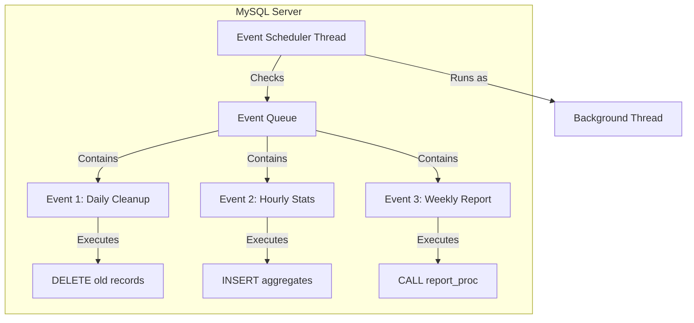
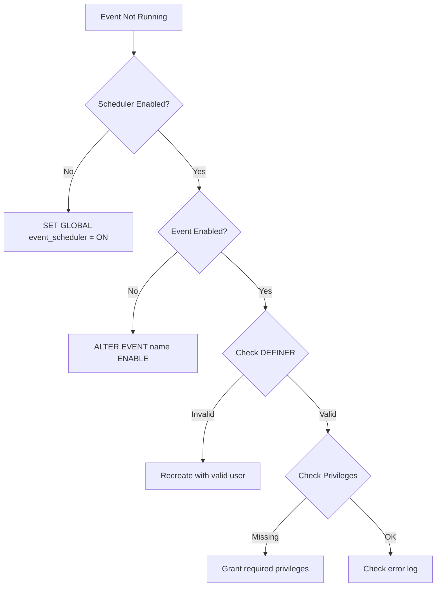

# How to Handle Events and Schedulers in MySQL

Author: [nawazdhandala](https://github.com/nawazdhandala)

Tags: MySQL, Database, Automation, Scheduling, Events

Description: Learn how to create, manage, and troubleshoot MySQL Event Scheduler for automated database tasks including cleanup jobs, data aggregation, and maintenance routines.

---

MySQL Event Scheduler is a built-in job scheduler that runs SQL statements at specified intervals. It is ideal for automated maintenance tasks, data cleanup, report generation, and periodic data processing. Unlike external cron jobs, events run inside MySQL with full access to database context and require no external dependencies.

## Event Scheduler Architecture



## Enabling the Event Scheduler

First, check if the Event Scheduler is running:

```sql
-- Check scheduler status
SHOW VARIABLES LIKE 'event_scheduler';

-- Check scheduler process
SHOW PROCESSLIST;
-- Look for "event_scheduler" in the User column
```

Enable the Event Scheduler:

```sql
-- Enable temporarily (until restart)
SET GLOBAL event_scheduler = ON;

-- Check it's running
SELECT @@event_scheduler;
```

For permanent configuration, add to `/etc/mysql/mysql.conf.d/mysqld.cnf`:

```ini
[mysqld]
event_scheduler = ON
```

## Creating Events

### One-Time Event

Execute once at a specific time:

```sql
-- Run once at a specific datetime
CREATE EVENT one_time_cleanup
ON SCHEDULE AT '2026-01-25 03:00:00'
DO
    DELETE FROM session_logs WHERE created_at < DATE_SUB(NOW(), INTERVAL 7 DAY);

-- Run once, 1 hour from now
CREATE EVENT delayed_task
ON SCHEDULE AT CURRENT_TIMESTAMP + INTERVAL 1 HOUR
DO
    CALL process_pending_orders();
```

### Recurring Events

Execute on a regular schedule:

```sql
-- Every hour
CREATE EVENT hourly_stats_update
ON SCHEDULE EVERY 1 HOUR
STARTS CURRENT_TIMESTAMP
DO
    INSERT INTO hourly_stats (hour, active_users, page_views)
    SELECT
        DATE_FORMAT(NOW(), '%Y-%m-%d %H:00:00'),
        COUNT(DISTINCT user_id),
        COUNT(*)
    FROM user_activity
    WHERE activity_time >= DATE_SUB(NOW(), INTERVAL 1 HOUR);

-- Every day at 2 AM
CREATE EVENT daily_cleanup
ON SCHEDULE EVERY 1 DAY
STARTS (TIMESTAMP(CURRENT_DATE) + INTERVAL 1 DAY + INTERVAL 2 HOUR)
DO
    DELETE FROM temp_data WHERE created_at < DATE_SUB(NOW(), INTERVAL 1 DAY);

-- Every week on Sunday at midnight
CREATE EVENT weekly_archive
ON SCHEDULE EVERY 1 WEEK
STARTS '2026-01-26 00:00:00'  -- First Sunday
DO
    CALL archive_old_orders();
```

### Events with End Time

```sql
-- Run every hour for the next 30 days
CREATE EVENT limited_monitoring
ON SCHEDULE EVERY 1 HOUR
STARTS CURRENT_TIMESTAMP
ENDS CURRENT_TIMESTAMP + INTERVAL 30 DAY
DO
    INSERT INTO system_metrics (recorded_at, cpu_queries)
    SELECT NOW(), COUNT(*) FROM INFORMATION_SCHEMA.PROCESSLIST;
```

## Complex Event Bodies

For events with multiple statements, use BEGIN...END:

```sql
DELIMITER //

CREATE EVENT comprehensive_daily_maintenance
ON SCHEDULE EVERY 1 DAY
STARTS (TIMESTAMP(CURRENT_DATE) + INTERVAL 1 DAY + INTERVAL 3 HOUR)
COMMENT 'Daily maintenance tasks at 3 AM'
DO
BEGIN
    DECLARE exit_handler BOOLEAN DEFAULT FALSE;

    -- Log start
    INSERT INTO maintenance_log (task, started_at, status)
    VALUES ('daily_maintenance', NOW(), 'started');

    -- Task 1: Clean old sessions
    DELETE FROM user_sessions
    WHERE last_activity < DATE_SUB(NOW(), INTERVAL 24 HOUR);

    -- Task 2: Archive completed orders older than 90 days
    INSERT INTO orders_archive
    SELECT * FROM orders
    WHERE status = 'completed'
      AND order_date < DATE_SUB(NOW(), INTERVAL 90 DAY);

    DELETE FROM orders
    WHERE status = 'completed'
      AND order_date < DATE_SUB(NOW(), INTERVAL 90 DAY);

    -- Task 3: Update statistics
    ANALYZE TABLE users, orders, products;

    -- Task 4: Rebuild fragmented indexes
    OPTIMIZE TABLE user_sessions;

    -- Log completion
    UPDATE maintenance_log
    SET completed_at = NOW(), status = 'completed'
    WHERE task = 'daily_maintenance'
      AND DATE(started_at) = CURRENT_DATE;
END //

DELIMITER ;
```

## Managing Events

### View All Events

```sql
-- List all events
SHOW EVENTS;

-- Detailed event information
SELECT
    EVENT_NAME,
    EVENT_SCHEMA,
    STATUS,
    EVENT_TYPE,
    INTERVAL_VALUE,
    INTERVAL_FIELD,
    LAST_EXECUTED,
    STARTS,
    ENDS
FROM INFORMATION_SCHEMA.EVENTS
WHERE EVENT_SCHEMA = 'your_database';

-- View event definition
SHOW CREATE EVENT event_name;
```

### Modify Events

```sql
-- Disable an event
ALTER EVENT daily_cleanup DISABLE;

-- Enable an event
ALTER EVENT daily_cleanup ENABLE;

-- Change schedule
ALTER EVENT hourly_stats_update
ON SCHEDULE EVERY 30 MINUTE;

-- Rename event
ALTER EVENT old_name RENAME TO new_name;

-- Update event body
ALTER EVENT daily_cleanup
DO
BEGIN
    DELETE FROM temp_data WHERE created_at < DATE_SUB(NOW(), INTERVAL 2 DAY);
    DELETE FROM audit_logs WHERE log_date < DATE_SUB(NOW(), INTERVAL 30 DAY);
END;
```

### Delete Events

```sql
-- Drop a single event
DROP EVENT IF EXISTS one_time_cleanup;

-- Drop all events in a database (be careful!)
-- Generate drop statements:
SELECT CONCAT('DROP EVENT IF EXISTS ', EVENT_NAME, ';')
FROM INFORMATION_SCHEMA.EVENTS
WHERE EVENT_SCHEMA = 'your_database';
```

## Event Preservation

By default, one-time events are dropped after execution. To keep them:

```sql
-- Keep event after execution (for debugging/history)
CREATE EVENT preserved_task
ON SCHEDULE AT CURRENT_TIMESTAMP + INTERVAL 1 HOUR
ON COMPLETION PRESERVE
DO
    CALL some_procedure();

-- Default behavior: drop after execution
CREATE EVENT auto_drop_task
ON SCHEDULE AT CURRENT_TIMESTAMP + INTERVAL 1 HOUR
ON COMPLETION NOT PRESERVE
DO
    CALL some_procedure();
```

## Error Handling in Events

```sql
DELIMITER //

CREATE EVENT safe_data_sync
ON SCHEDULE EVERY 1 HOUR
DO
BEGIN
    DECLARE CONTINUE HANDLER FOR SQLEXCEPTION
    BEGIN
        -- Log error and continue
        INSERT INTO event_errors (event_name, error_time, error_message)
        VALUES ('safe_data_sync', NOW(), 'Error during execution');
    END;

    -- Start transaction for atomicity
    START TRANSACTION;

    -- Perform sync operations
    INSERT INTO synced_data
    SELECT * FROM source_data WHERE NOT synced;

    UPDATE source_data SET synced = TRUE WHERE NOT synced;

    COMMIT;
END //

DELIMITER ;
```

## Monitoring Events

### Check Event Execution History

MySQL does not maintain event history by default. Create your own logging:

```sql
-- Create logging table
CREATE TABLE event_execution_log (
    id BIGINT AUTO_INCREMENT PRIMARY KEY,
    event_name VARCHAR(64),
    started_at DATETIME,
    completed_at DATETIME,
    rows_affected INT,
    status ENUM('started', 'completed', 'failed'),
    error_message TEXT,
    INDEX idx_event_name (event_name),
    INDEX idx_started_at (started_at)
);

-- Wrap events with logging
DELIMITER //

CREATE EVENT logged_cleanup
ON SCHEDULE EVERY 1 DAY
STARTS (TIMESTAMP(CURRENT_DATE) + INTERVAL 1 DAY + INTERVAL 4 HOUR)
DO
BEGIN
    DECLARE v_rows INT DEFAULT 0;
    DECLARE v_log_id BIGINT;

    -- Log start
    INSERT INTO event_execution_log (event_name, started_at, status)
    VALUES ('logged_cleanup', NOW(), 'started');
    SET v_log_id = LAST_INSERT_ID();

    -- Execute task
    DELETE FROM old_data WHERE created_at < DATE_SUB(NOW(), INTERVAL 30 DAY);
    SET v_rows = ROW_COUNT();

    -- Log completion
    UPDATE event_execution_log
    SET completed_at = NOW(),
        rows_affected = v_rows,
        status = 'completed'
    WHERE id = v_log_id;
END //

DELIMITER ;
```

### Monitor Event Scheduler Status

```sql
-- Check scheduler thread
SELECT * FROM INFORMATION_SCHEMA.PROCESSLIST
WHERE USER = 'event_scheduler';

-- Check for stuck events
SELECT
    EVENT_NAME,
    LAST_EXECUTED,
    TIMESTAMPDIFF(MINUTE, LAST_EXECUTED, NOW()) AS minutes_since_last_run,
    INTERVAL_VALUE,
    INTERVAL_FIELD
FROM INFORMATION_SCHEMA.EVENTS
WHERE STATUS = 'ENABLED'
  AND EVENT_TYPE = 'RECURRING'
  AND LAST_EXECUTED IS NOT NULL
  AND TIMESTAMPDIFF(MINUTE, LAST_EXECUTED, NOW()) >
      CASE INTERVAL_FIELD
          WHEN 'MINUTE' THEN INTERVAL_VALUE * 2
          WHEN 'HOUR' THEN INTERVAL_VALUE * 60 * 2
          WHEN 'DAY' THEN INTERVAL_VALUE * 1440 * 2
          ELSE 60
      END;
```

## Common Use Cases

### Data Retention Policy

```sql
DELIMITER //

CREATE EVENT enforce_data_retention
ON SCHEDULE EVERY 1 DAY
STARTS (TIMESTAMP(CURRENT_DATE) + INTERVAL 1 DAY + INTERVAL 1 HOUR)
COMMENT 'Enforce data retention policies'
DO
BEGIN
    -- Delete logs older than 90 days
    DELETE FROM application_logs
    WHERE log_date < DATE_SUB(NOW(), INTERVAL 90 DAY)
    LIMIT 100000;  -- Batch to avoid long locks

    -- Delete analytics older than 1 year
    DELETE FROM user_analytics
    WHERE recorded_at < DATE_SUB(NOW(), INTERVAL 1 YEAR)
    LIMIT 50000;

    -- Delete expired tokens
    DELETE FROM auth_tokens WHERE expires_at < NOW();

    -- Delete soft-deleted records older than 30 days
    DELETE FROM users WHERE deleted_at < DATE_SUB(NOW(), INTERVAL 30 DAY);
END //

DELIMITER ;
```

### Aggregation and Reporting

```sql
DELIMITER //

CREATE EVENT hourly_sales_aggregation
ON SCHEDULE EVERY 1 HOUR
STARTS (TIMESTAMP(CURRENT_DATE, '00:00:00') + INTERVAL 1 HOUR)
DO
BEGIN
    DECLARE v_hour DATETIME;
    SET v_hour = DATE_FORMAT(DATE_SUB(NOW(), INTERVAL 1 HOUR), '%Y-%m-%d %H:00:00');

    -- Aggregate hourly sales
    INSERT INTO hourly_sales_summary (
        hour,
        total_orders,
        total_revenue,
        unique_customers,
        avg_order_value
    )
    SELECT
        v_hour,
        COUNT(*),
        SUM(total_amount),
        COUNT(DISTINCT customer_id),
        AVG(total_amount)
    FROM orders
    WHERE order_date >= v_hour
      AND order_date < v_hour + INTERVAL 1 HOUR
    ON DUPLICATE KEY UPDATE
        total_orders = VALUES(total_orders),
        total_revenue = VALUES(total_revenue),
        unique_customers = VALUES(unique_customers),
        avg_order_value = VALUES(avg_order_value);
END //

DELIMITER ;
```

### Database Health Checks

```sql
DELIMITER //

CREATE EVENT database_health_check
ON SCHEDULE EVERY 5 MINUTE
DO
BEGIN
    -- Check connection count
    INSERT INTO health_metrics (metric_name, metric_value, recorded_at)
    SELECT 'active_connections', COUNT(*), NOW()
    FROM INFORMATION_SCHEMA.PROCESSLIST;

    -- Check slow query count
    INSERT INTO health_metrics (metric_name, metric_value, recorded_at)
    SELECT 'slow_queries', VARIABLE_VALUE, NOW()
    FROM performance_schema.global_status
    WHERE VARIABLE_NAME = 'Slow_queries';

    -- Check table sizes
    INSERT INTO table_size_history (table_name, data_size_mb, index_size_mb, recorded_at)
    SELECT
        TABLE_NAME,
        ROUND(DATA_LENGTH / 1024 / 1024, 2),
        ROUND(INDEX_LENGTH / 1024 / 1024, 2),
        NOW()
    FROM INFORMATION_SCHEMA.TABLES
    WHERE TABLE_SCHEMA = DATABASE()
      AND TABLE_TYPE = 'BASE TABLE';
END //

DELIMITER ;
```

## Troubleshooting

### Event Not Running



### Common Issues and Fixes

| Issue | Cause | Solution |
|-------|-------|----------|
| Event not executing | Scheduler disabled | Enable event_scheduler |
| Permission denied | DEFINER lacks privileges | Grant EVENT privilege or recreate |
| Event dropped after execution | ON COMPLETION NOT PRESERVE | Use ON COMPLETION PRESERVE |
| Long-running event blocks | No LIMIT on DELETE/UPDATE | Use batching with LIMIT |
| Event runs but no effect | Transaction not committed | Add explicit COMMIT |

### Debug Commands

```sql
-- Check MySQL error log
SHOW VARIABLES LIKE 'log_error';

-- Check event definer privileges
SELECT EVENT_NAME, DEFINER
FROM INFORMATION_SCHEMA.EVENTS
WHERE EVENT_SCHEMA = DATABASE();

-- Test event body manually
-- Copy the DO block and run it directly

-- Check if event is stuck
SHOW PROCESSLIST;
```

## Best Practices

1. **Always use logging** - MySQL does not track event history by default
2. **Use transactions** - Ensure atomicity for multi-statement events
3. **Batch large operations** - Use LIMIT to avoid long-running locks
4. **Handle errors** - Use DECLARE HANDLER to catch and log errors
5. **Test thoroughly** - Run event body manually before scheduling
6. **Monitor execution** - Check LAST_EXECUTED regularly
7. **Use meaningful names** - Prefix with frequency (daily_, hourly_)
8. **Document with COMMENT** - Add descriptions for future reference

## Summary

MySQL Event Scheduler provides a powerful way to automate database tasks without external dependencies. Key points for effective use:

- Enable the scheduler globally and verify it is running
- Use BEGIN...END blocks for multi-statement events
- Implement your own logging since MySQL does not track history
- Handle errors gracefully with DECLARE HANDLER
- Batch large operations to minimize lock contention
- Monitor LAST_EXECUTED to ensure events run as expected

With proper implementation, events can handle data retention, aggregation, health monitoring, and many other automated tasks reliably.
