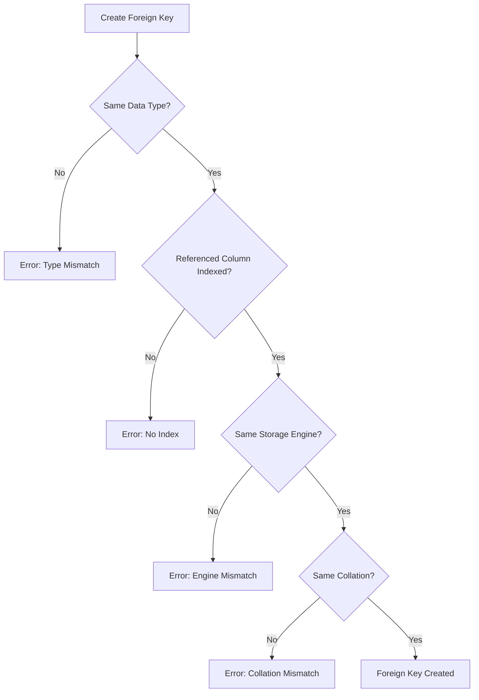

# How to Fix 'Cannot Add Foreign Key' Constraint Errors

Author: [nawazdhandala](https://www.github.com/nawazdhandala)

Tags: MySQL, Database, Foreign Key, Constraints, SQL, Troubleshooting

Description: Learn how to diagnose and fix MySQL foreign key constraint errors including data type mismatches, missing indexes, and engine incompatibilities.

---

Foreign key constraint errors in MySQL can stop migrations dead in their tracks. The error message "Cannot add foreign key constraint" is frustratingly vague, but the underlying causes follow predictable patterns. This guide walks through the most common causes and their solutions.

## Understanding Foreign Key Requirements

Before diving into fixes, it helps to understand what MySQL requires for foreign keys to work:



MySQL enforces strict requirements for foreign keys:

1. Both columns must have identical data types
2. The referenced column must be indexed (primary key or explicit index)
3. Both tables must use the InnoDB storage engine
4. String columns must have matching character sets and collations

## Problem 1: Data Type Mismatch

The most common cause. Even subtle differences like INT vs INT UNSIGNED will fail.

**Diagnose the issue:**

```sql
-- Check column types in both tables
DESCRIBE parent_table;
DESCRIBE child_table;

-- More detailed view
SELECT COLUMN_NAME, DATA_TYPE, COLUMN_TYPE, IS_NULLABLE
FROM INFORMATION_SCHEMA.COLUMNS
WHERE TABLE_SCHEMA = 'your_database'
  AND TABLE_NAME IN ('parent_table', 'child_table')
  AND COLUMN_NAME IN ('id', 'parent_id');
```

**Common mismatch examples:**

```sql
-- Parent table with UNSIGNED int
CREATE TABLE users (
    id INT UNSIGNED AUTO_INCREMENT PRIMARY KEY,
    name VARCHAR(100)
);

-- Child table with SIGNED int - THIS WILL FAIL
CREATE TABLE orders (
    id INT AUTO_INCREMENT PRIMARY KEY,
    user_id INT,  -- Missing UNSIGNED
    FOREIGN KEY (user_id) REFERENCES users(id)
);
-- Error: Cannot add foreign key constraint
```

**Fix: Match the data types exactly:**

```sql
-- Correct version with matching UNSIGNED
CREATE TABLE orders (
    id INT AUTO_INCREMENT PRIMARY KEY,
    user_id INT UNSIGNED,  -- Matches parent column
    FOREIGN KEY (user_id) REFERENCES users(id)
);
```

**Fix existing tables:**

```sql
-- Alter the column to match
ALTER TABLE orders
MODIFY COLUMN user_id INT UNSIGNED;

-- Now add the foreign key
ALTER TABLE orders
ADD CONSTRAINT fk_orders_user
FOREIGN KEY (user_id) REFERENCES users(id);
```

## Problem 2: Missing Index on Referenced Column

The referenced column must have an index. Primary keys automatically have one, but other columns may not.

**Diagnose:**

```sql
-- Check indexes on the parent table
SHOW INDEX FROM parent_table;

-- Look for the specific column
SELECT INDEX_NAME, COLUMN_NAME
FROM INFORMATION_SCHEMA.STATISTICS
WHERE TABLE_SCHEMA = 'your_database'
  AND TABLE_NAME = 'parent_table'
  AND COLUMN_NAME = 'referenced_column';
```

**Example problem:**

```sql
-- Parent table with a unique column but no index
CREATE TABLE products (
    id INT AUTO_INCREMENT PRIMARY KEY,
    sku VARCHAR(50),  -- No index on this column
    name VARCHAR(100)
);

-- This will fail
CREATE TABLE inventory (
    id INT AUTO_INCREMENT PRIMARY KEY,
    product_sku VARCHAR(50),
    quantity INT,
    FOREIGN KEY (product_sku) REFERENCES products(sku)
);
-- Error: Cannot add foreign key constraint
```

**Fix: Add an index to the referenced column:**

```sql
-- Add index to the parent table
ALTER TABLE products
ADD INDEX idx_sku (sku);

-- Now the foreign key will work
CREATE TABLE inventory (
    id INT AUTO_INCREMENT PRIMARY KEY,
    product_sku VARCHAR(50),
    quantity INT,
    FOREIGN KEY (product_sku) REFERENCES products(sku)
);
```

## Problem 3: Storage Engine Mismatch

Foreign keys only work with InnoDB. If either table uses MyISAM or another engine, the constraint fails silently or with an error.

**Diagnose:**

```sql
-- Check engine for both tables
SELECT TABLE_NAME, ENGINE
FROM INFORMATION_SCHEMA.TABLES
WHERE TABLE_SCHEMA = 'your_database'
  AND TABLE_NAME IN ('parent_table', 'child_table');
```

**Fix: Convert tables to InnoDB:**

```sql
-- Convert MyISAM table to InnoDB
ALTER TABLE parent_table ENGINE = InnoDB;
ALTER TABLE child_table ENGINE = InnoDB;

-- Now add the foreign key
ALTER TABLE child_table
ADD CONSTRAINT fk_child_parent
FOREIGN KEY (parent_id) REFERENCES parent_table(id);
```

## Problem 4: Character Set and Collation Mismatch

For string columns (VARCHAR, CHAR, TEXT), both the character set and collation must match.

**Diagnose:**

```sql
-- Check character set and collation
SELECT TABLE_NAME, COLUMN_NAME, CHARACTER_SET_NAME, COLLATION_NAME
FROM INFORMATION_SCHEMA.COLUMNS
WHERE TABLE_SCHEMA = 'your_database'
  AND COLUMN_NAME IN ('email', 'user_email')
  AND TABLE_NAME IN ('users', 'user_logs');
```

**Example problem:**

```sql
-- Parent with utf8mb4
CREATE TABLE users (
    id INT AUTO_INCREMENT PRIMARY KEY,
    email VARCHAR(255) CHARACTER SET utf8mb4 COLLATE utf8mb4_unicode_ci
);

-- Child with utf8 - WILL FAIL
CREATE TABLE user_logs (
    id INT AUTO_INCREMENT PRIMARY KEY,
    user_email VARCHAR(255) CHARACTER SET utf8 COLLATE utf8_general_ci,
    FOREIGN KEY (user_email) REFERENCES users(email)
);
```

**Fix: Align character sets and collations:**

```sql
-- Modify child column to match parent
ALTER TABLE user_logs
MODIFY COLUMN user_email VARCHAR(255)
CHARACTER SET utf8mb4 COLLATE utf8mb4_unicode_ci;

-- Now add foreign key
ALTER TABLE user_logs
ADD CONSTRAINT fk_logs_user
FOREIGN KEY (user_email) REFERENCES users(email);
```

## Problem 5: Data Integrity Violations

If existing data violates the constraint, MySQL refuses to add the foreign key.

**Diagnose:**

```sql
-- Find orphan records in child table
SELECT c.*
FROM child_table c
LEFT JOIN parent_table p ON c.parent_id = p.id
WHERE p.id IS NULL;
```

**Fix: Clean up orphan records:**

```sql
-- Option 1: Delete orphan records
DELETE c FROM child_table c
LEFT JOIN parent_table p ON c.parent_id = p.id
WHERE p.id IS NULL;

-- Option 2: Set orphan foreign keys to NULL (if column allows)
UPDATE child_table c
LEFT JOIN parent_table p ON c.parent_id = p.id
SET c.parent_id = NULL
WHERE p.id IS NULL;

-- Option 3: Add missing parent records
INSERT INTO parent_table (id, name)
SELECT DISTINCT c.parent_id, 'Unknown'
FROM child_table c
LEFT JOIN parent_table p ON c.parent_id = p.id
WHERE p.id IS NULL;
```

## Debugging with SHOW ENGINE INNODB STATUS

When the error message does not give enough detail, check the InnoDB status:

```sql
-- Get detailed error information
SHOW ENGINE INNODB STATUS\G
```

Look for the "LATEST FOREIGN KEY ERROR" section:

```
------------------------
LATEST FOREIGN KEY ERROR
------------------------
2026-01-24 10:15:32 Error in foreign key constraint of table mydb/orders:
foreign key (user_id) references users(id):
Cannot find an index in the referenced table where the
referenced columns appear as the first columns
```

## Complete Diagnostic Script

Use this script to diagnose foreign key issues:

```sql
-- diagnostic_fk.sql
-- Run this to check all requirements before adding a foreign key

SET @parent_table = 'users';
SET @parent_column = 'id';
SET @child_table = 'orders';
SET @child_column = 'user_id';
SET @db = DATABASE();

-- Check data types match
SELECT
    'DATA TYPE CHECK' as check_type,
    p.TABLE_NAME as parent_table,
    p.COLUMN_TYPE as parent_type,
    c.TABLE_NAME as child_table,
    c.COLUMN_TYPE as child_type,
    CASE WHEN p.COLUMN_TYPE = c.COLUMN_TYPE THEN 'OK' ELSE 'MISMATCH' END as status
FROM INFORMATION_SCHEMA.COLUMNS p
JOIN INFORMATION_SCHEMA.COLUMNS c ON 1=1
WHERE p.TABLE_SCHEMA = @db AND p.TABLE_NAME = @parent_table AND p.COLUMN_NAME = @parent_column
  AND c.TABLE_SCHEMA = @db AND c.TABLE_NAME = @child_table AND c.COLUMN_NAME = @child_column;

-- Check storage engines match
SELECT
    'ENGINE CHECK' as check_type,
    p.TABLE_NAME as parent_table,
    p.ENGINE as parent_engine,
    c.TABLE_NAME as child_table,
    c.ENGINE as child_engine,
    CASE WHEN p.ENGINE = 'InnoDB' AND c.ENGINE = 'InnoDB' THEN 'OK' ELSE 'MISMATCH' END as status
FROM INFORMATION_SCHEMA.TABLES p
JOIN INFORMATION_SCHEMA.TABLES c ON 1=1
WHERE p.TABLE_SCHEMA = @db AND p.TABLE_NAME = @parent_table
  AND c.TABLE_SCHEMA = @db AND c.TABLE_NAME = @child_table;

-- Check parent column is indexed
SELECT
    'INDEX CHECK' as check_type,
    @parent_table as parent_table,
    @parent_column as parent_column,
    CASE WHEN COUNT(*) > 0 THEN 'OK' ELSE 'NO INDEX' END as status
FROM INFORMATION_SCHEMA.STATISTICS
WHERE TABLE_SCHEMA = @db
  AND TABLE_NAME = @parent_table
  AND COLUMN_NAME = @parent_column;
```

## Best Practices

Follow these guidelines to avoid foreign key issues:

1. **Always use INT UNSIGNED for auto-increment primary keys** - Consistency prevents mismatches
2. **Create parent tables before child tables** - Foreign keys need the referenced table to exist
3. **Use consistent character sets** - Set database defaults with `utf8mb4`
4. **Check data before adding constraints** - Run orphan queries first
5. **Name your constraints** - Makes debugging and dropping easier

```sql
-- Good practice: Named constraint with consistent types
ALTER TABLE orders
ADD CONSTRAINT fk_orders_user_id
FOREIGN KEY (user_id) REFERENCES users(id)
ON DELETE CASCADE
ON UPDATE CASCADE;
```

Foreign key errors are almost always caused by one of the five issues covered here. Check data types first, then indexes, then engines, then character sets, and finally data integrity. The diagnostic script will catch most problems before you waste time on trial and error.
