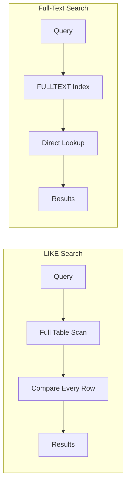
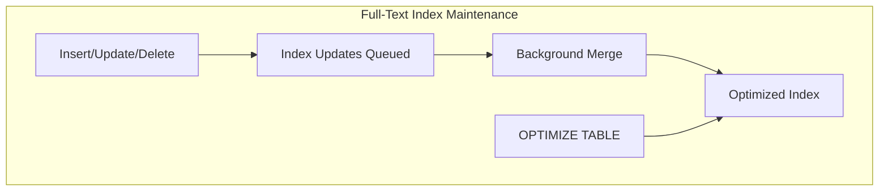

# How to Handle Full-Text Search in MySQL

Author: [nawazdhandala](https://www.github.com/nawazdhandala)

Tags: MySQL, Full-Text Search, Database, Performance, InnoDB

Description: Learn how to implement and optimize full-text search in MySQL using FULLTEXT indexes, natural language mode, and boolean search operators.

---

Full-text search allows you to search for words and phrases within text columns efficiently. While MySQL is not a dedicated search engine like Elasticsearch or Solr, its built-in full-text search capabilities are powerful enough for many use cases. In this guide, we will cover how to set up, use, and optimize full-text search in MySQL.

## Understanding Full-Text Search

Traditional LIKE queries with wildcards are slow because they cannot use indexes effectively:

```sql
-- Slow: Full table scan required
SELECT * FROM articles WHERE content LIKE '%database optimization%';
```

Full-text search uses special FULLTEXT indexes to find matching documents quickly:

```sql
-- Fast: Uses FULLTEXT index
SELECT * FROM articles
WHERE MATCH(content) AGAINST('database optimization');
```



## Setting Up Full-Text Search

### Creating FULLTEXT Indexes

You can create FULLTEXT indexes on CHAR, VARCHAR, and TEXT columns:

```sql
-- Create table with FULLTEXT index
CREATE TABLE articles (
    id INT AUTO_INCREMENT PRIMARY KEY,
    title VARCHAR(255),
    content TEXT,
    author VARCHAR(100),
    created_at DATETIME DEFAULT CURRENT_TIMESTAMP,

    -- Single column index
    FULLTEXT INDEX ft_content (content),

    -- Multi-column index for searching title and content together
    FULLTEXT INDEX ft_title_content (title, content)
) ENGINE=InnoDB;

-- Add FULLTEXT index to existing table
ALTER TABLE articles ADD FULLTEXT INDEX ft_title (title);

-- Or using CREATE INDEX
CREATE FULLTEXT INDEX ft_author ON articles(author);
```

### Insert Sample Data

```sql
INSERT INTO articles (title, content, author) VALUES
('Introduction to MySQL', 'MySQL is a popular open-source relational database management system. It uses SQL for querying data.', 'John Smith'),
('Database Performance Tuning', 'Optimizing database performance requires understanding indexes, query plans, and server configuration.', 'Jane Doe'),
('Full-Text Search Guide', 'Full-text search allows efficient searching of text content using specialized indexes and algorithms.', 'John Smith'),
('MySQL vs PostgreSQL', 'Both MySQL and PostgreSQL are excellent database choices. Each has strengths in different areas.', 'Bob Wilson'),
('Query Optimization Tips', 'Writing efficient SQL queries is essential for application performance. Use indexes wisely.', 'Jane Doe');
```

## Search Modes

### Natural Language Mode (Default)

Natural language mode interprets the search string as a phrase in natural human language:

```sql
-- Basic natural language search
SELECT
    id,
    title,
    MATCH(content) AGAINST('database optimization') as relevance
FROM articles
WHERE MATCH(content) AGAINST('database optimization')
ORDER BY relevance DESC;

-- Search across multiple columns
SELECT *
FROM articles
WHERE MATCH(title, content) AGAINST('MySQL performance');
```

The relevance score indicates how well the document matches the search terms. Higher scores mean better matches.

### Boolean Mode

Boolean mode allows precise control with operators:

```sql
-- Must contain 'database', optionally 'performance'
SELECT * FROM articles
WHERE MATCH(content) AGAINST('+database performance' IN BOOLEAN MODE);

-- Must contain 'MySQL', must NOT contain 'PostgreSQL'
SELECT * FROM articles
WHERE MATCH(content) AGAINST('+MySQL -PostgreSQL' IN BOOLEAN MODE);

-- Phrase search (exact phrase)
SELECT * FROM articles
WHERE MATCH(content) AGAINST('"open-source relational"' IN BOOLEAN MODE);

-- Wildcard search
SELECT * FROM articles
WHERE MATCH(content) AGAINST('optim*' IN BOOLEAN MODE);
```

Boolean operators reference:

| Operator | Description | Example |
|----------|-------------|---------|
| + | Word must be present | +MySQL +database |
| - | Word must not be present | MySQL -PostgreSQL |
| > | Increase relevance | >important feature |
| < | Decrease relevance | <minor feature |
| () | Group words | +(MySQL PostgreSQL) +database |
| ~ | Negate word relevance | MySQL ~slow |
| * | Wildcard | optim* |
| "" | Exact phrase | "database management" |

### Query Expansion Mode

Query expansion performs the search twice - first to find relevant documents, then to find additional matching terms:

```sql
-- Query expansion finds related content
SELECT * FROM articles
WHERE MATCH(content) AGAINST('database' WITH QUERY EXPANSION);
```

Use this when you want to find documents that might not contain the exact search terms but are conceptually related.

## Building a Search Feature

Here is a complete example of implementing search in an application:

```python
import mysql.connector
from mysql.connector import Error

class ArticleSearch:
    def __init__(self, connection):
        self.connection = connection

    def search(self, query, mode='natural', limit=20):
        """
        Search articles using full-text search.

        Args:
            query: Search terms
            mode: 'natural', 'boolean', or 'expansion'
            limit: Maximum results to return
        """
        cursor = self.connection.cursor(dictionary=True)

        # Build the AGAINST clause based on mode
        if mode == 'boolean':
            against = f"AGAINST(%s IN BOOLEAN MODE)"
        elif mode == 'expansion':
            against = f"AGAINST(%s WITH QUERY EXPANSION)"
        else:
            against = f"AGAINST(%s IN NATURAL LANGUAGE MODE)"

        sql = f"""
            SELECT
                id,
                title,
                LEFT(content, 200) as snippet,
                author,
                created_at,
                MATCH(title, content) {against} as relevance
            FROM articles
            WHERE MATCH(title, content) {against.replace('%s', '%s')}
            ORDER BY relevance DESC
            LIMIT %s
        """

        cursor.execute(sql, (query, query, limit))
        return cursor.fetchall()

    def search_with_filters(self, query, author=None, date_from=None):
        """
        Search with additional filters.
        """
        cursor = self.connection.cursor(dictionary=True)

        sql = """
            SELECT
                id,
                title,
                LEFT(content, 200) as snippet,
                author,
                created_at,
                MATCH(title, content) AGAINST(%s) as relevance
            FROM articles
            WHERE MATCH(title, content) AGAINST(%s)
        """
        params = [query, query]

        if author:
            sql += " AND author = %s"
            params.append(author)

        if date_from:
            sql += " AND created_at >= %s"
            params.append(date_from)

        sql += " ORDER BY relevance DESC LIMIT 20"

        cursor.execute(sql, params)
        return cursor.fetchall()

    def highlight_matches(self, text, query, tag='<mark>'):
        """
        Highlight matching terms in text.
        """
        import re
        words = query.split()
        for word in words:
            # Case-insensitive replacement
            pattern = re.compile(re.escape(word), re.IGNORECASE)
            text = pattern.sub(f'{tag}{word}</mark>', text)
        return text

# Usage
connection = mysql.connector.connect(
    host='localhost',
    database='myapp',
    user='user',
    password='password'
)

search = ArticleSearch(connection)

# Natural language search
results = search.search('MySQL performance optimization')
for article in results:
    print(f"{article['title']} (relevance: {article['relevance']:.2f})")

# Boolean search
results = search.search('+MySQL +performance -PostgreSQL', mode='boolean')
```

## Performance Optimization

### Index Configuration

Tune full-text search parameters for your use case:

```sql
-- Check current settings
SHOW VARIABLES LIKE 'ft_%';
SHOW VARIABLES LIKE 'innodb_ft_%';

-- Key settings for InnoDB
-- Minimum word length (default is 3)
SET GLOBAL innodb_ft_min_token_size = 2;

-- Maximum word length (default is 84)
SET GLOBAL innodb_ft_max_token_size = 84;
```

Update my.cnf for persistent configuration:

```ini
[mysqld]
# Minimum word length to index
innodb_ft_min_token_size = 2

# Enable stopword customization
innodb_ft_enable_stopword = ON
innodb_ft_server_stopword_table = 'mydb/custom_stopwords'
```

### Custom Stopwords

Stopwords are common words that are ignored during indexing:

```sql
-- Create custom stopword table
CREATE TABLE custom_stopwords (
    value VARCHAR(30)
) ENGINE=InnoDB;

-- Add your stopwords
INSERT INTO custom_stopwords VALUES
('the'), ('and'), ('for'), ('that'), ('this');

-- Configure MySQL to use your stopword table
SET GLOBAL innodb_ft_server_stopword_table = 'mydb/custom_stopwords';

-- Rebuild the index to apply changes
ALTER TABLE articles DROP INDEX ft_content;
ALTER TABLE articles ADD FULLTEXT INDEX ft_content (content);
```

### Optimize Index for Large Tables

```sql
-- Optimize the full-text index
OPTIMIZE TABLE articles;

-- For InnoDB, run optimize periodically
SET GLOBAL innodb_optimize_fulltext_only = ON;
OPTIMIZE TABLE articles;
SET GLOBAL innodb_optimize_fulltext_only = OFF;
```



## Advanced Patterns

### Searching with Relevance Threshold

```sql
-- Only return results above a relevance threshold
SELECT
    id,
    title,
    MATCH(title, content) AGAINST('database') as score
FROM articles
WHERE MATCH(title, content) AGAINST('database')
HAVING score > 0.5
ORDER BY score DESC;
```

### Combining Full-Text with Other Conditions

```sql
-- Full-text search with date range and category
SELECT
    a.id,
    a.title,
    c.name as category,
    MATCH(a.title, a.content) AGAINST('MySQL') as relevance
FROM articles a
JOIN categories c ON a.category_id = c.id
WHERE MATCH(a.title, a.content) AGAINST('MySQL')
AND a.created_at >= '2026-01-01'
AND c.name IN ('Technology', 'Databases')
ORDER BY relevance DESC;
```

### Faceted Search

```sql
-- Get search results with category counts
SELECT
    c.name as category,
    COUNT(*) as article_count
FROM articles a
JOIN categories c ON a.category_id = c.id
WHERE MATCH(a.title, a.content) AGAINST('database')
GROUP BY c.name
ORDER BY article_count DESC;
```

## Limitations and Alternatives

MySQL full-text search works well for many applications but has limitations:

- No built-in fuzzy matching or typo tolerance
- Limited language analysis (no stemming for all languages)
- No relevance tuning beyond basic modes
- Performance degrades with very large datasets

For more advanced needs, consider:

| Solution | Use Case |
|----------|----------|
| MySQL Full-Text | Simple search, moderate data size |
| Elasticsearch | Large scale, complex queries, analytics |
| Apache Solr | Enterprise search, rich document processing |
| Meilisearch | Typo tolerance, instant search |

## Quick Reference

```sql
-- Create FULLTEXT index
ALTER TABLE articles ADD FULLTEXT INDEX ft_idx (title, content);

-- Natural language search
SELECT * FROM articles
WHERE MATCH(title, content) AGAINST('search terms');

-- Boolean search
SELECT * FROM articles
WHERE MATCH(title, content) AGAINST('+required -excluded' IN BOOLEAN MODE);

-- Get relevance score
SELECT *, MATCH(content) AGAINST('term') as score
FROM articles
WHERE MATCH(content) AGAINST('term');

-- Rebuild index after config change
OPTIMIZE TABLE articles;
```

Full-text search in MySQL is a powerful feature that is often overlooked. For many applications, it provides sufficient search functionality without the complexity of managing a separate search infrastructure. Start simple with natural language mode, and explore boolean mode when you need more control over search behavior.
