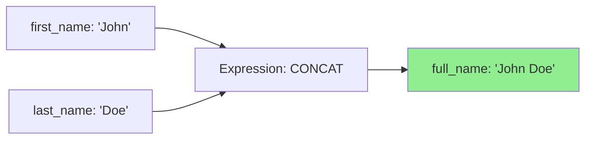
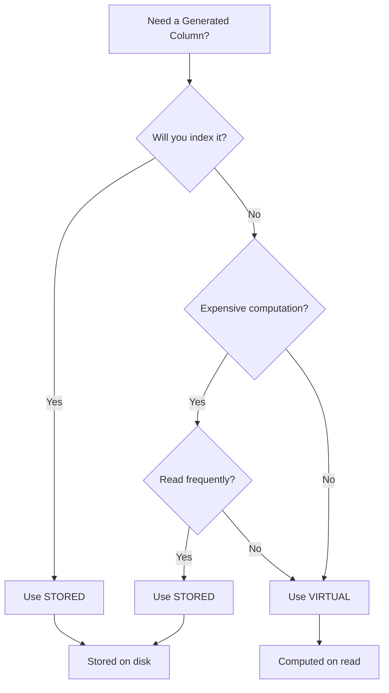

# How to Handle Generated Columns in MySQL

Author: [nawazdhandala](https://www.github.com/nawazdhandala)

Tags: MySQL, Database, Generated Columns, Virtual Columns, Stored Columns, Schema Design

Description: Learn how to create and use generated columns in MySQL for computed values, with examples of virtual and stored columns.

---

Generated columns let you define columns whose values are computed from expressions rather than inserted directly. MySQL calculates these values automatically, which simplifies application code and ensures consistency. You can index them, use them in queries, and choose whether to store them on disk or compute them on the fly.

This guide covers creating generated columns, choosing between virtual and stored types, and avoiding common mistakes.

## What Are Generated Columns?

A generated column is a column whose value comes from an expression involving other columns in the same row. MySQL maintains this value automatically when the source columns change.



There are two types of generated columns:

- **Virtual**: Computed when read, not stored on disk. Uses no storage but requires CPU on every access.
- **Stored**: Computed when data is written, saved on disk. Uses storage but reads are instant.

## Creating Virtual Generated Columns

Virtual columns are computed every time you query them:

```sql
-- Create a table with a virtual generated column
CREATE TABLE users (
    id INT PRIMARY KEY AUTO_INCREMENT,
    first_name VARCHAR(50) NOT NULL,
    last_name VARCHAR(50) NOT NULL,
    -- Virtual column: computed on every read
    full_name VARCHAR(101) GENERATED ALWAYS AS (CONCAT(first_name, ' ', last_name)) VIRTUAL
);

-- Insert data (do not include the generated column)
INSERT INTO users (first_name, last_name) VALUES ('John', 'Doe');

-- Query includes the computed value
SELECT * FROM users;
-- Output: id=1, first_name='John', last_name='Doe', full_name='John Doe'
```

The column updates automatically when source columns change:

```sql
UPDATE users SET first_name = 'Jane' WHERE id = 1;

SELECT full_name FROM users WHERE id = 1;
-- Output: 'Jane Doe'
```

## Creating Stored Generated Columns

Stored columns are computed once and saved to disk:

```sql
CREATE TABLE products (
    id INT PRIMARY KEY AUTO_INCREMENT,
    price DECIMAL(10,2) NOT NULL,
    tax_rate DECIMAL(4,2) NOT NULL DEFAULT 0.08,
    -- Stored column: computed on insert/update, saved to disk
    price_with_tax DECIMAL(10,2) GENERATED ALWAYS AS (price * (1 + tax_rate)) STORED
);

INSERT INTO products (price, tax_rate) VALUES (100.00, 0.10);

SELECT price, tax_rate, price_with_tax FROM products;
-- Output: price=100.00, tax_rate=0.10, price_with_tax=110.00
```

## Choosing Between Virtual and Stored

Use this decision tree to pick the right type:



| Consideration | Virtual | Stored |
|---------------|---------|--------|
| Storage space | None | Same as column type |
| Read performance | Slower (computed each time) | Faster (already calculated) |
| Write performance | Faster (no computation) | Slower (must compute and store) |
| Can be indexed | Yes (with limitations) | Yes |
| Can have foreign key | No | Yes |

## Practical Examples

### JSON Data Extraction

Extract values from JSON for indexing and queries:

```sql
CREATE TABLE events (
    id INT PRIMARY KEY AUTO_INCREMENT,
    payload JSON NOT NULL,
    -- Extract user_id from JSON for efficient querying
    user_id INT GENERATED ALWAYS AS (JSON_EXTRACT(payload, '$.user_id')) STORED,
    -- Extract event type
    event_type VARCHAR(50) GENERATED ALWAYS AS (
        JSON_UNQUOTE(JSON_EXTRACT(payload, '$.type'))
    ) STORED,
    created_at TIMESTAMP DEFAULT CURRENT_TIMESTAMP
);

-- Index the generated columns for fast lookups
CREATE INDEX idx_events_user_id ON events(user_id);
CREATE INDEX idx_events_type ON events(event_type);

-- Insert JSON data
INSERT INTO events (payload) VALUES
    ('{"user_id": 123, "type": "login", "ip": "192.168.1.1"}'),
    ('{"user_id": 456, "type": "purchase", "amount": 99.99}');

-- Query using the generated column (uses index)
SELECT * FROM events WHERE user_id = 123;
SELECT * FROM events WHERE event_type = 'purchase';
```

### Computed Age from Birth Date

```sql
CREATE TABLE members (
    id INT PRIMARY KEY AUTO_INCREMENT,
    name VARCHAR(100) NOT NULL,
    birth_date DATE NOT NULL,
    -- Calculate age (use VIRTUAL since it changes over time)
    age INT GENERATED ALWAYS AS (
        TIMESTAMPDIFF(YEAR, birth_date, CURDATE())
    ) VIRTUAL
);

INSERT INTO members (name, birth_date) VALUES ('Alice', '1990-05-15');

SELECT name, birth_date, age FROM members;
-- age updates automatically as time passes
```

### Normalized Search Column

Create a searchable, normalized version of text:

```sql
CREATE TABLE articles (
    id INT PRIMARY KEY AUTO_INCREMENT,
    title VARCHAR(255) NOT NULL,
    -- Lowercase, trimmed version for case-insensitive search
    title_normalized VARCHAR(255) GENERATED ALWAYS AS (
        LOWER(TRIM(title))
    ) STORED
);

CREATE INDEX idx_articles_title_norm ON articles(title_normalized);

INSERT INTO articles (title) VALUES ('  MySQL Best Practices  ');

-- Search is case-insensitive and ignores leading/trailing spaces
SELECT * FROM articles WHERE title_normalized = 'mysql best practices';
```

### Computed Status Based on Dates

```sql
CREATE TABLE subscriptions (
    id INT PRIMARY KEY AUTO_INCREMENT,
    user_id INT NOT NULL,
    start_date DATE NOT NULL,
    end_date DATE NOT NULL,
    -- Compute status based on current date
    status VARCHAR(20) GENERATED ALWAYS AS (
        CASE
            WHEN CURDATE() < start_date THEN 'pending'
            WHEN CURDATE() BETWEEN start_date AND end_date THEN 'active'
            ELSE 'expired'
        END
    ) VIRTUAL
);

INSERT INTO subscriptions (user_id, start_date, end_date)
VALUES (1, '2026-01-01', '2026-12-31');

SELECT * FROM subscriptions;
-- status is automatically 'active', 'pending', or 'expired'
```

## Adding Generated Columns to Existing Tables

You can add generated columns to existing tables:

```sql
-- Add a virtual column
ALTER TABLE users
ADD COLUMN email_domain VARCHAR(255) GENERATED ALWAYS AS (
    SUBSTRING_INDEX(email, '@', -1)
) VIRTUAL;

-- Add a stored column (may take time for large tables)
ALTER TABLE orders
ADD COLUMN total_with_discount DECIMAL(10,2) GENERATED ALWAYS AS (
    total - COALESCE(discount, 0)
) STORED;
```

## Indexing Generated Columns

You can create indexes on generated columns for better query performance:

```sql
-- Index on a stored generated column (straightforward)
CREATE INDEX idx_price_with_tax ON products(price_with_tax);

-- Index on a virtual generated column (MySQL materializes values in the index)
CREATE INDEX idx_full_name ON users(full_name);
```

Note: Indexing virtual columns works in MySQL 5.7+ but the index stores actual values, using disk space similar to stored columns.

## Limitations and Restrictions

Generated columns have several limitations:

```sql
-- Cannot reference other generated columns (in MySQL 5.7)
-- This fails:
CREATE TABLE bad_example (
    a INT,
    b INT GENERATED ALWAYS AS (a * 2) STORED,
    c INT GENERATED ALWAYS AS (b * 2) STORED  -- Error: references b
);

-- Cannot use subqueries
-- This fails:
CREATE TABLE bad_example (
    user_id INT,
    order_count INT GENERATED ALWAYS AS (
        SELECT COUNT(*) FROM orders WHERE orders.user_id = user_id
    ) STORED  -- Error: subqueries not allowed
);

-- Cannot use non-deterministic functions in STORED columns
-- This fails:
CREATE TABLE bad_example (
    id INT,
    random_val INT GENERATED ALWAYS AS (RAND()) STORED  -- Error
);

-- But VIRTUAL allows some non-deterministic functions
CREATE TABLE ok_example (
    id INT,
    current_time TIMESTAMP GENERATED ALWAYS AS (NOW()) VIRTUAL  -- Works
);
```

## Updating Generated Column Definitions

You cannot directly modify a generated column. Drop and recreate it:

```sql
-- Change the expression for a generated column
ALTER TABLE users DROP COLUMN full_name;

ALTER TABLE users ADD COLUMN full_name VARCHAR(102) GENERATED ALWAYS AS (
    CONCAT(first_name, ' ', UPPER(last_name))
) VIRTUAL;
```

## Migration Considerations

When migrating data to tables with generated columns:

```sql
-- Generated columns are excluded from INSERT statements
-- This works:
INSERT INTO users (first_name, last_name) VALUES ('John', 'Doe');

-- This fails:
INSERT INTO users (first_name, last_name, full_name)
VALUES ('John', 'Doe', 'John Doe');  -- Error: cannot insert into generated column

-- For bulk imports, exclude generated columns from your CSV/data
LOAD DATA INFILE '/data/users.csv'
INTO TABLE users
FIELDS TERMINATED BY ','
(first_name, last_name);  -- Explicitly list non-generated columns
```

## Best Practices

1. **Use VIRTUAL for simple expressions** that are fast to compute and not frequently queried.

2. **Use STORED for indexed columns** or computationally expensive expressions.

3. **Extract JSON fields into stored columns** for efficient indexing and querying.

4. **Avoid expressions that change frequently** in stored columns (like age calculations based on current date).

5. **Test performance** before and after adding generated columns, especially stored ones on large tables.

6. **Document the expressions** in comments since they define business logic:

```sql
CREATE TABLE orders (
    id INT PRIMARY KEY,
    subtotal DECIMAL(10,2),
    tax_rate DECIMAL(4,2),
    -- Business rule: tax applied after discount, minimum $0
    tax_amount DECIMAL(10,2) GENERATED ALWAYS AS (
        GREATEST(0, subtotal * tax_rate)
    ) STORED COMMENT 'Tax calculated on discounted subtotal'
);
```

Generated columns reduce code duplication, ensure data consistency, and can improve query performance when used wisely. Start with virtual columns for simple cases and switch to stored when you need indexes or expensive computations.
