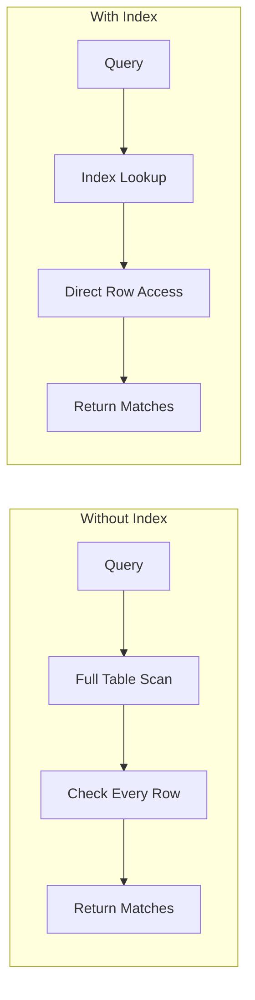
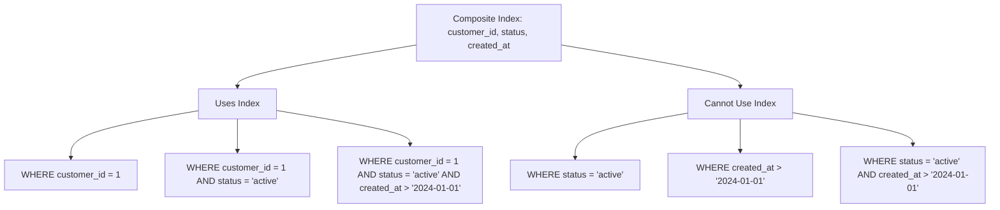
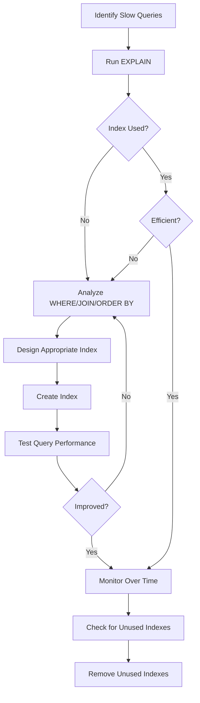

# How to Handle Index Optimization in MySQL

Author: [nawazdhandala](https://github.com/nawazdhandala)

Tags: MySQL, Database, Performance, Indexing, Query Optimization, DevOps

Description: Learn how to analyze, create, and optimize MySQL indexes for better query performance including composite indexes, covering indexes, and index maintenance strategies.

---

Database indexes are essential for query performance, but poorly designed indexes can hurt more than they help. Too few indexes cause slow queries, while too many indexes slow down writes and waste storage. This guide covers how to analyze your workload and create effective indexes.

## How MySQL Uses Indexes

An index is a sorted data structure that allows MySQL to find rows without scanning the entire table. Think of it like a book index that tells you which page contains a topic.



## Analyzing Query Performance

Before adding indexes, identify which queries need optimization using EXPLAIN.

```sql
-- Basic EXPLAIN shows the query execution plan
EXPLAIN SELECT * FROM orders WHERE customer_id = 12345;

-- Output columns explained:
-- type: access type (ALL is worst, const/ref are good)
-- possible_keys: indexes that could be used
-- key: index actually chosen
-- rows: estimated rows to examine
-- Extra: additional information

-- EXPLAIN ANALYZE (MySQL 8.0+) shows actual execution time
EXPLAIN ANALYZE
SELECT * FROM orders
WHERE customer_id = 12345
AND status = 'pending';
```

Key indicators of poor performance in EXPLAIN output:

```sql
-- type = ALL means full table scan (bad for large tables)
-- rows = high number means many rows examined
-- Extra = "Using filesort" means sorting without index
-- Extra = "Using temporary" means temporary table created

-- Example of a problematic query plan:
-- +----+------+---------------+------+------+-------------+
-- | id | type | possible_keys | key  | rows | Extra       |
-- +----+------+---------------+------+------+-------------+
-- |  1 | ALL  | NULL          | NULL | 1M   | Using where |
-- +----+------+---------------+------+------+-------------+
-- This scans 1 million rows because no index is used
```

## Creating Effective Indexes

### Single Column Indexes

Start with indexes on columns used in WHERE clauses, JOIN conditions, and ORDER BY.

```sql
-- Create index on frequently filtered column
CREATE INDEX idx_customer_id ON orders(customer_id);

-- Verify the index helps
EXPLAIN SELECT * FROM orders WHERE customer_id = 12345;
-- type should now show "ref" instead of "ALL"
-- key should show "idx_customer_id"

-- Create index for sorting
CREATE INDEX idx_created_at ON orders(created_at);

-- Now this query uses the index for ordering
SELECT * FROM orders ORDER BY created_at DESC LIMIT 100;
```

### Composite Indexes

Composite indexes contain multiple columns and follow the leftmost prefix rule. Column order matters significantly.

```sql
-- Composite index for common query pattern
-- Always put the most selective (unique) column first if all columns
-- use equality, or the range column last
CREATE INDEX idx_customer_status_date
ON orders(customer_id, status, created_at);

-- This index helps these queries:
-- 1. WHERE customer_id = ?
-- 2. WHERE customer_id = ? AND status = ?
-- 3. WHERE customer_id = ? AND status = ? AND created_at > ?

-- But NOT these queries (leftmost prefix not satisfied):
-- 1. WHERE status = ?
-- 2. WHERE created_at > ?
-- 3. WHERE status = ? AND created_at > ?
```



### Covering Indexes

A covering index contains all columns needed by a query, eliminating the need to read the actual table rows.

```sql
-- Query that needs only specific columns
SELECT customer_id, status, total
FROM orders
WHERE customer_id = 12345 AND status = 'completed';

-- Covering index includes all columns in the query
CREATE INDEX idx_covering_orders
ON orders(customer_id, status, total);

-- EXPLAIN shows "Using index" in Extra column
-- This means MySQL reads only the index, not the table
EXPLAIN SELECT customer_id, status, total
FROM orders
WHERE customer_id = 12345 AND status = 'completed';
-- Extra: Using index (this is good!)
```

### Index for JOIN Operations

Indexes on foreign keys improve JOIN performance significantly.

```sql
-- Tables involved in join
-- orders: id, customer_id, product_id, quantity
-- customers: id, name, email
-- products: id, name, price

-- Ensure foreign key columns are indexed
CREATE INDEX idx_orders_customer ON orders(customer_id);
CREATE INDEX idx_orders_product ON orders(product_id);

-- Now this JOIN can use indexes on both tables
SELECT c.name, p.name, o.quantity
FROM orders o
JOIN customers c ON o.customer_id = c.id
JOIN products p ON o.product_id = p.id
WHERE o.created_at > '2024-01-01';
```

## Index Maintenance

### Finding Unused Indexes

Unused indexes waste storage and slow down writes. Identify and remove them.

```sql
-- MySQL 8.0+ with sys schema: Find unused indexes
SELECT
    object_schema AS database_name,
    object_name AS table_name,
    index_name,
    rows_selected,
    rows_inserted,
    rows_updated,
    rows_deleted
FROM performance_schema.table_io_waits_summary_by_index_usage
WHERE index_name IS NOT NULL
AND rows_selected = 0
AND object_schema NOT IN ('mysql', 'sys', 'performance_schema')
ORDER BY object_schema, object_name;

-- Check index usage stats
SELECT
    table_schema,
    table_name,
    index_name,
    stat_value AS pages,
    stat_description
FROM mysql.innodb_index_stats
WHERE stat_name = 'size'
ORDER BY stat_value DESC;
```

### Finding Duplicate Indexes

Duplicate indexes provide no benefit but consume resources.

```sql
-- Find duplicate indexes (indexes with same leftmost columns)
SELECT
    t.table_schema,
    t.table_name,
    t.index_name,
    t.column_name,
    t.seq_in_index
FROM information_schema.statistics t
JOIN information_schema.statistics t2
    ON t.table_schema = t2.table_schema
    AND t.table_name = t2.table_name
    AND t.column_name = t2.column_name
    AND t.seq_in_index = t2.seq_in_index
    AND t.index_name != t2.index_name
WHERE t.table_schema NOT IN ('mysql', 'sys', 'performance_schema')
ORDER BY t.table_schema, t.table_name, t.index_name, t.seq_in_index;

-- Example: These are duplicates
-- idx_customer_id ON orders(customer_id)
-- idx_customer_status ON orders(customer_id, status)
-- The first index is redundant because the second covers it
```

### Analyzing Index Cardinality

Cardinality indicates how unique the values in an index are. Higher cardinality means more selective indexes.

```sql
-- Show index cardinality
SHOW INDEX FROM orders;

-- Output includes:
-- Cardinality: estimated unique values
-- Higher is better for filtering

-- Update cardinality statistics (run after major data changes)
ANALYZE TABLE orders;

-- Check if cardinality is reasonable
-- Low cardinality columns (like status with 5 values) are poor
-- candidates for single-column indexes but fine in composites
SELECT
    table_name,
    index_name,
    column_name,
    cardinality,
    (SELECT COUNT(*) FROM information_schema.tables
     WHERE table_name = s.table_name) AS approx_rows
FROM information_schema.statistics s
WHERE table_schema = 'mydb'
ORDER BY table_name, index_name, seq_in_index;
```

## Index Types

### B-Tree Index (Default)

B-Tree indexes work well for most queries including equality, ranges, and sorting.

```sql
-- B-Tree is the default index type
CREATE INDEX idx_btree ON orders(amount);

-- Supports these operations efficiently:
-- Equality: WHERE amount = 100
-- Range: WHERE amount > 100
-- Range: WHERE amount BETWEEN 100 AND 200
-- Sorting: ORDER BY amount
-- Prefix: WHERE name LIKE 'John%' (but NOT LIKE '%John')
```

### Full-Text Index

For text search on large text columns, use full-text indexes instead of LIKE queries.

```sql
-- Create full-text index
CREATE FULLTEXT INDEX idx_fulltext ON products(name, description);

-- Search using MATCH ... AGAINST
SELECT * FROM products
WHERE MATCH(name, description) AGAINST('wireless bluetooth' IN NATURAL LANGUAGE MODE);

-- Boolean mode for more control
SELECT * FROM products
WHERE MATCH(name, description) AGAINST('+wireless -wired' IN BOOLEAN MODE);
-- + means must include
-- - means must exclude
```

### Spatial Index

For geographic data, spatial indexes enable efficient location queries.

```sql
-- Create table with spatial column
CREATE TABLE locations (
    id INT PRIMARY KEY,
    name VARCHAR(100),
    coordinates POINT NOT NULL SRID 4326
);

-- Create spatial index
CREATE SPATIAL INDEX idx_spatial ON locations(coordinates);

-- Find locations within a radius
SET @center = ST_GeomFromText('POINT(-73.935242 40.730610)', 4326);
SELECT name, ST_Distance_Sphere(coordinates, @center) AS distance
FROM locations
WHERE ST_Distance_Sphere(coordinates, @center) < 1000  -- within 1km
ORDER BY distance;
```

## Performance Impact of Indexes

### Write Performance

Every index must be updated on INSERT, UPDATE, and DELETE operations.

```sql
-- Measure insert performance with different index counts
-- Table with 1 index: ~50,000 inserts/second
-- Table with 5 indexes: ~20,000 inserts/second
-- Table with 10 indexes: ~10,000 inserts/second

-- For bulk inserts, consider temporarily disabling indexes
ALTER TABLE orders DISABLE KEYS;
-- ... bulk insert data ...
ALTER TABLE orders ENABLE KEYS;

-- Or for InnoDB, load data with indexes, but optimize batch size
LOAD DATA INFILE '/data/orders.csv'
INTO TABLE orders
FIELDS TERMINATED BY ','
LINES TERMINATED BY '\n';
```

### Index Size Management

```sql
-- Check index sizes
SELECT
    database_name,
    table_name,
    index_name,
    ROUND(stat_value * @@innodb_page_size / 1024 / 1024, 2) AS size_mb
FROM mysql.innodb_index_stats
WHERE stat_name = 'size'
AND database_name = 'mydb'
ORDER BY stat_value DESC;

-- Total index size per table
SELECT
    table_schema,
    table_name,
    ROUND(index_length / 1024 / 1024, 2) AS index_size_mb,
    ROUND(data_length / 1024 / 1024, 2) AS data_size_mb
FROM information_schema.tables
WHERE table_schema = 'mydb'
ORDER BY index_length DESC;
```

## Optimization Workflow

Follow this process when optimizing indexes for a workload.



## Quick Reference

| Query Pattern | Index Strategy |
|--------------|----------------|
| WHERE col = value | Single column index |
| WHERE col1 = ? AND col2 = ? | Composite index (col1, col2) |
| WHERE col1 = ? AND col2 > ? | Composite index (col1, col2) |
| ORDER BY col | Index on col |
| WHERE col1 = ? ORDER BY col2 | Composite index (col1, col2) |
| JOIN ON foreign_key | Index on foreign_key |
| SELECT col1, col2 WHERE col1 = ? | Covering index (col1, col2) |
| LIKE 'prefix%' | B-Tree index works |
| LIKE '%suffix' | Full-text index needed |

Effective indexing requires understanding your query patterns. Start with EXPLAIN to identify problems, create targeted indexes, and regularly review for unused or duplicate indexes. The goal is finding the balance between read performance and write overhead.
