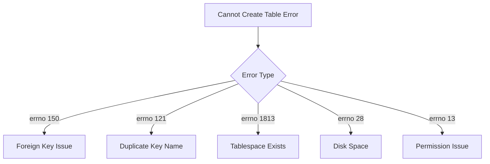
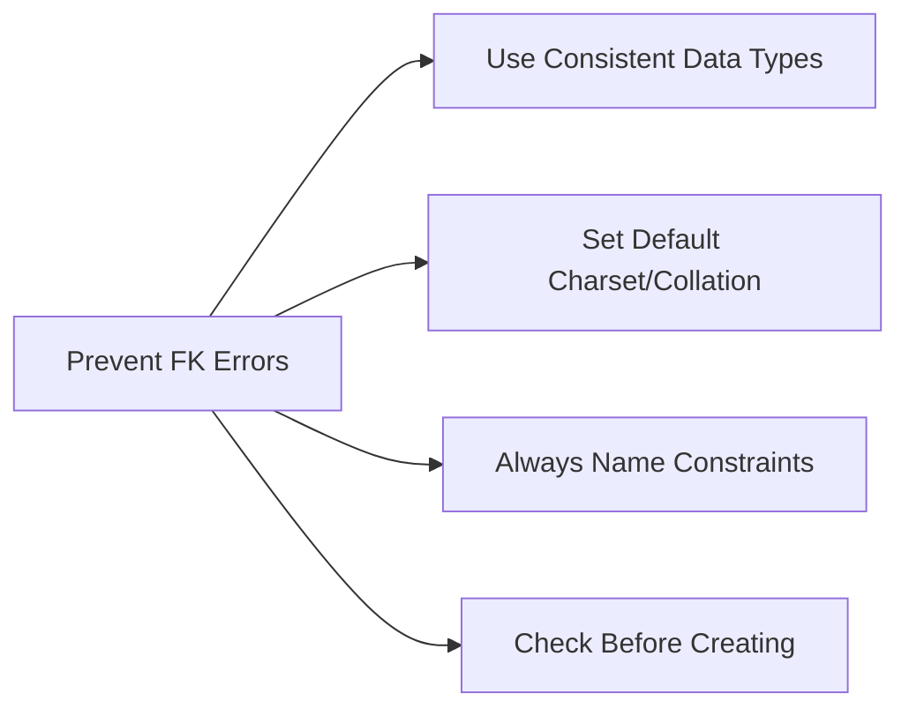

# How to Fix "Cannot Create Table" InnoDB Errors

Author: [nawazdhandala](https://www.github.com/nawazdhandala)

Tags: MySQL, InnoDB, Errors, Troubleshooting, Foreign Keys, Database Administration

Description: A practical guide to diagnosing and fixing InnoDB "Cannot create table" errors including foreign key issues, tablespace problems, and data type mismatches.

---

The dreaded "Cannot create table" error in MySQL InnoDB can be frustrating because the error message often lacks specific details. This guide covers the common causes and provides systematic approaches to diagnose and fix these issues.

## Understanding the Error

When you encounter this error, MySQL typically shows something like:

```
ERROR 1005 (HY000): Can't create table 'database.tablename' (errno: 150)
ERROR 1005 (HY000): Can't create table 'database.tablename' (errno: 121)
ERROR 1813 (HY000): Tablespace 'database/tablename' exists.
```



## Getting Detailed Error Information

Always start by checking the detailed error:

```sql
-- Check the last InnoDB error
SHOW ENGINE INNODB STATUS\G

-- Look for the "LATEST FOREIGN KEY ERROR" section
-- This provides specific details about what went wrong
```

For MySQL 8.0+:

```sql
-- Check foreign key errors specifically
SELECT * FROM information_schema.INNODB_FOREIGN_ERRORS;

-- Or use performance schema
SELECT * FROM performance_schema.events_errors_summary_global_by_error
WHERE error_name LIKE '%FOREIGN%';
```

## Foreign Key Errors (errno: 150)

This is the most common cause. Foreign key constraints have strict requirements.

### 1. Data Type Mismatch

The referenced and referencing columns must have identical data types.

```sql
-- Wrong: data type mismatch
CREATE TABLE parent (
    id BIGINT UNSIGNED PRIMARY KEY,
    name VARCHAR(100)
);

CREATE TABLE child (
    id INT PRIMARY KEY,
    parent_id INT,  -- Wrong: should be BIGINT UNSIGNED
    FOREIGN KEY (parent_id) REFERENCES parent(id)
);
-- This will fail with errno: 150

-- Correct: matching data types
CREATE TABLE child (
    id INT PRIMARY KEY,
    parent_id BIGINT UNSIGNED,
    FOREIGN KEY (parent_id) REFERENCES parent(id)
);
```

### 2. Character Set and Collation Mismatch

String columns must have matching character sets and collations.

```sql
-- Wrong: collation mismatch
CREATE TABLE categories (
    code VARCHAR(10) CHARACTER SET utf8mb4 COLLATE utf8mb4_unicode_ci PRIMARY KEY,
    name VARCHAR(100)
);

CREATE TABLE products (
    id INT PRIMARY KEY,
    category_code VARCHAR(10) CHARACTER SET utf8mb4 COLLATE utf8mb4_general_ci,
    FOREIGN KEY (category_code) REFERENCES categories(code)
);
-- This will fail

-- Correct: matching collation
CREATE TABLE products (
    id INT PRIMARY KEY,
    category_code VARCHAR(10) CHARACTER SET utf8mb4 COLLATE utf8mb4_unicode_ci,
    FOREIGN KEY (category_code) REFERENCES categories(code)
);
```

Check existing column definitions:

```sql
-- Check column charset and collation
SELECT
    table_name,
    column_name,
    data_type,
    character_set_name,
    collation_name
FROM information_schema.columns
WHERE table_schema = 'your_database'
  AND column_name IN ('id', 'parent_id', 'category_code');
```

### 3. Missing Index on Referenced Column

The referenced column must be indexed (primary key or unique key).

```sql
-- Wrong: no index on referenced column
CREATE TABLE parent (
    id INT PRIMARY KEY,
    code VARCHAR(10)  -- No index
);

CREATE TABLE child (
    id INT PRIMARY KEY,
    parent_code VARCHAR(10),
    FOREIGN KEY (parent_code) REFERENCES parent(code)  -- Fails: code is not indexed
);

-- Correct: add index first
ALTER TABLE parent ADD UNIQUE INDEX idx_code (code);

CREATE TABLE child (
    id INT PRIMARY KEY,
    parent_code VARCHAR(10),
    FOREIGN KEY (parent_code) REFERENCES parent(code)
);
```

### 4. Referenced Table Does Not Exist

```sql
-- Check if parent table exists
SHOW TABLES LIKE 'parent_table_name';

-- Check foreign key references
SELECT
    constraint_name,
    table_name,
    column_name,
    referenced_table_name,
    referenced_column_name
FROM information_schema.key_column_usage
WHERE table_schema = 'your_database'
  AND referenced_table_name IS NOT NULL;
```

### 5. Engine Mismatch

Both tables must use InnoDB for foreign keys.

```sql
-- Check table engines
SELECT table_name, engine
FROM information_schema.tables
WHERE table_schema = 'your_database';

-- Convert table to InnoDB if needed
ALTER TABLE old_myisam_table ENGINE = InnoDB;
```

## Duplicate Key Name (errno: 121)

This occurs when a constraint name already exists.

```sql
-- Check existing constraint names
SELECT
    constraint_name,
    table_name,
    constraint_type
FROM information_schema.table_constraints
WHERE constraint_schema = 'your_database';

-- Use unique constraint names
CREATE TABLE orders (
    id INT PRIMARY KEY,
    customer_id INT,
    CONSTRAINT fk_orders_customer FOREIGN KEY (customer_id)
        REFERENCES customers(id)
);

CREATE TABLE invoices (
    id INT PRIMARY KEY,
    customer_id INT,
    CONSTRAINT fk_invoices_customer FOREIGN KEY (customer_id)
        REFERENCES customers(id)
);
```

## Tablespace Already Exists (errno: 1813)

This happens when .ibd files remain after a table was dropped.

```sql
-- Check for orphaned tablespace
SELECT * FROM information_schema.INNODB_TABLESPACES
WHERE name LIKE '%tablename%';
```

### Solution 1: Discard the orphaned tablespace

```sql
-- If you can recreate the table temporarily
CREATE TABLE tablename (id INT) ENGINE=InnoDB;
ALTER TABLE tablename DISCARD TABLESPACE;
DROP TABLE tablename;

-- Now create your actual table
CREATE TABLE tablename (...);
```

### Solution 2: Remove .ibd file manually

```bash
# Find the orphaned file
ls -la /var/lib/mysql/database_name/tablename.ibd

# Stop MySQL
systemctl stop mysql

# Remove the orphaned file
rm /var/lib/mysql/database_name/tablename.ibd

# Start MySQL
systemctl start mysql

# Create the table
mysql -e "CREATE TABLE database_name.tablename (...);"
```

### Solution 3: Use innodb_force_recovery

```ini
# my.cnf - temporary setting
[mysqld]
innodb_force_recovery = 1
```

```bash
# Restart MySQL
systemctl restart mysql

# Drop the problematic table
mysql -e "DROP TABLE IF EXISTS database_name.tablename;"

# Remove the recovery setting and restart
# Then create the table fresh
```

## Disk Space Issues (errno: 28)

```bash
# Check disk space
df -h /var/lib/mysql

# Check InnoDB tablespace usage
mysql -e "SELECT * FROM information_schema.INNODB_TABLESPACES ORDER BY FILE_SIZE DESC LIMIT 10;"

# Optimize tables to reclaim space
mysqlcheck -o database_name
```

## Permission Issues (errno: 13)

```bash
# Check MySQL data directory permissions
ls -la /var/lib/mysql/

# Fix ownership
chown -R mysql:mysql /var/lib/mysql/

# Check SELinux if enabled
getenforce
# If enforcing, check for AVC denials
ausearch -m avc -ts recent | grep mysql
```

## Diagnostic Script

Use this comprehensive diagnostic script:

```sql
DELIMITER //

CREATE PROCEDURE diagnose_fk_error(
    IN p_child_table VARCHAR(64),
    IN p_child_column VARCHAR(64),
    IN p_parent_table VARCHAR(64),
    IN p_parent_column VARCHAR(64)
)
BEGIN
    DECLARE v_child_type VARCHAR(100);
    DECLARE v_parent_type VARCHAR(100);
    DECLARE v_child_charset VARCHAR(64);
    DECLARE v_parent_charset VARCHAR(64);
    DECLARE v_child_collation VARCHAR(64);
    DECLARE v_parent_collation VARCHAR(64);
    DECLARE v_parent_indexed INT;

    -- Get child column info
    SELECT
        CONCAT(data_type,
            CASE WHEN character_maximum_length IS NOT NULL
                 THEN CONCAT('(', character_maximum_length, ')')
                 ELSE '' END,
            CASE WHEN column_type LIKE '%unsigned%' THEN ' unsigned' ELSE '' END),
        character_set_name,
        collation_name
    INTO v_child_type, v_child_charset, v_child_collation
    FROM information_schema.columns
    WHERE table_schema = DATABASE()
      AND table_name = p_child_table
      AND column_name = p_child_column;

    -- Get parent column info
    SELECT
        CONCAT(data_type,
            CASE WHEN character_maximum_length IS NOT NULL
                 THEN CONCAT('(', character_maximum_length, ')')
                 ELSE '' END,
            CASE WHEN column_type LIKE '%unsigned%' THEN ' unsigned' ELSE '' END),
        character_set_name,
        collation_name
    INTO v_parent_type, v_parent_charset, v_parent_collation
    FROM information_schema.columns
    WHERE table_schema = DATABASE()
      AND table_name = p_parent_table
      AND column_name = p_parent_column;

    -- Check if parent column is indexed
    SELECT COUNT(*) INTO v_parent_indexed
    FROM information_schema.statistics
    WHERE table_schema = DATABASE()
      AND table_name = p_parent_table
      AND column_name = p_parent_column
      AND seq_in_index = 1;

    -- Output results
    SELECT 'Diagnostic Results' AS section;
    SELECT
        p_child_table AS child_table,
        p_child_column AS child_column,
        v_child_type AS child_type,
        v_child_charset AS child_charset,
        v_child_collation AS child_collation;

    SELECT
        p_parent_table AS parent_table,
        p_parent_column AS parent_column,
        v_parent_type AS parent_type,
        v_parent_charset AS parent_charset,
        v_parent_collation AS parent_collation,
        CASE WHEN v_parent_indexed > 0 THEN 'Yes' ELSE 'NO - ADD INDEX!' END AS is_indexed;

    -- Check for issues
    SELECT 'Issues Found' AS section;

    IF v_child_type != v_parent_type THEN
        SELECT 'ERROR: Data type mismatch' AS issue,
               CONCAT(v_child_type, ' vs ', v_parent_type) AS details;
    END IF;

    IF v_child_charset != v_parent_charset OR v_child_collation != v_parent_collation THEN
        SELECT 'ERROR: Charset/Collation mismatch' AS issue,
               CONCAT(v_child_charset, '/', v_child_collation, ' vs ',
                      v_parent_charset, '/', v_parent_collation) AS details;
    END IF;

    IF v_parent_indexed = 0 THEN
        SELECT 'ERROR: Parent column is not indexed' AS issue,
               CONCAT('Add index on ', p_parent_table, '(', p_parent_column, ')') AS solution;
    END IF;

END //

DELIMITER ;

-- Usage:
-- CALL diagnose_fk_error('child_table', 'parent_id', 'parent_table', 'id');
```

## Prevention Best Practices



1. **Standardize data types**: Use consistent ID types (e.g., BIGINT UNSIGNED) across all tables
2. **Set database defaults**: Configure default charset and collation at database level
3. **Name all constraints**: Use descriptive, unique constraint names
4. **Validate before creating**: Check column definitions match before adding foreign keys
5. **Use migrations**: Track schema changes with migration tools

```sql
-- Set database defaults
ALTER DATABASE mydb
    CHARACTER SET utf8mb4
    COLLATE utf8mb4_unicode_ci;

-- Create tables with explicit settings
CREATE TABLE example (
    id BIGINT UNSIGNED AUTO_INCREMENT PRIMARY KEY,
    name VARCHAR(100)
) ENGINE=InnoDB
  DEFAULT CHARSET=utf8mb4
  COLLATE=utf8mb4_unicode_ci;
```

By understanding these common causes and using the diagnostic techniques provided, you can quickly resolve InnoDB table creation errors and prevent them in future development.
