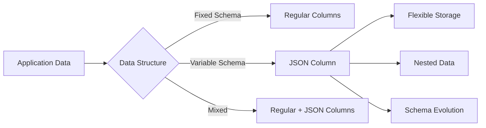
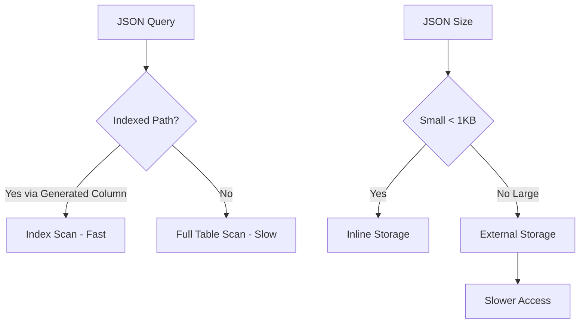

# How to Handle JSON Data in MySQL 8

Author: [nawazdhandala](https://www.github.com/nawazdhandala)

Tags: MySQL, JSON, Database, MySQL 8, NoSQL, SQL

Description: Learn how to store, query, index, and manipulate JSON data in MySQL 8 with practical examples for schema flexibility and performance optimization.

---

MySQL 8 provides robust JSON support that bridges the gap between relational and document databases. You can store flexible schema data while still benefiting from SQL queries, transactions, and joins. This guide covers everything from basic JSON operations to advanced indexing strategies.

## Why JSON in MySQL?

JSON columns make sense when:

- Data structure varies between rows
- You need to store nested or array data
- Schema changes frequently
- You want to avoid excessive normalization



## Creating Tables with JSON Columns

```sql
-- Basic JSON column
CREATE TABLE products (
    id INT AUTO_INCREMENT PRIMARY KEY,
    name VARCHAR(255) NOT NULL,
    attributes JSON,
    created_at TIMESTAMP DEFAULT CURRENT_TIMESTAMP
);

-- Insert JSON data
INSERT INTO products (name, attributes) VALUES
('Laptop', '{"brand": "Dell", "cpu": "i7", "ram_gb": 16, "storage": {"type": "SSD", "size_gb": 512}}'),
('Monitor', '{"brand": "LG", "size_inches": 27, "resolution": "4K", "ports": ["HDMI", "DisplayPort", "USB-C"]}'),
('Keyboard', '{"brand": "Logitech", "wireless": true, "backlit": true, "layout": "US"}');
```

## Extracting JSON Values

MySQL provides two operators for extracting JSON values:

| Operator | Returns | Use Case |
|----------|---------|----------|
| `->` | JSON value (with quotes for strings) | When you need JSON type |
| `->>` | Unquoted text | When you need actual values |

```sql
-- Extract with -> (returns JSON)
SELECT
    name,
    attributes->'$.brand' as brand_json
FROM products;
-- Returns: "Dell", "LG", "Logitech" (with quotes)

-- Extract with ->> (returns text)
SELECT
    name,
    attributes->>'$.brand' as brand
FROM products;
-- Returns: Dell, LG, Logitech (without quotes)

-- Access nested values
SELECT
    name,
    attributes->>'$.storage.type' as storage_type,
    attributes->>'$.storage.size_gb' as storage_size
FROM products
WHERE name = 'Laptop';
```

## JSON Path Expressions

JSON paths let you navigate complex structures:

```sql
-- Array access
SELECT
    name,
    attributes->>'$.ports[0]' as first_port,
    attributes->>'$.ports[1]' as second_port
FROM products
WHERE name = 'Monitor';

-- Wildcard for all array elements
SELECT
    name,
    JSON_EXTRACT(attributes, '$.ports[*]') as all_ports
FROM products
WHERE name = 'Monitor';

-- Check if path exists
SELECT
    name,
    JSON_CONTAINS_PATH(attributes, 'one', '$.wireless') as has_wireless
FROM products;
```

## JSON Functions for Querying

**Filter by JSON values:**

```sql
-- Find products by brand
SELECT * FROM products
WHERE attributes->>'$.brand' = 'Dell';

-- Find products with specific RAM
SELECT * FROM products
WHERE JSON_EXTRACT(attributes, '$.ram_gb') >= 16;

-- Find wireless keyboards
SELECT * FROM products
WHERE attributes->>'$.wireless' = 'true';

-- Search in arrays
SELECT * FROM products
WHERE JSON_CONTAINS(attributes->'$.ports', '"HDMI"');
```

**JSON_TABLE for expanding JSON to rows:**

```sql
-- Expand array to rows
SELECT
    p.name,
    ports.port_name
FROM products p,
JSON_TABLE(
    p.attributes,
    '$.ports[*]' COLUMNS (
        port_name VARCHAR(50) PATH '$'
    )
) AS ports
WHERE JSON_CONTAINS_PATH(p.attributes, 'one', '$.ports');
```

## Modifying JSON Data

**Update specific JSON values:**

```sql
-- Update a single value
UPDATE products
SET attributes = JSON_SET(attributes, '$.ram_gb', 32)
WHERE name = 'Laptop';

-- Add a new key
UPDATE products
SET attributes = JSON_SET(attributes, '$.on_sale', true)
WHERE name = 'Keyboard';

-- Replace existing value (only if key exists)
UPDATE products
SET attributes = JSON_REPLACE(attributes, '$.brand', 'DELL')
WHERE name = 'Laptop';

-- Insert new key (only if key does not exist)
UPDATE products
SET attributes = JSON_INSERT(attributes, '$.warranty_years', 2)
WHERE name = 'Laptop';
```

**Remove JSON keys:**

```sql
-- Remove a key
UPDATE products
SET attributes = JSON_REMOVE(attributes, '$.on_sale')
WHERE name = 'Keyboard';

-- Remove array element
UPDATE products
SET attributes = JSON_REMOVE(attributes, '$.ports[0]')
WHERE name = 'Monitor';
```

**Append to arrays:**

```sql
-- Add element to array
UPDATE products
SET attributes = JSON_ARRAY_APPEND(attributes, '$.ports', 'VGA')
WHERE name = 'Monitor';

-- Insert at specific position
UPDATE products
SET attributes = JSON_ARRAY_INSERT(attributes, '$.ports[0]', 'Thunderbolt')
WHERE name = 'Monitor';
```

## Indexing JSON Data

JSON columns cannot be indexed directly, but you can create indexes on generated columns.

```sql
-- Add generated column for frequently queried JSON path
ALTER TABLE products
ADD COLUMN brand VARCHAR(100)
GENERATED ALWAYS AS (attributes->>'$.brand') STORED;

-- Create index on generated column
CREATE INDEX idx_brand ON products(brand);

-- Now this query uses the index
SELECT * FROM products WHERE brand = 'Dell';
```

**Multi-value indexes for arrays (MySQL 8.0.17+):**

```sql
-- Create table with multi-value index support
CREATE TABLE articles (
    id INT AUTO_INCREMENT PRIMARY KEY,
    title VARCHAR(255),
    metadata JSON,
    INDEX idx_tags ((CAST(metadata->>'$.tags' AS CHAR(50) ARRAY)))
);

-- Insert with tags array
INSERT INTO articles (title, metadata) VALUES
('MySQL Tips', '{"tags": ["mysql", "database", "sql"]}'),
('JSON Guide', '{"tags": ["json", "mysql", "nosql"]}');

-- Query using the multi-value index
SELECT * FROM articles
WHERE 'mysql' MEMBER OF (metadata->>'$.tags');
```

## JSON Validation

**Validate JSON structure with CHECK constraints:**

```sql
-- Ensure valid JSON
CREATE TABLE events (
    id INT AUTO_INCREMENT PRIMARY KEY,
    event_data JSON NOT NULL,
    CONSTRAINT check_json CHECK (JSON_VALID(event_data))
);

-- Validate required fields
CREATE TABLE orders (
    id INT AUTO_INCREMENT PRIMARY KEY,
    order_data JSON NOT NULL,
    CONSTRAINT check_customer CHECK (
        JSON_CONTAINS_PATH(order_data, 'all', '$.customer_id', '$.items')
    )
);
```

## JSON Aggregation

**Build JSON from query results:**

```sql
-- Aggregate rows to JSON array
SELECT JSON_ARRAYAGG(
    JSON_OBJECT('id', id, 'name', name)
) as products_json
FROM products;

-- Group and aggregate
SELECT
    attributes->>'$.brand' as brand,
    JSON_ARRAYAGG(name) as product_names
FROM products
GROUP BY attributes->>'$.brand';
```

**Build JSON objects:**

```sql
-- Create JSON object from columns
SELECT JSON_OBJECT(
    'product', name,
    'details', attributes
) as full_product
FROM products;
```

## Performance Considerations



**Best practices for JSON performance:**

```sql
-- DO: Extract frequently filtered values to generated columns
ALTER TABLE products
ADD COLUMN brand VARCHAR(100) GENERATED ALWAYS AS (attributes->>'$.brand') STORED,
ADD INDEX idx_brand (brand);

-- DO: Keep JSON documents reasonably sized
-- Avoid storing large blobs in JSON

-- DON'T: Use JSON for everything
-- Regular columns are faster for fixed schema data

-- DO: Use JSON_CONTAINS for array searches
SELECT * FROM products
WHERE JSON_CONTAINS(attributes->'$.ports', '"HDMI"');

-- DON'T: Use LIKE on JSON strings
-- Avoid: WHERE attributes LIKE '%HDMI%'
```

## Practical Example: User Preferences

```sql
-- Flexible user preferences storage
CREATE TABLE users (
    id INT AUTO_INCREMENT PRIMARY KEY,
    email VARCHAR(255) NOT NULL UNIQUE,
    preferences JSON DEFAULT '{}',
    CONSTRAINT check_prefs CHECK (JSON_VALID(preferences))
);

-- Insert with defaults
INSERT INTO users (email) VALUES ('user@example.com');

-- Update preferences
UPDATE users
SET preferences = JSON_SET(
    preferences,
    '$.theme', 'dark',
    '$.notifications.email', true,
    '$.notifications.push', false,
    '$.language', 'en'
)
WHERE email = 'user@example.com';

-- Read specific preference with default
SELECT
    email,
    COALESCE(preferences->>'$.theme', 'light') as theme,
    COALESCE(preferences->>'$.language', 'en') as language
FROM users;

-- Merge new preferences
UPDATE users
SET preferences = JSON_MERGE_PATCH(
    preferences,
    '{"timezone": "UTC", "notifications": {"sms": true}}'
)
WHERE email = 'user@example.com';
```

## JSON vs Normalized Tables

| Aspect | JSON | Normalized Tables |
|--------|------|-------------------|
| Schema flexibility | High | Low |
| Query performance | Lower | Higher |
| Index support | Limited | Full |
| Data integrity | Application enforced | Database enforced |
| Storage efficiency | Variable | Predictable |

Use JSON for metadata, configuration, and truly variable data. Use regular columns for data you query frequently or need to join on.

MySQL 8's JSON support gives you document database flexibility with relational database reliability. The key is knowing when to use JSON columns and when to stick with traditional schema design.
