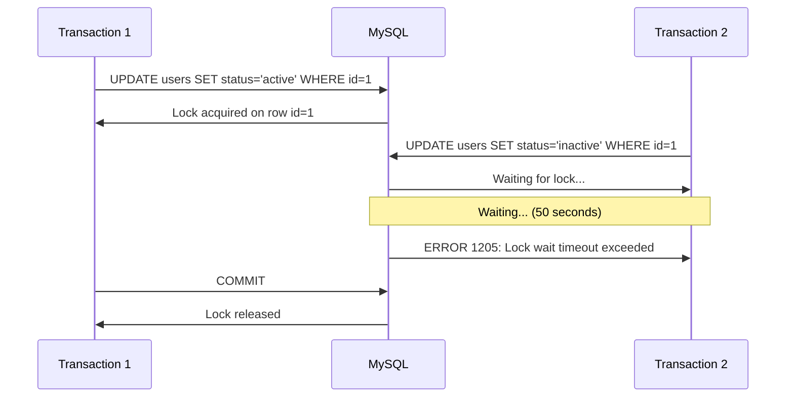
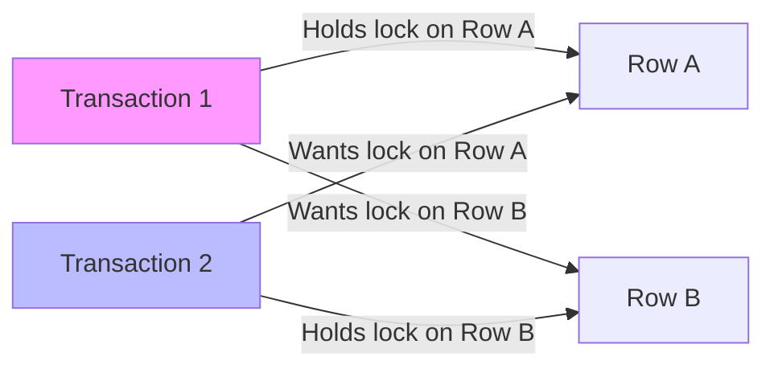

# How to Fix 'Lock Wait Timeout' Errors in MySQL

Author: [nawazdhandala](https://github.com/nawazdhandala)

Tags: MySQL, Database, Locks, Deadlocks, Performance, Troubleshooting, InnoDB

Description: Learn how to diagnose and resolve MySQL lock wait timeout errors including identifying blocking queries, preventing deadlocks, and optimizing transaction handling.

---

The "Lock wait timeout exceeded" error occurs when a transaction waits too long to acquire a lock on a row or table. This typically means another transaction is holding the lock and not releasing it. Understanding MySQL's locking mechanism helps you diagnose and prevent these issues.

## Understanding the Error

The full error message looks like this:

```
ERROR 1205 (HY000): Lock wait timeout exceeded; try restarting transaction
```

This means your transaction waited for the configured timeout period (default 50 seconds) without being able to acquire the lock it needed.



## Diagnosing Lock Issues

### Check Current Locks

First, identify what is holding the lock and what is waiting.

```sql
-- MySQL 8.0+: Show current lock waits
SELECT
    r.trx_id AS waiting_trx_id,
    r.trx_mysql_thread_id AS waiting_thread,
    r.trx_query AS waiting_query,
    b.trx_id AS blocking_trx_id,
    b.trx_mysql_thread_id AS blocking_thread,
    b.trx_query AS blocking_query
FROM performance_schema.data_lock_waits w
JOIN information_schema.innodb_trx b
    ON b.trx_id = w.blocking_engine_transaction_id
JOIN information_schema.innodb_trx r
    ON r.trx_id = w.requesting_engine_transaction_id;

-- Show all current transactions
SELECT
    trx_id,
    trx_state,
    trx_started,
    trx_mysql_thread_id,
    trx_query,
    trx_rows_locked,
    trx_rows_modified,
    TIMESTAMPDIFF(SECOND, trx_started, NOW()) AS duration_seconds
FROM information_schema.innodb_trx
ORDER BY trx_started;
```

### View Lock Details

```sql
-- MySQL 8.0+: Show detailed lock information
SELECT
    engine_lock_id,
    engine_transaction_id,
    thread_id,
    object_schema,
    object_name,
    index_name,
    lock_type,
    lock_mode,
    lock_status,
    lock_data
FROM performance_schema.data_locks
WHERE object_schema = 'mydb';

-- Find which query is blocking
SELECT
    p.id AS process_id,
    p.user,
    p.host,
    p.db,
    p.command,
    p.time AS seconds_running,
    p.state,
    p.info AS query
FROM information_schema.processlist p
JOIN information_schema.innodb_trx t
    ON p.id = t.trx_mysql_thread_id
WHERE t.trx_state = 'RUNNING'
ORDER BY p.time DESC;
```

### Enable Lock Wait Monitoring

```sql
-- Set up monitoring for lock waits
-- This logs queries that wait for locks

-- Lower the lock wait timeout for testing (default is 50 seconds)
SET GLOBAL innodb_lock_wait_timeout = 10;

-- Enable slow query log to capture lock wait incidents
SET GLOBAL slow_query_log = 'ON';
SET GLOBAL long_query_time = 5;
SET GLOBAL log_queries_not_using_indexes = 'ON';

-- Check InnoDB status for deadlock information
SHOW ENGINE INNODB STATUS\G
-- Look for "LATEST DETECTED DEADLOCK" section
```

## Common Causes and Solutions

### 1. Long-Running Transactions

Transactions that stay open too long hold locks unnecessarily.

```sql
-- Problem: Transaction holds lock while doing non-DB work
START TRANSACTION;
UPDATE orders SET status = 'processing' WHERE id = 123;
-- ... application does HTTP calls, file operations, etc ...
-- Lock is held the entire time!
COMMIT;

-- Solution: Minimize transaction scope
-- Do external work OUTSIDE the transaction
-- fetch_data_from_api();  -- do this first

START TRANSACTION;
UPDATE orders SET status = 'processing' WHERE id = 123;
COMMIT;
-- Transaction is short, lock released quickly
```

### 2. Missing Indexes on UPDATE/DELETE

Without proper indexes, UPDATE and DELETE statements lock more rows than necessary.

```sql
-- Problem: No index on status column
-- This locks ALL rows while scanning the table
UPDATE orders SET processed = 1 WHERE status = 'pending';

-- Check the execution plan
EXPLAIN UPDATE orders SET processed = 1 WHERE status = 'pending';
-- type: ALL means full table scan = many row locks

-- Solution: Add index
CREATE INDEX idx_status ON orders(status);

-- Now only matching rows are locked
EXPLAIN UPDATE orders SET processed = 1 WHERE status = 'pending';
-- type: ref means index lookup = fewer row locks
```

### 3. Deadlocks

Deadlocks occur when two transactions wait for each other's locks.



```sql
-- Transaction 1                    -- Transaction 2
START TRANSACTION;                  START TRANSACTION;
UPDATE accounts SET                 UPDATE accounts SET
  balance = balance - 100             balance = balance - 50
  WHERE id = 1;                       WHERE id = 2;
-- Holds lock on id=1               -- Holds lock on id=2

UPDATE accounts SET                 UPDATE accounts SET
  balance = balance + 100             balance = balance + 50
  WHERE id = 2;                       WHERE id = 1;
-- Waits for id=2                   -- Waits for id=1
-- DEADLOCK!                        -- DEADLOCK!
```

**Solution: Consistent Lock Ordering**

```sql
-- Always acquire locks in the same order (e.g., by ID ascending)
-- This prevents circular wait conditions

-- Transaction 1 (transfer from account 1 to 2)
START TRANSACTION;
SELECT * FROM accounts WHERE id IN (1, 2) FOR UPDATE;  -- Lock both in ID order
UPDATE accounts SET balance = balance - 100 WHERE id = 1;
UPDATE accounts SET balance = balance + 100 WHERE id = 2;
COMMIT;

-- Transaction 2 (transfer from account 2 to 1)
START TRANSACTION;
SELECT * FROM accounts WHERE id IN (1, 2) FOR UPDATE;  -- Same order!
UPDATE accounts SET balance = balance - 50 WHERE id = 2;
UPDATE accounts SET balance = balance + 50 WHERE id = 1;
COMMIT;
```

### 4. Large Batch Operations

Large batch updates lock many rows for extended periods.

```sql
-- Problem: Single huge UPDATE locks millions of rows
UPDATE orders SET archived = 1 WHERE created_at < '2023-01-01';
-- Locks potentially millions of rows for minutes

-- Solution: Process in small batches
DELIMITER //
CREATE PROCEDURE archive_orders_batch(IN batch_size INT)
BEGIN
    DECLARE affected_rows INT DEFAULT 1;

    WHILE affected_rows > 0 DO
        UPDATE orders
        SET archived = 1
        WHERE created_at < '2023-01-01'
        AND archived = 0
        LIMIT batch_size;  -- Process only batch_size rows at a time

        SET affected_rows = ROW_COUNT();

        -- Short pause to let other transactions proceed
        DO SLEEP(0.1);
    END WHILE;
END //
DELIMITER ;

-- Run with small batches
CALL archive_orders_batch(1000);
```

## Configuration Tuning

### Lock Wait Timeout

Adjust the timeout based on your application's needs.

```sql
-- Check current setting
SHOW VARIABLES LIKE 'innodb_lock_wait_timeout';

-- Set globally (requires SUPER privilege)
SET GLOBAL innodb_lock_wait_timeout = 30;  -- 30 seconds

-- Set for current session only
SET SESSION innodb_lock_wait_timeout = 10;

-- Or in my.cnf for permanent change
-- [mysqld]
-- innodb_lock_wait_timeout = 30
```

### Deadlock Detection

```sql
-- Check deadlock detection setting (MySQL 8.0+)
SHOW VARIABLES LIKE 'innodb_deadlock_detect';

-- Deadlock detection adds overhead but prevents indefinite waits
-- Keep it ON unless you have very high transaction rates
-- and can handle deadlocks at the application level
```

## Application-Level Handling

### Retry Logic

Implement retry logic for lock timeout errors.

```javascript
// Node.js retry pattern for lock timeouts
async function executeWithRetry(pool, queryFn, maxRetries = 3) {
  let lastError;

  for (let attempt = 1; attempt <= maxRetries; attempt++) {
    const connection = await pool.getConnection();

    try {
      await connection.beginTransaction();
      const result = await queryFn(connection);
      await connection.commit();
      return result;

    } catch (error) {
      await connection.rollback();
      lastError = error;

      // Check if it's a retryable error
      // 1205: Lock wait timeout
      // 1213: Deadlock found
      const retryableErrors = [1205, 1213];

      if (retryableErrors.includes(error.errno)) {
        console.log(`Attempt ${attempt} failed with ${error.code}, retrying...`);
        // Exponential backoff: 100ms, 200ms, 400ms
        await new Promise(r => setTimeout(r, 100 * Math.pow(2, attempt - 1)));
        continue;
      }

      // Non-retryable error, throw immediately
      throw error;

    } finally {
      connection.release();
    }
  }

  throw lastError;
}

// Usage
await executeWithRetry(pool, async (conn) => {
  await conn.execute('UPDATE accounts SET balance = balance - ? WHERE id = ?', [100, 1]);
  await conn.execute('UPDATE accounts SET balance = balance + ? WHERE id = ?', [100, 2]);
});
```

```python
# Python retry pattern
import pymysql
import time
from functools import wraps

def retry_on_lock_timeout(max_retries=3, base_delay=0.1):
    def decorator(func):
        @wraps(func)
        def wrapper(*args, **kwargs):
            last_exception = None

            for attempt in range(max_retries):
                try:
                    return func(*args, **kwargs)
                except pymysql.err.OperationalError as e:
                    error_code = e.args[0]
                    # 1205: Lock wait timeout, 1213: Deadlock
                    if error_code in (1205, 1213):
                        last_exception = e
                        delay = base_delay * (2 ** attempt)
                        print(f"Attempt {attempt + 1} failed, retrying in {delay}s")
                        time.sleep(delay)
                    else:
                        raise

            raise last_exception
        return wrapper
    return decorator

@retry_on_lock_timeout(max_retries=3)
def transfer_funds(conn, from_id, to_id, amount):
    with conn.cursor() as cursor:
        cursor.execute("UPDATE accounts SET balance = balance - %s WHERE id = %s",
                      (amount, from_id))
        cursor.execute("UPDATE accounts SET balance = balance + %s WHERE id = %s",
                      (amount, to_id))
    conn.commit()
```

### Optimistic Locking

Use version numbers to detect concurrent modifications without holding locks.

```sql
-- Add version column to table
ALTER TABLE orders ADD COLUMN version INT DEFAULT 0;

-- Read the current version
SELECT id, status, version FROM orders WHERE id = 123;
-- Returns: id=123, status='pending', version=5

-- Update with version check
UPDATE orders
SET status = 'processing', version = version + 1
WHERE id = 123 AND version = 5;

-- Check if update succeeded
-- If affected_rows = 0, someone else modified the row
-- Retry by re-reading and re-attempting
```

```javascript
// Optimistic locking implementation
async function updateOrderOptimistic(pool, orderId, newStatus, maxRetries = 3) {
  for (let attempt = 0; attempt < maxRetries; attempt++) {
    // Read current state
    const [rows] = await pool.execute(
      'SELECT id, status, version FROM orders WHERE id = ?',
      [orderId]
    );

    if (rows.length === 0) {
      throw new Error('Order not found');
    }

    const { version } = rows[0];

    // Attempt update with version check
    const [result] = await pool.execute(
      'UPDATE orders SET status = ?, version = version + 1 WHERE id = ? AND version = ?',
      [newStatus, orderId, version]
    );

    if (result.affectedRows === 1) {
      return true;  // Success
    }

    // Version mismatch, someone else modified the row
    console.log(`Optimistic lock failed, attempt ${attempt + 1}`);
  }

  throw new Error('Failed to update order after max retries');
}
```

## Monitoring and Alerting

Set up monitoring to catch lock issues before they become critical.

```sql
-- Create a monitoring query to run periodically
-- Alert if any transaction has been running for more than 60 seconds
SELECT
    trx_id,
    trx_mysql_thread_id,
    trx_query,
    TIMESTAMPDIFF(SECOND, trx_started, NOW()) AS duration_seconds
FROM information_schema.innodb_trx
WHERE TIMESTAMPDIFF(SECOND, trx_started, NOW()) > 60;

-- Count of waiting locks
SELECT COUNT(*) AS waiting_locks
FROM performance_schema.data_lock_waits;

-- Recent deadlocks from InnoDB status
-- Parse the output of SHOW ENGINE INNODB STATUS
-- and alert on new deadlock occurrences
```

## Quick Reference

| Symptom | Likely Cause | Solution |
|---------|-------------|----------|
| Frequent timeouts | Long transactions | Reduce transaction scope |
| Random timeouts | Missing indexes | Add indexes on UPDATE/DELETE columns |
| Mutual blocking | Deadlock | Use consistent lock ordering |
| Bulk operation timeouts | Large batch | Process in smaller batches |
| Peak time timeouts | High contention | Implement optimistic locking |

Lock wait timeouts indicate contention problems. Start by identifying the blocking query using the diagnostic queries above, then address the root cause whether it is long transactions, missing indexes, or application design issues. With proper monitoring, you can catch these issues before they affect users.
