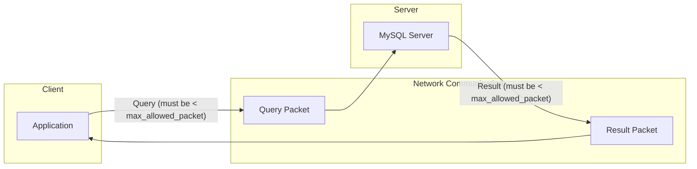

# How to Fix "Max Allowed Packet" Errors

Author: [nawazdhandala](https://www.github.com/nawazdhandala)

Tags: MySQL, Database, Errors, Configuration, Troubleshooting, max_allowed_packet

Description: Learn how to diagnose and fix MySQL "max_allowed_packet" errors that occur when queries or data exceed the server's packet size limit.

---

You are running a database migration or inserting a large blob, and MySQL throws this error: "Packet for query is too large (16795136 > 16777216). You can change this value on the server by setting the max_allowed_packet variable."

This error occurs when a query or result exceeds MySQL's maximum packet size. The fix is straightforward once you understand what controls this limit.

## Understanding max_allowed_packet

MySQL communicates between client and server using packets. The `max_allowed_packet` setting controls the maximum size of a single packet. When a query, result set, or data chunk exceeds this limit, MySQL refuses to process it.



Common scenarios that trigger this error:

- Inserting large BLOBs or TEXT values
- Running queries with large IN() clauses
- Bulk INSERT statements with many rows
- mysqldump/restore operations
- Replication of large transactions

## Checking Current Settings

First, check your current packet size limit:

```sql
-- Check server setting
SHOW VARIABLES LIKE 'max_allowed_packet';

-- Typical output: 16777216 (16 MB default)
```

Check both client and server values since they can differ:

```bash
# Check server value via command line
mysql -e "SHOW VARIABLES LIKE 'max_allowed_packet';"

# Check what the client sees
mysql -e "SELECT @@max_allowed_packet;"
```

## Quick Fix: Increase at Runtime

You can increase the limit without restarting MySQL:

```sql
-- Increase to 64 MB
SET GLOBAL max_allowed_packet = 67108864;

-- Verify the change
SHOW VARIABLES LIKE 'max_allowed_packet';
```

Important: The session variable cannot be set directly. You must set the global variable, then reconnect for the change to apply to your session:

```sql
-- This works
SET GLOBAL max_allowed_packet = 67108864;

-- This fails
-- SET SESSION max_allowed_packet = 67108864;

-- Reconnect to get the new value in your session
-- \q (quit and reconnect)
```

## Permanent Fix: Configuration File

For a permanent fix, modify the MySQL configuration file:

```ini
# /etc/mysql/mysql.conf.d/mysqld.cnf (Debian/Ubuntu)
# /etc/my.cnf (CentOS/RHEL)

[mysqld]
# Set to 256 MB (adjust based on your needs)
max_allowed_packet = 256M

[mysqldump]
# Also set for mysqldump operations
max_allowed_packet = 256M

[mysql]
# Client setting
max_allowed_packet = 256M
```

Restart MySQL to apply:

```bash
# Debian/Ubuntu
sudo systemctl restart mysql

# CentOS/RHEL
sudo systemctl restart mysqld

# Verify after restart
mysql -e "SHOW VARIABLES LIKE 'max_allowed_packet';"
```

## Fixing mysqldump Errors

When mysqldump fails with packet errors, you need to set the limit for both the dump and restore operations:

```bash
# Increase packet size during dump
mysqldump --max_allowed_packet=256M -u root -p database_name > backup.sql

# Increase packet size during restore
mysql --max_allowed_packet=256M -u root -p database_name < backup.sql
```

For large databases, combine with other options:

```bash
# Full backup with increased limits and optimizations
mysqldump \
    --max_allowed_packet=256M \
    --single-transaction \
    --quick \
    --routines \
    --triggers \
    -u root -p database_name > backup.sql
```

## Fixing Replication Errors

In replication setups, both master and replica need matching settings:

```sql
-- On the master
SET GLOBAL max_allowed_packet = 268435456;

-- On each replica
SET GLOBAL max_allowed_packet = 268435456;
```

If replication stops due to a packet error:

```sql
-- Check replica status
SHOW REPLICA STATUS\G

-- If you see a packet error, increase the limit and restart replication
STOP REPLICA;
SET GLOBAL max_allowed_packet = 268435456;
START REPLICA;
```

## Choosing the Right Size

The appropriate size depends on your workload:


Size recommendations:

| Use Case | Recommended Size | Value in Bytes |
|----------|------------------|----------------|
| Default web application | 64 MB | 67108864 |
| Document storage | 128 MB | 134217728 |
| Binary file handling | 256 MB | 268435456 |
| Large blob storage | 512 MB | 536870912 |
| Maximum allowed | 1 GB | 1073741824 |

## Application-Level Solutions

Sometimes you can avoid increasing packet size by changing your application logic.

### Chunked Inserts

Instead of one massive INSERT, break it into chunks:

```python
# Bad: Single large insert
# cursor.execute("INSERT INTO table VALUES " + ",".join(thousands_of_values))

# Good: Chunked inserts
def chunked_insert(cursor, table, values, chunk_size=1000):
    """Insert values in chunks to avoid packet size limits."""
    for i in range(0, len(values), chunk_size):
        chunk = values[i:i + chunk_size]
        placeholders = ",".join(["(%s, %s, %s)"] * len(chunk))
        flat_values = [item for row in chunk for item in row]
        cursor.execute(f"INSERT INTO {table} VALUES {placeholders}", flat_values)
        connection.commit()

# Usage
chunked_insert(cursor, "orders", order_data, chunk_size=500)
```

### Streaming Large Data

For large BLOBs, consider storing files externally:

```sql
-- Instead of storing the file in MySQL
-- INSERT INTO documents (content) VALUES (<large_blob>);

-- Store a reference and keep files on disk or object storage
INSERT INTO documents (filename, storage_path, size)
VALUES ('report.pdf', '/storage/docs/2026/01/abc123.pdf', 15728640);
```

### Compressing Data

Compress data before inserting:

```python
import zlib

# Compress before insert
original_data = b"..." # Large binary data
compressed = zlib.compress(original_data, level=9)

cursor.execute(
    "INSERT INTO documents (content, is_compressed) VALUES (%s, %s)",
    (compressed, True)
)

# Decompress on retrieval
cursor.execute("SELECT content FROM documents WHERE id = %s", (doc_id,))
compressed_data = cursor.fetchone()[0]
original = zlib.decompress(compressed_data)
```

## Troubleshooting Common Issues

### Error Persists After Setting

If the error continues after changing the setting:

```sql
-- Check if the change actually applied
SHOW GLOBAL VARIABLES LIKE 'max_allowed_packet';

-- Your session might still have the old value
-- Reconnect and check again
SELECT @@session.max_allowed_packet;
```

### Setting Resets After Restart

The runtime setting does not persist. Add it to the configuration file:

```bash
# Check if configuration file is correct
grep -r "max_allowed_packet" /etc/mysql/

# Make sure you're editing the right file
mysql -e "SHOW VARIABLES LIKE 'datadir';"
```

### Different Values for Server and Client

Both need appropriate settings:

```ini
# my.cnf
[mysqld]
max_allowed_packet = 256M    # Server setting

[mysql]
max_allowed_packet = 256M    # mysql client setting

[mysqldump]
max_allowed_packet = 256M    # mysqldump setting

[client]
max_allowed_packet = 256M    # All client programs
```

### Memory Considerations

Higher packet sizes consume more memory:

```sql
-- Each connection can allocate up to max_allowed_packet
-- With 100 connections and 256 MB packet size, worst case is 25 GB

-- Monitor memory usage
SHOW STATUS LIKE 'Max_used_connections';
SHOW VARIABLES LIKE 'max_connections';
```

Balance packet size against available memory:

```ini
# Conservative approach for limited memory servers
[mysqld]
max_allowed_packet = 64M
max_connections = 100
```

## Verification Script

Use this script to verify your configuration:

```bash
#!/bin/bash
# verify-packet-size.sh

echo "Server max_allowed_packet:"
mysql -e "SHOW VARIABLES LIKE 'max_allowed_packet';"

echo ""
echo "Testing with a large query..."
# Generate a query slightly under your limit to test
SIZE_MB=50
LARGE_STRING=$(python3 -c "print('x' * ($SIZE_MB * 1024 * 1024))")

if mysql -e "SELECT LENGTH('$LARGE_STRING');" 2>/dev/null; then
    echo "Success: ${SIZE_MB}MB query works"
else
    echo "Failed: ${SIZE_MB}MB query exceeds limit"
fi
```

## Best Practices

1. **Set the value consistently** across all MySQL configuration sections ([mysqld], [mysql], [mysqldump]).

2. **Do not set arbitrarily high values.** 1 GB max packet with 200 connections could theoretically use 200 GB of memory.

3. **Match the setting on replicas.** Replication breaks if the replica cannot accept packets that the master sends.

4. **Consider application-level solutions first.** Chunked inserts and external file storage often work better than huge packets.

5. **Monitor and adjust.** Start with a reasonable value and increase only if you encounter errors.

The max_allowed_packet error is one of the easier MySQL problems to fix. Set an appropriate limit, make sure it persists across restarts, and your large queries will work without issues.
