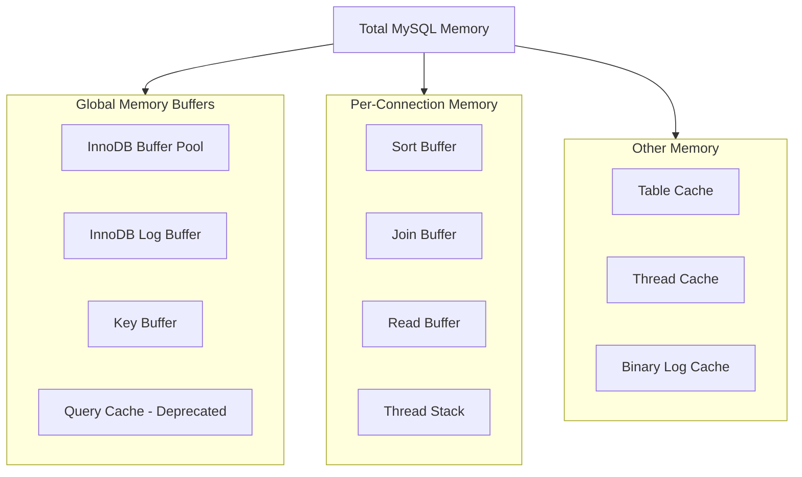
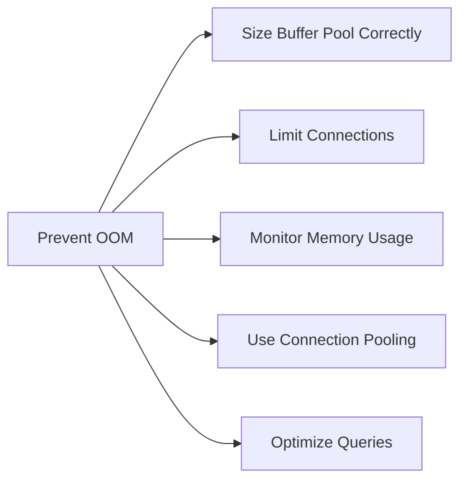

# How to Fix "Out of Memory" Errors in MySQL

Author: [nawazdhandala](https://www.github.com/nawazdhandala)

Tags: MySQL, Memory, OOM, Troubleshooting, Performance, Database Administration

Description: A practical guide to diagnosing and fixing Out of Memory errors in MySQL, including buffer pool tuning, connection management, and memory leak detection.

---

Out of Memory (OOM) errors in MySQL can crash your database server and cause significant downtime. Understanding how MySQL uses memory and how to tune it properly is critical for maintaining stable production systems.

## Understanding MySQL Memory Architecture

MySQL uses memory in several key areas. Knowing these helps you identify where the problem lies.



## Diagnosing OOM Errors

### Check System Logs

```bash
# Check for OOM killer activity on Linux
dmesg | grep -i "out of memory"
dmesg | grep -i "killed process"

# Check MySQL error log
tail -100 /var/log/mysql/error.log | grep -i "memory"

# Check if MySQL was killed by OOM
journalctl -u mysql | grep -i "oom\|killed\|memory"
```

### Monitor Current Memory Usage

```sql
-- Check MySQL memory usage summary
SELECT
    event_name,
    current_alloc AS current_memory,
    high_alloc AS peak_memory
FROM sys.memory_global_by_current_bytes
ORDER BY current_alloc DESC
LIMIT 10;

-- Check total allocated memory
SELECT
    FORMAT_BYTES(SUM(current_alloc)) AS total_allocated
FROM sys.memory_global_by_current_bytes;
```

### Calculate Expected Memory Usage

```sql
-- Calculate theoretical maximum memory usage
SELECT
    (@@innodb_buffer_pool_size / 1024 / 1024) AS buffer_pool_mb,
    (@@innodb_log_buffer_size / 1024 / 1024) AS log_buffer_mb,
    (@@key_buffer_size / 1024 / 1024) AS key_buffer_mb,
    (@@max_connections * (
        @@sort_buffer_size +
        @@join_buffer_size +
        @@read_buffer_size +
        @@read_rnd_buffer_size +
        @@thread_stack
    ) / 1024 / 1024) AS max_per_thread_mb;
```

## Common Causes and Solutions

### 1. Oversized InnoDB Buffer Pool

The buffer pool is typically the largest memory consumer. Setting it too high leaves no room for other operations.

```ini
# my.cnf - Recommended buffer pool sizing
[mysqld]
# For dedicated database server: 70-80% of RAM
# For shared server: 50-60% of RAM
innodb_buffer_pool_size = 8G

# Split buffer pool into multiple instances for better concurrency
# Use 1 instance per GB (up to 64)
innodb_buffer_pool_instances = 8

# Enable buffer pool dump for faster warm-up after restart
innodb_buffer_pool_dump_at_shutdown = ON
innodb_buffer_pool_load_at_startup = ON
```

Monitor buffer pool usage:

```sql
-- Check buffer pool usage
SELECT
    pool_id,
    pool_size AS pages_total,
    free_buffers AS pages_free,
    database_pages AS pages_data,
    ROUND((database_pages / pool_size) * 100, 2) AS usage_percent
FROM information_schema.INNODB_BUFFER_POOL_STATS;
```

### 2. Too Many Connections

Each connection consumes memory. Hundreds of idle connections can exhaust available RAM.

```sql
-- Check current connections
SHOW STATUS LIKE 'Threads_connected';
SHOW STATUS LIKE 'Max_used_connections';

-- Check connection details
SELECT
    user,
    host,
    db,
    command,
    time,
    state
FROM information_schema.processlist
ORDER BY time DESC;
```

Configure connection limits:

```ini
# my.cnf - Connection settings
[mysqld]
# Set maximum connections based on available memory
max_connections = 200

# Thread cache to reduce thread creation overhead
thread_cache_size = 50

# Wait timeout for idle connections (in seconds)
wait_timeout = 300
interactive_timeout = 300
```

### 3. Per-Thread Buffer Issues

Large per-thread buffers multiplied by many connections can cause OOM.

```ini
# my.cnf - Per-thread buffer settings
[mysqld]
# Sort buffer - allocated per query that needs sorting
# Start small, increase only if needed
sort_buffer_size = 2M

# Join buffer - for joins without indexes
join_buffer_size = 2M

# Read buffer - for sequential table scans
read_buffer_size = 1M

# Read random buffer - for random reads after sorting
read_rnd_buffer_size = 1M

# Thread stack size
thread_stack = 256K
```

### 4. Temporary Tables in Memory

Large queries can create huge temporary tables that exhaust memory.

```sql
-- Check temporary table usage
SHOW STATUS LIKE 'Created_tmp%';

-- Identify queries creating large temporary tables
SELECT
    sql_text,
    created_tmp_tables,
    created_tmp_disk_tables
FROM performance_schema.events_statements_summary_by_digest
WHERE created_tmp_tables > 0
ORDER BY created_tmp_disk_tables DESC
LIMIT 10;
```

Configure temporary table limits:

```ini
# my.cnf - Temporary table settings
[mysqld]
# Maximum size for in-memory temporary tables
tmp_table_size = 64M
max_heap_table_size = 64M

# Directory for disk-based temporary tables
tmpdir = /var/lib/mysql/tmp
```

### 5. Memory Leaks in Stored Procedures

Poorly written stored procedures can leak memory.

```sql
-- Check for long-running procedures
SELECT
    processlist_id,
    processlist_user,
    processlist_db,
    processlist_command,
    processlist_time,
    processlist_state
FROM performance_schema.threads
WHERE processlist_command = 'Query'
  AND processlist_time > 300;

-- Kill problematic connections if needed
-- KILL <processlist_id>;
```

## Memory Calculation Formula

Use this script to calculate safe memory settings:

```bash
#!/bin/bash
# MySQL Memory Calculator

# System total RAM in GB
TOTAL_RAM_GB=16

# Reserve for OS and other processes (2-4 GB)
OS_RESERVE_GB=3

# Available for MySQL
AVAILABLE_GB=$((TOTAL_RAM_GB - OS_RESERVE_GB))
AVAILABLE_MB=$((AVAILABLE_GB * 1024))

# Buffer pool (70% of available)
BUFFER_POOL_MB=$((AVAILABLE_MB * 70 / 100))

# Max connections
MAX_CONNECTIONS=200

# Per-thread memory (conservative estimate: 10MB per connection)
PER_THREAD_MB=10
MAX_THREAD_MEMORY=$((MAX_CONNECTIONS * PER_THREAD_MB))

# Other buffers (approximately 500MB)
OTHER_BUFFERS_MB=500

echo "=== MySQL Memory Calculation ==="
echo "Total System RAM: ${TOTAL_RAM_GB}GB"
echo "Reserved for OS: ${OS_RESERVE_GB}GB"
echo "Available for MySQL: ${AVAILABLE_GB}GB"
echo ""
echo "Recommended Settings:"
echo "innodb_buffer_pool_size = ${BUFFER_POOL_MB}M"
echo "max_connections = ${MAX_CONNECTIONS}"
echo "Max per-thread memory = ${MAX_THREAD_MEMORY}MB"
echo ""
echo "Total estimated MySQL usage: $((BUFFER_POOL_MB + MAX_THREAD_MEMORY + OTHER_BUFFERS_MB))MB"
```

## Monitoring and Alerting

### Set Up Memory Monitoring

```sql
-- Create a monitoring event
DELIMITER //
CREATE EVENT IF NOT EXISTS memory_monitor
ON SCHEDULE EVERY 5 MINUTE
DO
BEGIN
    INSERT INTO memory_stats (
        recorded_at,
        total_allocated,
        buffer_pool_pages_data,
        connections
    )
    SELECT
        NOW(),
        (SELECT SUM(current_alloc) FROM sys.memory_global_by_current_bytes),
        (SELECT SUM(database_pages) FROM information_schema.INNODB_BUFFER_POOL_STATS),
        (SELECT VARIABLE_VALUE FROM performance_schema.global_status
         WHERE VARIABLE_NAME = 'Threads_connected');
END //
DELIMITER ;
```

### Linux OOM Killer Configuration

Protect MySQL from the OOM killer:

```bash
# Find MySQL process ID
MYSQL_PID=$(pgrep -x mysqld)

# Reduce OOM score (lower = less likely to be killed)
echo -500 > /proc/$MYSQL_PID/oom_score_adj

# Or in systemd service file
# /etc/systemd/system/mysql.service.d/override.conf
# [Service]
# OOMScoreAdjust=-500
```

## Emergency Recovery Steps

When MySQL crashes due to OOM:

```bash
#!/bin/bash
# Emergency OOM recovery script

# 1. Clear system caches to free memory
sync && echo 3 > /proc/sys/vm/drop_caches

# 2. Reduce buffer pool temporarily
cat >> /etc/mysql/conf.d/emergency.cnf << EOF
[mysqld]
innodb_buffer_pool_size = 2G
max_connections = 50
EOF

# 3. Start MySQL with reduced settings
systemctl start mysql

# 4. Check status
mysql -e "SHOW STATUS LIKE 'Threads_connected';"
mysql -e "SELECT FORMAT_BYTES(SUM(current_alloc)) FROM sys.memory_global_by_current_bytes;"

echo "MySQL started with reduced memory settings"
echo "Remember to remove /etc/mysql/conf.d/emergency.cnf after proper tuning"
```

## Best Practices Summary



1. **Right-size the buffer pool**: Never exceed 80% of available RAM
2. **Use connection pooling**: Implement connection pooling at the application level
3. **Set connection limits**: Configure max_connections based on actual needs
4. **Monitor continuously**: Track memory usage trends and set alerts
5. **Optimize queries**: Reduce temporary table creation with proper indexes
6. **Plan for growth**: Leave headroom for traffic spikes

By following these guidelines and monitoring your MySQL memory usage, you can prevent OOM errors and maintain a stable, high-performance database server.
