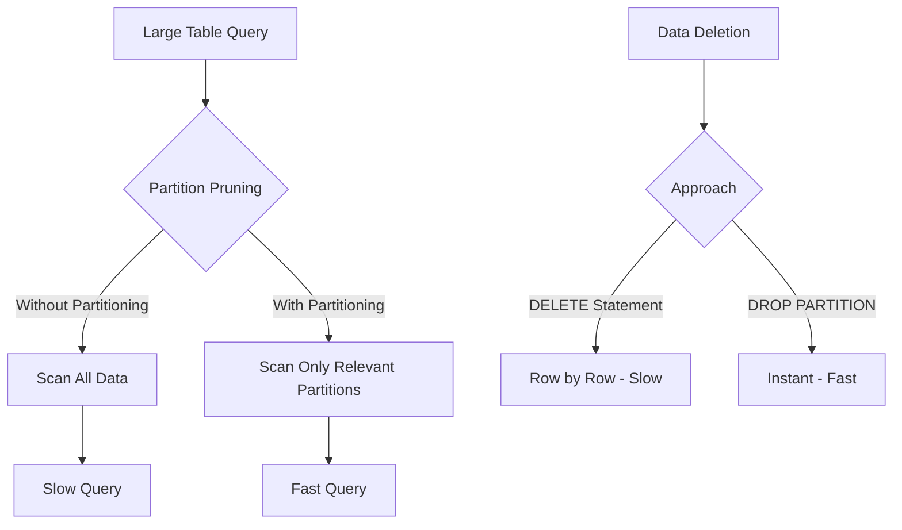

# How to Configure MySQL Partitioning

Author: [nawazdhandala](https://www.github.com/nawazdhandala)

Tags: MySQL, Database, Partitioning, Performance, SQL, Optimization

Description: Learn how to configure MySQL table partitioning for improved query performance, easier data management, and efficient storage with practical examples.

---

Table partitioning splits large tables into smaller, more manageable pieces while maintaining the appearance of a single table. When done right, partitioning dramatically improves query performance and simplifies data lifecycle management. This guide covers the different partitioning strategies and when to use each one.

## When to Use Partitioning

Partitioning makes sense when:

- Tables exceed tens of millions of rows
- Queries frequently filter on a specific column (date, region, status)
- You need to purge old data regularly
- Full table scans are causing performance issues



## Partition Types

MySQL supports four partition types:

| Type | Use Case | Example |
|------|----------|---------|
| RANGE | Time-series data, sequential values | Orders by year/month |
| LIST | Discrete categories | Data by region or status |
| HASH | Even distribution | Load balancing |
| KEY | Similar to HASH, uses MySQL's hashing | When no obvious partition key |

## Range Partitioning

Best for time-series data where queries filter by date ranges.

**Create a range-partitioned table:**

```sql
-- Partition orders by year
CREATE TABLE orders (
    id BIGINT AUTO_INCREMENT,
    customer_id INT NOT NULL,
    order_date DATE NOT NULL,
    total DECIMAL(10,2),
    status VARCHAR(20),
    PRIMARY KEY (id, order_date),  -- Partition key must be in primary key
    INDEX idx_customer (customer_id)
) ENGINE=InnoDB
PARTITION BY RANGE (YEAR(order_date)) (
    PARTITION p2022 VALUES LESS THAN (2023),
    PARTITION p2023 VALUES LESS THAN (2024),
    PARTITION p2024 VALUES LESS THAN (2025),
    PARTITION p2025 VALUES LESS THAN (2026),
    PARTITION p2026 VALUES LESS THAN (2027),
    PARTITION pmax VALUES LESS THAN MAXVALUE
);
```

**Range partitioning by month for finer granularity:**

```sql
-- Partition by month using TO_DAYS function
CREATE TABLE events (
    id BIGINT AUTO_INCREMENT,
    event_type VARCHAR(50),
    event_date DATE NOT NULL,
    payload JSON,
    PRIMARY KEY (id, event_date)
) ENGINE=InnoDB
PARTITION BY RANGE (TO_DAYS(event_date)) (
    PARTITION p202401 VALUES LESS THAN (TO_DAYS('2024-02-01')),
    PARTITION p202402 VALUES LESS THAN (TO_DAYS('2024-03-01')),
    PARTITION p202403 VALUES LESS THAN (TO_DAYS('2024-04-01')),
    -- Add more partitions as needed
    PARTITION pmax VALUES LESS THAN MAXVALUE
);
```

## List Partitioning

Best for data that falls into discrete categories.

```sql
-- Partition by geographic region
CREATE TABLE customers (
    id INT AUTO_INCREMENT,
    name VARCHAR(100),
    email VARCHAR(255),
    region VARCHAR(20) NOT NULL,
    created_at DATETIME,
    PRIMARY KEY (id, region)
) ENGINE=InnoDB
PARTITION BY LIST COLUMNS (region) (
    PARTITION p_north_america VALUES IN ('US', 'CA', 'MX'),
    PARTITION p_europe VALUES IN ('UK', 'DE', 'FR', 'IT', 'ES'),
    PARTITION p_asia VALUES IN ('JP', 'CN', 'KR', 'IN', 'SG'),
    PARTITION p_other VALUES IN ('AU', 'BR', 'ZA')
);
```

**Partition by status for workflow tables:**

```sql
-- Partition tickets by status
CREATE TABLE support_tickets (
    id BIGINT AUTO_INCREMENT,
    subject VARCHAR(255),
    status TINYINT NOT NULL,  -- 1=open, 2=in_progress, 3=resolved, 4=closed
    created_at DATETIME,
    PRIMARY KEY (id, status)
) ENGINE=InnoDB
PARTITION BY LIST (status) (
    PARTITION p_active VALUES IN (1, 2),    -- Open and in-progress
    PARTITION p_resolved VALUES IN (3),      -- Resolved
    PARTITION p_closed VALUES IN (4)         -- Closed/archived
);
```

## Hash Partitioning

Distributes data evenly across partitions. Useful when there is no natural range or list to partition by.

```sql
-- Distribute user data across 8 partitions
CREATE TABLE user_sessions (
    id BIGINT AUTO_INCREMENT,
    user_id INT NOT NULL,
    session_token VARCHAR(255),
    created_at DATETIME,
    expires_at DATETIME,
    PRIMARY KEY (id, user_id)
) ENGINE=InnoDB
PARTITION BY HASH (user_id)
PARTITIONS 8;
```

**Linear hash for easier partition management:**

```sql
-- Linear hash allows adding/removing partitions more efficiently
CREATE TABLE cache_entries (
    cache_key VARCHAR(255) NOT NULL,
    cache_value MEDIUMBLOB,
    expires_at DATETIME,
    PRIMARY KEY (cache_key)
) ENGINE=InnoDB
PARTITION BY LINEAR KEY (cache_key)
PARTITIONS 16;
```

## Managing Partitions

**Add new partitions:**

```sql
-- Add partition for 2027
ALTER TABLE orders
ADD PARTITION (PARTITION p2027 VALUES LESS THAN (2028));

-- For tables with MAXVALUE, reorganize instead
ALTER TABLE orders
REORGANIZE PARTITION pmax INTO (
    PARTITION p2027 VALUES LESS THAN (2028),
    PARTITION pmax VALUES LESS THAN MAXVALUE
);
```

**Drop old partitions (instant data deletion):**

```sql
-- Remove all 2022 data instantly
ALTER TABLE orders DROP PARTITION p2022;
```

**Merge partitions:**

```sql
-- Combine old partitions
ALTER TABLE orders
REORGANIZE PARTITION p2022, p2023 INTO (
    PARTITION p_archive VALUES LESS THAN (2024)
);
```

**Check partition information:**

```sql
-- View partition details
SELECT
    PARTITION_NAME,
    PARTITION_METHOD,
    PARTITION_EXPRESSION,
    PARTITION_DESCRIPTION,
    TABLE_ROWS,
    AVG_ROW_LENGTH,
    DATA_LENGTH
FROM INFORMATION_SCHEMA.PARTITIONS
WHERE TABLE_SCHEMA = 'your_database'
  AND TABLE_NAME = 'orders';
```

## Partition Pruning

Partition pruning is where the performance gains come from. MySQL only scans relevant partitions when queries include the partition key.

**Verify partition pruning with EXPLAIN:**

```sql
-- This query will only scan p2024 partition
EXPLAIN SELECT * FROM orders
WHERE order_date BETWEEN '2024-01-01' AND '2024-12-31';

-- Check the partitions column in output
-- +----+-------------+--------+------------+------+...+----------+
-- | id | select_type | table  | partitions | type |...| rows     |
-- +----+-------------+--------+------------+------+...+----------+
-- |  1 | SIMPLE      | orders | p2024      | ALL  |...| 1000000  |
-- +----+-------------+--------+------------+------+...+----------+
```

**Queries that enable pruning:**

```sql
-- Good: Direct comparison on partition key
SELECT * FROM orders WHERE order_date = '2024-06-15';

-- Good: Range on partition key
SELECT * FROM orders WHERE order_date >= '2024-01-01' AND order_date < '2024-07-01';

-- Good: IN list on partition key
SELECT * FROM orders WHERE YEAR(order_date) IN (2024, 2025);
```

**Queries that prevent pruning:**

```sql
-- Bad: Function on column (unless it matches partition expression)
SELECT * FROM orders WHERE DATE_FORMAT(order_date, '%Y') = '2024';

-- Bad: OR with non-partition column
SELECT * FROM orders WHERE order_date = '2024-06-15' OR customer_id = 100;
```

## Subpartitioning

Combine two partitioning strategies for complex scenarios.

```sql
-- Range partition by year, hash subpartition by customer
CREATE TABLE order_items (
    id BIGINT AUTO_INCREMENT,
    order_id BIGINT NOT NULL,
    customer_id INT NOT NULL,
    product_id INT,
    quantity INT,
    order_date DATE NOT NULL,
    PRIMARY KEY (id, order_date, customer_id)
) ENGINE=InnoDB
PARTITION BY RANGE (YEAR(order_date))
SUBPARTITION BY HASH (customer_id)
SUBPARTITIONS 4 (
    PARTITION p2024 VALUES LESS THAN (2025),
    PARTITION p2025 VALUES LESS THAN (2026),
    PARTITION p2026 VALUES LESS THAN (2027),
    PARTITION pmax VALUES LESS THAN MAXVALUE
);
```

## Converting Existing Tables

**Add partitioning to an existing table:**

```sql
-- Step 1: Ensure partition key is in primary key
ALTER TABLE orders DROP PRIMARY KEY, ADD PRIMARY KEY (id, order_date);

-- Step 2: Add partitioning
ALTER TABLE orders
PARTITION BY RANGE (YEAR(order_date)) (
    PARTITION p2023 VALUES LESS THAN (2024),
    PARTITION p2024 VALUES LESS THAN (2025),
    PARTITION p2025 VALUES LESS THAN (2026),
    PARTITION pmax VALUES LESS THAN MAXVALUE
);
```

**Remove partitioning:**

```sql
-- Remove partitioning while keeping data
ALTER TABLE orders REMOVE PARTITIONING;
```

## Automated Partition Maintenance

Create a stored procedure to manage partitions automatically:

```sql
DELIMITER //

CREATE PROCEDURE maintain_order_partitions()
BEGIN
    DECLARE next_year INT;
    DECLARE partition_name VARCHAR(20);
    DECLARE partition_exists INT;

    -- Calculate next year
    SET next_year = YEAR(CURDATE()) + 1;
    SET partition_name = CONCAT('p', next_year);

    -- Check if partition exists
    SELECT COUNT(*) INTO partition_exists
    FROM INFORMATION_SCHEMA.PARTITIONS
    WHERE TABLE_SCHEMA = DATABASE()
      AND TABLE_NAME = 'orders'
      AND PARTITION_NAME = partition_name;

    -- Create if not exists
    IF partition_exists = 0 THEN
        SET @sql = CONCAT(
            'ALTER TABLE orders REORGANIZE PARTITION pmax INTO (',
            'PARTITION ', partition_name, ' VALUES LESS THAN (', next_year + 1, '),',
            'PARTITION pmax VALUES LESS THAN MAXVALUE)'
        );
        PREPARE stmt FROM @sql;
        EXECUTE stmt;
        DEALLOCATE PREPARE stmt;
    END IF;

    -- Optionally drop old partitions (older than 5 years)
    -- ALTER TABLE orders DROP PARTITION p2019;
END //

DELIMITER ;

-- Schedule with MySQL Event Scheduler
CREATE EVENT maintain_partitions
ON SCHEDULE EVERY 1 MONTH
STARTS '2024-01-01 00:00:00'
DO CALL maintain_order_partitions();
```

## Common Pitfalls

1. **Partition key not in primary key** - MySQL requires the partition column to be part of all unique keys
2. **Too many partitions** - Stick to fewer than 100 partitions per table
3. **Foreign keys** - Partitioned tables cannot have foreign key constraints
4. **Wrong partition type** - Use RANGE for time data, not HASH
5. **Forgetting MAXVALUE** - Always include a catchall partition

Partitioning is a powerful tool when used correctly. Start with RANGE partitioning on date columns for time-series data, and monitor query plans to verify partition pruning is working. The biggest wins come from instant partition drops for data lifecycle management and reduced scan sizes for analytical queries.
