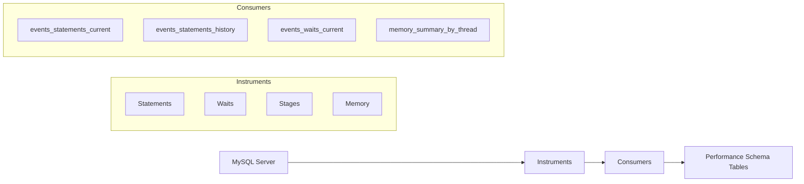
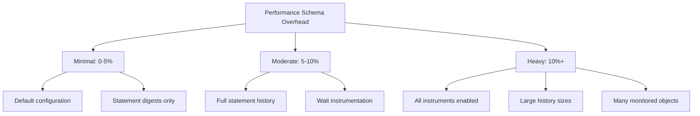

# How to Configure MySQL Performance Schema

Author: [nawazdhandala](https://www.github.com/nawazdhandala)

Tags: MySQL, Performance, Monitoring, Database, Optimization, DevOps

Description: Learn how to configure and use MySQL Performance Schema to identify slow queries, lock contention, and resource bottlenecks.

---

MySQL Performance Schema is a built-in diagnostic tool that provides detailed instrumentation for server events. Unlike the slow query log which only shows completed queries, Performance Schema captures real-time execution details, memory usage, lock waits, and connection statistics. This guide covers practical configuration and usage for production debugging.

## Understanding Performance Schema Architecture

Performance Schema collects data through instrumentation points embedded in MySQL source code. Events flow through consumers that store data in memory-based tables.



## Enabling Performance Schema

Performance Schema is enabled by default in MySQL 5.6+, but many instruments are disabled to minimize overhead. Check your current configuration.

```sql
-- Check if Performance Schema is enabled
SHOW VARIABLES LIKE 'performance_schema';

-- View current memory usage
SELECT * FROM performance_schema.memory_summary_global_by_event_name
WHERE EVENT_NAME LIKE 'memory/performance_schema/%'
ORDER BY CURRENT_NUMBER_OF_BYTES_USED DESC
LIMIT 10;

-- Check what percentage of the server memory PS uses
SELECT
    FORMAT(SUM(CURRENT_NUMBER_OF_BYTES_USED)/1024/1024, 2) AS MB_used
FROM performance_schema.memory_summary_global_by_event_name
WHERE EVENT_NAME LIKE 'memory/performance_schema/%';
```

Enable Performance Schema in your MySQL configuration file for persistent settings.

```ini
# my.cnf configuration
[mysqld]
performance_schema = ON

# Increase history sizes for better analysis
performance_schema_events_statements_history_size = 20
performance_schema_events_statements_history_long_size = 10000

# Enable digest statistics (query fingerprints)
performance_schema_digests_size = 10000

# Memory instrument sizing
performance_schema_max_memory_classes = 320
```

## Configuring Instruments and Consumers

Instruments collect data; consumers store it. Enable only what you need to minimize overhead.

```sql
-- View all available instruments
SELECT NAME, ENABLED, TIMED
FROM performance_schema.setup_instruments
WHERE NAME LIKE 'statement/%'
LIMIT 20;

-- Enable statement instrumentation
UPDATE performance_schema.setup_instruments
SET ENABLED = 'YES', TIMED = 'YES'
WHERE NAME LIKE 'statement/%';

-- Enable wait instrumentation for lock analysis
UPDATE performance_schema.setup_instruments
SET ENABLED = 'YES', TIMED = 'YES'
WHERE NAME LIKE 'wait/lock/%';

-- Enable memory instrumentation
UPDATE performance_schema.setup_instruments
SET ENABLED = 'YES'
WHERE NAME LIKE 'memory/%';

-- View consumers and their status
SELECT * FROM performance_schema.setup_consumers;

-- Enable statement history tables
UPDATE performance_schema.setup_consumers
SET ENABLED = 'YES'
WHERE NAME LIKE 'events_statements_%';

-- Enable wait event tables
UPDATE performance_schema.setup_consumers
SET ENABLED = 'YES'
WHERE NAME LIKE 'events_waits_%';
```

## Finding Slow Queries

The `events_statements_summary_by_digest` table aggregates queries by their normalized form (digest), making it easy to find problematic query patterns.

```sql
-- Top 10 queries by total execution time
SELECT
    DIGEST_TEXT,
    COUNT_STAR AS exec_count,
    ROUND(SUM_TIMER_WAIT/1000000000000, 3) AS total_time_sec,
    ROUND(AVG_TIMER_WAIT/1000000000000, 3) AS avg_time_sec,
    ROUND(MAX_TIMER_WAIT/1000000000000, 3) AS max_time_sec,
    SUM_ROWS_EXAMINED,
    SUM_ROWS_SENT,
    ROUND(SUM_ROWS_EXAMINED/NULLIF(SUM_ROWS_SENT,0), 0) AS rows_examined_per_row_sent
FROM performance_schema.events_statements_summary_by_digest
WHERE SCHEMA_NAME = 'your_database'
ORDER BY SUM_TIMER_WAIT DESC
LIMIT 10;

-- Queries with poor index usage (examining many rows but returning few)
SELECT
    DIGEST_TEXT,
    COUNT_STAR,
    SUM_ROWS_EXAMINED,
    SUM_ROWS_SENT,
    ROUND(SUM_ROWS_EXAMINED/NULLIF(SUM_ROWS_SENT,0), 0) AS efficiency_ratio
FROM performance_schema.events_statements_summary_by_digest
WHERE SUM_ROWS_EXAMINED > 1000
AND SUM_ROWS_SENT > 0
ORDER BY SUM_ROWS_EXAMINED/SUM_ROWS_SENT DESC
LIMIT 10;

-- Find queries doing full table scans
SELECT
    DIGEST_TEXT,
    COUNT_STAR,
    SUM_NO_INDEX_USED,
    SUM_NO_GOOD_INDEX_USED
FROM performance_schema.events_statements_summary_by_digest
WHERE SUM_NO_INDEX_USED > 0 OR SUM_NO_GOOD_INDEX_USED > 0
ORDER BY SUM_NO_INDEX_USED DESC
LIMIT 10;
```

## Analyzing Currently Running Queries

```sql
-- View currently executing statements
SELECT
    THREAD_ID,
    EVENT_ID,
    SQL_TEXT,
    ROUND(TIMER_WAIT/1000000000000, 3) AS duration_sec,
    ROWS_EXAMINED,
    ROWS_SENT,
    STATE
FROM performance_schema.events_statements_current
WHERE SQL_TEXT IS NOT NULL
ORDER BY TIMER_WAIT DESC;

-- Match threads to connection IDs
SELECT
    t.THREAD_ID,
    t.PROCESSLIST_ID,
    t.PROCESSLIST_USER,
    t.PROCESSLIST_HOST,
    t.PROCESSLIST_DB,
    s.SQL_TEXT,
    ROUND(s.TIMER_WAIT/1000000000000, 3) AS duration_sec
FROM performance_schema.threads t
JOIN performance_schema.events_statements_current s
    ON t.THREAD_ID = s.THREAD_ID
WHERE t.PROCESSLIST_ID IS NOT NULL
AND s.SQL_TEXT IS NOT NULL;
```

## Identifying Lock Contention

Lock waits are a common cause of slow applications. Performance Schema shows exactly who is waiting for what.

```sql
-- View current lock waits
SELECT
    r.trx_id AS waiting_trx_id,
    r.trx_mysql_thread_id AS waiting_thread,
    r.trx_query AS waiting_query,
    b.trx_id AS blocking_trx_id,
    b.trx_mysql_thread_id AS blocking_thread,
    b.trx_query AS blocking_query
FROM information_schema.innodb_lock_waits w
JOIN information_schema.innodb_trx b ON b.trx_id = w.blocking_trx_id
JOIN information_schema.innodb_trx r ON r.trx_id = w.requesting_trx_id;

-- Aggregate lock wait statistics
SELECT
    OBJECT_SCHEMA,
    OBJECT_NAME,
    COUNT_STAR AS wait_count,
    ROUND(SUM_TIMER_WAIT/1000000000000, 3) AS total_wait_sec
FROM performance_schema.table_lock_waits_summary_by_table
WHERE COUNT_STAR > 0
ORDER BY SUM_TIMER_WAIT DESC
LIMIT 10;

-- Find the most contended row locks
SELECT
    OBJECT_SCHEMA,
    OBJECT_NAME,
    INDEX_NAME,
    COUNT_STAR,
    ROUND(SUM_TIMER_WAIT/1000000000000, 3) AS total_wait_sec
FROM performance_schema.table_io_waits_summary_by_index_usage
WHERE INDEX_NAME IS NOT NULL
ORDER BY SUM_TIMER_WAIT DESC
LIMIT 10;
```

## Memory Usage Analysis

Track which components consume the most memory.

```sql
-- Memory usage by component
SELECT
    SUBSTRING_INDEX(EVENT_NAME, '/', 2) AS category,
    ROUND(SUM(CURRENT_NUMBER_OF_BYTES_USED)/1024/1024, 2) AS current_mb,
    ROUND(SUM(HIGH_NUMBER_OF_BYTES_USED)/1024/1024, 2) AS high_water_mb
FROM performance_schema.memory_summary_global_by_event_name
GROUP BY category
ORDER BY SUM(CURRENT_NUMBER_OF_BYTES_USED) DESC
LIMIT 15;

-- Memory by thread (find memory-hungry connections)
SELECT
    t.PROCESSLIST_USER,
    t.PROCESSLIST_HOST,
    t.PROCESSLIST_DB,
    ROUND(SUM(m.CURRENT_NUMBER_OF_BYTES_USED)/1024/1024, 2) AS current_mb
FROM performance_schema.memory_summary_by_thread_by_event_name m
JOIN performance_schema.threads t ON m.THREAD_ID = t.THREAD_ID
WHERE t.PROCESSLIST_ID IS NOT NULL
GROUP BY t.THREAD_ID
ORDER BY SUM(m.CURRENT_NUMBER_OF_BYTES_USED) DESC
LIMIT 10;

-- Track specific memory allocations
SELECT
    EVENT_NAME,
    CURRENT_COUNT_USED,
    ROUND(CURRENT_NUMBER_OF_BYTES_USED/1024/1024, 2) AS current_mb,
    ROUND(HIGH_NUMBER_OF_BYTES_USED/1024/1024, 2) AS high_mb
FROM performance_schema.memory_summary_global_by_event_name
WHERE EVENT_NAME LIKE 'memory/innodb/%'
ORDER BY CURRENT_NUMBER_OF_BYTES_USED DESC
LIMIT 10;
```

## Connection and Thread Analysis

```sql
-- Connection statistics by user
SELECT
    USER,
    HOST,
    CURRENT_CONNECTIONS,
    TOTAL_CONNECTIONS
FROM performance_schema.hosts
ORDER BY TOTAL_CONNECTIONS DESC;

-- Thread statistics
SELECT
    TYPE,
    PROCESSLIST_USER,
    PROCESSLIST_COMMAND,
    PROCESSLIST_STATE,
    COUNT(*) AS thread_count
FROM performance_schema.threads
GROUP BY TYPE, PROCESSLIST_USER, PROCESSLIST_COMMAND, PROCESSLIST_STATE
ORDER BY thread_count DESC;

-- Long-running transactions
SELECT
    t.THREAD_ID,
    t.PROCESSLIST_USER,
    t.PROCESSLIST_HOST,
    ROUND((UNIX_TIMESTAMP() - UNIX_TIMESTAMP(trx.trx_started)), 0) AS duration_sec,
    trx.trx_state,
    trx.trx_query
FROM information_schema.innodb_trx trx
JOIN performance_schema.threads t
    ON t.PROCESSLIST_ID = trx.trx_mysql_thread_id
ORDER BY duration_sec DESC;
```

## Creating Custom Monitoring Views

Build views for dashboards and alerts.

```sql
-- Create a view for query performance monitoring
CREATE VIEW query_performance_summary AS
SELECT
    DIGEST_TEXT,
    SCHEMA_NAME,
    COUNT_STAR AS executions,
    ROUND(SUM_TIMER_WAIT/1000000000000, 4) AS total_seconds,
    ROUND(AVG_TIMER_WAIT/1000000000, 2) AS avg_ms,
    ROUND(MAX_TIMER_WAIT/1000000000, 2) AS max_ms,
    SUM_ROWS_EXAMINED AS rows_examined,
    SUM_ROWS_SENT AS rows_returned,
    FIRST_SEEN,
    LAST_SEEN
FROM performance_schema.events_statements_summary_by_digest
WHERE DIGEST_TEXT IS NOT NULL
AND COUNT_STAR > 0;

-- Create alerting thresholds
SELECT
    DIGEST_TEXT,
    executions,
    avg_ms,
    max_ms,
    CASE
        WHEN avg_ms > 1000 THEN 'CRITICAL'
        WHEN avg_ms > 100 THEN 'WARNING'
        ELSE 'OK'
    END AS status
FROM query_performance_summary
WHERE avg_ms > 100
ORDER BY avg_ms DESC;
```

## Resetting Statistics

Clear accumulated data when starting a new analysis period.

```sql
-- Reset statement statistics
TRUNCATE performance_schema.events_statements_summary_by_digest;

-- Reset all table IO statistics
TRUNCATE performance_schema.table_io_waits_summary_by_table;

-- Reset connection statistics
TRUNCATE performance_schema.hosts;

-- Reset all Performance Schema tables (use with caution)
CALL sys.ps_truncate_all_tables(FALSE);
```

## Performance Overhead



## Best Practices

| Setting | Recommendation | Reason |
|---------|---------------|--------|
| Statement digests | Always enable | Low overhead, high value |
| Wait instrumentation | Enable for debugging | Moderate overhead |
| Memory instrumentation | Enable selectively | Helps find leaks |
| History sizes | Keep small in production | Memory consumption |
| Stage instrumentation | Disable unless needed | Higher overhead |

## Summary

Performance Schema provides deep visibility into MySQL internals that the slow query log cannot match. Start with statement digest analysis to find slow queries, then enable wait and lock instrumentation when debugging contention. Keep history sizes reasonable in production to control memory usage.

For ongoing monitoring, combine Performance Schema with the sys schema which provides human-readable views of Performance Schema data. Export key metrics to your monitoring system for alerting on query performance degradation and lock contention.
