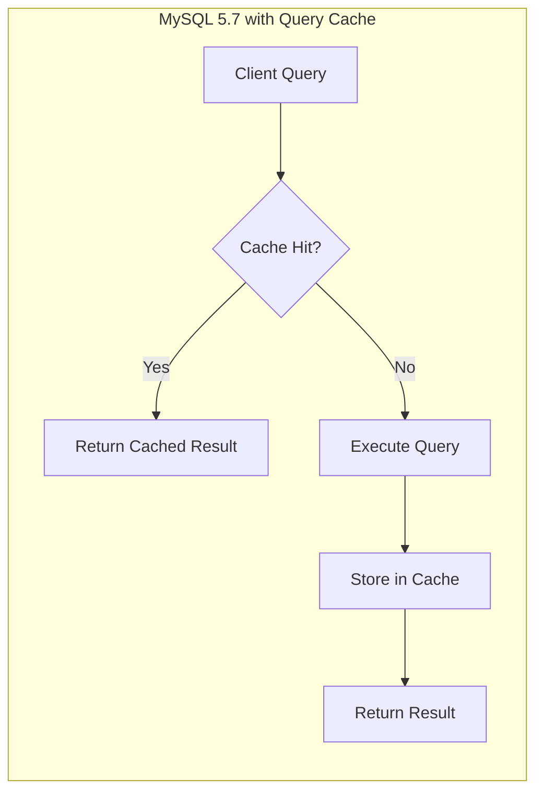
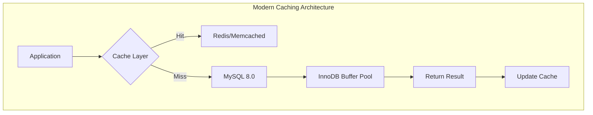

# How to Configure MySQL Query Cache (Deprecated)

Author: [nawazdhandala](https://www.github.com/nawazdhandala)

Tags: MySQL, Query Cache, Performance, Database, Legacy, Migration

Description: A comprehensive guide to understanding the deprecated MySQL Query Cache, why it was removed in MySQL 8.0, and modern alternatives for query optimization.

---

The MySQL Query Cache was once a popular feature for improving read performance. However, it was deprecated in MySQL 5.7.20 and completely removed in MySQL 8.0. If you are maintaining legacy systems or migrating to newer versions, understanding this feature and its alternatives is essential.

## What Was the Query Cache?

The Query Cache stored the text of SELECT statements along with their results. When an identical query was received, MySQL would return the cached result instead of re-executing the query.



## Why Was Query Cache Deprecated?

MySQL removed the Query Cache for several important reasons:

1. **Scalability Issues**: The Query Cache used a global mutex, causing severe contention on multi-core systems
2. **Cache Invalidation Overhead**: Any write to a table invalidated all cached queries for that table
3. **Memory Fragmentation**: The cache suffered from fragmentation over time
4. **Limited Benefit**: Modern storage engines and operating system caches provide better alternatives

## Configuring Query Cache in MySQL 5.7 (Legacy)

If you are still running MySQL 5.7 and need to configure the Query Cache, here are the relevant settings.

### Check Current Status

```sql
-- Check if query cache is available and enabled
SHOW VARIABLES LIKE 'query_cache%';

-- Expected output for enabled cache:
-- query_cache_type: ON
-- query_cache_size: 16777216
-- query_cache_limit: 1048576
```

### Enable Query Cache

```ini
# my.cnf configuration for MySQL 5.7
[mysqld]
# Enable query cache
query_cache_type = 1

# Set cache size (in bytes) - 64MB example
query_cache_size = 67108864

# Maximum size for individual query results (1MB)
query_cache_limit = 1048576

# Minimum allocation block size
query_cache_min_res_unit = 4096
```

### Query Cache Types

```sql
-- Type 0: OFF - Query cache disabled
SET GLOBAL query_cache_type = 0;

-- Type 1: ON - Cache all cacheable queries
SET GLOBAL query_cache_type = 1;

-- Type 2: DEMAND - Cache only queries with SQL_CACHE hint
SET GLOBAL query_cache_type = 2;
```

### Using SQL_CACHE and SQL_NO_CACHE Hints

```sql
-- Force caching (when query_cache_type = 2)
SELECT SQL_CACHE * FROM users WHERE status = 'active';

-- Prevent caching for specific query
SELECT SQL_NO_CACHE * FROM transactions WHERE date = CURDATE();
```

### Monitor Query Cache Performance

```sql
-- Check cache hit ratio
SHOW STATUS LIKE 'Qcache%';

-- Key metrics to monitor:
-- Qcache_hits: Number of cache hits
-- Qcache_inserts: Number of queries added to cache
-- Qcache_lowmem_prunes: Queries removed due to low memory
-- Qcache_not_cached: Number of non-cached queries
```

Calculate the hit ratio:

```sql
-- Calculate query cache hit ratio
SELECT
    (Qcache_hits / (Qcache_hits + Com_select)) * 100 AS hit_ratio
FROM (
    SELECT
        VARIABLE_VALUE AS Qcache_hits
    FROM information_schema.GLOBAL_STATUS
    WHERE VARIABLE_NAME = 'Qcache_hits'
) hits,
(
    SELECT
        VARIABLE_VALUE AS Com_select
    FROM information_schema.GLOBAL_STATUS
    WHERE VARIABLE_NAME = 'Com_select'
) selects;
```

## Migration Path to MySQL 8.0

When upgrading to MySQL 8.0, you must remove all Query Cache related configuration options, or MySQL will fail to start.

### Remove These Settings Before Upgrade

```ini
# Remove these from my.cnf before upgrading to MySQL 8.0
# query_cache_type = 1       # REMOVE
# query_cache_size = 67108864 # REMOVE
# query_cache_limit = 1048576 # REMOVE
# query_cache_min_res_unit = 4096 # REMOVE
```

### Pre-Upgrade Checklist

```bash
#!/bin/bash
# Check for query cache settings before MySQL 8.0 upgrade

CONFIG_FILE="/etc/mysql/my.cnf"

echo "Checking for deprecated query cache settings..."

if grep -i "query_cache" "$CONFIG_FILE"; then
    echo "WARNING: Found query cache settings that must be removed:"
    grep -i "query_cache" "$CONFIG_FILE"
    echo ""
    echo "Remove these settings before upgrading to MySQL 8.0"
else
    echo "No query cache settings found. Safe to upgrade."
fi
```

## Modern Alternatives to Query Cache



### 1. InnoDB Buffer Pool Optimization

The InnoDB Buffer Pool is more effective than the Query Cache for most workloads.

```sql
-- Check current buffer pool size
SHOW VARIABLES LIKE 'innodb_buffer_pool_size';

-- Recommended: 70-80% of available RAM for dedicated DB servers
-- Set in my.cnf:
-- innodb_buffer_pool_size = 8G

-- Monitor buffer pool efficiency
SELECT
    (1 - (Innodb_buffer_pool_reads / Innodb_buffer_pool_read_requests)) * 100
    AS buffer_pool_hit_ratio
FROM (
    SELECT VARIABLE_VALUE AS Innodb_buffer_pool_reads
    FROM information_schema.GLOBAL_STATUS
    WHERE VARIABLE_NAME = 'Innodb_buffer_pool_reads'
) reads,
(
    SELECT VARIABLE_VALUE AS Innodb_buffer_pool_read_requests
    FROM information_schema.GLOBAL_STATUS
    WHERE VARIABLE_NAME = 'Innodb_buffer_pool_read_requests'
) requests;
```

### 2. Application-Level Caching with Redis

```python
import redis
import mysql.connector
import json
import hashlib

class CachedQuery:
    def __init__(self):
        self.redis = redis.Redis(host='localhost', port=6379, db=0)
        self.mysql = mysql.connector.connect(
            host='localhost',
            user='app_user',
            password='password',
            database='myapp'
        )

    def execute(self, query, params=None, ttl=300):
        # Generate cache key from query and params
        cache_key = self._generate_key(query, params)

        # Check cache first
        cached = self.redis.get(cache_key)
        if cached:
            return json.loads(cached)

        # Execute query if not cached
        cursor = self.mysql.cursor(dictionary=True)
        cursor.execute(query, params)
        result = cursor.fetchall()

        # Store in cache with TTL
        self.redis.setex(cache_key, ttl, json.dumps(result))

        return result

    def invalidate(self, pattern):
        # Invalidate cache entries matching pattern
        for key in self.redis.scan_iter(f"query:{pattern}*"):
            self.redis.delete(key)

    def _generate_key(self, query, params):
        data = f"{query}:{params}"
        return f"query:{hashlib.md5(data.encode()).hexdigest()}"

# Usage example
cache = CachedQuery()
users = cache.execute(
    "SELECT * FROM users WHERE status = %s",
    ('active',),
    ttl=600  # Cache for 10 minutes
)
```

### 3. ProxySQL Query Caching

ProxySQL provides intelligent query caching without the limitations of MySQL's built-in cache.

```sql
-- Configure ProxySQL query cache rules
INSERT INTO mysql_query_rules (
    rule_id, active, match_pattern, cache_ttl, apply
) VALUES (
    100, 1, '^SELECT .* FROM users WHERE', 60000, 1
);

-- Reload rules
LOAD MYSQL QUERY RULES TO RUNTIME;
SAVE MYSQL QUERY RULES TO DISK;

-- Monitor cache performance
SELECT * FROM stats_mysql_query_cache;
```

### 4. MySQL 8.0 Performance Improvements

MySQL 8.0 includes many optimizations that reduce the need for query caching:

```sql
-- Enable hash joins for better performance
SET optimizer_switch = 'hash_join=on';

-- Use invisible indexes for testing
ALTER TABLE users ADD INDEX idx_status (status) INVISIBLE;

-- Analyze query performance
EXPLAIN ANALYZE SELECT * FROM users WHERE status = 'active';
```

## Best Practices for Post-Query-Cache Era

1. **Optimize Your Queries**: Focus on proper indexing and query structure
2. **Use Connection Pooling**: Reduce connection overhead
3. **Implement Read Replicas**: Distribute read load across multiple servers
4. **Application Caching**: Use Redis or Memcached for frequently accessed data
5. **Monitor Buffer Pool**: Ensure your InnoDB buffer pool is properly sized

```sql
-- Create indexes based on query patterns
CREATE INDEX idx_users_status_created ON users(status, created_at);

-- Use covering indexes
CREATE INDEX idx_users_covering ON users(status, email, name);

-- Analyze index usage
SELECT
    table_name,
    index_name,
    stat_value AS pages_read
FROM mysql.innodb_index_stats
WHERE stat_name = 'n_leaf_pages'
ORDER BY stat_value DESC
LIMIT 10;
```

## Summary

The MySQL Query Cache served its purpose in earlier versions but became a bottleneck in modern multi-threaded environments. When migrating to MySQL 8.0, remove all query cache configuration and implement application-level caching with Redis or Memcached. Focus on InnoDB buffer pool optimization and proper indexing for the best performance in contemporary MySQL deployments.
