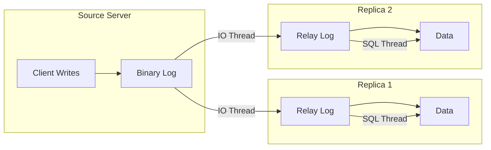
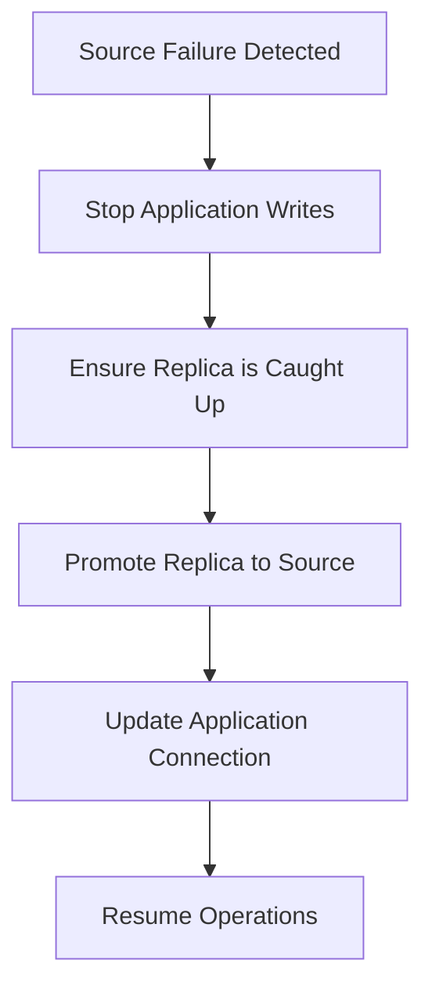

# How to Configure MySQL Replication

Author: [nawazdhandala](https://github.com/nawazdhandala)

Tags: MySQL, Database, Replication, High Availability, DevOps, Disaster Recovery

Description: Learn how to set up MySQL replication including source-replica configuration, GTID-based replication, monitoring replication lag, and handling failover scenarios.

---

MySQL replication copies data from a source server to one or more replica servers. This provides high availability, read scaling, and disaster recovery capabilities. This guide covers setting up replication from scratch, monitoring its health, and handling common issues.

## Replication Architecture

MySQL replication works by having the source server write changes to a binary log, which replicas read and apply to their own data.



## Prerequisites

Before setting up replication, ensure both servers can communicate and have consistent MySQL versions.

```bash
# Check MySQL version on both servers
mysql --version

# Ensure source and replica can communicate on port 3306
# From replica server:
telnet source-server 3306

# Or using nc
nc -zv source-server 3306
```

## Setting Up the Source Server

### Configure Binary Logging

Edit the source server's MySQL configuration to enable binary logging.

```ini
# /etc/mysql/mysql.conf.d/mysqld.cnf on source server

[mysqld]
# Unique server ID (must be different on each server)
server-id = 1

# Enable binary logging
log_bin = /var/log/mysql/mysql-bin.log

# Recommended: Use row-based replication for consistency
binlog_format = ROW

# How long to keep binary logs (days)
expire_logs_days = 7

# Sync binary log to disk after each write for durability
sync_binlog = 1

# For GTID-based replication (recommended for MySQL 5.6+)
gtid_mode = ON
enforce_gtid_consistency = ON

# Which databases to replicate (optional, omit to replicate all)
# binlog_do_db = mydb
# binlog_ignore_db = mysql
```

Restart MySQL after configuration changes:

```bash
sudo systemctl restart mysql
```

### Create Replication User

Create a dedicated user for replication with minimal required privileges.

```sql
-- Connect to source server
mysql -u root -p

-- Create replication user
-- Use a strong password and restrict to replica IP if possible
CREATE USER 'repl_user'@'replica-server-ip'
IDENTIFIED BY 'secure_replication_password';

-- Grant replication privileges
GRANT REPLICATION SLAVE ON *.* TO 'repl_user'@'replica-server-ip';

-- For GTID replication, also grant:
GRANT REPLICATION CLIENT ON *.* TO 'repl_user'@'replica-server-ip';

FLUSH PRIVILEGES;

-- Verify the user was created
SELECT User, Host FROM mysql.user WHERE User = 'repl_user';
```

### Get Source Position (Non-GTID Method)

If not using GTID, you need to record the binary log position.

```sql
-- Lock tables to get consistent position
FLUSH TABLES WITH READ LOCK;

-- Get current binary log position
SHOW MASTER STATUS;
-- Note the File and Position values:
-- +------------------+----------+
-- | File             | Position |
-- +------------------+----------+
-- | mysql-bin.000003 | 154      |
-- +------------------+----------+

-- Keep this session open and take a backup in another terminal
-- Then release the lock
UNLOCK TABLES;
```

### Take Initial Backup

Export the data to transfer to the replica.

```bash
# Using mysqldump (for smaller databases)
# --source-data=2 includes position info as a comment
mysqldump -u root -p --all-databases --source-data=2 \
  --single-transaction --routines --triggers > backup.sql

# For GTID replication, use:
mysqldump -u root -p --all-databases --set-gtid-purged=ON \
  --single-transaction --routines --triggers > backup.sql

# Transfer to replica
scp backup.sql user@replica-server:/tmp/
```

## Setting Up the Replica Server

### Configure Replica

Edit the replica server's configuration.

```ini
# /etc/mysql/mysql.conf.d/mysqld.cnf on replica server

[mysqld]
# Unique server ID (different from source)
server-id = 2

# Enable relay log
relay_log = /var/log/mysql/mysql-relay-bin.log

# Read-only mode (prevents accidental writes)
read_only = ON
super_read_only = ON

# For GTID replication
gtid_mode = ON
enforce_gtid_consistency = ON

# Preserve GTID information in relay log
log_slave_updates = ON

# Binary logging on replica (useful for chained replication)
log_bin = /var/log/mysql/mysql-bin.log
```

Restart MySQL:

```bash
sudo systemctl restart mysql
```

### Restore Backup

```bash
# Import the backup
mysql -u root -p < /tmp/backup.sql

# Verify data was restored
mysql -u root -p -e "SHOW DATABASES;"
```

### Configure Replication

Connect to the replica and set up replication to the source.

**For GTID-based replication (recommended):**

```sql
-- Connect to replica
mysql -u root -p

-- Configure source connection using GTID
CHANGE REPLICATION SOURCE TO
    SOURCE_HOST = 'source-server-ip',
    SOURCE_USER = 'repl_user',
    SOURCE_PASSWORD = 'secure_replication_password',
    SOURCE_AUTO_POSITION = 1;

-- Start replication
START REPLICA;

-- Check status
SHOW REPLICA STATUS\G
```

**For position-based replication:**

```sql
-- Configure source connection with position
CHANGE REPLICATION SOURCE TO
    SOURCE_HOST = 'source-server-ip',
    SOURCE_USER = 'repl_user',
    SOURCE_PASSWORD = 'secure_replication_password',
    SOURCE_LOG_FILE = 'mysql-bin.000003',
    SOURCE_LOG_POS = 154;

-- Start replication
START REPLICA;

-- Check status
SHOW REPLICA STATUS\G
```

### Verify Replication

```sql
-- Check replication status
SHOW REPLICA STATUS\G

-- Key fields to check:
-- Replica_IO_Running: Yes
-- Replica_SQL_Running: Yes
-- Seconds_Behind_Source: 0 (or low number)
-- Last_Error: (should be empty)

-- Verify data is replicating
-- On source:
CREATE DATABASE test_replication;
CREATE TABLE test_replication.test (id INT PRIMARY KEY, data VARCHAR(100));
INSERT INTO test_replication.test VALUES (1, 'test data');

-- On replica (should appear within seconds):
SELECT * FROM test_replication.test;

-- Clean up
DROP DATABASE test_replication;
```

## Monitoring Replication

### Check Replication Lag

Replication lag indicates how far behind the replica is from the source.

```sql
-- Basic lag check
SHOW REPLICA STATUS\G
-- Look for: Seconds_Behind_Source

-- More detailed monitoring query
SELECT
    CHANNEL_NAME,
    SOURCE_UUID,
    SERVICE_STATE AS io_thread_state,
    LAST_ERROR_MESSAGE AS io_error
FROM performance_schema.replication_connection_status;

SELECT
    CHANNEL_NAME,
    SERVICE_STATE AS sql_thread_state,
    LAST_ERROR_MESSAGE AS sql_error,
    LAST_PROCESSED_TRANSACTION,
    LAST_APPLIED_TRANSACTION_IMMEDIATE_COMMIT_TIMESTAMP,
    LAST_QUEUED_TRANSACTION_IMMEDIATE_COMMIT_TIMESTAMP
FROM performance_schema.replication_applier_status_by_worker;
```

### Create Monitoring Script

```bash
#!/bin/bash
# replication_check.sh - Run via cron every minute

MYSQL_USER="monitor"
MYSQL_PASS="monitor_password"
ALERT_THRESHOLD=60  # Alert if lag exceeds 60 seconds

# Get replication status
STATUS=$(mysql -u$MYSQL_USER -p$MYSQL_PASS -e "SHOW REPLICA STATUS\G" 2>/dev/null)

# Check if replication is running
IO_RUNNING=$(echo "$STATUS" | grep "Replica_IO_Running:" | awk '{print $2}')
SQL_RUNNING=$(echo "$STATUS" | grep "Replica_SQL_Running:" | awk '{print $2}')
LAG=$(echo "$STATUS" | grep "Seconds_Behind_Source:" | awk '{print $2}')

if [ "$IO_RUNNING" != "Yes" ] || [ "$SQL_RUNNING" != "Yes" ]; then
    echo "CRITICAL: Replication not running! IO: $IO_RUNNING, SQL: $SQL_RUNNING"
    # Send alert (e.g., to PagerDuty, Slack, etc.)
    exit 2
fi

if [ "$LAG" != "NULL" ] && [ "$LAG" -gt "$ALERT_THRESHOLD" ]; then
    echo "WARNING: Replication lag is ${LAG} seconds"
    exit 1
fi

echo "OK: Replication healthy, lag: ${LAG}s"
exit 0
```

## Handling Common Issues

### Replication Stopped Due to Error

```sql
-- Check the error
SHOW REPLICA STATUS\G
-- Look for Last_SQL_Error

-- Example error: Duplicate entry for key
-- Option 1: Skip the problematic transaction (use with caution!)
STOP REPLICA;
SET GLOBAL SQL_SLAVE_SKIP_COUNTER = 1;
START REPLICA;

-- Option 2: For GTID, skip specific transaction
STOP REPLICA;
SET GTID_NEXT = 'source-uuid:transaction-number';
BEGIN; COMMIT;  -- Empty transaction marks GTID as executed
SET GTID_NEXT = 'AUTOMATIC';
START REPLICA;

-- Option 3: Re-sync from source (safest but slowest)
-- Take fresh backup and reconfigure replication
```

### Replication Lag Too High

```sql
-- Check what's causing lag
SHOW PROCESSLIST;

-- Check for large transactions
SELECT * FROM information_schema.innodb_trx
WHERE trx_mysql_thread_id IN (
    SELECT thread_id FROM performance_schema.replication_applier_status_by_worker
);

-- Enable parallel replication (MySQL 5.7+)
STOP REPLICA;
SET GLOBAL replica_parallel_workers = 4;
SET GLOBAL replica_parallel_type = 'LOGICAL_CLOCK';
START REPLICA;
```

### Network Issues

```sql
-- Increase timeouts for unreliable networks
STOP REPLICA;
CHANGE REPLICATION SOURCE TO
    SOURCE_CONNECT_RETRY = 60,      -- Retry connection every 60 seconds
    SOURCE_RETRY_COUNT = 86400;     -- Keep retrying for 24 hours
START REPLICA;
```

## Failover Procedures

### Manual Failover (Promote Replica to Source)



```sql
-- On replica (new source):

-- 1. Stop replication
STOP REPLICA;

-- 2. Reset replica configuration
RESET REPLICA ALL;

-- 3. Disable read-only mode
SET GLOBAL read_only = OFF;
SET GLOBAL super_read_only = OFF;

-- 4. Verify binary logging is enabled
SHOW VARIABLES LIKE 'log_bin';

-- 5. Create replication user for other replicas
CREATE USER 'repl_user'@'%' IDENTIFIED BY 'secure_password';
GRANT REPLICATION SLAVE ON *.* TO 'repl_user'@'%';

-- 6. Update application connection strings to point to new source
```

### Setting Up Automatic Failover

For production environments, consider using MySQL Group Replication or orchestration tools.

```sql
-- MySQL Group Replication setup (single-primary mode)
-- All members can become primary automatically

-- On each server:
SET GLOBAL group_replication_group_name = "aaaaaaaa-bbbb-cccc-dddd-eeeeeeeeeeee";
SET GLOBAL group_replication_local_address = "this-server:33061";
SET GLOBAL group_replication_group_seeds = "server1:33061,server2:33061,server3:33061";
SET GLOBAL group_replication_single_primary_mode = ON;

-- Bootstrap on first server
SET GLOBAL group_replication_bootstrap_group = ON;
START GROUP_REPLICATION;
SET GLOBAL group_replication_bootstrap_group = OFF;

-- Join other servers
START GROUP_REPLICATION;

-- Check group status
SELECT * FROM performance_schema.replication_group_members;
```

## Configuration Reference

| Parameter | Source | Replica | Description |
|-----------|--------|---------|-------------|
| server-id | Required | Required | Unique ID for each server |
| log_bin | Required | Optional | Enable binary logging |
| gtid_mode | ON | ON | Enable GTID replication |
| enforce_gtid_consistency | ON | ON | Required for GTID |
| relay_log | - | Required | Relay log location |
| read_only | OFF | ON | Prevent writes on replica |
| log_slave_updates | Optional | Recommended | Log replicated events |
| sync_binlog | 1 | 1 | Sync binlog to disk |

## Quick Reference

| Task | Command |
|------|---------|
| Check replication status | `SHOW REPLICA STATUS\G` |
| Start replication | `START REPLICA;` |
| Stop replication | `STOP REPLICA;` |
| Skip one transaction | `SET GLOBAL SQL_SLAVE_SKIP_COUNTER = 1;` |
| Reset replica | `RESET REPLICA ALL;` |
| Check binary log position | `SHOW MASTER STATUS;` |
| List binary logs | `SHOW BINARY LOGS;` |

MySQL replication is a fundamental tool for scaling reads and providing high availability. Start with GTID-based replication for easier management, implement proper monitoring for lag and errors, and have a tested failover procedure ready before you need it.
